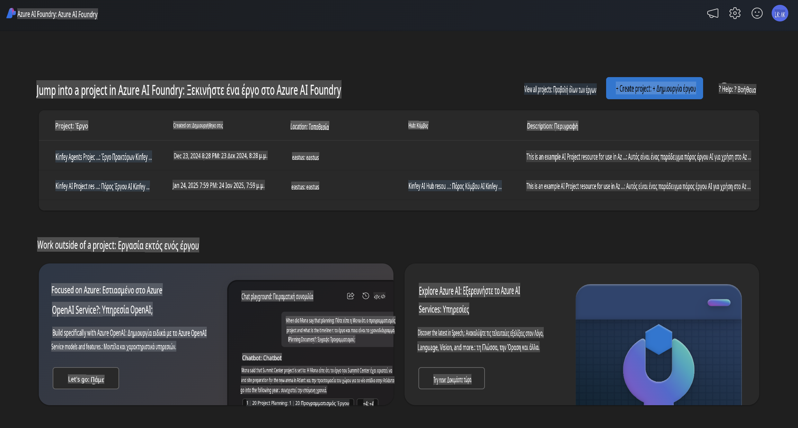
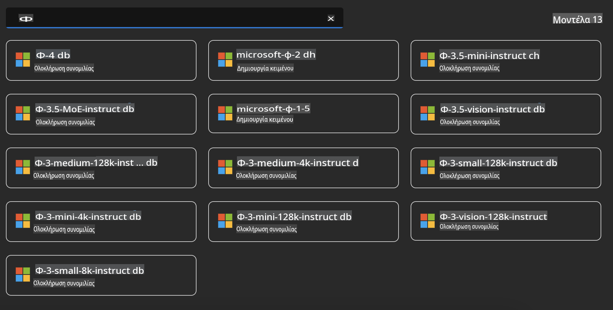
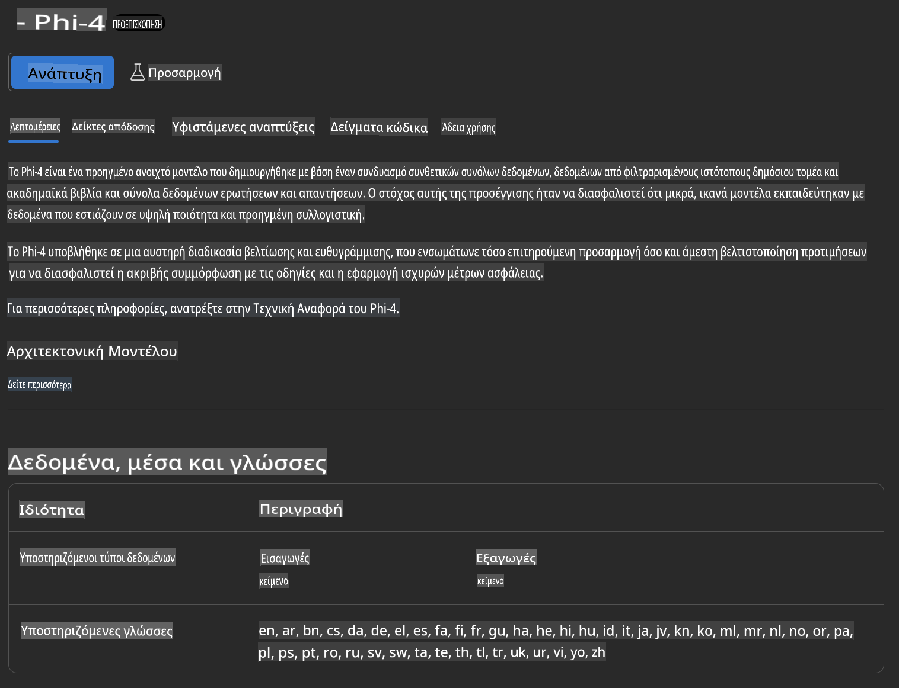
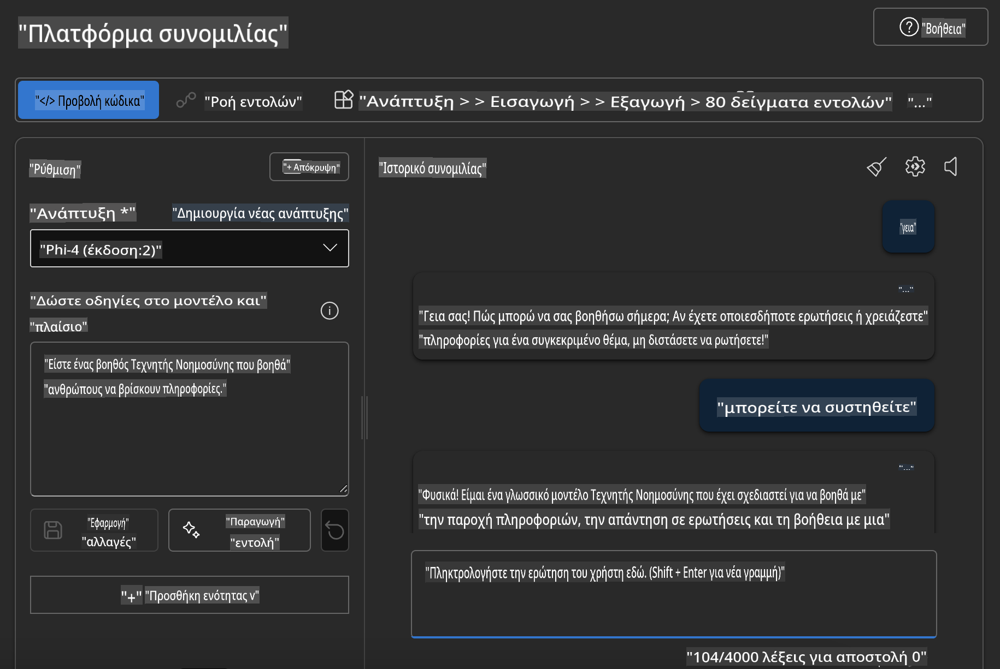

## Η οικογένεια Phi στο Azure AI Foundry

[Azure AI Foundry](https://ai.azure.com) είναι μια αξιόπιστη πλατφόρμα που δίνει τη δυνατότητα στους προγραμματιστές να προωθήσουν την καινοτομία και να διαμορφώσουν το μέλλον με την Τεχνητή Νοημοσύνη με ασφαλή, προστατευμένο και υπεύθυνο τρόπο.

[Azure AI Foundry](https://ai.azure.com) έχει σχεδιαστεί για προγραμματιστές ώστε να:

- Δημιουργούν εφαρμογές δημιουργικής Τεχνητής Νοημοσύνης σε μια πλατφόρμα επιχειρηματικού επιπέδου.
- Εξερευνούν, αναπτύσσουν, δοκιμάζουν και υλοποιούν χρησιμοποιώντας προηγμένα εργαλεία AI και μοντέλα ML, βασισμένα σε υπεύθυνες πρακτικές AI.
- Συνεργάζονται με την ομάδα τους σε όλο τον κύκλο ζωής ανάπτυξης εφαρμογών.

Με το Azure AI Foundry, μπορείτε να εξερευνήσετε μια μεγάλη ποικιλία μοντέλων, υπηρεσιών και δυνατοτήτων, και να ξεκινήσετε τη δημιουργία εφαρμογών AI που εξυπηρετούν καλύτερα τους στόχους σας. Η πλατφόρμα Azure AI Foundry διευκολύνει την κλιμάκωση για τη μετατροπή πρωτοτύπων σε πλήρως ανεπτυγμένες παραγωγικές εφαρμογές με ευκολία. Η συνεχής παρακολούθηση και βελτίωση υποστηρίζουν τη μακροπρόθεσμη επιτυχία.



Εκτός από τη χρήση της υπηρεσίας Azure AOAI στο Azure AI Foundry, μπορείτε επίσης να χρησιμοποιήσετε μοντέλα τρίτων μέσω του Azure AI Foundry Model Catalog. Αυτή είναι μια καλή επιλογή εάν θέλετε να χρησιμοποιήσετε το Azure AI Foundry ως την πλατφόρμα λύσεων AI σας.

Μπορούμε να αναπτύξουμε γρήγορα τα μοντέλα της οικογένειας Phi μέσω του Model Catalog στο Azure AI Foundry.



### **Ανάπτυξη του Phi-4 στο Azure AI Foundry**



### **Δοκιμή του Phi-4 στο Azure AI Foundry Playground**



### **Εκτέλεση κώδικα Python για την κλήση του Azure AI Foundry Phi-4**

```python

import os  
import base64
from openai import AzureOpenAI  
from azure.identity import DefaultAzureCredential, get_bearer_token_provider  
        
endpoint = os.getenv("ENDPOINT_URL", "Your Azure AOAI Service Endpoint")  
deployment = os.getenv("DEPLOYMENT_NAME", "Phi-4")  
      
token_provider = get_bearer_token_provider(  
    DefaultAzureCredential(),  
    "https://cognitiveservices.azure.com/.default"  
)  
  
client = AzureOpenAI(  
    azure_endpoint=endpoint,  
    azure_ad_token_provider=token_provider,  
    api_version="2024-05-01-preview",  
)  
  

chat_prompt = [
    {
        "role": "system",
        "content": "You are an AI assistant that helps people find information."
    },
    {
        "role": "user",
        "content": "can you introduce yourself"
    }
] 
    
# Include speech result if speech is enabled  
messages = chat_prompt 

completion = client.chat.completions.create(  
    model=deployment,  
    messages=messages,
    max_tokens=800,  
    temperature=0.7,  
    top_p=0.95,  
    frequency_penalty=0,  
    presence_penalty=0,
    stop=None,  
    stream=False  
)  
  
print(completion.to_json())  

```

**Αποποίηση ευθυνών**:  
Αυτό το έγγραφο έχει μεταφραστεί χρησιμοποιώντας υπηρεσίες μετάφρασης που βασίζονται σε τεχνητή νοημοσύνη. Ενώ καταβάλλουμε προσπάθειες για ακρίβεια, παρακαλούμε να έχετε υπόψη ότι οι αυτοματοποιημένες μεταφράσεις ενδέχεται να περιέχουν σφάλματα ή ανακρίβειες. Το πρωτότυπο έγγραφο στη μητρική του γλώσσα θα πρέπει να θεωρείται η αυθεντική πηγή. Για κρίσιμες πληροφορίες, συνιστάται επαγγελματική ανθρώπινη μετάφραση. Δεν φέρουμε ευθύνη για τυχόν παρανοήσεις ή εσφαλμένες ερμηνείες που προκύπτουν από τη χρήση αυτής της μετάφρασης.