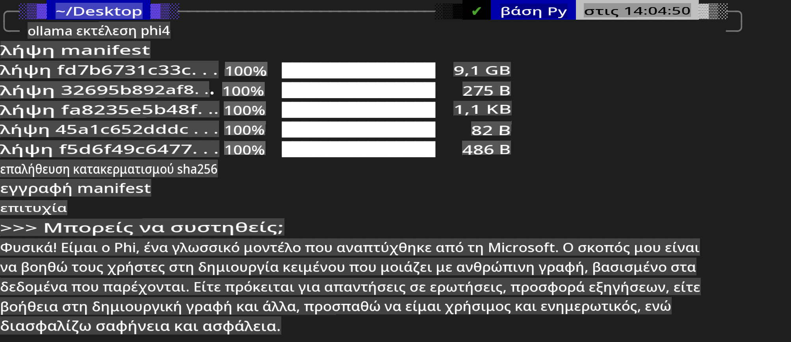
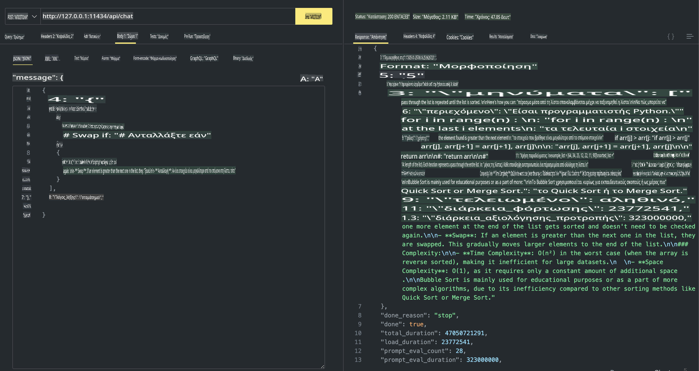

## Οικογένεια Phi στο Ollama

[Ollama](https://ollama.com) επιτρέπει σε περισσότερους ανθρώπους να αναπτύσσουν άμεσα ανοιχτού κώδικα LLM ή SLM μέσω απλών scripts, ενώ μπορεί επίσης να δημιουργήσει APIs για να υποστηρίξει τοπικά σενάρια εφαρμογών Copilot.

## **1. Εγκατάσταση**

Το Ollama υποστηρίζει τη λειτουργία σε Windows, macOS και Linux. Μπορείτε να εγκαταστήσετε το Ollama μέσω αυτού του συνδέσμου ([https://ollama.com/download](https://ollama.com/download)). Μετά την επιτυχή εγκατάσταση, μπορείτε να χρησιμοποιήσετε το script του Ollama για να καλέσετε το Phi-3 απευθείας από ένα τερματικό. Μπορείτε να δείτε όλες τις [διαθέσιμες βιβλιοθήκες στο Ollama](https://ollama.com/library). Εάν ανοίξετε αυτό το αποθετήριο σε ένα Codespace, το Ollama θα είναι ήδη εγκατεστημένο.

```bash

ollama run phi4

```

> [!NOTE]
> Το μοντέλο θα ληφθεί για πρώτη φορά όταν το εκτελέσετε. Φυσικά, μπορείτε επίσης να καθορίσετε απευθείας το ήδη ληφθέν μοντέλο Phi-4. Παίρνουμε ως παράδειγμα το WSL για την εκτέλεση της εντολής. Μετά την επιτυχή λήψη του μοντέλου, μπορείτε να αλληλεπιδράσετε απευθείας στο τερματικό.



## **2. Κλήση του API phi-4 από το Ollama**

Αν θέλετε να καλέσετε το API Phi-4 που δημιουργείται από το Ollama, μπορείτε να χρησιμοποιήσετε αυτήν την εντολή στο τερματικό για να ξεκινήσετε τον server του Ollama.

```bash

ollama serve

```

> [!NOTE]
> Αν χρησιμοποιείτε macOS ή Linux, σημειώστε ότι μπορεί να αντιμετωπίσετε το παρακάτω σφάλμα **"Error: listen tcp 127.0.0.1:11434: bind: address already in use"**. Αυτό το σφάλμα μπορεί να εμφανιστεί όταν εκτελείτε την εντολή. Μπορείτε είτε να το αγνοήσετε, καθώς συνήθως υποδεικνύει ότι ο server είναι ήδη σε λειτουργία, είτε να σταματήσετε και να επανεκκινήσετε το Ollama:

**macOS**

```bash

brew services restart ollama

```

**Linux**

```bash

sudo systemctl stop ollama

```

Το Ollama υποστηρίζει δύο APIs: generate και chat. Μπορείτε να καλέσετε το API του μοντέλου που παρέχεται από το Ollama ανάλογα με τις ανάγκες σας, στέλνοντας αιτήματα στην τοπική υπηρεσία που εκτελείται στη θύρα 11434.

**Chat**

```bash

curl http://127.0.0.1:11434/api/chat -d '{
  "model": "phi3",
  "messages": [
    {
      "role": "system",
      "content": "Your are a python developer."
    },
    {
      "role": "user",
      "content": "Help me generate a bubble algorithm"
    }
  ],
  "stream": false
  
}'

This is the result in Postman



## Additional Resources

Check the list of available models in Ollama in [their library](https://ollama.com/library).

Pull your model from the Ollama server using this command

```bash
ollama pull phi4
```

Run the model using this command

```bash
ollama run phi4
```

***Note:*** Visit this link [https://github.com/ollama/ollama/blob/main/docs/api.md](https://github.com/ollama/ollama/blob/main/docs/api.md) to learn more

## Calling Ollama from Python

You can use `requests` or `urllib3` to make requests to the local server endpoints used above. However, a popular way to use Ollama in Python is via the [openai](https://pypi.org/project/openai/) SDK, since Ollama provides OpenAI-compatible server endpoints as well.

Here is an example for phi3-mini:

```python
import openai

client = openai.OpenAI(
    base_url="http://localhost:11434/v1",
    api_key="nokeyneeded",
)

response = client.chat.completions.create(
    model="phi4",
    temperature=0.7,
    n=1,
    messages=[
        {"role": "system", "content": "You are a helpful assistant."},
        {"role": "user", "content": "Write a haiku about a hungry cat"},
    ],
)

print("Response:")
print(response.choices[0].message.content)
```

## Calling Ollama from JavaScript 

```javascript
// Παράδειγμα περίληψης ενός αρχείου με το Phi-4
script({
    model: "ollama:phi4",
    title: "Summarize with Phi-4",
    system: ["system"],
})

// Παράδειγμα περίληψης
const file = def("FILE", env.files)
$`Summarize ${file} in a single paragraph.`
```

## Calling Ollama from C#

Create a new C# Console application and add the following NuGet package:

```bash
dotnet add package Microsoft.SemanticKernel --version 1.34.0
```

Then replace this code in the `Program.cs` file

```csharp
using Microsoft.SemanticKernel;
using Microsoft.SemanticKernel.ChatCompletion;

// προσθήκη υπηρεσίας ολοκλήρωσης συνομιλίας χρησιμοποιώντας το τοπικό endpoint του server Ollama
#pragma warning disable SKEXP0001, SKEXP0003, SKEXP0010, SKEXP0011, SKEXP0050, SKEXP0052
builder.AddOpenAIChatCompletion(
    modelId: "phi4",
    endpoint: new Uri("http://localhost:11434/"),
    apiKey: "non required");

// εκτέλεση μιας απλής προτροπής στην υπηρεσία συνομιλίας
string prompt = "Write a joke about kittens";
var response = await kernel.InvokePromptAsync(prompt);
Console.WriteLine(response.GetValue<string>());
```

Run the app with the command:

```bash
dotnet run

**Αποποίηση Ευθύνης**:  
Αυτό το έγγραφο έχει μεταφραστεί χρησιμοποιώντας υπηρεσίες μετάφρασης που βασίζονται σε τεχνητή νοημοσύνη. Παρόλο που καταβάλλουμε προσπάθειες για ακρίβεια, παρακαλούμε να έχετε υπόψη ότι οι αυτοματοποιημένες μεταφράσεις ενδέχεται να περιέχουν λάθη ή ανακρίβειες. Το πρωτότυπο έγγραφο στη μητρική του γλώσσα θα πρέπει να θεωρείται η αυθεντική πηγή. Για κρίσιμες πληροφορίες, συνιστάται επαγγελματική ανθρώπινη μετάφραση. Δεν φέρουμε ευθύνη για τυχόν παρανοήσεις ή παρερμηνείες που προκύπτουν από τη χρήση αυτής της μετάφρασης.