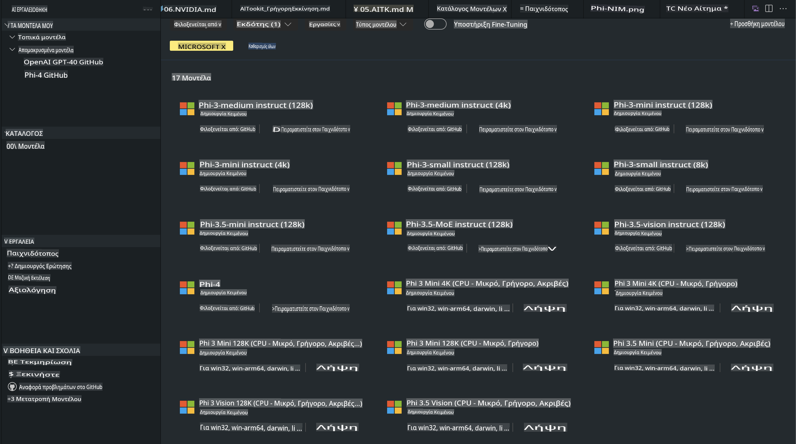
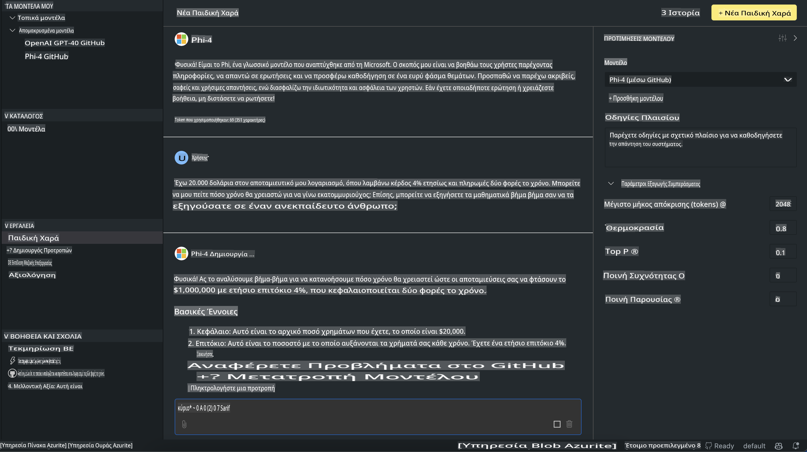

# Οικογένεια Phi στο AITK

[AI Toolkit για VS Code](https://marketplace.visualstudio.com/items?itemName=ms-windows-ai-studio.windows-ai-studio) απλοποιεί την ανάπτυξη εφαρμογών γενετικής τεχνητής νοημοσύνης, συνδυάζοντας προηγμένα εργαλεία ανάπτυξης AI και μοντέλα από τον Azure AI Foundry Catalog και άλλους καταλόγους όπως το Hugging Face. Μπορείτε να περιηγηθείτε στον κατάλογο μοντέλων AI που τροφοδοτείται από τα GitHub Models και τους Azure AI Foundry Model Catalogs, να τα κατεβάσετε τοπικά ή απομακρυσμένα, να τα προσαρμόσετε, να τα δοκιμάσετε και να τα χρησιμοποιήσετε στις εφαρμογές σας.

Το AI Toolkit Preview λειτουργεί τοπικά. Η τοπική πρόβλεψη ή προσαρμογή εξαρτάται από το μοντέλο που επιλέγετε και μπορεί να απαιτεί GPU όπως NVIDIA CUDA GPU. Μπορείτε επίσης να εκτελέσετε τα GitHub Models απευθείας με το AITK.

## Ξεκινώντας

[Μάθετε περισσότερα για την εγκατάσταση του Windows Subsystem for Linux](https://learn.microsoft.com/windows/wsl/install?WT.mc_id=aiml-137032-kinfeylo)

και [την αλλαγή της προεπιλεγμένης διανομής](https://learn.microsoft.com/windows/wsl/install#change-the-default-linux-distribution-installed).

[AI Toolkit GitHub Repo](https://github.com/microsoft/vscode-ai-toolkit/)

- Windows, Linux, macOS

- Για προσαρμογή τόσο σε Windows όσο και σε Linux, θα χρειαστείτε Nvidia GPU. Επιπλέον, τα **Windows** απαιτούν το subsystem for Linux με διανομή Ubuntu 18.4 ή νεότερη. [Μάθετε περισσότερα για την εγκατάσταση του Windows Subsystem for Linux](https://learn.microsoft.com/windows/wsl/install) και [την αλλαγή της προεπιλεγμένης διανομής](https://learn.microsoft.com/windows/wsl/install#change-the-default-linux-distribution-installed).

### Εγκατάσταση του AI Toolkit

Το AI Toolkit παρέχεται ως [επέκταση για το Visual Studio Code](https://code.visualstudio.com/docs/setup/additional-components#_vs-code-extensions), οπότε πρέπει πρώτα να εγκαταστήσετε το [VS Code](https://code.visualstudio.com/docs/setup/windows?WT.mc_id=aiml-137032-kinfeylo) και να κατεβάσετε το AI Toolkit από το [VS Marketplace](https://marketplace.visualstudio.com/items?itemName=ms-windows-ai-studio.windows-ai-studio).  
Το [AI Toolkit είναι διαθέσιμο στο Visual Studio Marketplace](https://marketplace.visualstudio.com/items?itemName=ms-windows-ai-studio.windows-ai-studio) και μπορεί να εγκατασταθεί όπως κάθε άλλη επέκταση του VS Code.

Αν δεν είστε εξοικειωμένοι με την εγκατάσταση επεκτάσεων του VS Code, ακολουθήστε αυτά τα βήματα:

### Σύνδεση

1. Στη γραμμή εργαλείων δραστηριοτήτων του VS Code επιλέξτε **Extensions**  
2. Στη γραμμή αναζήτησης επεκτάσεων πληκτρολογήστε "AI Toolkit"  
3. Επιλέξτε το "AI Toolkit for Visual Studio Code"  
4. Επιλέξτε **Install**

Τώρα είστε έτοιμοι να χρησιμοποιήσετε την επέκταση!

Θα σας ζητηθεί να συνδεθείτε στο GitHub, οπότε κάντε κλικ στο "Allow" για να συνεχίσετε. Θα ανακατευθυνθείτε στη σελίδα σύνδεσης του GitHub.

Συνδεθείτε και ακολουθήστε τα βήματα της διαδικασίας. Μετά την επιτυχή ολοκλήρωση, θα ανακατευθυνθείτε στο VS Code.

Αφού εγκατασταθεί η επέκταση, θα δείτε το εικονίδιο του AI Toolkit να εμφανίζεται στη γραμμή εργαλείων δραστηριοτήτων.

Ας εξερευνήσουμε τις διαθέσιμες ενέργειες!

### Διαθέσιμες Ενέργειες

Η κύρια πλαϊνή γραμμή του AI Toolkit είναι οργανωμένη σε  

- **Models**
- **Resources**
- **Playground**  
- **Fine-tuning**
- **Evaluation**

Είναι διαθέσιμα στην ενότητα Resources. Για να ξεκινήσετε, επιλέξτε **Model Catalog**.

### Λήψη ενός μοντέλου από τον κατάλογο

Με την εκκίνηση του AI Toolkit από την πλαϊνή γραμμή του VS Code, μπορείτε να επιλέξετε από τις παρακάτω επιλογές:



- Εντοπίστε ένα υποστηριζόμενο μοντέλο από τον **Model Catalog** και κατεβάστε το τοπικά  
- Δοκιμάστε την πρόβλεψη του μοντέλου στο **Model Playground**  
- Προσαρμόστε το μοντέλο τοπικά ή απομακρυσμένα στο **Model Fine-tuning**  
- Αναπτύξτε προσαρμοσμένα μοντέλα στο cloud μέσω του command palette για το AI Toolkit  
- Αξιολογήστε τα μοντέλα  

> [!NOTE]
>
> **GPU Vs CPU**
>
> Θα παρατηρήσετε ότι οι κάρτες μοντέλων εμφανίζουν το μέγεθος του μοντέλου, την πλατφόρμα και τον τύπο επιταχυντή (CPU, GPU). Για βελτιστοποιημένη απόδοση σε **συσκευές Windows που διαθέτουν τουλάχιστον μία GPU**, επιλέξτε εκδόσεις μοντέλων που στοχεύουν μόνο τα Windows.
>
> Αυτό εξασφαλίζει ότι έχετε ένα μοντέλο βελτιστοποιημένο για τον επιταχυντή DirectML.
>
> Τα ονόματα των μοντέλων έχουν τη μορφή
>
> - `{model_name}-{accelerator}-{quantization}-{format}`.
>
>Για να ελέγξετε αν διαθέτετε GPU στη συσκευή σας με Windows, ανοίξτε τον **Task Manager** και επιλέξτε την καρτέλα **Performance**. Αν έχετε GPU(s), θα εμφανίζονται με ονόματα όπως "GPU 0" ή "GPU 1".

### Εκτέλεση του μοντέλου στο Playground

Αφού ορίσετε όλες τις παραμέτρους, κάντε κλικ στο **Generate Project**.

Αφού κατεβάσετε το μοντέλο, επιλέξτε **Load in Playground** στην κάρτα του μοντέλου στον κατάλογο:

- Ξεκινήστε τη λήψη του μοντέλου  
- Εγκαταστήστε όλες τις προαπαιτούμενες και εξαρτώμενες βιβλιοθήκες  
- Δημιουργήστε workspace στο VS Code  



### Χρήση του REST API στην εφαρμογή σας 

Το AI Toolkit συνοδεύεται από έναν τοπικό διακομιστή REST API **στη θύρα 5272** που χρησιμοποιεί τη [μορφή chat completions του OpenAI](https://platform.openai.com/docs/api-reference/chat/create).  

Αυτό σας επιτρέπει να δοκιμάσετε την εφαρμογή σας τοπικά χωρίς να βασίζεστε σε υπηρεσία μοντέλου AI στο cloud. Για παράδειγμα, το παρακάτω αρχείο JSON δείχνει πώς να διαμορφώσετε το σώμα του αιτήματος:

```json
{
    "model": "Phi-4",
    "messages": [
        {
            "role": "user",
            "content": "what is the golden ratio?"
        }
    ],
    "temperature": 0.7,
    "top_p": 1,
    "top_k": 10,
    "max_tokens": 100,
    "stream": true
}
```

Μπορείτε να δοκιμάσετε το REST API χρησιμοποιώντας (για παράδειγμα) το [Postman](https://www.postman.com/) ή το εργαλείο CURL (Client URL):

```bash
curl -vX POST http://127.0.0.1:5272/v1/chat/completions -H 'Content-Type: application/json' -d @body.json
```

### Χρήση της βιβλιοθήκης πελάτη OpenAI για Python

```python
from openai import OpenAI

client = OpenAI(
    base_url="http://127.0.0.1:5272/v1/", 
    api_key="x" # required for the API but not used
)

chat_completion = client.chat.completions.create(
    messages=[
        {
            "role": "user",
            "content": "what is the golden ratio?",
        }
    ],
    model="Phi-4",
)

print(chat_completion.choices[0].message.content)
```

### Χρήση της βιβλιοθήκης πελάτη Azure OpenAI για .NET

Προσθέστε τη [βιβλιοθήκη πελάτη Azure OpenAI για .NET](https://www.nuget.org/packages/Azure.AI.OpenAI/) στο έργο σας χρησιμοποιώντας το NuGet:

```bash
dotnet add {project_name} package Azure.AI.OpenAI --version 1.0.0-beta.17
```

Προσθέστε ένα αρχείο C# με όνομα **OverridePolicy.cs** στο έργο σας και επικολλήστε τον παρακάτω κώδικα:

```csharp
// OverridePolicy.cs
using Azure.Core.Pipeline;
using Azure.Core;

internal partial class OverrideRequestUriPolicy(Uri overrideUri)
    : HttpPipelineSynchronousPolicy
{
    private readonly Uri _overrideUri = overrideUri;

    public override void OnSendingRequest(HttpMessage message)
    {
        message.Request.Uri.Reset(_overrideUri);
    }
}
```

Στη συνέχεια, επικολλήστε τον παρακάτω κώδικα στο αρχείο σας **Program.cs**:

```csharp
// Program.cs
using Azure.AI.OpenAI;

Uri localhostUri = new("http://localhost:5272/v1/chat/completions");

OpenAIClientOptions clientOptions = new();
clientOptions.AddPolicy(
    new OverrideRequestUriPolicy(localhostUri),
    Azure.Core.HttpPipelinePosition.BeforeTransport);
OpenAIClient client = new(openAIApiKey: "unused", clientOptions);

ChatCompletionsOptions options = new()
{
    DeploymentName = "Phi-4",
    Messages =
    {
        new ChatRequestSystemMessage("You are a helpful assistant. Be brief and succinct."),
        new ChatRequestUserMessage("What is the golden ratio?"),
    }
};

StreamingResponse<StreamingChatCompletionsUpdate> streamingChatResponse
    = await client.GetChatCompletionsStreamingAsync(options);

await foreach (StreamingChatCompletionsUpdate chatChunk in streamingChatResponse)
{
    Console.Write(chatChunk.ContentUpdate);
}
```

## Προσαρμογή με το AI Toolkit

- Ξεκινήστε με την ανακάλυψη μοντέλων και το playground.  
- Προσαρμογή και πρόβλεψη μοντέλων χρησιμοποιώντας τοπικούς πόρους υπολογιστών.  
- Απομακρυσμένη προσαρμογή και πρόβλεψη χρησιμοποιώντας πόρους του Azure  

[Προσαρμογή με το AI Toolkit](../../03.FineTuning/Finetuning_VSCodeaitoolkit.md)

## Πόροι Q&A για το AI Toolkit

Παρακαλούμε ανατρέξτε στη [σελίδα Q&A](https://github.com/microsoft/vscode-ai-toolkit/blob/main/archive/QA.md) για τα πιο κοινά ζητήματα και τις λύσεις τους.

**Αποποίηση Ευθυνών**:  
Αυτό το έγγραφο έχει μεταφραστεί χρησιμοποιώντας υπηρεσίες αυτόματης μετάφρασης μέσω τεχνητής νοημοσύνης. Παρόλο που καταβάλλουμε προσπάθειες για ακρίβεια, παρακαλούμε να έχετε υπόψη ότι οι αυτόματες μεταφράσεις ενδέχεται να περιέχουν λάθη ή ανακρίβειες. Το αρχικό έγγραφο στη μητρική του γλώσσα θα πρέπει να θεωρείται η αυθεντική πηγή. Για κρίσιμες πληροφορίες, συνιστάται επαγγελματική μετάφραση από άνθρωπο. Δεν φέρουμε ευθύνη για τυχόν παρεξηγήσεις ή εσφαλμένες ερμηνείες που προκύπτουν από τη χρήση αυτής της μετάφρασης.