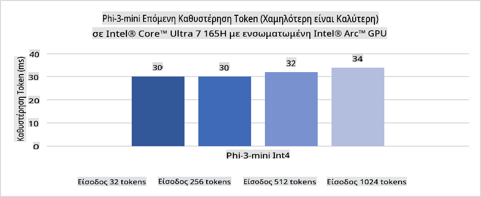
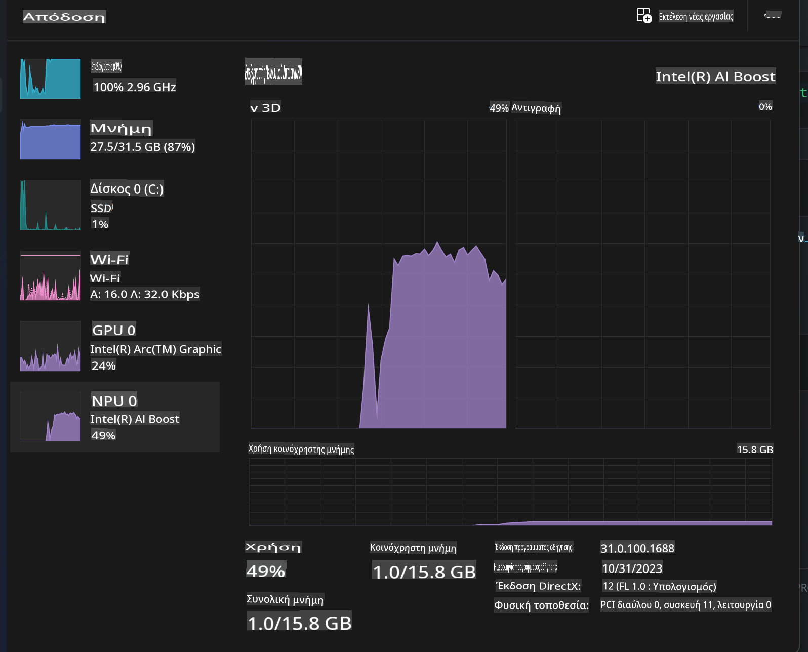
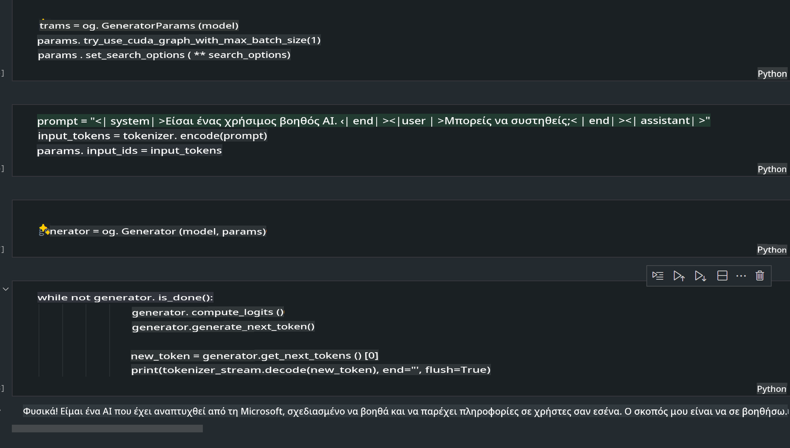
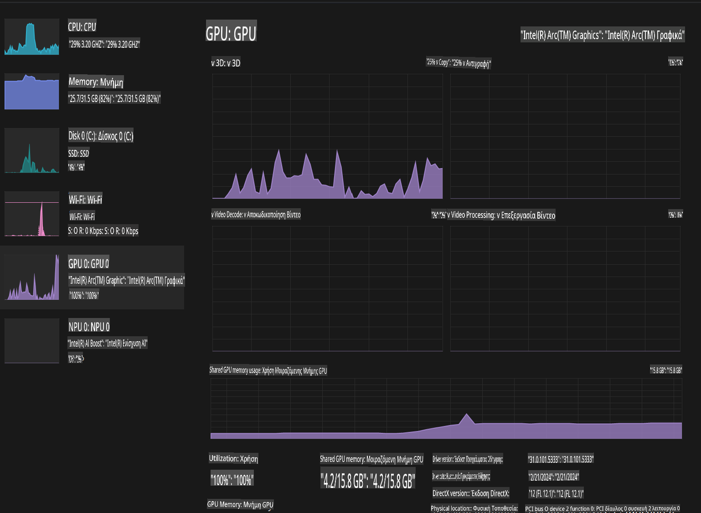

# **Inference Phi-3 σε AI PC**

Με την πρόοδο της γενετικής AI και τη βελτίωση των δυνατοτήτων υλικού των edge συσκευών, ένας αυξανόμενος αριθμός μοντέλων γενετικής AI μπορεί πλέον να ενσωματωθεί στις συσκευές BYOD (Bring Your Own Device) των χρηστών. Τα AI PCs ανήκουν σε αυτά τα μοντέλα. Από το 2024, η Intel, η AMD και η Qualcomm συνεργάζονται με κατασκευαστές υπολογιστών για να εισαγάγουν AI PCs που διευκολύνουν την ανάπτυξη τοπικών γενετικών AI μοντέλων μέσω τροποποιήσεων υλικού. Σε αυτή τη συζήτηση, θα εστιάσουμε στα Intel AI PCs και θα εξετάσουμε πώς να αναπτύξουμε το Phi-3 σε ένα Intel AI PC.

### Τι είναι το NPU

Ένα NPU (Neural Processing Unit) είναι ένας εξειδικευμένος επεξεργαστής ή μονάδα επεξεργασίας σε ένα μεγαλύτερο SoC, σχεδιασμένο ειδικά για την επιτάχυνση λειτουργιών νευρωνικών δικτύων και AI εργασιών. Σε αντίθεση με τους γενικής χρήσης CPUs και GPUs, τα NPUs είναι βελτιστοποιημένα για παράλληλη επεξεργασία δεδομένων, καθιστώντας τα εξαιρετικά αποδοτικά στην επεξεργασία τεράστιων πολυμέσων, όπως βίντεο και εικόνες, και δεδομένων για νευρωνικά δίκτυα. Είναι ιδιαίτερα κατάλληλα για AI εργασίες, όπως αναγνώριση ομιλίας, θάμπωμα φόντου στις βιντεοκλήσεις και επεξεργασία φωτογραφιών ή βίντεο, όπως ανίχνευση αντικειμένων.

## NPU vs GPU

Παρόλο που πολλές AI και machine learning εργασίες εκτελούνται σε GPUs, υπάρχει μια κρίσιμη διαφορά μεταξύ GPUs και NPUs.  
Οι GPUs είναι γνωστές για τις δυνατότητες παράλληλης επεξεργασίας, αλλά δεν είναι όλες οι GPUs εξίσου αποδοτικές πέρα από την επεξεργασία γραφικών. Αντίθετα, τα NPUs είναι κατασκευασμένα ειδικά για τις σύνθετες υπολογιστικές λειτουργίες που απαιτούνται για τα νευρωνικά δίκτυα, καθιστώντας τα εξαιρετικά αποτελεσματικά για AI εργασίες.

Συνοψίζοντας, τα NPUs είναι οι «μαθηματικοί ιδιοφυΐες» που επιταχύνουν τους AI υπολογισμούς και παίζουν καθοριστικό ρόλο στη νέα εποχή των AI PCs!

***Το παράδειγμα βασίζεται στον τελευταίο επεξεργαστή Intel Core Ultra***

## **1. Χρήση NPU για την εκτέλεση του μοντέλου Phi-3**

Η συσκευή Intel® NPU είναι ένας AI inference επιταχυντής ενσωματωμένος στους Intel client CPUs, ξεκινώντας από την Intel® Core™ Ultra γενιά CPUs (πρώην γνωστή ως Meteor Lake). Παρέχει ενεργειακά αποδοτική εκτέλεση εργασιών τεχνητών νευρωνικών δικτύων.




**Βιβλιοθήκη Επιτάχυνσης Intel NPU**

Η βιβλιοθήκη επιτάχυνσης Intel NPU [https://github.com/intel/intel-npu-acceleration-library](https://github.com/intel/intel-npu-acceleration-library) είναι μια Python βιβλιοθήκη σχεδιασμένη για να ενισχύει την αποδοτικότητα των εφαρμογών σας αξιοποιώντας τη δύναμη της Intel Neural Processing Unit (NPU) για την εκτέλεση ταχύτατων υπολογισμών σε συμβατό υλικό.

Παράδειγμα του Phi-3-mini σε AI PC που τροφοδοτείται από επεξεργαστές Intel® Core™ Ultra.


Εγκαταστήστε τη βιβλιοθήκη Python με pip

```bash

   pip install intel-npu-acceleration-library

```

***Σημείωση*** Το έργο βρίσκεται ακόμα υπό ανάπτυξη, αλλά το μοντέλο αναφοράς είναι ήδη πολύ ολοκληρωμένο.

### **Εκτέλεση του Phi-3 με τη βιβλιοθήκη Intel NPU Acceleration**

Χρησιμοποιώντας την επιτάχυνση Intel NPU, αυτή η βιβλιοθήκη δεν επηρεάζει τη διαδικασία παραδοσιακής κωδικοποίησης. Χρειάζεται απλώς να χρησιμοποιήσετε αυτή τη βιβλιοθήκη για να ποσοτικοποιήσετε το αρχικό μοντέλο Phi-3, όπως FP16, INT8, INT4, κ.λπ.

```python
from transformers import AutoTokenizer, pipeline,TextStreamer
from intel_npu_acceleration_library import NPUModelForCausalLM, int4
from intel_npu_acceleration_library.compiler import CompilerConfig
import warnings

model_id = "microsoft/Phi-3-mini-4k-instruct"

compiler_conf = CompilerConfig(dtype=int4)
model = NPUModelForCausalLM.from_pretrained(
    model_id, use_cache=True, config=compiler_conf, attn_implementation="sdpa"
).eval()

tokenizer = AutoTokenizer.from_pretrained(model_id)

text_streamer = TextStreamer(tokenizer, skip_prompt=True)
```

Μετά την επιτυχή ποσοτικοποίηση, συνεχίστε την εκτέλεση για να καλέσετε το NPU να τρέξει το μοντέλο Phi-3.

```python
generation_args = {
   "max_new_tokens": 1024,
   "return_full_text": False,
   "temperature": 0.3,
   "do_sample": False,
   "streamer": text_streamer,
}

pipe = pipeline(
   "text-generation",
   model=model,
   tokenizer=tokenizer,
)

query = "<|system|>You are a helpful AI assistant.<|end|><|user|>Can you introduce yourself?<|end|><|assistant|>"

with warnings.catch_warnings():
    warnings.simplefilter("ignore")
    pipe(query, **generation_args)
```

Κατά την εκτέλεση του κώδικα, μπορούμε να δούμε την κατάσταση λειτουργίας του NPU μέσω του Task Manager.



***Παραδείγματα*** : [AIPC_NPU_DEMO.ipynb](../../../../../code/03.Inference/AIPC/AIPC_NPU_DEMO.ipynb)

## **2. Χρήση DirectML + ONNX Runtime για την εκτέλεση του μοντέλου Phi-3**

### **Τι είναι το DirectML**

Το [DirectML](https://github.com/microsoft/DirectML) είναι μια υψηλής απόδοσης, hardware-accelerated βιβλιοθήκη DirectX 12 για machine learning. Παρέχει GPU επιτάχυνση για κοινές machine learning εργασίες σε ένα ευρύ φάσμα υποστηριζόμενου υλικού και drivers, συμπεριλαμβανομένων όλων των DirectX 12 συμβατών GPUs από προμηθευτές όπως AMD, Intel, NVIDIA και Qualcomm.

Όταν χρησιμοποιείται αυτόνομα, το DirectML API είναι μια χαμηλού επιπέδου βιβλιοθήκη DirectX 12 και είναι κατάλληλη για εφαρμογές υψηλής απόδοσης και χαμηλής καθυστέρησης, όπως frameworks, παιχνίδια και άλλες εφαρμογές πραγματικού χρόνου. Η απρόσκοπτη διαλειτουργικότητα του DirectML με το Direct3D 12, καθώς και το χαμηλό overhead και η συνέπεια σε όλο το υλικό, το καθιστούν ιδανικό για την επιτάχυνση του machine learning όταν απαιτείται τόσο υψηλή απόδοση όσο και αξιοπιστία.

***Σημείωση*** : Το πιο πρόσφατο DirectML υποστηρίζει ήδη NPU (https://devblogs.microsoft.com/directx/introducing-neural-processor-unit-npu-support-in-directml-developer-preview/)

### DirectML και CUDA ως προς τις δυνατότητες και την απόδοση:

**DirectML** είναι μια βιβλιοθήκη machine learning που αναπτύχθηκε από τη Microsoft. Σχεδιάστηκε για να επιταχύνει machine learning εργασίες σε Windows συσκευές, όπως desktops, laptops και edge συσκευές.
- Βασισμένο σε DX12: Το DirectML είναι χτισμένο πάνω στο DirectX 12 (DX12), παρέχοντας ευρεία υποστήριξη υλικού σε GPUs, συμπεριλαμβανομένων των NVIDIA και AMD.
- Ευρύτερη Υποστήριξη: Επειδή αξιοποιεί το DX12, το DirectML μπορεί να λειτουργήσει με οποιαδήποτε GPU που υποστηρίζει DX12, ακόμη και με ενσωματωμένες GPUs.
- Επεξεργασία Εικόνων: Το DirectML επεξεργάζεται εικόνες και άλλα δεδομένα χρησιμοποιώντας νευρωνικά δίκτυα, καθιστώντας το κατάλληλο για εργασίες όπως αναγνώριση εικόνων, ανίχνευση αντικειμένων και άλλα.
- Ευκολία στη Ρύθμιση: Η ρύθμιση του DirectML είναι απλή και δεν απαιτεί συγκεκριμένα SDKs ή βιβλιοθήκες από κατασκευαστές GPUs.
- Απόδοση: Σε ορισμένες περιπτώσεις, το DirectML αποδίδει καλά και μπορεί να είναι ταχύτερο από το CUDA, ειδικά για συγκεκριμένες εργασίες.
- Περιορισμοί: Ωστόσο, υπάρχουν περιπτώσεις όπου το DirectML μπορεί να είναι πιο αργό, ειδικά για float16 μεγάλα batch sizes.

**CUDA** είναι η πλατφόρμα παράλληλης επεξεργασίας και το μοντέλο προγραμματισμού της NVIDIA. Επιτρέπει στους προγραμματιστές να αξιοποιούν τη δύναμη των NVIDIA GPUs για γενικούς υπολογισμούς, συμπεριλαμβανομένων machine learning και επιστημονικών προσομοιώσεων.
- Ειδικό για NVIDIA: Το CUDA είναι στενά συνδεδεμένο με τις NVIDIA GPUs και έχει σχεδιαστεί ειδικά για αυτές.
- Άριστα Βελτιστοποιημένο: Παρέχει εξαιρετική απόδοση για GPU-επιταχυνόμενες εργασίες, ειδικά όταν χρησιμοποιούνται NVIDIA GPUs.
- Ευρέως Χρησιμοποιούμενο: Πολλά machine learning frameworks και βιβλιοθήκες (όπως TensorFlow και PyTorch) υποστηρίζουν CUDA.
- Εξατομίκευση: Οι προγραμματιστές μπορούν να προσαρμόσουν τις ρυθμίσεις CUDA για συγκεκριμένες εργασίες, κάτι που μπορεί να οδηγήσει σε βέλτιστη απόδοση.
- Περιορισμοί: Ωστόσο, η εξάρτηση του CUDA από το NVIDIA hardware μπορεί να είναι περιοριστική αν θέλετε ευρύτερη συμβατότητα με διαφορετικές GPUs.

### Επιλογή Μεταξύ DirectML και CUDA

Η επιλογή μεταξύ DirectML και CUDA εξαρτάται από τη συγκεκριμένη χρήση, τη διαθεσιμότητα υλικού και τις προτιμήσεις σας.  
Αν αναζητάτε ευρύτερη συμβατότητα και ευκολία στη ρύθμιση, το DirectML μπορεί να είναι μια καλή επιλογή. Ωστόσο, αν διαθέτετε NVIDIA GPUs και χρειάζεστε εξαιρετικά βελτιστοποιημένη απόδοση, το CUDA παραμένει μια ισχυρή επιλογή. Συνοψίζοντας, τόσο το DirectML όσο και το CUDA έχουν τα δικά τους πλεονεκτήματα και μειονεκτήματα, οπότε εξετάστε τις απαιτήσεις και το διαθέσιμο υλικό σας πριν πάρετε μια απόφαση.

### **Γενετική AI με ONNX Runtime**

Στην εποχή της AI, η φορητότητα των AI μοντέλων είναι πολύ σημαντική. Το ONNX Runtime μπορεί εύκολα να αναπτύξει εκπαιδευμένα μοντέλα σε διαφορετικές συσκευές. Οι προγραμματιστές δεν χρειάζεται να ασχολούνται με το inference framework και μπορούν να χρησιμοποιούν ένα ενιαίο API για να ολοκληρώσουν το inference του μοντέλου. Στην εποχή της γενετικής AI, το ONNX Runtime έχει επίσης πραγματοποιήσει βελτιστοποίηση κώδικα (https://onnxruntime.ai/docs/genai/). Μέσω του βελτιστοποιημένου ONNX Runtime, το ποσοτικοποιημένο γενετικό AI μοντέλο μπορεί να εκτελεστεί σε διαφορετικά τερματικά. Στο Generative AI με ONNX Runtime, μπορείτε να κάνετε inference AI μοντέλο API μέσω Python, C#, C / C++. Φυσικά, η ανάπτυξη σε iPhone μπορεί να αξιοποιήσει το Generative AI με ONNX Runtime API της C++.

[Δείγμα Κώδικα](https://github.com/Azure-Samples/Phi-3MiniSamples/tree/main/onnx)

***Συμπίεση γενετικής AI με τη βιβλιοθήκη ONNX Runtime***

```bash

winget install --id=Kitware.CMake  -e

git clone https://github.com/microsoft/onnxruntime.git

cd .\onnxruntime\

./build.bat --build_shared_lib --skip_tests --parallel --use_dml --config Release

cd ../

git clone https://github.com/microsoft/onnxruntime-genai.git

cd .\onnxruntime-genai\

mkdir ort

cd ort

mkdir include

mkdir lib

copy ..\onnxruntime\include\onnxruntime\core\providers\dml\dml_provider_factory.h ort\include

copy ..\onnxruntime\include\onnxruntime\core\session\onnxruntime_c_api.h ort\include

copy ..\onnxruntime\build\Windows\Release\Release\*.dll ort\lib

copy ..\onnxruntime\build\Windows\Release\Release\onnxruntime.lib ort\lib

python build.py --use_dml


```

**Εγκατάσταση βιβλιοθήκης**

```bash

pip install .\onnxruntime_genai_directml-0.3.0.dev0-cp310-cp310-win_amd64.whl

```

Αυτό είναι το αποτέλεσμα της εκτέλεσης



***Παραδείγματα*** : [AIPC_DirectML_DEMO.ipynb](../../../../../code/03.Inference/AIPC/AIPC_DirectML_DEMO.ipynb)

## **3. Χρήση Intel OpenVino για την εκτέλεση του μοντέλου Phi-3**

### **Τι είναι το OpenVINO**

Το [OpenVINO](https://github.com/openvinotoolkit/openvino) είναι ένα ανοιχτού κώδικα toolkit για τη βελτιστοποίηση και ανάπτυξη deep learning μοντέλων. Παρέχει ενισχυμένη απόδοση deep learning για μοντέλα οπτικής, ήχου και γλώσσας από δημοφιλή frameworks όπως TensorFlow, PyTorch, και άλλα. Ξεκινήστε με το OpenVINO. Το OpenVINO μπορεί επίσης να χρησιμοποιηθεί σε συνδυασμό με CPU και GPU για την εκτέλεση του μοντέλου Phi-3.

***Σημείωση***: Προς το παρόν, το OpenVINO δεν υποστηρίζει NPU.

### **Εγκατάσταση της Βιβλιοθήκης OpenVINO**

```bash

 pip install git+https://github.com/huggingface/optimum-intel.git

 pip install git+https://github.com/openvinotoolkit/nncf.git

 pip install openvino-nightly

```

### **Εκτέλεση του Phi-3 με OpenVINO**

Όπως και το NPU, το OpenVINO ολοκληρώνει την κλήση γενετικών AI μοντέλων εκτελώντας ποσοτικοποιημένα μοντέλα. Χρειάζεται πρώτα να ποσοτικοποιήσουμε το μοντέλο Phi-3 και να ολοκληρώσουμε την ποσοτικοποίηση του μοντέλου μέσω του command line με το optimum-cli.

**INT4**

```bash

optimum-cli export openvino --model "microsoft/Phi-3-mini-4k-instruct" --task text-generation-with-past --weight-format int4 --group-size 128 --ratio 0.6  --sym  --trust-remote-code ./openvinomodel/phi3/int4

```

**FP16**

```bash

optimum-cli export openvino --model "microsoft/Phi-3-mini-4k-instruct" --task text-generation-with-past --weight-format fp16 --trust-remote-code ./openvinomodel/phi3/fp16

```

Η μετατρεπόμενη μορφή, όπως αυτή


Φορτώστε διαδρομές μοντέλου (model_dir), σχετικές ρυθμίσεις (ov_config = {"PERFORMANCE_HINT": "LATENCY", "NUM_STREAMS": "1", "CACHE_DIR": ""}) και συσκευές επιτάχυνσης υλικού (GPU.0) μέσω OVModelForCausalLM.

```python

ov_model = OVModelForCausalLM.from_pretrained(
     model_dir,
     device='GPU.0',
     ov_config=ov_config,
     config=AutoConfig.from_pretrained(model_dir, trust_remote_code=True),
     trust_remote_code=True,
)

```

Κατά την εκτέλεση του κώδικα, μπορούμε να δούμε την κατάσταση λειτουργίας της GPU μέσω του Task Manager.



***Παραδείγματα*** : [AIPC_OpenVino_Demo.ipynb](../../../../../code/03.Inference/AIPC/AIPC_OpenVino_Demo.ipynb)

### ***Σημείωση*** : Οι παραπάνω τρεις μέθοδοι έχουν η καθεμία τα δικά της πλεονεκτήματα, αλλά συνιστάται η χρήση επιτάχυνσης NPU για inference σε AI PC.

**Αποποίηση ευθύνης**:  
Αυτό το έγγραφο έχει μεταφραστεί χρησιμοποιώντας υπηρεσίες αυτόματης μετάφρασης με βάση την τεχνητή νοημοσύνη. Παρόλο που καταβάλλουμε προσπάθειες για ακρίβεια, παρακαλούμε να έχετε υπόψη ότι οι αυτόματες μεταφράσεις ενδέχεται να περιέχουν λάθη ή ανακρίβειες. Το αρχικό έγγραφο στη μητρική του γλώσσα θα πρέπει να θεωρείται η αυθεντική πηγή. Για κρίσιμες πληροφορίες, συνιστάται επαγγελματική ανθρώπινη μετάφραση. Δεν φέρουμε ευθύνη για τυχόν παρεξηγήσεις ή παρερμηνείες που προκύπτουν από τη χρήση αυτής της μετάφρασης.