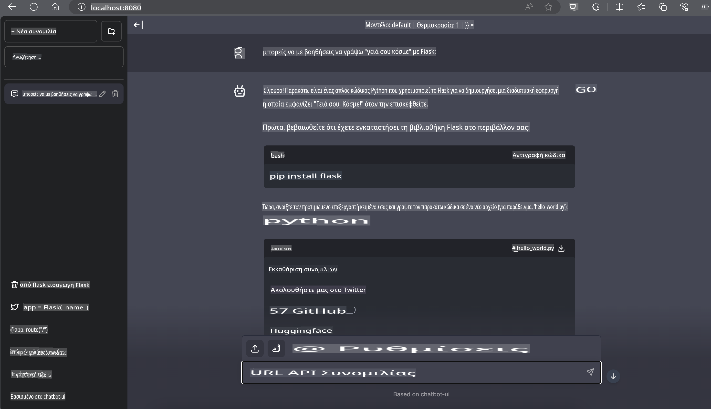

# **Inference Phi-3 σε Nvidia Jetson**

Το Nvidia Jetson είναι μια σειρά από ενσωματωμένες πλακέτες υπολογιστών της Nvidia. Τα μοντέλα Jetson TK1, TX1 και TX2 διαθέτουν επεξεργαστή Tegra (ή SoC) από την Nvidia, που ενσωματώνει μια κεντρική μονάδα επεξεργασίας (CPU) αρχιτεκτονικής ARM. Το Jetson είναι ένα σύστημα χαμηλής κατανάλωσης και έχει σχεδιαστεί για την επιτάχυνση εφαρμογών μηχανικής μάθησης. Το Nvidia Jetson χρησιμοποιείται από επαγγελματίες προγραμματιστές για τη δημιουργία πρωτοποριακών προϊόντων τεχνητής νοημοσύνης σε όλους τους τομείς, καθώς και από φοιτητές και λάτρεις για πρακτική εκμάθηση AI και δημιουργία εντυπωσιακών έργων. Το SLM αναπτύσσεται σε συσκευές edge όπως το Jetson, επιτρέποντας καλύτερη υλοποίηση βιομηχανικών σεναρίων εφαρμογής γενετικής τεχνητής νοημοσύνης.

## Ανάπτυξη στο NVIDIA Jetson:
Οι προγραμματιστές που εργάζονται σε αυτόνομα ρομπότ και ενσωματωμένες συσκευές μπορούν να αξιοποιήσουν το Phi-3 Mini. Το μικρό μέγεθος του Phi-3 το καθιστά ιδανικό για ανάπτυξη στο edge. Οι παράμετροι έχουν ρυθμιστεί προσεκτικά κατά την εκπαίδευση, εξασφαλίζοντας υψηλή ακρίβεια στις αποκρίσεις.

### Βελτιστοποίηση TensorRT-LLM:
Η βιβλιοθήκη [TensorRT-LLM της NVIDIA](https://github.com/NVIDIA/TensorRT-LLM?WT.mc_id=aiml-138114-kinfeylo) βελτιστοποιεί την εξαγωγή συμπερασμάτων από μεγάλα γλωσσικά μοντέλα. Υποστηρίζει το μεγάλο παράθυρο συμφραζομένων του Phi-3 Mini, βελτιώνοντας τόσο τη διεκπεραιωτική ικανότητα όσο και την καθυστέρηση. Οι βελτιστοποιήσεις περιλαμβάνουν τεχνικές όπως LongRoPE, FP8 και inflight batching.

### Διαθεσιμότητα και Ανάπτυξη:
Οι προγραμματιστές μπορούν να εξερευνήσουν το Phi-3 Mini με το παράθυρο συμφραζομένων 128K στη [σελίδα AI της NVIDIA](https://www.nvidia.com/en-us/ai-data-science/generative-ai/). Είναι διαθέσιμο ως NVIDIA NIM, μια μικροϋπηρεσία με τυπικό API που μπορεί να αναπτυχθεί οπουδήποτε. Επίσης, οι [υλοποιήσεις TensorRT-LLM στο GitHub](https://github.com/NVIDIA/TensorRT-LLM).

## **1. Προετοιμασία**

a. Jetson Orin NX / Jetson NX

b. JetPack 5.1.2+
   
c. Cuda 11.8
   
d. Python 3.8+

## **2. Εκτέλεση του Phi-3 στο Jetson**

Μπορούμε να επιλέξουμε [Ollama](https://ollama.com) ή [LlamaEdge](https://llamaedge.com).

Αν θέλετε να χρησιμοποιήσετε το gguf τόσο στο cloud όσο και σε edge συσκευές, το LlamaEdge μπορεί να θεωρηθεί ως WasmEdge (το WasmEdge είναι ένα ελαφρύ, υψηλής απόδοσης, επεκτάσιμο περιβάλλον εκτέλεσης WebAssembly κατάλληλο για cloud native, edge και αποκεντρωμένες εφαρμογές. Υποστηρίζει serverless εφαρμογές, ενσωματωμένες λειτουργίες, μικροϋπηρεσίες, έξυπνα συμβόλαια και συσκευές IoT. Μπορείτε να αναπτύξετε το ποσοτικοποιημένο μοντέλο του gguf σε edge συσκευές και στο cloud μέσω του LlamaEdge).


Ακολουθούν τα βήματα για χρήση:

1. Εγκατάσταση και λήψη σχετικών βιβλιοθηκών και αρχείων

```bash

curl -sSf https://raw.githubusercontent.com/WasmEdge/WasmEdge/master/utils/install.sh | bash -s -- --plugin wasi_nn-ggml

curl -LO https://github.com/LlamaEdge/LlamaEdge/releases/latest/download/llama-api-server.wasm

curl -LO https://github.com/LlamaEdge/chatbot-ui/releases/latest/download/chatbot-ui.tar.gz

tar xzf chatbot-ui.tar.gz

```

**Σημείωση**: Τα llama-api-server.wasm και chatbot-ui πρέπει να βρίσκονται στον ίδιο κατάλογο.

2. Εκτέλεση scripts στο terminal

```bash

wasmedge --dir .:. --nn-preload default:GGML:AUTO:{Your gguf path} llama-api-server.wasm -p phi-3-chat

```

Αυτό είναι το αποτέλεσμα της εκτέλεσης:



***Δείγμα κώδικα*** [Phi-3 mini WASM Notebook Sample](https://github.com/Azure-Samples/Phi-3MiniSamples/tree/main/wasm)

Συνοψίζοντας, το Phi-3 Mini αντιπροσωπεύει ένα άλμα προς τα εμπρός στη μοντελοποίηση γλώσσας, συνδυάζοντας αποδοτικότητα, ευαισθησία στα συμφραζόμενα και τη βελτιστοποίηση της NVIDIA. Είτε κατασκευάζετε ρομπότ είτε εφαρμογές edge, το Phi-3 Mini είναι ένα ισχυρό εργαλείο που αξίζει να γνωρίζετε.

**Αποποίηση Ευθύνης**:  
Αυτό το έγγραφο έχει μεταφραστεί χρησιμοποιώντας υπηρεσίες αυτόματης μετάφρασης με τεχνητή νοημοσύνη. Παρόλο που καταβάλλουμε προσπάθειες για ακρίβεια, παρακαλούμε να έχετε υπόψη ότι οι αυτοματοποιημένες μεταφράσεις ενδέχεται να περιέχουν λάθη ή ανακρίβειες. Το πρωτότυπο έγγραφο στη μητρική του γλώσσα θα πρέπει να θεωρείται η έγκυρη πηγή. Για κρίσιμες πληροφορίες, συνιστάται επαγγελματική ανθρώπινη μετάφραση. Δεν φέρουμε καμία ευθύνη για τυχόν παρεξηγήσεις ή παρερμηνείες που προκύπτουν από τη χρήση αυτής της μετάφρασης.