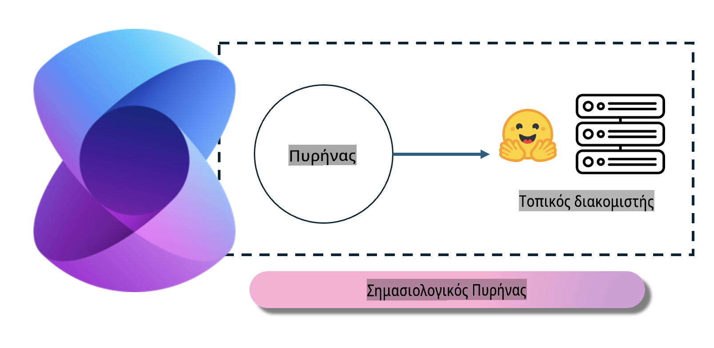
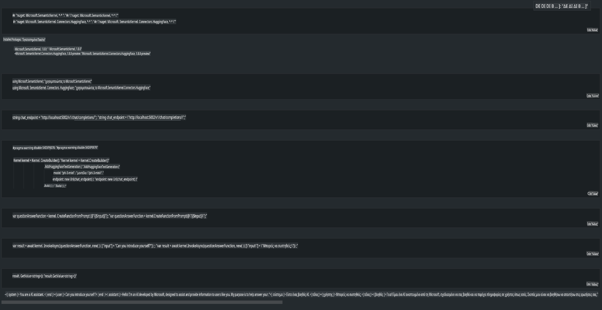

# **Εκτέλεση του Phi-3 σε Τοπικό Διακομιστή**

Μπορούμε να αναπτύξουμε το Phi-3 σε έναν τοπικό διακομιστή. Οι χρήστες μπορούν να επιλέξουν τις λύσεις [Ollama](https://ollama.com) ή [LM Studio](https://llamaedge.com), ή να γράψουν τον δικό τους κώδικα. Μπορείτε να συνδεθείτε με τις τοπικές υπηρεσίες του Phi-3 μέσω του [Semantic Kernel](https://github.com/microsoft/semantic-kernel?WT.mc_id=aiml-138114-kinfeylo) ή του [Langchain](https://www.langchain.com/) για να δημιουργήσετε εφαρμογές Copilot.

## **Χρήση του Semantic Kernel για πρόσβαση στο Phi-3-mini**

Στις εφαρμογές Copilot, δημιουργούμε εφαρμογές μέσω των Semantic Kernel / LangChain. Αυτό το είδος πλαισίου εφαρμογών είναι γενικά συμβατό με το Azure OpenAI Service / OpenAI μοντέλα και μπορεί επίσης να υποστηρίξει ανοιχτού κώδικα μοντέλα από το Hugging Face καθώς και τοπικά μοντέλα. Τι πρέπει να κάνουμε εάν θέλουμε να χρησιμοποιήσουμε το Semantic Kernel για πρόσβαση στο Phi-3-mini; Χρησιμοποιώντας ως παράδειγμα τη .NET, μπορούμε να το συνδυάσουμε με τον Hugging Face Connector στο Semantic Kernel. Από προεπιλογή, μπορεί να αντιστοιχεί στο model id στο Hugging Face (την πρώτη φορά που το χρησιμοποιείτε, το μοντέλο θα κατέβει από το Hugging Face, κάτι που απαιτεί χρόνο). Μπορείτε επίσης να συνδεθείτε με την τοπική υπηρεσία που έχετε δημιουργήσει. Μεταξύ των δύο επιλογών, συνιστούμε τη δεύτερη, καθώς προσφέρει μεγαλύτερη αυτονομία, ιδιαίτερα σε επιχειρηματικές εφαρμογές.

Από την εικόνα, η πρόσβαση σε τοπικές υπηρεσίες μέσω του Semantic Kernel μπορεί εύκολα να συνδέσει τον τοπικό διακομιστή μοντέλων Phi-3-mini που έχετε δημιουργήσει. Εδώ φαίνεται το αποτέλεσμα εκτέλεσης:

***Δείγμα Κώδικα*** https://github.com/kinfey/Phi3MiniSamples/tree/main/semantickernel

**Αποποίηση Ευθύνης**:  
Αυτό το έγγραφο έχει μεταφραστεί χρησιμοποιώντας υπηρεσίες αυτόματης μετάφρασης με βάση την τεχνητή νοημοσύνη. Παρόλο που καταβάλλουμε προσπάθειες για ακρίβεια, παρακαλούμε να γνωρίζετε ότι οι αυτόματες μεταφράσεις ενδέχεται να περιέχουν λάθη ή ανακρίβειες. Το αρχικό έγγραφο στη μητρική του γλώσσα θα πρέπει να θεωρείται η αυθεντική πηγή. Για κρίσιμες πληροφορίες, συνιστάται επαγγελματική ανθρώπινη μετάφραση. Δεν φέρουμε καμία ευθύνη για τυχόν παρεξηγήσεις ή λανθασμένες ερμηνείες που προκύπτουν από τη χρήση αυτής της μετάφρασης.