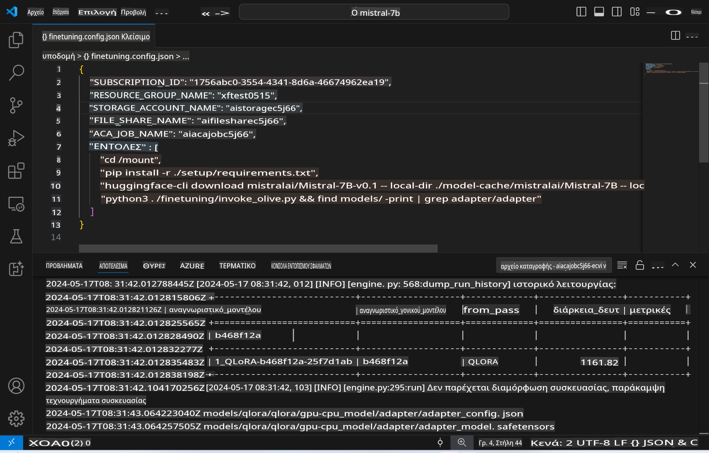
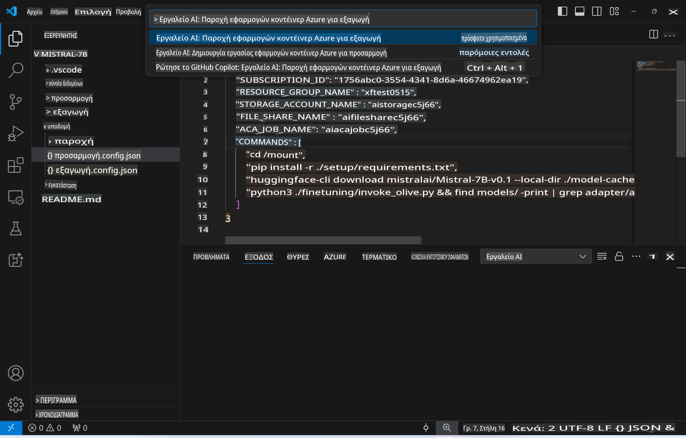
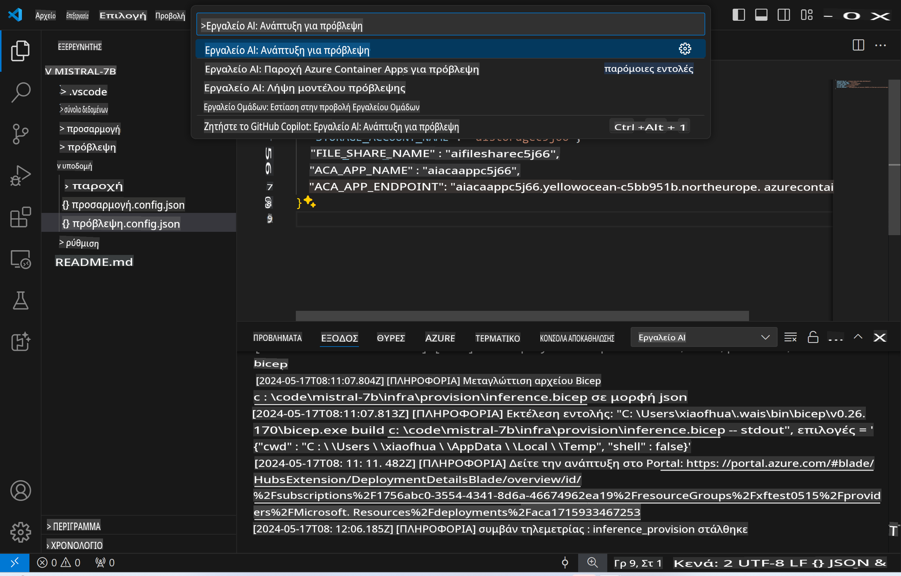
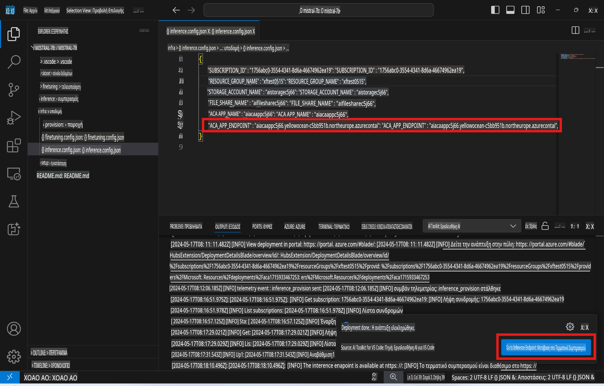

# Απομακρυσμένη Επεξεργασία με το προσαρμοσμένο μοντέλο

Αφού εκπαιδευτούν οι adapters στο απομακρυσμένο περιβάλλον, μπορείτε να χρησιμοποιήσετε μια απλή εφαρμογή Gradio για να αλληλεπιδράσετε με το μοντέλο.



### Δημιουργία Πόρων Azure
Πρέπει να ρυθμίσετε τους πόρους Azure για απομακρυσμένη επεξεργασία εκτελώντας την `AI Toolkit: Provision Azure Container Apps for inference` από το command palette. Κατά τη διάρκεια αυτής της διαδικασίας, θα σας ζητηθεί να επιλέξετε τη συνδρομή Azure και την ομάδα πόρων σας.  

   
Από προεπιλογή, η συνδρομή και η ομάδα πόρων για την επεξεργασία θα πρέπει να είναι ίδιες με αυτές που χρησιμοποιήθηκαν για την προσαρμογή. Η επεξεργασία θα χρησιμοποιήσει το ίδιο Azure Container App Environment και θα έχει πρόσβαση στο μοντέλο και τον adapter του μοντέλου που αποθηκεύτηκαν στο Azure Files κατά τη φάση της προσαρμογής.

## Χρήση του AI Toolkit 

### Ανάπτυξη για Επεξεργασία  
Εάν θέλετε να τροποποιήσετε τον κώδικα επεξεργασίας ή να φορτώσετε εκ νέου το μοντέλο επεξεργασίας, εκτελέστε την εντολή `AI Toolkit: Deploy for inference`. Αυτό θα συγχρονίσει τον τελευταίο σας κώδικα με το ACA και θα επανεκκινήσει το αντίγραφο.  



Μετά την επιτυχή ολοκλήρωση της ανάπτυξης, το μοντέλο είναι έτοιμο για αξιολόγηση χρησιμοποιώντας αυτό το endpoint.

### Πρόσβαση στο API Επεξεργασίας

Μπορείτε να αποκτήσετε πρόσβαση στο API επεξεργασίας κάνοντας κλικ στο κουμπί "*Go to Inference Endpoint*" που εμφανίζεται στην ειδοποίηση του VSCode. Εναλλακτικά, το endpoint του web API μπορείτε να το βρείτε στο `ACA_APP_ENDPOINT` στο `./infra/inference.config.json` και στο output panel.



> **Σημείωση:** Το endpoint επεξεργασίας μπορεί να χρειαστεί μερικά λεπτά για να γίνει πλήρως λειτουργικό.

## Στοιχεία Επεξεργασίας που Περιλαμβάνονται στο Πρότυπο
 
| Φάκελος | Περιεχόμενα |
| ------ |--------- |
| `infra` | Περιέχει όλες τις απαραίτητες ρυθμίσεις για απομακρυσμένες λειτουργίες. |
| `infra/provision/inference.parameters.json` | Περιέχει παραμέτρους για τα bicep templates, που χρησιμοποιούνται για τη δημιουργία πόρων Azure για επεξεργασία. |
| `infra/provision/inference.bicep` | Περιέχει templates για τη δημιουργία πόρων Azure για επεξεργασία. |
| `infra/inference.config.json` | Το αρχείο ρύθμισης, που δημιουργείται από την εντολή `AI Toolkit: Provision Azure Container Apps for inference`. Χρησιμοποιείται ως είσοδος για άλλες απομακρυσμένες εντολές. |

### Χρήση του AI Toolkit για Ρύθμιση Δημιουργίας Πόρων Azure
Ρυθμίστε το [AI Toolkit](https://marketplace.visualstudio.com/items?itemName=ms-windows-ai-studio.windows-ai-studio)

Δημιουργήστε Azure Container Apps για επεξεργασία ` command.

You can find configuration parameters in `./infra/provision/inference.parameters.json` file. Here are the details:
| Parameter | Description |
| --------- |------------ |
| `defaultCommands` | This is the commands to initiate a web API. |
| `maximumInstanceCount` | This parameter sets the maximum capacity of GPU instances. |
| `location` | This is the location where Azure resources are provisioned. The default value is the same as the chosen resource group's location. |
| `storageAccountName`, `fileShareName` `acaEnvironmentName`, `acaEnvironmentStorageName`, `acaAppName`,  `acaLogAnalyticsName` | These parameters are used to name the Azure resources for provision. By default, they will be same to the fine-tuning resource name. You can input a new, unused resource name to create your own custom-named resources, or you can input the name of an already existing Azure resource if you'd prefer to use that. For details, refer to the section [Using existing Azure Resources](../../../../../md/01.Introduction/03). |

### Using Existing Azure Resources

By default, the inference provision use the same Azure Container App Environment, Storage Account, Azure File Share, and Azure Log Analytics that were used for fine-tuning. A separate Azure Container App is created solely for the inference API. 

If you have customized the Azure resources during the fine-tuning step or want to use your own existing Azure resources for inference, specify their names in the `./infra/inference.parameters.json` αρχείο. Στη συνέχεια, εκτελέστε την `AI Toolkit: Provision Azure Container Apps for inference` εντολή από το command palette. Αυτό θα ενημερώσει οποιουσδήποτε καθορισμένους πόρους και θα δημιουργήσει τυχόν ελλείποντες.

Για παράδειγμα, εάν έχετε ήδη ένα υπάρχον Azure container περιβάλλον, το `./infra/finetuning.parameters.json` σας θα πρέπει να μοιάζει ως εξής:

```json
{
    "$schema": "https://schema.management.azure.com/schemas/2019-04-01/deploymentParameters.json#",
    "contentVersion": "1.0.0.0",
    "parameters": {
      ...
      "acaEnvironmentName": {
        "value": "<your-aca-env-name>"
      },
      "acaEnvironmentStorageName": {
        "value": null
      },
      ...
    }
  }
```

### Χειροκίνητη Δημιουργία  
Εάν προτιμάτε να ρυθμίσετε χειροκίνητα τους πόρους Azure, μπορείτε να χρησιμοποιήσετε τα παρεχόμενα αρχεία bicep στο `./infra/provision` folders. If you have already set up and configured all the Azure resources without using the AI Toolkit command palette, you can simply enter the resource names in the `inference.config.json` αρχείο.

Για παράδειγμα:

```json
{
  "SUBSCRIPTION_ID": "<your-subscription-id>",
  "RESOURCE_GROUP_NAME": "<your-resource-group-name>",
  "STORAGE_ACCOUNT_NAME": "<your-storage-account-name>",
  "FILE_SHARE_NAME": "<your-file-share-name>",
  "ACA_APP_NAME": "<your-aca-name>",
  "ACA_APP_ENDPOINT": "<your-aca-endpoint>"
}
```

**Αποποίηση ευθυνών**:  
Αυτό το έγγραφο έχει μεταφραστεί χρησιμοποιώντας υπηρεσίες αυτόματης μετάφρασης με τεχνητή νοημοσύνη. Ενώ καταβάλλουμε κάθε προσπάθεια για ακρίβεια, παρακαλούμε να έχετε υπόψη ότι οι αυτόματες μεταφράσεις ενδέχεται να περιέχουν λάθη ή ανακρίβειες. Το πρωτότυπο έγγραφο στη μητρική του γλώσσα θα πρέπει να θεωρείται η αυθεντική πηγή. Για κρίσιμες πληροφορίες, συνιστάται επαγγελματική ανθρώπινη μετάφραση. Δεν φέρουμε ευθύνη για τυχόν παρεξηγήσεις ή εσφαλμένες ερμηνείες που προκύπτουν από τη χρήση αυτής της μετάφρασης.