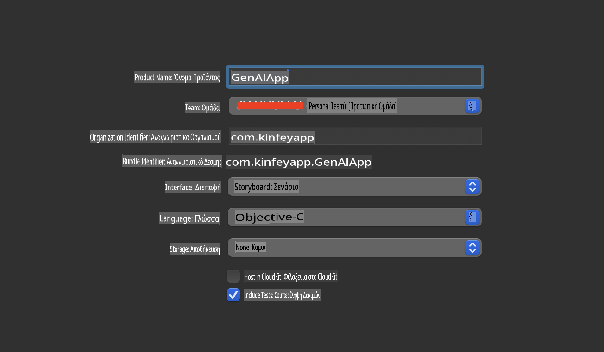
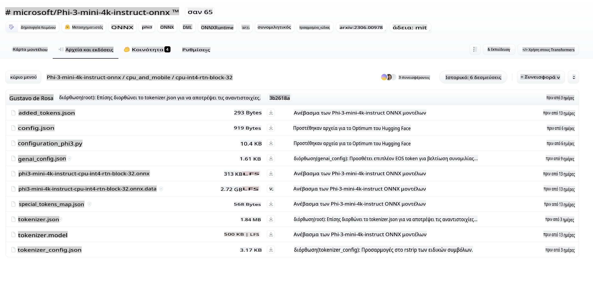
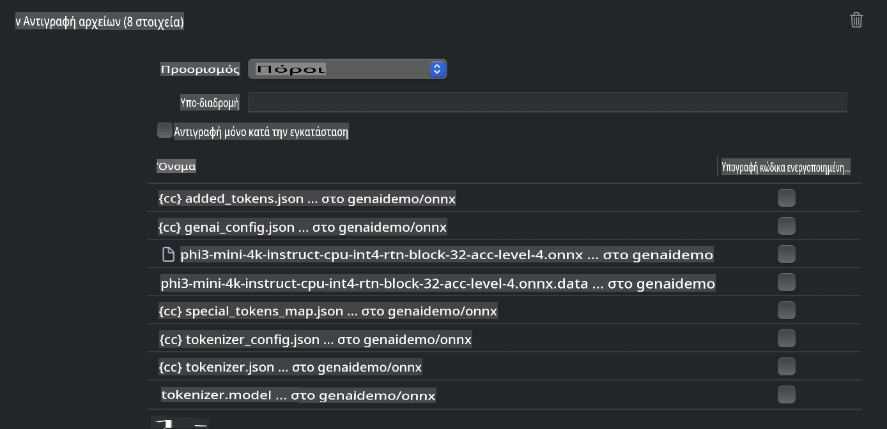
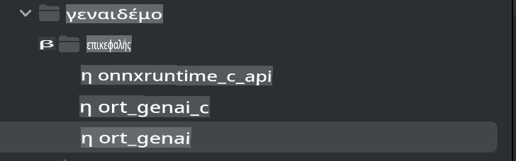
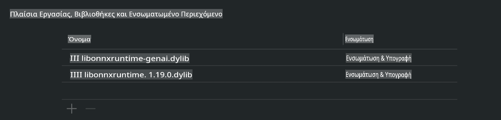
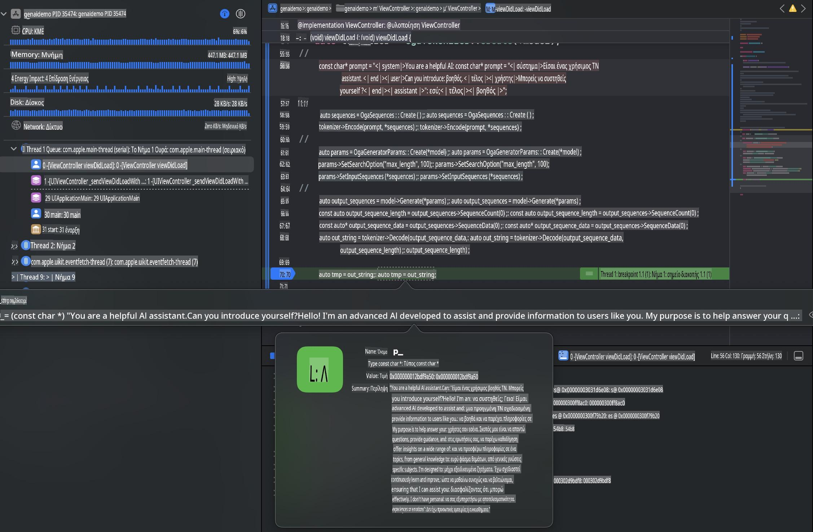

# **Inference Phi-3 σε iOS**

Το Phi-3-mini είναι μια νέα σειρά μοντέλων από τη Microsoft που επιτρέπει την ανάπτυξη Μεγάλων Γλωσσικών Μοντέλων (LLMs) σε συσκευές άκρης και IoT. Το Phi-3-mini είναι διαθέσιμο για ανάπτυξη σε iOS, Android και συσκευές άκρης, επιτρέποντας την υλοποίηση γεννητικής τεχνητής νοημοσύνης σε περιβάλλοντα BYOD. Το παρακάτω παράδειγμα δείχνει πώς να αναπτύξετε το Phi-3-mini σε iOS.

## **1. Προετοιμασία**

- **α.** macOS 14+  
- **β.** Xcode 15+  
- **γ.** iOS SDK 17.x (iPhone 14 A16 ή νεότερο)  
- **δ.** Εγκαταστήστε Python 3.10+ (συνιστάται το Conda)  
- **ε.** Εγκαταστήστε τη βιβλιοθήκη Python: `python-flatbuffers`  
- **στ.** Εγκαταστήστε το CMake  

### Semantic Kernel και Inferencing

Το Semantic Kernel είναι ένα πλαίσιο εφαρμογών που σας επιτρέπει να δημιουργείτε εφαρμογές συμβατές με την υπηρεσία Azure OpenAI, τα μοντέλα OpenAI και ακόμα και τοπικά μοντέλα. Μέσω του Semantic Kernel, μπορείτε εύκολα να ενσωματώσετε την αυτο-φιλοξενούμενη έκδοση του μοντέλου Phi-3-mini.

### Κλήση Ποσοτικοποιημένων Μοντέλων με Ollama ή LlamaEdge

Πολλοί χρήστες προτιμούν τη χρήση ποσοτικοποιημένων μοντέλων για τοπική εκτέλεση. Το [Ollama](https://ollama.com) και το [LlamaEdge](https://llamaedge.com) επιτρέπουν την κλήση διαφορετικών ποσοτικοποιημένων μοντέλων:

#### **Ollama**

Μπορείτε να εκτελέσετε το `ollama run phi3` απευθείας ή να το διαμορφώσετε εκτός σύνδεσης. Δημιουργήστε ένα Modelfile με τη διαδρομή προς το `gguf` αρχείο σας. Παράδειγμα κώδικα για την εκτέλεση του ποσοτικοποιημένου μοντέλου Phi-3-mini:

```gguf
FROM {Add your gguf file path}
TEMPLATE \"\"\"<|user|> .Prompt<|end|> <|assistant|>\"\"\"
PARAMETER stop <|end|>
PARAMETER num_ctx 4096
```

#### **LlamaEdge**

Αν θέλετε να χρησιμοποιήσετε το `gguf` τόσο σε cloud όσο και σε συσκευές άκρης ταυτόχρονα, το LlamaEdge είναι μια εξαιρετική επιλογή.

## **2. Μεταγλώττιση του ONNX Runtime για iOS**

```bash

git clone https://github.com/microsoft/onnxruntime.git

cd onnxruntime

./build.sh --build_shared_lib --ios --skip_tests --parallel --build_dir ./build_ios --ios --apple_sysroot iphoneos --osx_arch arm64 --apple_deploy_target 17.5 --cmake_generator Xcode --config Release

cd ../

```

### **Σημείωση**

- **α.** Πριν τη μεταγλώττιση, βεβαιωθείτε ότι το Xcode έχει ρυθμιστεί σωστά και ότι έχει οριστεί ως ο ενεργός κατάλογος προγραμματιστή στο τερματικό:

    ```bash
    sudo xcode-select -switch /Applications/Xcode.app/Contents/Developer
    ```

- **β.** Το ONNX Runtime χρειάζεται μεταγλώττιση για διαφορετικές πλατφόρμες. Για iOS, μπορείτε να το μεταγλωττίσετε για `arm64` or `x86_64`.

- **γ.** Συνιστάται η χρήση της τελευταίας έκδοσης του iOS SDK για μεταγλώττιση. Ωστόσο, μπορείτε να χρησιμοποιήσετε και παλαιότερη έκδοση αν χρειάζεστε συμβατότητα με προηγούμενα SDKs.

## **3. Μεταγλώττιση Γεννητικής Τεχνητής Νοημοσύνης με ONNX Runtime για iOS**

> **Σημείωση:** Επειδή η Γεννητική Τεχνητή Νοημοσύνη με ONNX Runtime βρίσκεται σε δοκιμαστική έκδοση, ενδέχεται να υπάρξουν αλλαγές.

```bash

git clone https://github.com/microsoft/onnxruntime-genai
 
cd onnxruntime-genai
 
mkdir ort
 
cd ort
 
mkdir include
 
mkdir lib
 
cd ../
 
cp ../onnxruntime/include/onnxruntime/core/session/onnxruntime_c_api.h ort/include
 
cp ../onnxruntime/build_ios/Release/Release-iphoneos/libonnxruntime*.dylib* ort/lib
 
export OPENCV_SKIP_XCODEBUILD_FORCE_TRYCOMPILE_DEBUG=1
 
python3 build.py --parallel --build_dir ./build_ios --ios --ios_sysroot iphoneos --ios_arch arm64 --ios_deployment_target 17.5 --cmake_generator Xcode --cmake_extra_defines CMAKE_XCODE_ATTRIBUTE_CODE_SIGNING_ALLOWED=NO

```

## **4. Δημιουργία εφαρμογής App στο Xcode**

Επέλεξα την Objective-C ως μέθοδο ανάπτυξης της εφαρμογής, επειδή η χρήση Γεννητικής Τεχνητής Νοημοσύνης με το ONNX Runtime C++ API είναι καλύτερα συμβατή με την Objective-C. Φυσικά, μπορείτε να ολοκληρώσετε τις σχετικές κλήσεις και μέσω Swift bridging.



## **5. Αντιγραφή του ποσοτικοποιημένου μοντέλου INT4 ONNX στο έργο της εφαρμογής**

Πρέπει να εισάγουμε το μοντέλο ποσοτικοποίησης INT4 σε μορφή ONNX, το οποίο πρέπει να κατεβάσετε πρώτα.



Αφού το κατεβάσετε, πρέπει να το προσθέσετε στον κατάλογο Resources του έργου στο Xcode.



## **6. Προσθήκη του C++ API στα ViewControllers**

> **Σημείωση:**

- **α.** Προσθέστε τα αντίστοιχα αρχεία κεφαλίδων C++ στο έργο.

  

- **β.** Συμπεριλάβετε τα `onnxruntime-genai` dynamic library in Xcode.

  

- **c.** Use the C Samples code for testing. You can also add additional features like ChatUI for more functionality.

- **d.** Since you need to use C++ in your project, rename `ViewController.m` to `ViewController.mm` για να ενεργοποιήσετε την υποστήριξη Objective-C++.

```objc

    NSString *llmPath = [[NSBundle mainBundle] resourcePath];
    char const *modelPath = llmPath.cString;

    auto model =  OgaModel::Create(modelPath);

    auto tokenizer = OgaTokenizer::Create(*model);

    const char* prompt = "<|system|>You are a helpful AI assistant.<|end|><|user|>Can you introduce yourself?<|end|><|assistant|>";

    auto sequences = OgaSequences::Create();
    tokenizer->Encode(prompt, *sequences);

    auto params = OgaGeneratorParams::Create(*model);
    params->SetSearchOption("max_length", 100);
    params->SetInputSequences(*sequences);

    auto output_sequences = model->Generate(*params);
    const auto output_sequence_length = output_sequences->SequenceCount(0);
    const auto* output_sequence_data = output_sequences->SequenceData(0);
    auto out_string = tokenizer->Decode(output_sequence_data, output_sequence_length);
    
    auto tmp = out_string;

```

## **7. Εκτέλεση της Εφαρμογής**

Αφού ολοκληρωθεί η ρύθμιση, μπορείτε να εκτελέσετε την εφαρμογή για να δείτε τα αποτελέσματα της εξαγωγής του μοντέλου Phi-3-mini.



Για περισσότερο δείγμα κώδικα και αναλυτικές οδηγίες, επισκεφθείτε το [Phi-3 Mini Samples repository](https://github.com/Azure-Samples/Phi-3MiniSamples/tree/main/ios).

**Αποποίηση ευθύνης**:  
Αυτό το έγγραφο έχει μεταφραστεί χρησιμοποιώντας υπηρεσίες μετάφρασης που βασίζονται σε τεχνητή νοημοσύνη. Παρόλο που καταβάλλουμε προσπάθειες για ακρίβεια, παρακαλούμε να έχετε υπόψη ότι οι αυτοματοποιημένες μεταφράσεις ενδέχεται να περιέχουν λάθη ή ανακρίβειες. Το πρωτότυπο έγγραφο στη μητρική του γλώσσα πρέπει να θεωρείται η αυθεντική πηγή. Για κρίσιμες πληροφορίες, συνιστάται επαγγελματική ανθρώπινη μετάφραση. Δεν φέρουμε ευθύνη για τυχόν παρανοήσεις ή παρερμηνείες που προκύπτουν από τη χρήση αυτής της μετάφρασης.