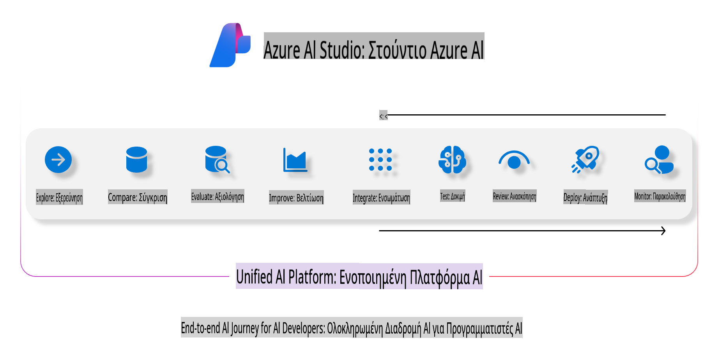
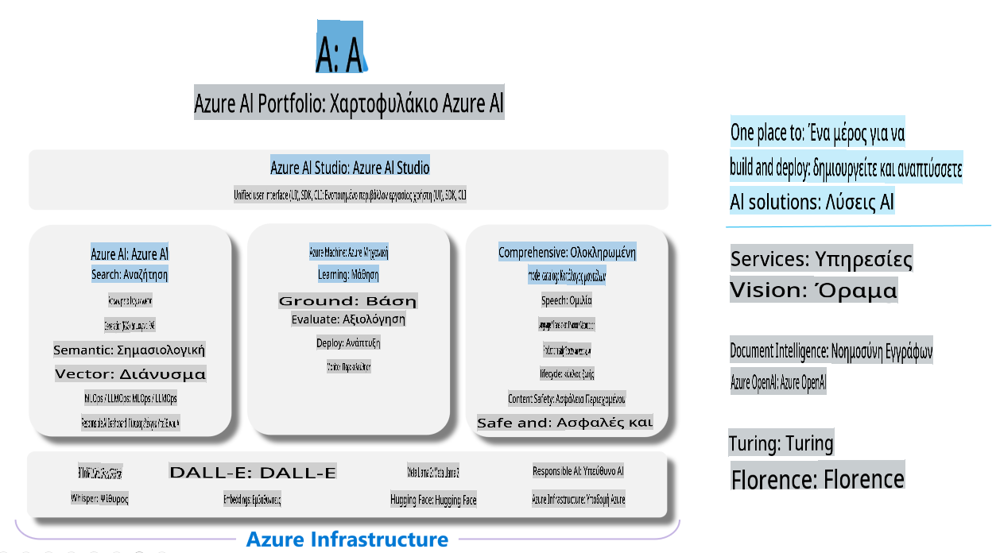

# **Χρήση του Azure AI Foundry για αξιολόγηση**

Πώς να αξιολογήσετε την εφαρμογή σας που βασίζεται σε γενετική τεχνητή νοημοσύνη χρησιμοποιώντας το [Azure AI Foundry](https://ai.azure.com?WT.mc_id=aiml-138114-kinfeylo). Είτε αξιολογείτε διαλόγους μίας στροφής είτε πολλαπλών στροφών, το Azure AI Foundry παρέχει εργαλεία για την αξιολόγηση της απόδοσης και της ασφάλειας του μοντέλου.

## Πώς να αξιολογήσετε εφαρμογές γενετικής τεχνητής νοημοσύνης με το Azure AI Foundry
Για περισσότερες λεπτομέρειες, δείτε την [τεκμηρίωση του Azure AI Foundry](https://learn.microsoft.com/azure/ai-studio/how-to/evaluate-generative-ai-app?WT.mc_id=aiml-138114-kinfeylo).

Ακολουθούν τα βήματα για να ξεκινήσετε:

## Αξιολόγηση Μοντέλων Γενετικής Τεχνητής Νοημοσύνης στο Azure AI Foundry

**Προαπαιτούμενα**

- Ένα σύνολο δεδομένων δοκιμών σε μορφή CSV ή JSON.
- Ένα αναπτυγμένο μοντέλο γενετικής τεχνητής νοημοσύνης (όπως Phi-3, GPT 3.5, GPT 4, ή Davinci models).
- Ένα runtime με υπολογιστική μονάδα για την εκτέλεση της αξιολόγησης.

## Ενσωματωμένοι Δείκτες Αξιολόγησης

Το Azure AI Foundry σας επιτρέπει να αξιολογήσετε τόσο διαλόγους μίας στροφής όσο και πιο περίπλοκους διαλόγους πολλαπλών στροφών.
Για σενάρια RAG (Retrieval Augmented Generation), όπου το μοντέλο βασίζεται σε συγκεκριμένα δεδομένα, μπορείτε να αξιολογήσετε την απόδοση χρησιμοποιώντας ενσωματωμένους δείκτες αξιολόγησης.
Επιπλέον, μπορείτε να αξιολογήσετε γενικά σενάρια ερωταπαντήσεων μίας στροφής (non-RAG).

## Δημιουργία Εκτέλεσης Αξιολόγησης

Από το περιβάλλον χρήστη του Azure AI Foundry, πλοηγηθείτε είτε στη σελίδα Evaluate είτε στη σελίδα Prompt Flow.
Ακολουθήστε τον οδηγό δημιουργίας αξιολόγησης για να ρυθμίσετε μια εκτέλεση αξιολόγησης. Δώστε προαιρετικά ένα όνομα για την αξιολόγησή σας.
Επιλέξτε το σενάριο που ευθυγραμμίζεται με τους στόχους της εφαρμογής σας.
Διαλέξτε έναν ή περισσότερους δείκτες αξιολόγησης για να αξιολογήσετε την έξοδο του μοντέλου.

## Προσαρμοσμένη Ροή Αξιολόγησης (Προαιρετικά)

Για μεγαλύτερη ευελιξία, μπορείτε να δημιουργήσετε μια προσαρμοσμένη ροή αξιολόγησης. Προσαρμόστε τη διαδικασία αξιολόγησης σύμφωνα με τις συγκεκριμένες απαιτήσεις σας.

## Προβολή Αποτελεσμάτων

Μετά την εκτέλεση της αξιολόγησης, καταγράψτε, προβάλετε και αναλύστε λεπτομερείς δείκτες αξιολόγησης στο Azure AI Foundry. Αποκτήστε πληροφορίες για τις δυνατότητες και τους περιορισμούς της εφαρμογής σας.

**Σημείωση** Το Azure AI Foundry βρίσκεται επί του παρόντος σε δημόσια προεπισκόπηση, οπότε χρησιμοποιήστε το για πειραματισμό και σκοπούς ανάπτυξης. Για εργασίες παραγωγής, εξετάστε άλλες επιλογές. Εξερευνήστε την επίσημη [τεκμηρίωση του AI Foundry](https://learn.microsoft.com/azure/ai-studio/?WT.mc_id=aiml-138114-kinfeylo) για περισσότερες λεπτομέρειες και οδηγίες βήμα προς βήμα.

**Αποποίηση ευθύνης**:  
Αυτό το έγγραφο έχει μεταφραστεί χρησιμοποιώντας υπηρεσίες αυτόματης μετάφρασης με τεχνητή νοημοσύνη. Παρόλο που καταβάλλουμε προσπάθειες για ακρίβεια, παρακαλούμε να γνωρίζετε ότι οι αυτόματες μεταφράσεις ενδέχεται να περιέχουν λάθη ή ανακρίβειες. Το αρχικό έγγραφο στη μητρική του γλώσσα θα πρέπει να θεωρείται η αυθεντική πηγή. Για κρίσιμες πληροφορίες, συνιστάται επαγγελματική ανθρώπινη μετάφραση. Δεν φέρουμε ευθύνη για τυχόν παρεξηγήσεις ή παρερμηνείες που προκύπτουν από τη χρήση αυτής της μετάφρασης.