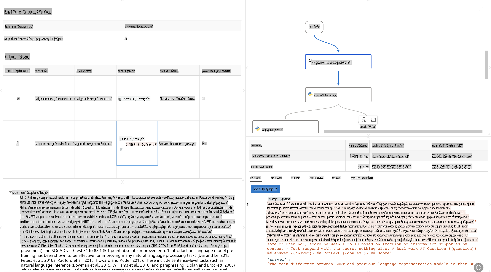

# **Γνωρίστε το Promptflow**

[Microsoft Prompt Flow](https://microsoft.github.io/promptflow/index.html?WT.mc_id=aiml-138114-kinfeylo) είναι ένα εργαλείο αυτοματοποίησης ροών εργασίας με γραφική διεπαφή, που επιτρέπει στους χρήστες να δημιουργούν αυτοματοποιημένες ροές χρησιμοποιώντας προκατασκευασμένα πρότυπα και προσαρμοσμένους συνδέσμους. Σχεδιάστηκε για να δώσει τη δυνατότητα σε προγραμματιστές και επιχειρηματικούς αναλυτές να δημιουργούν γρήγορα αυτοματοποιημένες διαδικασίες για εργασίες όπως η διαχείριση δεδομένων, η συνεργασία και η βελτιστοποίηση διαδικασιών. Με το Prompt Flow, οι χρήστες μπορούν εύκολα να συνδέσουν διαφορετικές υπηρεσίες, εφαρμογές και συστήματα, και να αυτοματοποιήσουν πολύπλοκες επιχειρηματικές διαδικασίες.

Το Microsoft Prompt Flow έχει σχεδιαστεί για να απλοποιεί τον κύκλο ανάπτυξης εφαρμογών τεχνητής νοημοσύνης (AI) που βασίζονται σε Μεγάλα Γλωσσικά Μοντέλα (LLMs). Είτε βρίσκεστε στη φάση της ιδέας, του πρωτοτύπου, της δοκιμής, της αξιολόγησης ή της ανάπτυξης εφαρμογών που βασίζονται σε LLM, το Prompt Flow διευκολύνει τη διαδικασία και σας επιτρέπει να δημιουργείτε εφαρμογές LLM με ποιότητα παραγωγής.

## Τα βασικά χαρακτηριστικά και οφέλη του Microsoft Prompt Flow:

**Διαδραστική Εμπειρία Ανάπτυξης**

Το Prompt Flow παρέχει μια γραφική αναπαράσταση της δομής της ροής σας, κάνοντάς την εύκολη στην κατανόηση και πλοήγηση.
Προσφέρει μια εμπειρία κωδικοποίησης τύπου notebook για αποδοτική ανάπτυξη και αποσφαλμάτωση των ροών.

**Παραλλαγές και Βελτιστοποίηση Προτροπών**

Δημιουργήστε και συγκρίνετε πολλαπλές παραλλαγές προτροπών για να διευκολύνετε τη διαδικασία βελτίωσης. Αξιολογήστε την απόδοση διαφορετικών προτροπών και επιλέξτε τις πιο αποτελεσματικές.

**Ενσωματωμένες Ροές Αξιολόγησης**

Αξιολογήστε την ποιότητα και την αποτελεσματικότητα των προτροπών και των ροών σας χρησιμοποιώντας τα ενσωματωμένα εργαλεία αξιολόγησης.
Κατανοήστε πόσο καλά αποδίδουν οι εφαρμογές σας που βασίζονται σε LLM.

**Ολοκληρωμένοι Πόροι**

Το Prompt Flow περιλαμβάνει μια βιβλιοθήκη με ενσωματωμένα εργαλεία, δείγματα και πρότυπα. Αυτοί οι πόροι λειτουργούν ως σημείο εκκίνησης για την ανάπτυξη, εμπνέουν δημιουργικότητα και επιταχύνουν τη διαδικασία.

**Συνεργασία και Ετοιμότητα για Επιχειρήσεις**

Υποστηρίξτε τη συνεργασία της ομάδας επιτρέποντας σε πολλούς χρήστες να εργάζονται μαζί σε έργα προτροπών.
Διατηρήστε τον έλεγχο εκδόσεων και μοιραστείτε τη γνώση αποτελεσματικά. Απλοποιήστε όλη τη διαδικασία προτροπών, από την ανάπτυξη και την αξιολόγηση έως την ανάπτυξη και την παρακολούθηση.

## Αξιολόγηση στο Prompt Flow 

Στο Microsoft Prompt Flow, η αξιολόγηση παίζει κρίσιμο ρόλο στην εκτίμηση της απόδοσης των μοντέλων AI σας. Ας εξερευνήσουμε πώς μπορείτε να προσαρμόσετε τις ροές και τα μέτρα αξιολόγησης μέσα στο Prompt Flow:

**Κατανόηση της Αξιολόγησης στο Prompt Flow**

Στο Prompt Flow, μια ροή αντιπροσωπεύει μια ακολουθία κόμβων που επεξεργάζονται εισόδους και παράγουν εξόδους. Οι ροές αξιολόγησης είναι ειδικοί τύποι ροών που έχουν σχεδιαστεί για να αξιολογούν την απόδοση μιας εκτέλεσης με βάση συγκεκριμένα κριτήρια και στόχους.

**Βασικά χαρακτηριστικά των ροών αξιολόγησης**

Συνήθως εκτελούνται μετά τη ροή που δοκιμάζεται, χρησιμοποιώντας τα αποτελέσματά της. Υπολογίζουν σκορ ή μέτρα για τη μέτρηση της απόδοσης της δοκιμαζόμενης ροής. Τα μέτρα μπορεί να περιλαμβάνουν ακρίβεια, βαθμολογίες συνάφειας ή οποιαδήποτε άλλα σχετικά μέτρα.

### Προσαρμογή Ροών Αξιολόγησης

**Ορισμός Εισόδων**

Οι ροές αξιολόγησης πρέπει να λαμβάνουν τις εξόδους της δοκιμαζόμενης εκτέλεσης. Ορίστε εισόδους παρόμοια με τις τυπικές ροές.
Για παράδειγμα, αν αξιολογείτε μια ροή Ερωτήσεων-Απαντήσεων, ονομάστε μια είσοδο "απάντηση." Αν αξιολογείτε μια ροή ταξινόμησης, ονομάστε μια είσοδο "κατηγορία." Ενδέχεται επίσης να χρειαστούν εισόδοι αναφοράς (π.χ. πραγματικές ετικέτες).

**Έξοδοι και Μέτρα**

Οι ροές αξιολόγησης παράγουν αποτελέσματα που μετρούν την απόδοση της δοκιμαζόμενης ροής. Τα μέτρα μπορούν να υπολογιστούν χρησιμοποιώντας Python ή LLM (Μεγάλα Γλωσσικά Μοντέλα). Χρησιμοποιήστε τη συνάρτηση log_metric() για να καταγράψετε σχετικά μέτρα.

**Χρήση Προσαρμοσμένων Ροών Αξιολόγησης**

Αναπτύξτε τη δική σας ροή αξιολόγησης προσαρμοσμένη στις συγκεκριμένες εργασίες και στόχους σας. Προσαρμόστε τα μέτρα με βάση τους στόχους αξιολόγησής σας.
Εφαρμόστε αυτήν την προσαρμοσμένη ροή αξιολόγησης σε μαζικές εκτελέσεις για δοκιμές μεγάλης κλίμακας.

## Ενσωματωμένες Μέθοδοι Αξιολόγησης

Το Prompt Flow παρέχει επίσης ενσωματωμένες μεθόδους αξιολόγησης.
Μπορείτε να υποβάλετε μαζικές εκτελέσεις και να χρησιμοποιήσετε αυτές τις μεθόδους για να αξιολογήσετε πόσο καλά αποδίδει η ροή σας με μεγάλα σύνολα δεδομένων.
Δείτε τα αποτελέσματα αξιολόγησης, συγκρίνετε μέτρα και κάντε επαναλήψεις όπου χρειάζεται.
Θυμηθείτε, η αξιολόγηση είναι απαραίτητη για να διασφαλίσετε ότι τα μοντέλα AI σας πληρούν τα επιθυμητά κριτήρια και στόχους. Εξερευνήστε την επίσημη τεκμηρίωση για αναλυτικές οδηγίες σχετικά με την ανάπτυξη και τη χρήση ροών αξιολόγησης στο Microsoft Prompt Flow.

Συνοψίζοντας, το Microsoft Prompt Flow δίνει τη δυνατότητα στους προγραμματιστές να δημιουργούν εφαρμογές LLM υψηλής ποιότητας, απλοποιώντας την ανάπτυξη προτροπών και παρέχοντας ένα ισχυρό περιβάλλον ανάπτυξης. Αν εργάζεστε με LLM, το Prompt Flow είναι ένα πολύτιμο εργαλείο για να εξερευνήσετε. Εξερευνήστε τα [Έγγραφα Αξιολόγησης Prompt Flow](https://learn.microsoft.com/azure/machine-learning/prompt-flow/how-to-develop-an-evaluation-flow?view=azureml-api-2?WT.mc_id=aiml-138114-kinfeylo) για αναλυτικές οδηγίες σχετικά με την ανάπτυξη και τη χρήση ροών αξιολόγησης στο Microsoft Prompt Flow.

**Αποποίηση ευθύνης**:  
Αυτό το έγγραφο έχει μεταφραστεί χρησιμοποιώντας υπηρεσίες αυτόματης μετάφρασης με τεχνητή νοημοσύνη. Παρόλο που καταβάλλουμε προσπάθειες για ακρίβεια, παρακαλούμε να γνωρίζετε ότι οι αυτόματες μεταφράσεις ενδέχεται να περιέχουν λάθη ή ανακρίβειες. Το πρωτότυπο έγγραφο στη μητρική του γλώσσα θα πρέπει να θεωρείται η αυθεντική πηγή. Για κρίσιμες πληροφορίες, συνιστάται επαγγελματική μετάφραση από άνθρωπο. Δεν φέρουμε καμία ευθύνη για τυχόν παρεξηγήσεις ή εσφαλμένες ερμηνείες που προκύπτουν από τη χρήση αυτής της μετάφρασης.