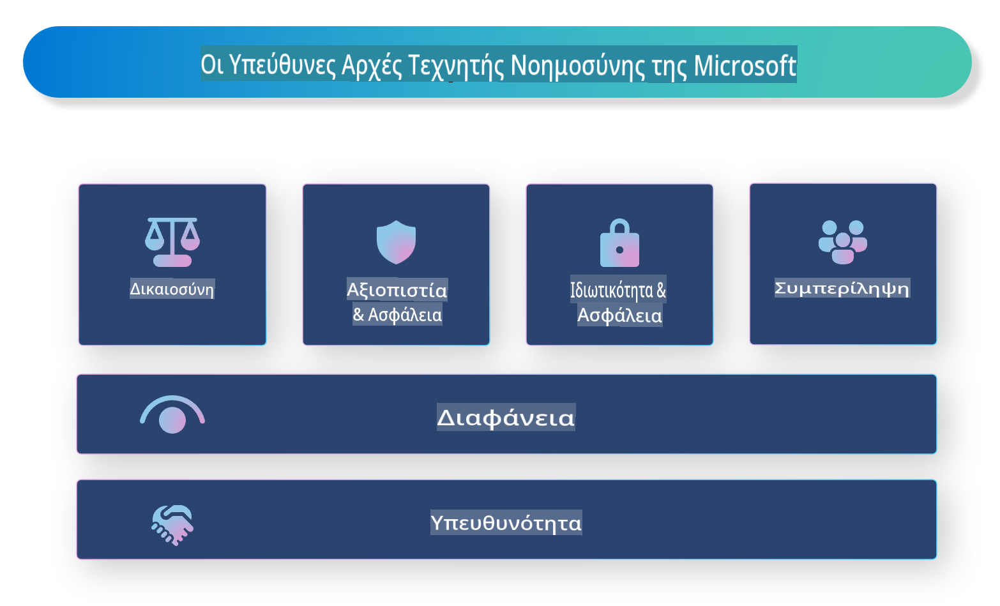

# **Εισαγωγή στην Υπεύθυνη Τεχνητή Νοημοσύνη**

[Microsoft Responsible AI](https://www.microsoft.com/ai/responsible-ai?WT.mc_id=aiml-138114-kinfeylo) είναι μια πρωτοβουλία που στοχεύει να βοηθήσει τους προγραμματιστές και τους οργανισμούς να δημιουργούν συστήματα Τεχνητής Νοημοσύνης που είναι διαφανή, αξιόπιστα και υπεύθυνα. Η πρωτοβουλία παρέχει καθοδήγηση και πόρους για την ανάπτυξη λύσεων υπεύθυνης Τεχνητής Νοημοσύνης που ευθυγραμμίζονται με ηθικές αρχές, όπως η ιδιωτικότητα, η δικαιοσύνη και η διαφάνεια. Θα εξετάσουμε επίσης μερικές από τις προκλήσεις και τις βέλτιστες πρακτικές που σχετίζονται με την ανάπτυξη υπεύθυνων συστημάτων Τεχνητής Νοημοσύνης.

## Επισκόπηση της Υπεύθυνης Τεχνητής Νοημοσύνης της Microsoft

**Ηθικές αρχές**

Η Υπεύθυνη Τεχνητή Νοημοσύνη της Microsoft καθοδηγείται από ένα σύνολο ηθικών αρχών, όπως η ιδιωτικότητα, η δικαιοσύνη, η διαφάνεια, η υπευθυνότητα και η ασφάλεια. Αυτές οι αρχές έχουν σχεδιαστεί για να διασφαλίζουν ότι τα συστήματα Τεχνητής Νοημοσύνης αναπτύσσονται με ηθικό και υπεύθυνο τρόπο.

**Διαφανής Τεχνητή Νοημοσύνη**

Η Microsoft δίνει έμφαση στη σημασία της διαφάνειας στα συστήματα Τεχνητής Νοημοσύνης. Αυτό περιλαμβάνει την παροχή σαφών εξηγήσεων για το πώς λειτουργούν τα μοντέλα Τεχνητής Νοημοσύνης, καθώς και τη διασφάλιση ότι οι πηγές δεδομένων και οι αλγόριθμοι είναι διαθέσιμοι στο κοινό.

**Υπεύθυνη Τεχνητή Νοημοσύνη**

[Microsoft Responsible AI](https://www.microsoft.com/ai/responsible-ai?WT.mc_id=aiml-138114-kinfeylo) προωθεί την ανάπτυξη υπεύθυνων συστημάτων Τεχνητής Νοημοσύνης, τα οποία μπορούν να παρέχουν πληροφορίες για το πώς λαμβάνονται οι αποφάσεις από τα μοντέλα. Αυτό βοηθά τους χρήστες να κατανοούν και να εμπιστεύονται τα αποτελέσματα των συστημάτων Τεχνητής Νοημοσύνης.

**Συμπερίληψη**

Τα συστήματα Τεχνητής Νοημοσύνης πρέπει να σχεδιάζονται για να ωφελούν όλους. Η Microsoft στοχεύει στη δημιουργία περιεκτικής Τεχνητής Νοημοσύνης που λαμβάνει υπόψη διάφορες προοπτικές και αποφεύγει προκαταλήψεις ή διακρίσεις.

**Αξιοπιστία και Ασφάλεια**

Η διασφάλιση ότι τα συστήματα Τεχνητής Νοημοσύνης είναι αξιόπιστα και ασφαλή είναι κρίσιμη. Η Microsoft εστιάζει στην κατασκευή ανθεκτικών μοντέλων που λειτουργούν σταθερά και αποφεύγουν επιβλαβή αποτελέσματα.

**Δικαιοσύνη στην Τεχνητή Νοημοσύνη**

Η Microsoft αναγνωρίζει ότι τα συστήματα Τεχνητής Νοημοσύνης μπορεί να διαιωνίσουν προκαταλήψεις αν εκπαιδευτούν με μεροληπτικά δεδομένα ή αλγόριθμους. Η πρωτοβουλία παρέχει καθοδήγηση για την ανάπτυξη δίκαιων συστημάτων που δεν κάνουν διακρίσεις βάσει παραγόντων όπως η φυλή, το φύλο ή η ηλικία.

**Ιδιωτικότητα και Ασφάλεια**

Η Microsoft δίνει έμφαση στη σημασία της προστασίας της ιδιωτικότητας και της ασφάλειας των δεδομένων των χρηστών στα συστήματα Τεχνητής Νοημοσύνης. Αυτό περιλαμβάνει την εφαρμογή ισχυρής κρυπτογράφησης δεδομένων και ελέγχων πρόσβασης, καθώς και την τακτική αξιολόγηση των συστημάτων για ευπάθειες.

**Υπευθυνότητα και Ευθύνη**

Η Υπεύθυνη Τεχνητή Νοημοσύνη της Microsoft προωθεί την υπευθυνότητα και την ευθύνη στην ανάπτυξη και την υλοποίηση της Τεχνητής Νοημοσύνης. Αυτό περιλαμβάνει τη διασφάλιση ότι οι προγραμματιστές και οι οργανισμοί είναι ενήμεροι για τους πιθανούς κινδύνους που συνδέονται με τα συστήματα Τεχνητής Νοημοσύνης και λαμβάνουν μέτρα για να τους μετριάσουν.

## Βέλτιστες πρακτικές για την ανάπτυξη υπεύθυνων συστημάτων Τεχνητής Νοημοσύνης

**Ανάπτυξη μοντέλων με χρήση ποικίλων συνόλων δεδομένων**

Για να αποφευχθούν προκαταλήψεις στα συστήματα Τεχνητής Νοημοσύνης, είναι σημαντικό να χρησιμοποιούνται ποικίλα σύνολα δεδομένων που αντιπροσωπεύουν ένα εύρος προοπτικών και εμπειριών.

**Χρήση τεχνικών επεξηγήσιμης Τεχνητής Νοημοσύνης**

Οι τεχνικές επεξηγήσιμης Τεχνητής Νοημοσύνης μπορούν να βοηθήσουν τους χρήστες να κατανοήσουν πώς τα μοντέλα λαμβάνουν αποφάσεις, αυξάνοντας την εμπιστοσύνη στο σύστημα.

**Τακτική αξιολόγηση συστημάτων για ευπάθειες**

Η τακτική αξιολόγηση των συστημάτων Τεχνητής Νοημοσύνης μπορεί να βοηθήσει στον εντοπισμό πιθανών κινδύνων και ευπαθειών που πρέπει να αντιμετωπιστούν.

**Εφαρμογή ισχυρής κρυπτογράφησης δεδομένων και ελέγχων πρόσβασης**

Η κρυπτογράφηση δεδομένων και οι έλεγχοι πρόσβασης μπορούν να βοηθήσουν στην προστασία της ιδιωτικότητας και της ασφάλειας των χρηστών στα συστήματα Τεχνητής Νοημοσύνης.

**Τήρηση ηθικών αρχών στην ανάπτυξη Τεχνητής Νοημοσύνης**

Η τήρηση ηθικών αρχών, όπως η δικαιοσύνη, η διαφάνεια και η υπευθυνότητα, μπορεί να βοηθήσει στη δημιουργία εμπιστοσύνης στα συστήματα Τεχνητής Νοημοσύνης και να διασφαλίσει ότι αναπτύσσονται με υπεύθυνο τρόπο.

## Χρήση του AI Foundry για Υπεύθυνη Τεχνητή Νοημοσύνη

[Azure AI Foundry](https://ai.azure.com?WT.mc_id=aiml-138114-kinfeylo) είναι μια ισχυρή πλατφόρμα που επιτρέπει στους προγραμματιστές και τους οργανισμούς να δημιουργούν γρήγορα έξυπνες, προηγμένες, έτοιμες για την αγορά και υπεύθυνες εφαρμογές. Ακολουθούν μερικά βασικά χαρακτηριστικά και δυνατότητες του Azure AI Foundry:

**Έτοιμα APIs και Μοντέλα**

Το Azure AI Foundry παρέχει προεγκατεστημένα και προσαρμόσιμα APIs και μοντέλα. Αυτά καλύπτουν ένα ευρύ φάσμα εργασιών Τεχνητής Νοημοσύνης, όπως γενετική Τεχνητή Νοημοσύνη, επεξεργασία φυσικής γλώσσας, αναζήτηση, παρακολούθηση, μετάφραση, ομιλία, όραση και λήψη αποφάσεων.

**Prompt Flow**

Το Prompt Flow στο Azure AI Foundry σας επιτρέπει να δημιουργείτε εμπειρίες συνομιλητικής Τεχνητής Νοημοσύνης. Σας δίνει τη δυνατότητα να σχεδιάζετε και να διαχειρίζεστε συνομιλητικές ροές, διευκολύνοντας τη δημιουργία chatbots, εικονικών βοηθών και άλλων διαδραστικών εφαρμογών.

**Ανάκτηση Ενισχυμένης Γενετικής (RAG)**

Το RAG είναι μια τεχνική που συνδυάζει προσεγγίσεις βασισμένες στην ανάκτηση και στη δημιουργία. Ενισχύει την ποιότητα των παραγόμενων απαντήσεων αξιοποιώντας τόσο την υπάρχουσα γνώση (ανάκτηση) όσο και τη δημιουργική παραγωγή (γενετική).

**Μετρήσεις Αξιολόγησης και Παρακολούθησης για Γενετική Τεχνητή Νοημοσύνη**

Το Azure AI Foundry παρέχει εργαλεία για την αξιολόγηση και την παρακολούθηση μοντέλων γενετικής Τεχνητής Νοημοσύνης. Μπορείτε να αξιολογήσετε την απόδοσή τους, τη δικαιοσύνη και άλλες σημαντικές μετρήσεις για να διασφαλίσετε υπεύθυνη υλοποίηση. Επιπλέον, αν έχετε δημιουργήσει πίνακα εργαλείων, μπορείτε να χρησιμοποιήσετε το περιβάλλον χωρίς κώδικα στο Azure Machine Learning Studio για να προσαρμόσετε και να δημιουργήσετε έναν Πίνακα Υπεύθυνης Τεχνητής Νοημοσύνης και σχετική βαθμολογία βάσει των Python Libraries του [Responsible AI Toolbox](https://responsibleaitoolbox.ai/?WT.mc_id=aiml-138114-kinfeylo). Αυτός ο πίνακας βοηθά στην κοινοποίηση βασικών πληροφοριών σχετικά με τη δικαιοσύνη, τη σημασία χαρακτηριστικών και άλλες παραμέτρους υπεύθυνης υλοποίησης τόσο σε τεχνικούς όσο και σε μη τεχνικούς ενδιαφερόμενους.

Για να χρησιμοποιήσετε το AI Foundry με υπεύθυνη Τεχνητή Νοημοσύνη, μπορείτε να ακολουθήσετε τις εξής βέλτιστες πρακτικές:

**Ορίστε το πρόβλημα και τους στόχους του συστήματος Τεχνητής Νοημοσύνης**

Πριν ξεκινήσετε τη διαδικασία ανάπτυξης, είναι σημαντικό να ορίσετε με σαφήνεια το πρόβλημα ή τον στόχο που θέλει να επιτύχει το σύστημα Τεχνητής Νοημοσύνης. Αυτό θα σας βοηθήσει να προσδιορίσετε τα δεδομένα, τους αλγόριθμους και τους πόρους που απαιτούνται για τη δημιουργία ενός αποτελεσματικού μοντέλου.

**Συλλέξτε και προεπεξεργαστείτε τα σχετικά δεδομένα**

Η ποιότητα και η ποσότητα των δεδομένων που χρησιμοποιούνται για την εκπαίδευση ενός συστήματος Τεχνητής Νοημοσύνης μπορεί να έχουν σημαντικό αντίκτυπο στην απόδοσή του. Συνεπώς, είναι σημαντικό να συλλέγετε σχετικά δεδομένα, να τα καθαρίζετε, να τα προεπεξεργάζεστε και να διασφαλίζετε ότι αντιπροσωπεύουν τον πληθυσμό ή το πρόβλημα που προσπαθείτε να λύσετε.

**Επιλέξτε κατάλληλους αλγόριθμους αξιολόγησης**

Υπάρχουν διάφοροι αλγόριθμοι αξιολόγησης διαθέσιμοι. Είναι σημαντικό να επιλέξετε τον πιο κατάλληλο αλγόριθμο με βάση τα δεδομένα και το πρόβλημά σας.

**Αξιολογήστε και ερμηνεύστε το μοντέλο**

Αφού δημιουργήσετε ένα μοντέλο Τεχνητής Νοημοσύνης, είναι σημαντικό να αξιολογήσετε την απόδοσή του χρησιμοποιώντας κατάλληλες μετρήσεις και να ερμηνεύσετε τα αποτελέσματα με διαφανή τρόπο. Αυτό θα σας βοηθήσει να εντοπίσετε τυχόν προκαταλήψεις ή περιορισμούς στο μοντέλο και να κάνετε βελτιώσεις όπου χρειάζεται.

**Διασφαλίστε διαφάνεια και επεξηγησιμότητα**

Τα συστήματα Τεχνητής Νοημοσύνης πρέπει να είναι διαφανή και επεξηγήσιμα ώστε οι χρήστες να μπορούν να κατανοήσουν πώς λειτουργούν και πώς λαμβάνονται οι αποφάσεις. Αυτό είναι ιδιαίτερα σημαντικό για εφαρμογές που έχουν σημαντικές επιπτώσεις στις ανθρώπινες ζωές, όπως η υγειονομική περίθαλψη, τα οικονομικά και τα νομικά συστήματα.

**Παρακολουθήστε και ενημερώστε το μοντέλο**

Τα συστήματα Τεχνητής Νοημοσύνης πρέπει να παρακολουθούνται και να ενημερώνονται συνεχώς για να διασφαλίζεται ότι παραμένουν ακριβή και αποτελεσματικά με την πάροδο του χρόνου. Αυτό απαιτεί συνεχή συντήρηση, δοκιμές και επανεκπαίδευση του μοντέλου.

Συμπερασματικά, η Υπεύθυνη Τεχνητή Νοημοσύνη της Microsoft είναι μια πρωτοβουλία που στοχεύει να βοηθήσει τους προγραμματιστές και τους οργανισμούς να δημιουργούν συστήματα Τεχνητής Νοημοσύνης που είναι διαφανή, αξιόπιστα και υπεύθυνα. Θυμηθείτε ότι η υπεύθυνη υλοποίηση της Τεχνητής Νοημοσύνης είναι κρίσιμη, και το Azure AI Foundry στοχεύει να την κάνει πρακτική για τους οργανισμούς. Ακολουθώντας ηθικές αρχές και βέλτιστες πρακτικές, μπορούμε να διασφαλίσουμε ότι τα συστήματα Τεχνητής Νοημοσύνης αναπτύσσονται και υλοποιούνται με υπεύθυνο τρόπο που ωφελεί την κοινωνία στο σύνολό της.

**Αποποίηση Ευθύνης**:  
Αυτό το έγγραφο έχει μεταφραστεί χρησιμοποιώντας υπηρεσίες αυτόματης μετάφρασης με βάση την τεχνητή νοημοσύνη. Παρόλο που καταβάλλουμε προσπάθειες για ακρίβεια, παρακαλούμε να έχετε υπόψη ότι οι αυτοματοποιημένες μεταφράσεις ενδέχεται να περιέχουν λάθη ή ανακρίβειες. Το πρωτότυπο έγγραφο στη μητρική του γλώσσα θα πρέπει να θεωρείται η έγκυρη πηγή. Για κρίσιμες πληροφορίες, συνιστάται επαγγελματική ανθρώπινη μετάφραση. Δεν φέρουμε ευθύνη για τυχόν παρεξηγήσεις ή εσφαλμένες ερμηνείες που προκύπτουν από τη χρήση αυτής της μετάφρασης.