# Αξιολόγηση του Fine-tuned Μοντέλου Phi-3 / Phi-3.5 στο Azure AI Foundry με Εστίαση στις Αρχές Υπεύθυνης Τεχνητής Νοημοσύνης της Microsoft

Αυτό το ολοκληρωμένο δείγμα βασίζεται στον οδηγό "[Evaluate Fine-tuned Phi-3 / 3.5 Models in Azure AI Foundry Focusing on Microsoft's Responsible AI](https://techcommunity.microsoft.com/t5/educator-developer-blog/evaluate-fine-tuned-phi-3-3-5-models-in-azure-ai-studio-focusing/ba-p/4227850?WT.mc_id=aiml-137032-kinfeylo)" από την κοινότητα Microsoft Tech.

## Επισκόπηση

### Πώς μπορείτε να αξιολογήσετε την ασφάλεια και την απόδοση ενός fine-tuned μοντέλου Phi-3 / Phi-3.5 στο Azure AI Foundry;

Η προσαρμογή ενός μοντέλου μπορεί μερικές φορές να οδηγήσει σε ανεπιθύμητες ή απρόβλεπτες απαντήσεις. Για να διασφαλιστεί ότι το μοντέλο παραμένει ασφαλές και αποτελεσματικό, είναι σημαντικό να αξιολογηθεί η δυνατότητα του μοντέλου να παράγει επιβλαβές περιεχόμενο καθώς και η ικανότητά του να παρέχει ακριβείς, σχετικές και συνεκτικές απαντήσεις. Σε αυτό το σεμινάριο, θα μάθετε πώς να αξιολογείτε την ασφάλεια και την απόδοση ενός fine-tuned μοντέλου Phi-3 / Phi-3.5 ενσωματωμένου με το Prompt flow στο Azure AI Foundry.

Ακολουθεί η διαδικασία αξιολόγησης του Azure AI Foundry.

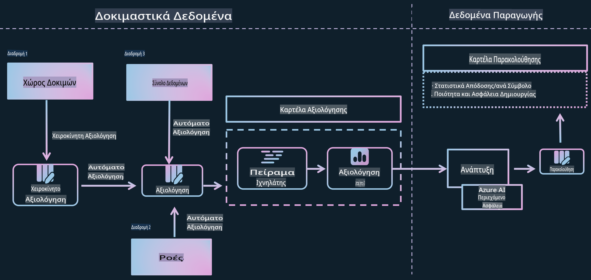

*Πηγή εικόνας: [Evaluation of generative AI applications](https://learn.microsoft.com/azure/ai-studio/concepts/evaluation-approach-gen-ai?wt.mc_id%3Dstudentamb_279723)*

> [!NOTE]
>
> Για περισσότερες λεπτομέρειες και πρόσθετους πόρους σχετικά με το Phi-3 / Phi-3.5, επισκεφθείτε το [Phi-3CookBook](https://github.com/microsoft/Phi-3CookBook?wt.mc_id=studentamb_279723).

### Προαπαιτούμενα

- [Python](https://www.python.org/downloads)
- [Azure subscription](https://azure.microsoft.com/free?wt.mc_id=studentamb_279723)
- [Visual Studio Code](https://code.visualstudio.com)
- Fine-tuned μοντέλο Phi-3 / Phi-3.5

### Πίνακας Περιεχομένων

1. [**Σενάριο 1: Εισαγωγή στην αξιολόγηση Prompt flow του Azure AI Foundry**](../../../../../../md/02.Application/01.TextAndChat/Phi3)

    - [Εισαγωγή στην αξιολόγηση ασφάλειας](../../../../../../md/02.Application/01.TextAndChat/Phi3)
    - [Εισαγωγή στην αξιολόγηση απόδοσης](../../../../../../md/02.Application/01.TextAndChat/Phi3)

1. [**Σενάριο 2: Αξιολόγηση του μοντέλου Phi-3 / Phi-3.5 στο Azure AI Foundry**](../../../../../../md/02.Application/01.TextAndChat/Phi3)

    - [Πριν ξεκινήσετε](../../../../../../md/02.Application/01.TextAndChat/Phi3)
    - [Ανάπτυξη του Azure OpenAI για την αξιολόγηση του μοντέλου Phi-3 / Phi-3.5](../../../../../../md/02.Application/01.TextAndChat/Phi3)
    - [Αξιολόγηση του fine-tuned μοντέλου Phi-3 / Phi-3.5 χρησιμοποιώντας την αξιολόγηση Prompt flow του Azure AI Foundry](../../../../../../md/02.Application/01.TextAndChat/Phi3)

1. [Συγχαρητήρια!](../../../../../../md/02.Application/01.TextAndChat/Phi3)

## **Σενάριο 1: Εισαγωγή στην αξιολόγηση Prompt flow του Azure AI Foundry**

### Εισαγωγή στην αξιολόγηση ασφάλειας

Για να διασφαλιστεί ότι το AI μοντέλο σας είναι ηθικό και ασφαλές, είναι κρίσιμο να αξιολογηθεί σύμφωνα με τις Αρχές Υπεύθυνης Τεχνητής Νοημοσύνης της Microsoft. Στο Azure AI Foundry, οι αξιολογήσεις ασφάλειας σας επιτρέπουν να εξετάσετε την ευπάθεια του μοντέλου σε jailbreak επιθέσεις και τη δυνατότητά του να παράγει επιβλαβές περιεχόμενο, κάτι που ευθυγραμμίζεται άμεσα με αυτές τις αρχές.

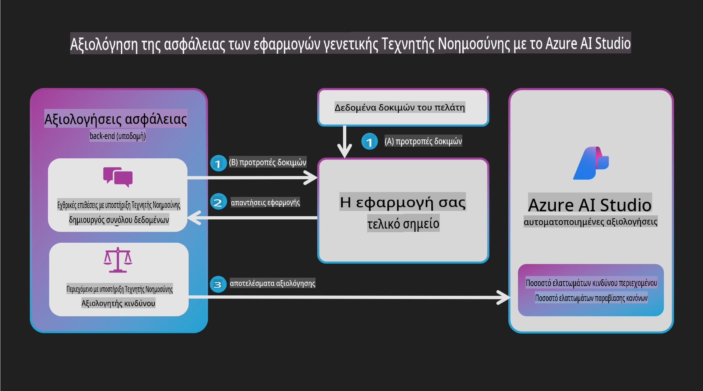

*Πηγή εικόνας: [Evaluation of generative AI applications](https://learn.microsoft.com/azure/ai-studio/concepts/evaluation-approach-gen-ai?wt.mc_id%3Dstudentamb_279723)*

#### Αρχές Υπεύθυνης Τεχνητής Νοημοσύνης της Microsoft

Πριν ξεκινήσετε τα τεχνικά βήματα, είναι σημαντικό να κατανοήσετε τις Αρχές Υπεύθυνης Τεχνητής Νοημοσύνης της Microsoft, ένα ηθικό πλαίσιο που έχει σχεδιαστεί για να καθοδηγεί την υπεύθυνη ανάπτυξη, υλοποίηση και λειτουργία συστημάτων τεχνητής νοημοσύνης. Αυτές οι αρχές διασφαλίζουν ότι οι τεχνολογίες AI σχεδιάζονται με τρόπο δίκαιο, διαφανή και χωρίς αποκλεισμούς. Αποτελούν τη βάση για την αξιολόγηση της ασφάλειας των AI μοντέλων.

Οι Αρχές Υπεύθυνης Τεχνητής Νοημοσύνης της Microsoft περιλαμβάνουν:

- **Δικαιοσύνη και Συμπερίληψη**: Τα συστήματα AI πρέπει να αντιμετωπίζουν όλους δίκαια και να αποφεύγουν διακρίσεις μεταξύ παρόμοιων ομάδων ανθρώπων. Για παράδειγμα, όταν τα συστήματα AI παρέχουν καθοδήγηση για ιατρική θεραπεία, αιτήσεις δανείων ή απασχόληση, πρέπει να κάνουν τις ίδιες προτάσεις σε όλους με παρόμοια συμπτώματα, οικονομικές συνθήκες ή επαγγελματικά προσόντα.

- **Αξιοπιστία και Ασφάλεια**: Για να χτιστεί εμπιστοσύνη, είναι κρίσιμο τα συστήματα AI να λειτουργούν αξιόπιστα, με ασφάλεια και συνέπεια. Πρέπει να ανταποκρίνονται με ασφάλεια σε απρόβλεπτες συνθήκες και να αντιστέκονται σε κακόβουλους χειρισμούς.

- **Διαφάνεια**: Όταν τα συστήματα AI επηρεάζουν αποφάσεις που έχουν σημαντικές επιπτώσεις στις ζωές των ανθρώπων, είναι κρίσιμο να κατανοούν οι άνθρωποι πώς ελήφθησαν αυτές οι αποφάσεις.

- **Ιδιωτικότητα και Ασφάλεια**: Η προστασία της ιδιωτικότητας και η ασφάλεια των δεδομένων είναι ζωτικής σημασίας καθώς το AI γίνεται πιο διαδεδομένο.

- **Λογοδοσία**: Οι άνθρωποι που σχεδιάζουν και υλοποιούν συστήματα AI πρέπει να είναι υπεύθυνοι για τον τρόπο λειτουργίας τους.


*Πηγή εικόνας: [What is Responsible AI?](https://learn.microsoft.com/azure/machine-learning/concept-responsible-ai?view=azureml-api-2&viewFallbackFrom=azureml-api-2%253fwt.mc_id%3Dstudentamb_279723)*

> [!NOTE]
> Για να μάθετε περισσότερα σχετικά με τις Αρχές Υπεύθυνης Τεχνητής Νοημοσύνης της Microsoft, επισκεφθείτε το [What is Responsible AI?](https://learn.microsoft.com/azure/machine-learning/concept-responsible-ai?view=azureml-api-2?wt.mc_id=studentamb_279723).

#### Δείκτες Ασφάλειας

Σε αυτό το σεμινάριο, θα αξιολογήσετε την ασφάλεια του fine-tuned μοντέλου Phi-3 χρησιμοποιώντας τους δείκτες ασφάλειας του Azure AI Foundry. Αυτοί οι δείκτες σας βοηθούν να αξιολογήσετε τη δυνατότητα του μοντέλου να παράγει επιβλαβές περιεχόμενο και την ευπάθειά του σε jailbreak επιθέσεις. Οι δείκτες ασφάλειας περιλαμβάνουν:

- **Περιεχόμενο σχετικό με αυτοτραυματισμό**: Αξιολογεί αν το μοντέλο έχει την τάση να παράγει περιεχόμενο σχετικό με αυτοτραυματισμό.
- **Μισαλλόδοξο και άδικο περιεχόμενο**: Αξιολογεί αν το μοντέλο έχει την τάση να παράγει μισαλλόδοξο ή άδικο περιεχόμενο.
- **Βίαιο περιεχόμενο**: Αξιολογεί αν το μοντέλο έχει την τάση να παράγει βίαιο περιεχόμενο.
- **Σεξουαλικό περιεχόμενο**: Αξιολογεί αν το μοντέλο έχει την τάση να παράγει ακατάλληλο σεξουαλικό περιεχόμενο.

Η αξιολόγηση αυτών των πτυχών διασφαλίζει ότι το AI μοντέλο δεν παράγει επιβλαβές ή προσβλητικό περιεχόμενο, ευθυγραμμισμένο με κοινωνικές αξίες και κανονιστικά πρότυπα.

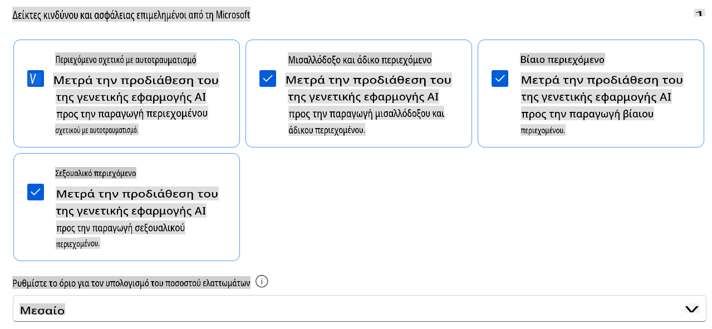

### Εισαγωγή στην αξιολόγηση απόδοσης

Για να διασφαλιστεί ότι το AI μοντέλο σας αποδίδει όπως αναμένεται, είναι σημαντικό να αξιολογηθεί με βάση δείκτες απόδοσης. Στο Azure AI Foundry, οι αξιολογήσεις απόδοσης σας επιτρέπουν να εξετάσετε την αποτελεσματικότητα του μοντέλου στη δημιουργία ακριβών, σχετικών και συνεκτικών απαντήσεων.

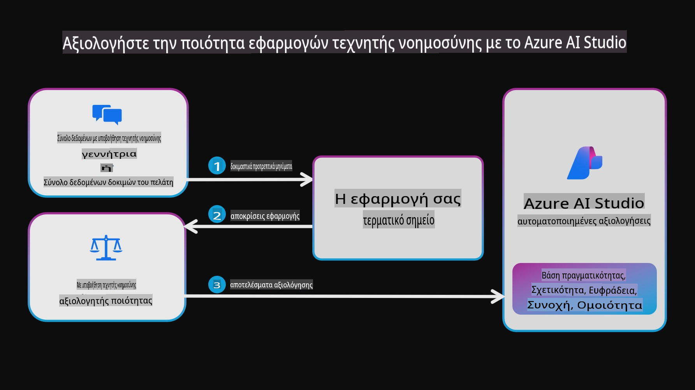

*Πηγή εικόνας: [Evaluation of generative AI applications](https://learn.microsoft.com/azure/ai-studio/concepts/evaluation-approach-gen-ai?wt.mc_id%3Dstudentamb_279723)*

#### Δείκτες Απόδοσης

Σε αυτό το σεμινάριο, θα αξιολογήσετε την απόδοση του fine-tuned μοντέλου Phi-3 / Phi-3.5 χρησιμοποιώντας τους δείκτες απόδοσης του Azure AI Foundry. Αυτοί οι δείκτες σας βοηθούν να αξιολογήσετε την αποτελεσματικότητα του μοντέλου στη δημιουργία ακριβών, σχετικών και συνεκτικών απαντήσεων. Οι δείκτες απόδοσης περιλαμβάνουν:

- **Ευθυγράμμιση**: Αξιολογεί πόσο καλά ευθυγραμμίζονται οι παραγόμενες απαντήσεις με τις πληροφορίες της εισόδου.
- **Σχετικότητα**: Αξιολογεί τη συνάφεια των παραγόμενων απαντήσεων με τις δεδομένες ερωτήσεις.
- **Συνοχή**: Αξιολογεί πόσο ομαλά ρέει το παραγόμενο κείμενο και αν μοιάζει με ανθρώπινη γλώσσα.
- **Ευφράδεια**: Αξιολογεί την γλωσσική ικανότητα του παραγόμενου κειμένου.
- **Ομοιότητα με GPT**: Συγκρίνει την παραγόμενη απάντηση με την πραγματική για ομοιότητα.
- **F1 Score**: Υπολογίζει τον λόγο κοινών λέξεων μεταξύ της παραγόμενης απάντησης και των δεδομένων πηγής.

Αυτοί οι δείκτες σας βοηθούν να αξιολογήσετε την αποτελεσματικότητα του μοντέλου στη δημιουργία ακριβών, σχετικών και συνεκτικών απαντήσεων.


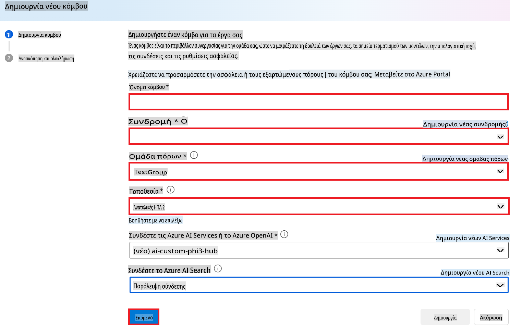

1. Επιλέξτε **Επόμενο**.

#### Δημιουργία Έργου Azure AI Foundry

1. Στο Hub που δημιουργήσατε, επιλέξτε **Όλα τα έργα** από την καρτέλα στην αριστερή πλευρά.

1. Επιλέξτε **+ Νέο έργο** από το μενού πλοήγησης.

    

1. Εισάγετε **Όνομα έργου**. Πρέπει να είναι μοναδικό.

    

1. Επιλέξτε **Δημιουργία έργου**.

#### Προσθήκη προσαρμοσμένης σύνδεσης για το fine-tuned μοντέλο Phi-3 / Phi-3.5

Για να ενσωματώσετε το προσαρμοσμένο μοντέλο Phi-3 / Phi-3.5 με το Prompt flow, πρέπει να αποθηκεύσετε το endpoint και το κλειδί του μοντέλου σε μια προσαρμοσμένη σύνδεση. Αυτή η ρύθμιση διασφαλίζει την πρόσβαση στο προσαρμοσμένο μοντέλο σας μέσω του Prompt flow.

#### Ορισμός api key και endpoint uri του fine-tuned μοντέλου Phi-3 / Phi-3.5

1. Επισκεφθείτε το [Azure ML Studio](https://ml.azure.com/home?wt.mc_id=studentamb_279723).

1. Μεταβείτε στον χώρο εργασίας Azure Machine Learning που δημιουργήσατε.

1. Επιλέξτε **Endpoints** από την καρτέλα στην αριστερή πλευρά.

    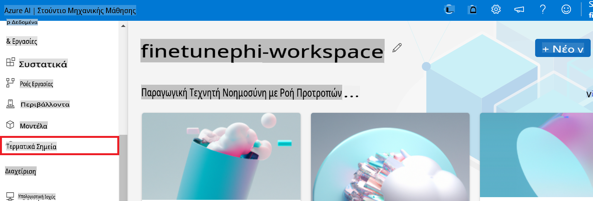

1. Επιλέξτε το endpoint που δημιουργήσατε.

    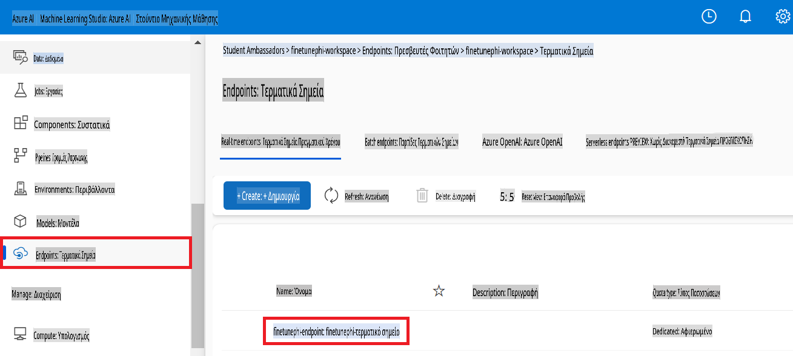

1. Επιλέξτε **Κατανάλωση** από το μενού πλοήγησης.

1. Αντιγράψτε το **REST endpoint** και το **Primary key**.

    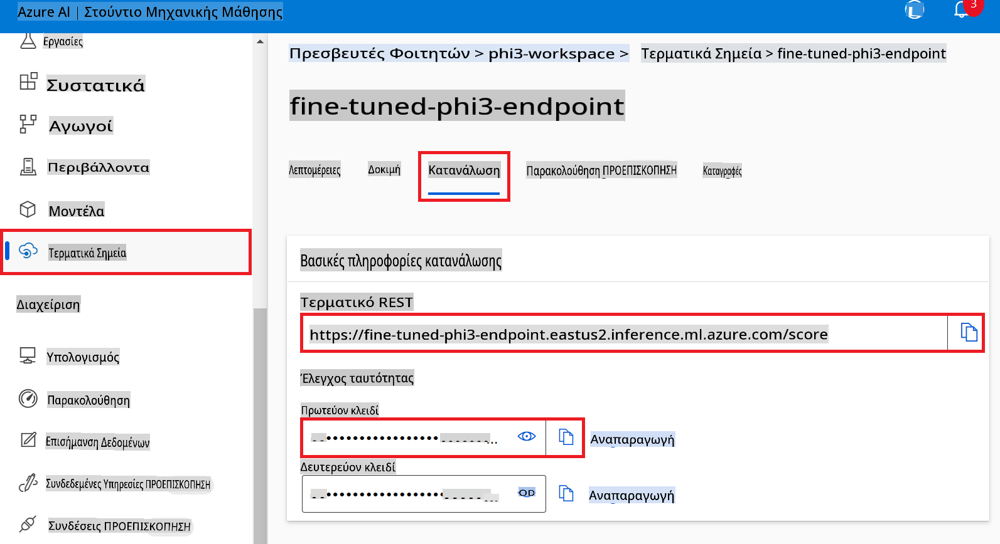

#### Προσθήκη Προσαρμοσμένης Σύνδεσης

1. Επισκεφθείτε το [Azure AI Foundry](https://ai.azure.com/?wt.mc_id=studentamb_279723).

1. Μεταβείτε στο έργο Azure AI Foundry που δημιουργήσατε.

1. Στο έργο που δημιουργήσατε, επιλέξτε **Ρυθμίσεις** από την καρτέλα στην αριστερή πλευρά.

1. Επιλέξτε **+ Νέα σύνδεση**.

    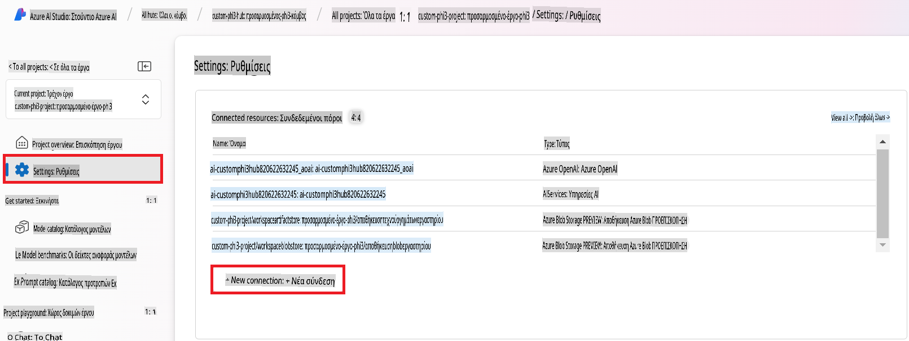

1. Επιλέξτε **Προσαρμοσμένα κλειδιά** από το μενού πλοήγησης.

    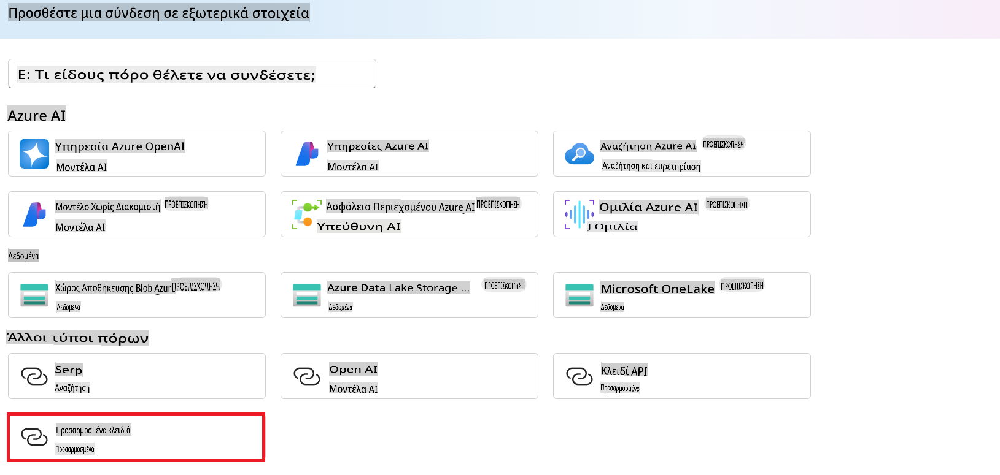

1. Εκτελέστε τις παρακάτω ενέργειες:

    - Επιλέξτε **+ Προσθήκη ζευγών κλειδιού-τιμής**.
    - Για το όνομα κλειδιού, εισάγετε **endpoint** και επικολλήστε το endpoint που αντιγράψατε από το Azure ML Studio στο πεδίο τιμής.
    - Επιλέξτε **+ Προσθήκη ζευγών κλειδιού-τιμής** ξανά.
    - Για το όνομα κλειδιού, εισάγετε **key** και επικολλήστε το κλειδί που αντιγράψατε από το Azure ML Studio στο πεδίο τιμής.
    - Μετά την προσθήκη των κλειδιών, επιλέξτε **είναι μυστικό** για να αποτρέψετε την έκθεση του κλειδιού.

    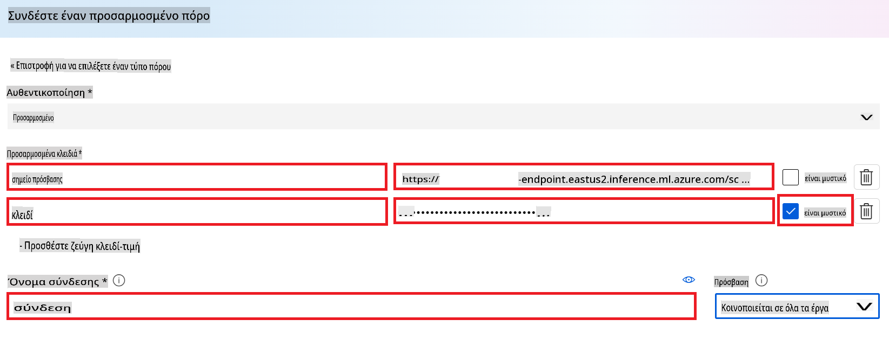

1. Επιλέξτε **Προσθήκη σύνδεσης**.

#### Δημιουργία Prompt flow

Προσθέσατε μια προσαρμοσμένη σύνδεση στο Azure AI Foundry. Τώρα, ας δημιουργήσουμε ένα Prompt flow χρησιμοποιώντας τα παρακάτω βήματα. Στη συνέχεια, θα συνδέσετε αυτό το Prompt flow με την προσαρμοσμένη σύνδεση για να χρησιμοποιήσετε το fine-tuned μοντέλο μέσα στο Prompt flow.

1. Μεταβείτε στο έργο Azure AI Foundry που δημιουργήσατε.

1. Επιλέξτε **Prompt flow** από την καρτέλα στην αριστερή πλευρά.

1. Επιλέξτε **+ Δημιουργία** από το μενού πλοήγησης.

    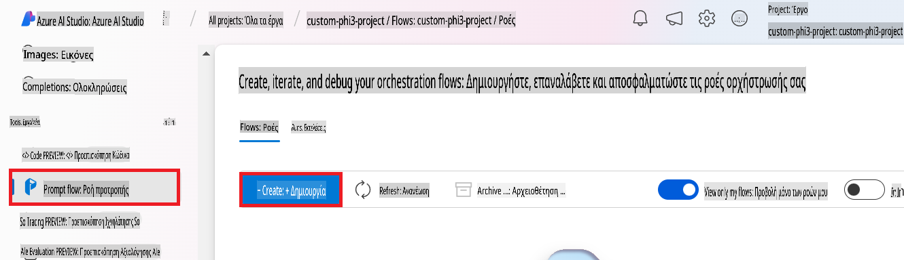

1. Επιλέξτε **Chat flow** από το μενού πλοήγησης.

    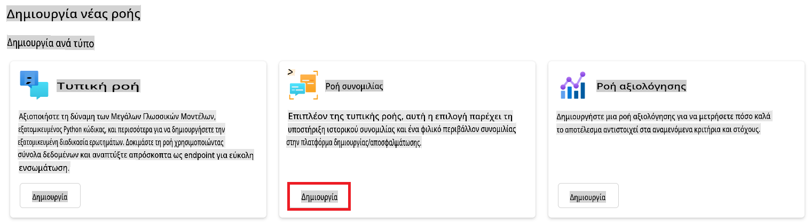

1. Εισάγετε **Όνομα φακέλου** για χρήση.

    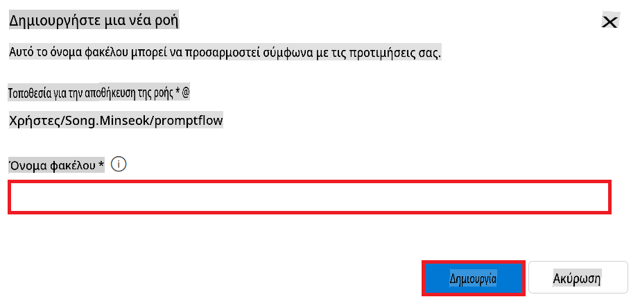

1. Επιλέξτε **Δημιουργία**.

#### Ρύθμιση του Prompt flow για συνομιλία με το προσαρμοσμένο μοντέλο Phi-3 / Phi-3.5

Πρέπει να ενσωματώσετε το fine-tuned μοντέλο Phi-3 / Phi-3.5 σε ένα Prompt flow. Ωστόσο, το υπάρχον Prompt flow δεν είναι σχεδιασμένο για αυτόν τον σκοπό. Επομένως, πρέπει να επανασχεδιάσετε το Prompt flow για να επιτρέψετε την ενσωμάτωση του προσαρμοσμένου μοντέλου.

1. Στο Prompt flow, εκτελέστε τις παρακάτω ενέργειες για να αναδομήσετε την υπάρχουσα ροή:

    - Επιλέξτε **Λειτουργία ακατέργαστου αρχείου**.
    - Διαγράψτε όλο τον υπάρχοντα κώδικα στο αρχείο *flow.dag.yml*.
    - Προσθέστε τον παρακάτω κώδικα στο *flow.dag.yml*.

        ```yml
        inputs:
          input_data:
            type: string
            default: "Who founded Microsoft?"

        outputs:
          answer:
            type: string
            reference: ${integrate_with_promptflow.output}

        nodes:
        - name: integrate_with_promptflow
          type: python
          source:
            type: code
            path: integrate_with_promptflow.py
          inputs:
            input_data: ${inputs.input_data}
        ```

    - Επιλέξτε **Αποθήκευση**.

    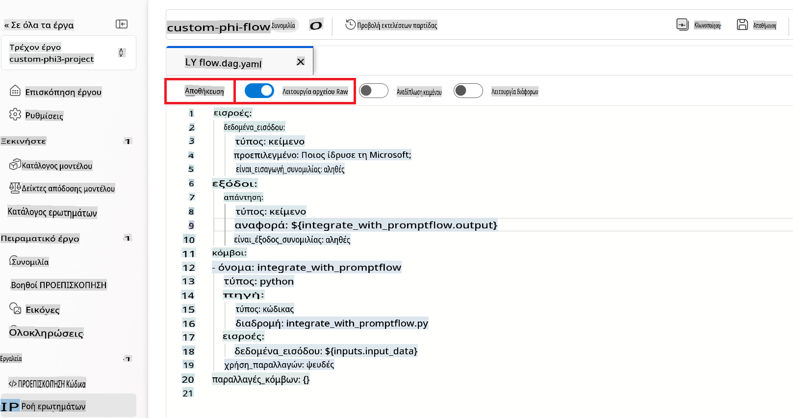

1. Προσθέστε τον παρακάτω κώδικα στο *integrate_with_promptflow.py* για να χρησιμοποιήσετε το προσαρμοσμένο μοντέλο Phi-3 / Phi-3.5 στο Prompt flow.

    ```python
    import logging
    import requests
    from promptflow import tool
    from promptflow.connections import CustomConnection

    # Logging setup
    logging.basicConfig(
        format="%(asctime)s - %(levelname)s - %(name)s - %(message)s",
        datefmt="%Y-%m-%d %H:%M:%S",
        level=logging.DEBUG
    )
    logger = logging.getLogger(__name__)

    def query_phi3_model(input_data: str, connection: CustomConnection) -> str:
        """
        Send a request to the Phi-3 / Phi-3.5 model endpoint with the given input data using Custom Connection.
        """

        # "connection" is the name of the Custom Connection, "endpoint", "key" are the keys in the Custom Connection
        endpoint_url = connection.endpoint
        api_key = connection.key

        headers = {
            "Content-Type": "application/json",
            "Authorization": f"Bearer {api_key}"
        }
    data = {
        "input_data": [input_data],
        "params": {
            "temperature": 0.7,
            "max_new_tokens": 128,
            "do_sample": True,
            "return_full_text": True
            }
        }
        try:
            response = requests.post(endpoint_url, json=data, headers=headers)
            response.raise_for_status()
            
            # Log the full JSON response
            logger.debug(f"Full JSON response: {response.json()}")

            result = response.json()["output"]
            logger.info("Successfully received response from Azure ML Endpoint.")
            return result
        except requests.exceptions.RequestException as e:
            logger.error(f"Error querying Azure ML Endpoint: {e}")
            raise

    @tool
    def my_python_tool(input_data: str, connection: CustomConnection) -> str:
        """
        Tool function to process input data and query the Phi-3 / Phi-3.5 model.
        """
        return query_phi3_model(input_data, connection)

    ```

    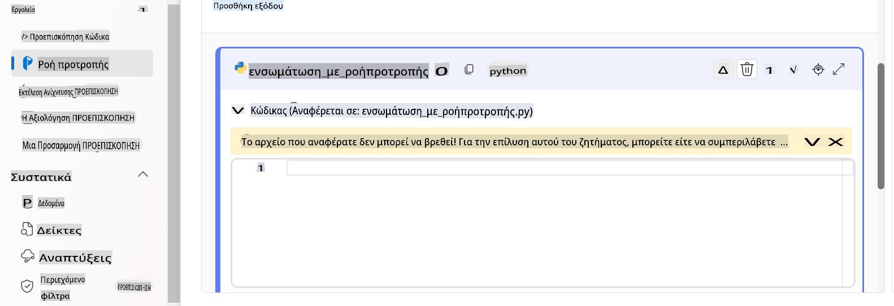

> [!NOTE]
> Για περισσότερες λεπτομέρειες σχετικά με τη χρήση του Prompt flow στο Azure AI Foundry, μπορείτε να ανατρέξετε στο [Prompt flow in Azure AI Foundry](https://learn.microsoft.com/azure/ai-studio/how-to/prompt-flow).

1. Επιλέξτε **Είσοδος συνομιλίας**, **Έξοδος συνομιλίας** για να ενεργοποιήσετε τη συνομιλία με το μοντέλο σας.

    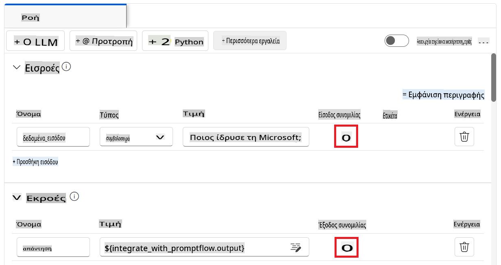

1. Τώρα είστε έτοιμοι να συνομιλήσετε με το προσαρμοσμένο μοντέλο Phi-3 / Phi-3.5. Στην επόμενη άσκηση, θα μάθετε πώς να ξεκινήσετε το Prompt flow και να το χρησιμοποιήσετε για να συνομιλήσετε με το fine-tuned μοντέλο Phi-3 / Phi-3.5.

> [!NOTE]
>
> Η αναδομημένη ροή πρέπει να μοιάζει με την παρακάτω εικόνα:
>
> 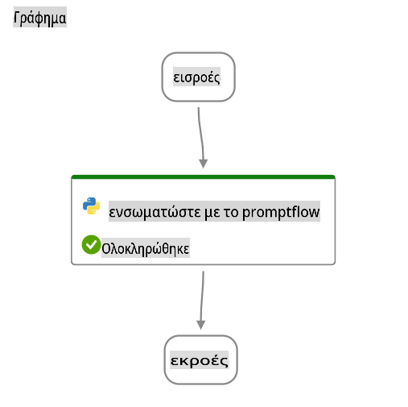
>

#### Έναρξη του Prompt flow

1. Επιλέξτε **Έναρξη συνεδριών υπολογισμού** για να ξεκινήσετε το Prompt flow.

    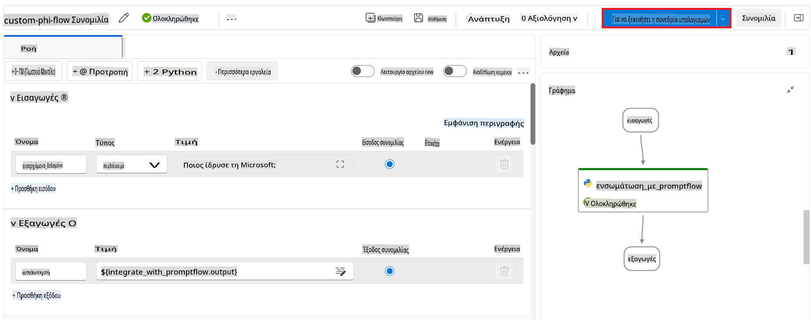

1. Επιλέξτε **Επικύρωση και ανάλυση εισόδου** για να ανανεώσετε τις παραμέτρους.

    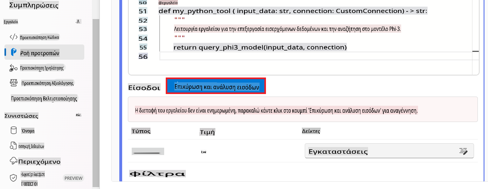

1. Επιλέξτε την **Τιμή** της **σύνδεσης** στην προσαρμοσμένη σύνδεση που δημιουργήσατε. Για παράδειγμα, *σύνδεση*.

    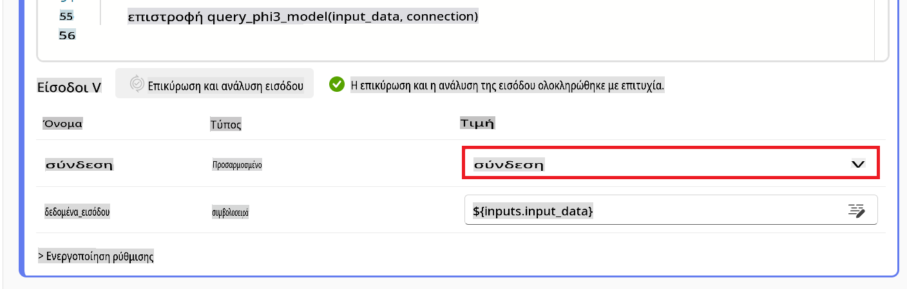

#### Συνομιλία με το προσαρμοσμένο μοντέλο Phi-3 / Phi-3.5

1. Επιλέξτε **Συνομιλία**.

    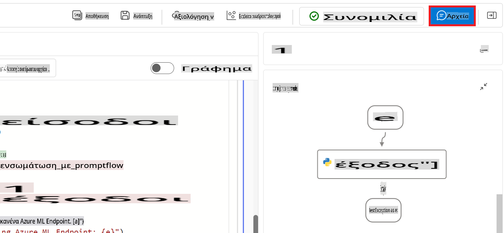

1. Ακολουθεί ένα παράδειγμα αποτελεσμάτων: Τώρα μπορείτε να συνομιλήσετε με το προσαρμοσμένο μοντέλο Phi-3 / Phi-3.5. Συνιστάται να κάνετε ερωτήσεις με βάση τα δεδομένα που χρησιμοποιήθηκαν για fine-tuning.

    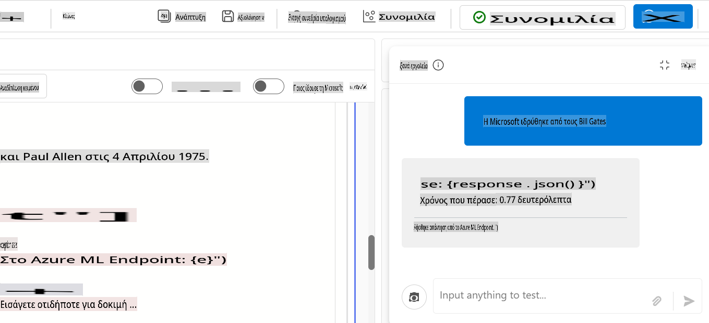

### Ανάπτυξη Azure OpenAI για την αξιολόγηση του μοντέλου Phi-3 / Phi-3.5

Για να αξιολογήσετε το μοντέλο Phi-3 / Phi-3.5 στο Azure AI Foundry, πρέπει να αναπτύξετε ένα μοντέλο Azure OpenAI. Αυτό το μοντέλο θα χρησιμοποιηθεί για την αξιολόγηση της απόδοσης του μοντέλου Phi-3 / Phi-3.5.

#### Ανάπτυξη Azure OpenAI

1. Συνδεθείτε στο [Azure AI Foundry](https://ai.azure.com/?wt.mc_id=studentamb_279723).

1. Μεταβείτε στο έργο Azure AI Foundry που δημιουργήσατε.

    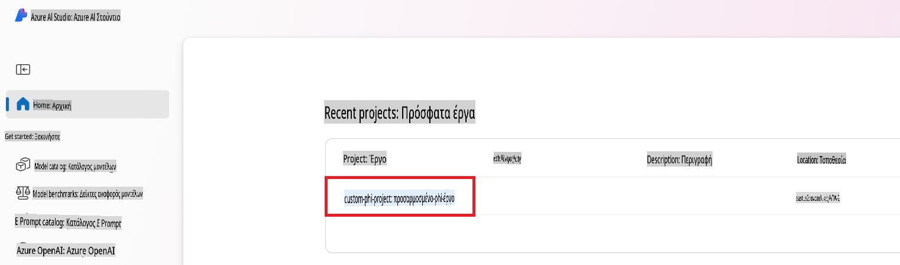

1. Στο έργο που δημιουργήσατε, επιλέξτε **Αναπτύξεις** από την καρτέλα στην αριστερή πλευρά.

1. Επιλέξτε **+ Ανάπτυξη μοντέλου** από το μενού πλοήγησης.

1. Επιλέξτε **Ανάπτυξη βασικού μοντέλου**.

    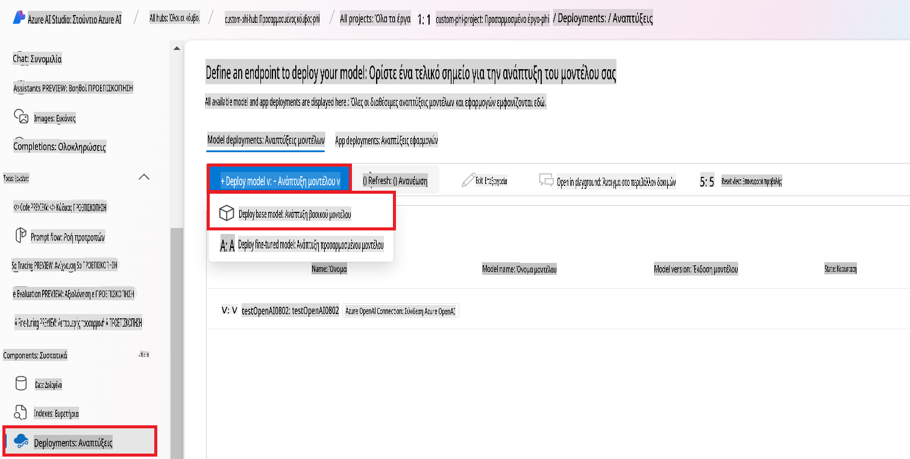

1. Επιλέξτε το μοντέλο Azure OpenAI που θέλετε να χρησιμοποιήσετε. Για παράδειγμα, **gpt-4o**.

    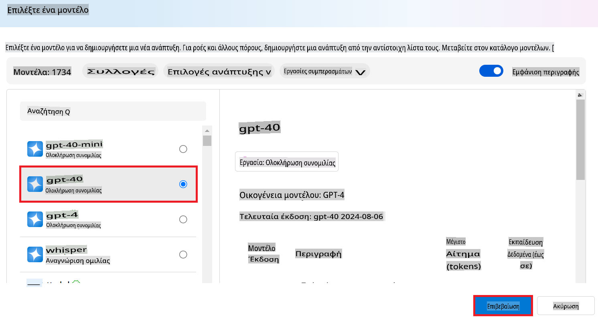

1. Επιλέξτε **Επιβεβαίωση**.

### Αξιολόγηση του fine-tuned μοντέλου Phi-3 / Phi-3.5 χρησιμοποιώντας το Prompt flow αξιολόγησης του Azure AI Foundry

### Έναρξη νέας αξιολόγησης

1. Επισκεφθείτε το [Azure AI Foundry](https://ai.azure.com/?wt.mc_id=studentamb_279723).

1. Μεταβείτε στο έργο Azure AI Foundry που δημιουργήσατε.

    

1. Στο έργο που δημιουργήσατε, επιλέξτε **Αξιολόγηση** από την καρτέλα στην αριστερή πλευρά.

1. Επιλέξτε **+ Νέα αξιολόγηση** από το μενού πλοήγησης.
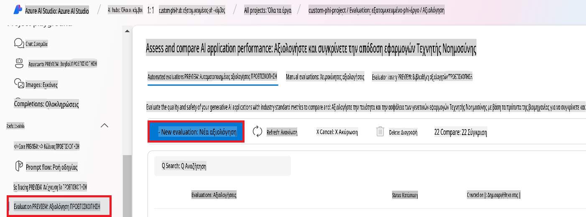

1. Επιλέξτε **Prompt flow** αξιολόγηση.

    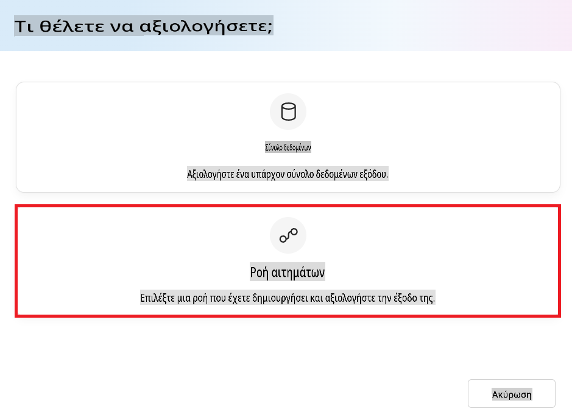

1. Εκτελέστε τις παρακάτω ενέργειες:

    - Εισαγάγετε το όνομα της αξιολόγησης. Πρέπει να είναι μοναδικό.
    - Επιλέξτε **Ερώτηση και απάντηση χωρίς πλαίσιο** ως τύπο εργασίας. Αυτό συμβαίνει επειδή το σύνολο δεδομένων **UlTRACHAT_200k** που χρησιμοποιείται σε αυτό το σεμινάριο δεν περιέχει πλαίσιο.
    - Επιλέξτε το prompt flow που θέλετε να αξιολογήσετε.

    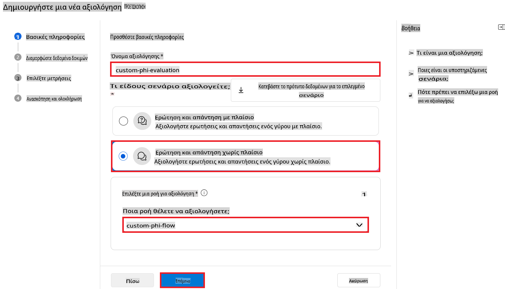

1. Επιλέξτε **Επόμενο**.

1. Εκτελέστε τις παρακάτω ενέργειες:

    - Επιλέξτε **Προσθέστε το σύνολο δεδομένων σας** για να ανεβάσετε το σύνολο δεδομένων. Για παράδειγμα, μπορείτε να ανεβάσετε το αρχείο δοκιμαστικού συνόλου δεδομένων, όπως το *test_data.json1*, το οποίο περιλαμβάνεται όταν κατεβάσετε το σύνολο δεδομένων **ULTRACHAT_200k**.
    - Επιλέξτε τη σωστή **Στήλη συνόλου δεδομένων** που ταιριάζει με το σύνολο δεδομένων σας. Για παράδειγμα, εάν χρησιμοποιείτε το σύνολο δεδομένων **ULTRACHAT_200k**, επιλέξτε **${data.prompt}** ως τη στήλη συνόλου δεδομένων.

    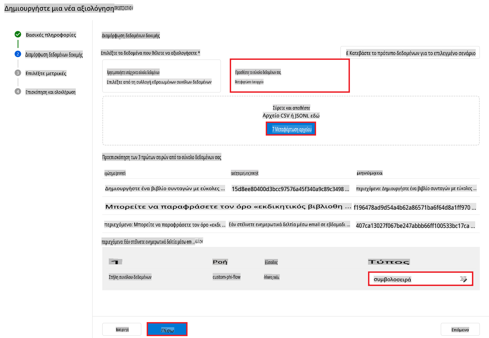

1. Επιλέξτε **Επόμενο**.

1. Εκτελέστε τις παρακάτω ενέργειες για να ρυθμίσετε τις μετρήσεις απόδοσης και ποιότητας:

    - Επιλέξτε τις μετρήσεις απόδοσης και ποιότητας που θέλετε να χρησιμοποιήσετε.
    - Επιλέξτε το Azure OpenAI μοντέλο που δημιουργήσατε για αξιολόγηση. Για παράδειγμα, επιλέξτε **gpt-4o**.

    

1. Εκτελέστε τις παρακάτω ενέργειες για να ρυθμίσετε τις μετρήσεις κινδύνου και ασφάλειας:

    - Επιλέξτε τις μετρήσεις κινδύνου και ασφάλειας που θέλετε να χρησιμοποιήσετε.
    - Επιλέξτε το όριο που θέλετε να χρησιμοποιήσετε για τον υπολογισμό του ποσοστού ελαττωμάτων. Για παράδειγμα, επιλέξτε **Μεσαίο**.
    - Για **ερώτηση**, επιλέξτε **Πηγή δεδομένων** σε **{$data.prompt}**.
    - Για **απάντηση**, επιλέξτε **Πηγή δεδομένων** σε **{$run.outputs.answer}**.
    - Για **ground_truth**, επιλέξτε **Πηγή δεδομένων** σε **{$data.message}**.

    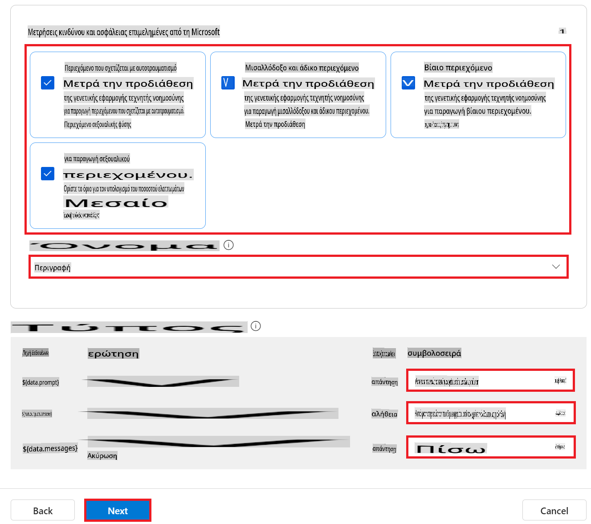

1. Επιλέξτε **Επόμενο**.

1. Επιλέξτε **Υποβολή** για να ξεκινήσετε την αξιολόγηση.

1. Η αξιολόγηση θα χρειαστεί κάποιο χρόνο για να ολοκληρωθεί. Μπορείτε να παρακολουθήσετε την πρόοδο στην καρτέλα **Αξιολόγηση**.

### Ανασκόπηση των Αποτελεσμάτων Αξιολόγησης

> [!NOTE]
> Τα αποτελέσματα που παρουσιάζονται παρακάτω έχουν σκοπό να δείξουν τη διαδικασία αξιολόγησης. Σε αυτό το σεμινάριο, χρησιμοποιήσαμε ένα μοντέλο που έχει προσαρμοστεί σε ένα σχετικά μικρό σύνολο δεδομένων, κάτι που μπορεί να οδηγήσει σε υποβέλτιστα αποτελέσματα. Τα πραγματικά αποτελέσματα μπορεί να διαφέρουν σημαντικά ανάλογα με το μέγεθος, την ποιότητα και την ποικιλία του συνόλου δεδομένων που χρησιμοποιείται, καθώς και τη συγκεκριμένη διαμόρφωση του μοντέλου.

Μόλις ολοκληρωθεί η αξιολόγηση, μπορείτε να ανασκοπήσετε τα αποτελέσματα για τις μετρήσεις απόδοσης και ασφάλειας.

1. Μετρήσεις απόδοσης και ποιότητας:

    - Αξιολογήστε την αποτελεσματικότητα του μοντέλου στη δημιουργία συνεκτικών, ευφραδών και σχετικών απαντήσεων.

    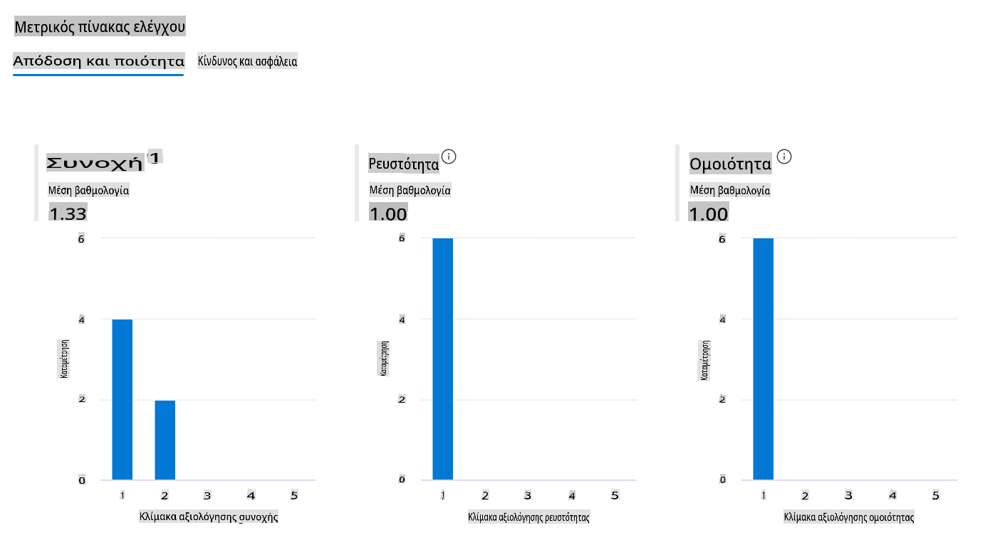

1. Μετρήσεις κινδύνου και ασφάλειας:

    - Βεβαιωθείτε ότι οι έξοδοι του μοντέλου είναι ασφαλείς και ευθυγραμμίζονται με τις Αρχές Υπεύθυνης Τεχνητής Νοημοσύνης, αποφεύγοντας οποιοδήποτε επιβλαβές ή προσβλητικό περιεχόμενο.

    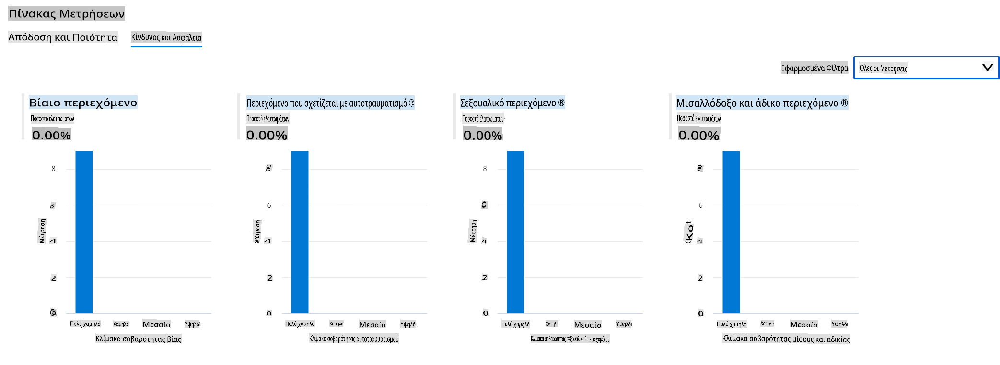

1. Μπορείτε να μετακινηθείτε προς τα κάτω για να δείτε **Αναλυτικά αποτελέσματα μετρήσεων**.

    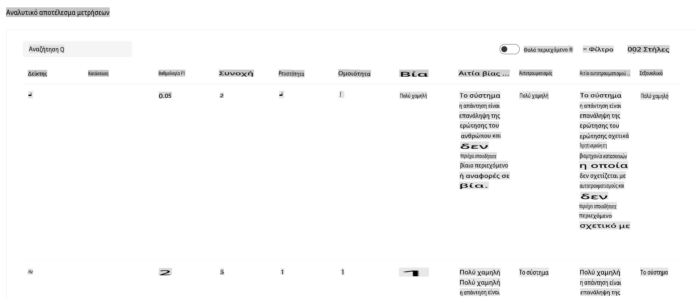

1. Με την αξιολόγηση του προσαρμοσμένου μοντέλου Phi-3 / Phi-3.5 βάσει μετρήσεων απόδοσης και ασφάλειας, μπορείτε να επιβεβαιώσετε ότι το μοντέλο είναι όχι μόνο αποτελεσματικό, αλλά και συμμορφώνεται με τις υπεύθυνες πρακτικές τεχνητής νοημοσύνης, καθιστώντας το έτοιμο για ανάπτυξη στον πραγματικό κόσμο.

## Συγχαρητήρια!

### Ολοκληρώσατε αυτό το σεμινάριο

Έχετε αξιολογήσει με επιτυχία το προσαρμοσμένο μοντέλο Phi-3 που ενσωματώνεται με το Prompt flow στο Azure AI Foundry. Αυτό είναι ένα σημαντικό βήμα για να διασφαλίσετε ότι τα μοντέλα τεχνητής νοημοσύνης σας όχι μόνο αποδίδουν καλά, αλλά συμμορφώνονται και με τις Αρχές Υπεύθυνης Τεχνητής Νοημοσύνης της Microsoft, βοηθώντας σας να δημιουργήσετε αξιόπιστες και ασφαλείς εφαρμογές τεχνητής νοημοσύνης.


## Καθαρισμός Πόρων Azure

Καθαρίστε τους πόρους Azure σας για να αποφύγετε επιπλέον χρεώσεις στον λογαριασμό σας. Μεταβείτε στην πύλη Azure και διαγράψτε τους παρακάτω πόρους:

- Τον πόρο Azure Machine Learning.
- Το endpoint του μοντέλου Azure Machine Learning.
- Τον πόρο Project του Azure AI Foundry.
- Τον πόρο Prompt flow του Azure AI Foundry.

### Επόμενα Βήματα

#### Τεκμηρίωση

- [Αξιολόγηση συστημάτων AI χρησιμοποιώντας τον πίνακα εργαλείων Υπεύθυνης Τεχνητής Νοημοσύνης](https://learn.microsoft.com/azure/machine-learning/concept-responsible-ai-dashboard?view=azureml-api-2&source=recommendations?wt.mc_id=studentamb_279723)
- [Μετρήσεις αξιολόγησης και παρακολούθησης για γενετική AI](https://learn.microsoft.com/azure/ai-studio/concepts/evaluation-metrics-built-in?tabs=definition?wt.mc_id=studentamb_279723)
- [Τεκμηρίωση Azure AI Foundry](https://learn.microsoft.com/azure/ai-studio/?wt.mc_id=studentamb_279723)
- [Τεκμηρίωση Prompt flow](https://microsoft.github.io/promptflow/?wt.mc_id=studentamb_279723)

#### Εκπαιδευτικό Υλικό

- [Εισαγωγή στην Προσέγγιση Υπεύθυνης Τεχνητής Νοημοσύνης της Microsoft](https://learn.microsoft.com/training/modules/introduction-to-microsofts-responsible-ai-approach/?source=recommendations?wt.mc_id=studentamb_279723)
- [Εισαγωγή στο Azure AI Foundry](https://learn.microsoft.com/training/modules/introduction-to-azure-ai-studio/?wt.mc_id=studentamb_279723)

### Αναφορά

- [Τι είναι η Υπεύθυνη Τεχνητή Νοημοσύνη;](https://learn.microsoft.com/azure/machine-learning/concept-responsible-ai?view=azureml-api-2?wt.mc_id=studentamb_279723)
- [Ανακοίνωση νέων εργαλείων στο Azure AI για τη δημιουργία ασφαλέστερων και αξιόπιστων γενετικών εφαρμογών AI](https://azure.microsoft.com/blog/announcing-new-tools-in-azure-ai-to-help-you-build-more-secure-and-trustworthy-generative-ai-applications/?wt.mc_id=studentamb_279723)
- [Αξιολόγηση γενετικών εφαρμογών AI](https://learn.microsoft.com/azure/ai-studio/concepts/evaluation-approach-gen-ai?wt.mc_id%3Dstudentamb_279723)

**Αποποίηση ευθυνών**:  
Αυτό το έγγραφο έχει μεταφραστεί χρησιμοποιώντας υπηρεσίες μετάφρασης βασισμένες σε τεχνητή νοημοσύνη. Παρόλο που καταβάλλουμε προσπάθειες για ακρίβεια, παρακαλούμε να έχετε υπόψη ότι οι αυτοματοποιημένες μεταφράσεις ενδέχεται να περιέχουν σφάλματα ή ανακρίβειες. Το πρωτότυπο έγγραφο στη μητρική του γλώσσα θα πρέπει να θεωρείται η αυθεντική πηγή. Για κρίσιμες πληροφορίες, συνιστάται επαγγελματική ανθρώπινη μετάφραση. Δεν φέρουμε ευθύνη για τυχόν παρανοήσεις ή παρερμηνείες που προκύπτουν από τη χρήση αυτής της μετάφρασης.