# Προσαρμογή και Ενσωμάτωση Προσαρμοσμένων Μοντέλων Phi-3 με το Prompt Flow στο Azure AI Foundry

Αυτό το ολοκληρωμένο παράδειγμα (E2E) βασίζεται στον οδηγό "[Fine-Tune and Integrate Custom Phi-3 Models with Prompt Flow in Azure AI Foundry](https://techcommunity.microsoft.com/t5/educator-developer-blog/fine-tune-and-integrate-custom-phi-3-models-with-prompt-flow-in/ba-p/4191726?WT.mc_id=aiml-137032-kinfeylo)" από την κοινότητα Microsoft Tech. Παρουσιάζει τις διαδικασίες προσαρμογής, ανάπτυξης και ενσωμάτωσης προσαρμοσμένων μοντέλων Phi-3 με το Prompt Flow στο Azure AI Foundry.  
Σε αντίθεση με το δείγμα E2E "[Fine-Tune and Integrate Custom Phi-3 Models with Prompt Flow](./E2E_Phi-3-FineTuning_PromptFlow_Integration.md)", που απαιτούσε την εκτέλεση κώδικα τοπικά, αυτό το σεμινάριο επικεντρώνεται εξ ολοκλήρου στην προσαρμογή και ενσωμάτωση του μοντέλου σας μέσα στο Azure AI / ML Studio.

## Επισκόπηση

Σε αυτό το παράδειγμα E2E, θα μάθετε πώς να προσαρμόσετε το μοντέλο Phi-3 και να το ενσωματώσετε με το Prompt Flow στο Azure AI Foundry. Με την αξιοποίηση του Azure AI / ML Studio, θα δημιουργήσετε μια ροή εργασίας για την ανάπτυξη και χρήση προσαρμοσμένων μοντέλων AI. Αυτό το παράδειγμα E2E χωρίζεται σε τρία σενάρια:

**Σενάριο 1: Δημιουργία πόρων Azure και Προετοιμασία για προσαρμογή**

**Σενάριο 2: Προσαρμογή του μοντέλου Phi-3 και Ανάπτυξή του στο Azure Machine Learning Studio**

**Σενάριο 3: Ενσωμάτωση με το Prompt Flow και Συνομιλία με το προσαρμοσμένο σας μοντέλο στο Azure AI Foundry**

Ακολουθεί μια επισκόπηση αυτού του παραδείγματος E2E.

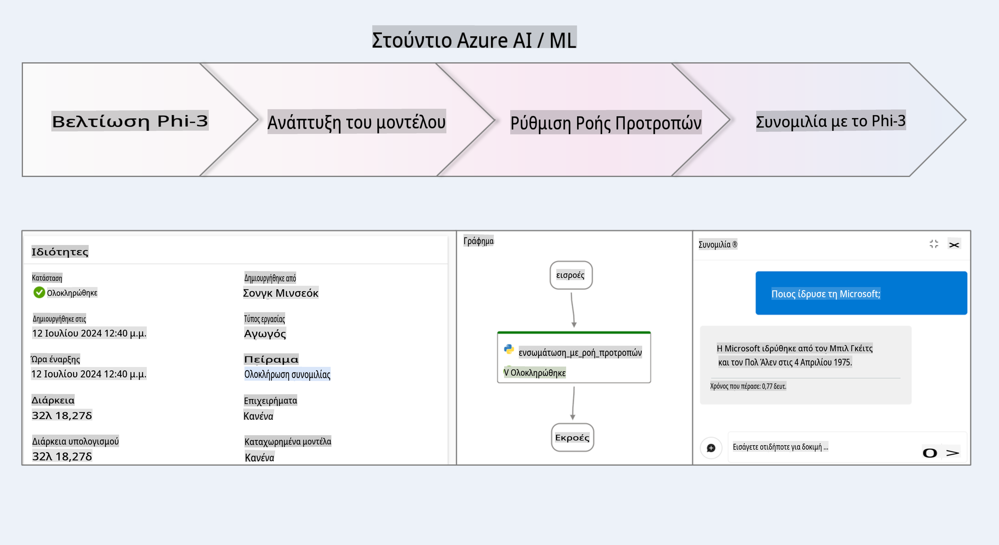

### Πίνακας Περιεχομένων

1. **[Σενάριο 1: Δημιουργία πόρων Azure και Προετοιμασία για προσαρμογή](../../../../../../md/02.Application/01.TextAndChat/Phi3)**
    - [Δημιουργία ενός Azure Machine Learning Workspace](../../../../../../md/02.Application/01.TextAndChat/Phi3)
    - [Αίτηση ποσοστώσεων GPU στη Συνδρομή Azure](../../../../../../md/02.Application/01.TextAndChat/Phi3)
    - [Προσθήκη ανάθεσης ρόλων](../../../../../../md/02.Application/01.TextAndChat/Phi3)
    - [Ρύθμιση έργου](../../../../../../md/02.Application/01.TextAndChat/Phi3)
    - [Προετοιμασία συνόλου δεδομένων για προσαρμογή](../../../../../../md/02.Application/01.TextAndChat/Phi3)

1. **[Σενάριο 2: Προσαρμογή του μοντέλου Phi-3 και Ανάπτυξή του στο Azure Machine Learning Studio](../../../../../../md/02.Application/01.TextAndChat/Phi3)**
    - [Προσαρμογή του μοντέλου Phi-3](../../../../../../md/02.Application/01.TextAndChat/Phi3)
    - [Ανάπτυξη του προσαρμοσμένου μοντέλου Phi-3](../../../../../../md/02.Application/01.TextAndChat/Phi3)

1. **[Σενάριο 3: Ενσωμάτωση με το Prompt Flow και Συνομιλία με το προσαρμοσμένο σας μοντέλο στο Azure AI Foundry](../../../../../../md/02.Application/01.TextAndChat/Phi3)**
    - [Ενσωμάτωση του προσαρμοσμένου μοντέλου Phi-3 με το Prompt Flow](../../../../../../md/02.Application/01.TextAndChat/Phi3)
    - [Συνομιλία με το προσαρμοσμένο σας μοντέλο Phi-3](../../../../../../md/02.Application/01.TextAndChat/Phi3)

## Σενάριο 1: Δημιουργία πόρων Azure και Προετοιμασία για προσαρμογή

### Δημιουργία ενός Azure Machine Learning Workspace

1. Πληκτρολογήστε *azure machine learning* στη **γραμμή αναζήτησης** στο επάνω μέρος της πύλης και επιλέξτε **Azure Machine Learning** από τις επιλογές που εμφανίζονται.

    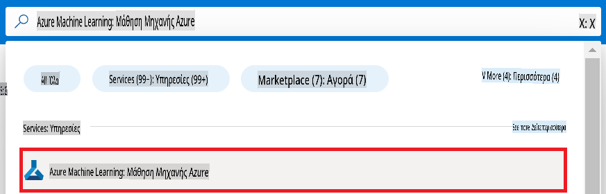

2. Επιλέξτε **+ Create** από το μενού πλοήγησης.

3. Επιλέξτε **New workspace** από το μενού πλοήγησης.

    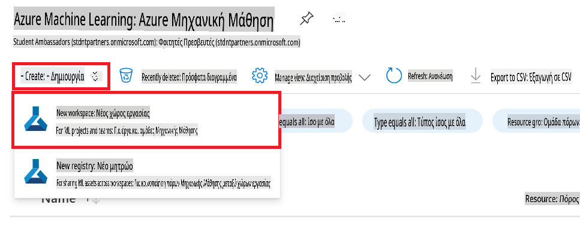

4. Εκτελέστε τις παρακάτω ενέργειες:

    - Επιλέξτε τη **Συνδρομή Azure** σας.
    - Επιλέξτε την **Ομάδα πόρων** που θα χρησιμοποιήσετε (δημιουργήστε μια νέα αν χρειάζεται).
    - Εισαγάγετε **Όνομα Workspace**. Πρέπει να είναι μοναδικό.
    - Επιλέξτε την **Περιοχή** που θέλετε να χρησιμοποιήσετε.
    - Επιλέξτε τον **Λογαριασμό αποθήκευσης** που θα χρησιμοποιήσετε (δημιουργήστε έναν νέο αν χρειάζεται).
    - Επιλέξτε το **Key vault** που θα χρησιμοποιήσετε (δημιουργήστε έναν νέο αν χρειάζεται).
    - Επιλέξτε το **Application insights** που θα χρησιμοποιήσετε (δημιουργήστε έναν νέο αν χρειάζεται).
    - Επιλέξτε το **Container registry** που θα χρησιμοποιήσετε (δημιουργήστε έναν νέο αν χρειάζεται).

    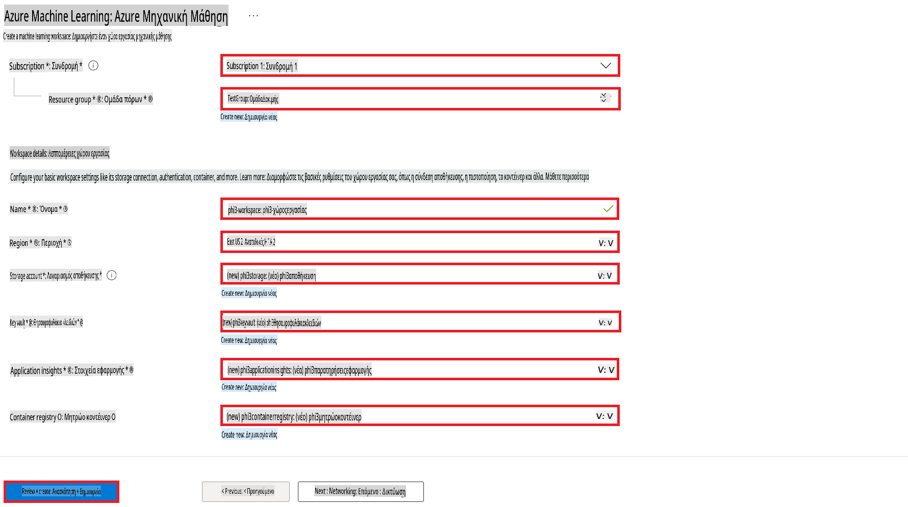

5. Επιλέξτε **Review + Create**.

6. Επιλέξτε **Create**.

### Αίτηση ποσοστώσεων GPU στη Συνδρομή Azure

Σε αυτό το σεμινάριο, θα μάθετε πώς να προσαρμόσετε και να αναπτύξετε ένα μοντέλο Phi-3, χρησιμοποιώντας GPUs. Για την προσαρμογή, θα χρησιμοποιήσετε τη GPU *Standard_NC24ads_A100_v4*, η οποία απαιτεί αίτηση ποσοστώσεων. Για την ανάπτυξη, θα χρησιμοποιήσετε τη GPU *Standard_NC6s_v3*, η οποία επίσης απαιτεί αίτηση ποσοστώσεων.

> [!NOTE]
>
> Μόνο οι συνδρομές Pay-As-You-Go (ο τυπικός τύπος συνδρομής) είναι επιλέξιμες για κατανομή GPU. Οι συνδρομές με παροχές δεν υποστηρίζονται προς το παρόν.

1. Επισκεφθείτε το [Azure ML Studio](https://ml.azure.com/home?wt.mc_id=studentamb_279723).

1. Εκτελέστε τις παρακάτω ενέργειες για να ζητήσετε ποσοστώσεις GPU *Standard NCADSA100v4 Family*:

    - Επιλέξτε **Quota** από την αριστερή καρτέλα.
    - Επιλέξτε την **Οικογένεια εικονικών μηχανών** που θα χρησιμοποιήσετε. Για παράδειγμα, επιλέξτε **Standard NCADSA100v4 Family Cluster Dedicated vCPUs**, που περιλαμβάνει τη GPU *Standard_NC24ads_A100_v4*.
    - Επιλέξτε **Request quota** από το μενού πλοήγησης.

        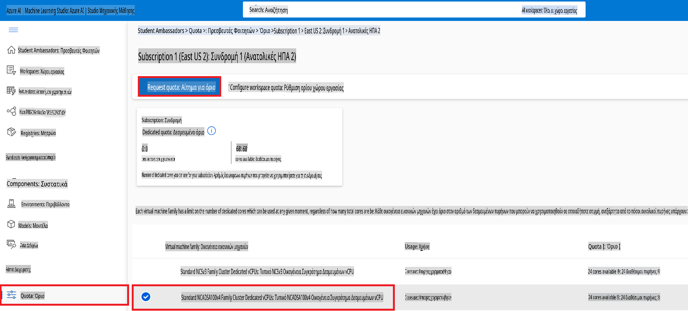

    - Στη σελίδα Request quota, εισαγάγετε το **Νέο όριο πυρήνων** που θέλετε να χρησιμοποιήσετε. Για παράδειγμα, 24.
    - Στη σελίδα Request quota, επιλέξτε **Submit** για να ζητήσετε την ποσοστώση GPU.

1. Εκτελέστε τις παρακάτω ενέργειες για να ζητήσετε ποσοστώσεις GPU *Standard NCSv3 Family*:

    - Επιλέξτε **Quota** από την αριστερή καρτέλα.
    - Επιλέξτε την **Οικογένεια εικονικών μηχανών** που θα χρησιμοποιήσετε. Για παράδειγμα, επιλέξτε **Standard NCSv3 Family Cluster Dedicated vCPUs**, που περιλαμβάνει τη GPU *Standard_NC6s_v3*.
    - Επιλέξτε **Request quota** από το μενού πλοήγησης.
    - Στη σελίδα Request quota, εισαγάγετε το **Νέο όριο πυρήνων** που θέλετε να χρησιμοποιήσετε. Για παράδειγμα, 24.
    - Στη σελίδα Request quota, επιλέξτε **Submit** για να ζητήσετε την ποσοστώση GPU.

### Προσθήκη ανάθεσης ρόλων

Για να προσαρμόσετε και να αναπτύξετε τα μοντέλα σας, πρέπει πρώτα να δημιουργήσετε μια Διαχειριζόμενη Ταυτότητα που έχει ανατεθεί από τον χρήστη (UAI) και να της εκχωρήσετε τα κατάλληλα δικαιώματα. Αυτή η ταυτότητα θα χρησιμοποιηθεί για πιστοποίηση κατά την ανάπτυξη.  

#### Δημιουργία Διαχειριζόμενης Ταυτότητας που έχει ανατεθεί από τον χρήστη (UAI)

1. Πληκτρολογήστε *managed identities* στη **γραμμή αναζήτησης** στο επάνω μέρος της πύλης και επιλέξτε **Managed Identities** από τις επιλογές που εμφανίζονται.

    

1. Επιλέξτε **+ Create**.

    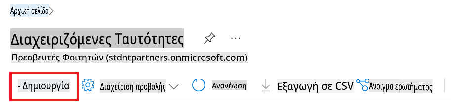

1. Εκτελέστε τις παρακάτω ενέργειες:

    - Επιλέξτε τη **Συνδρομή Azure** σας.
    - Επιλέξτε την **Ομάδα πόρων** που θα χρησιμοποιήσετε (δημιουργήστε μια νέα αν χρειάζεται).
    - Επιλέξτε την **Περιοχή** που θέλετε να χρησιμοποιήσετε.
    - Εισαγάγετε το **Όνομα**. Πρέπει να είναι μοναδικό.

    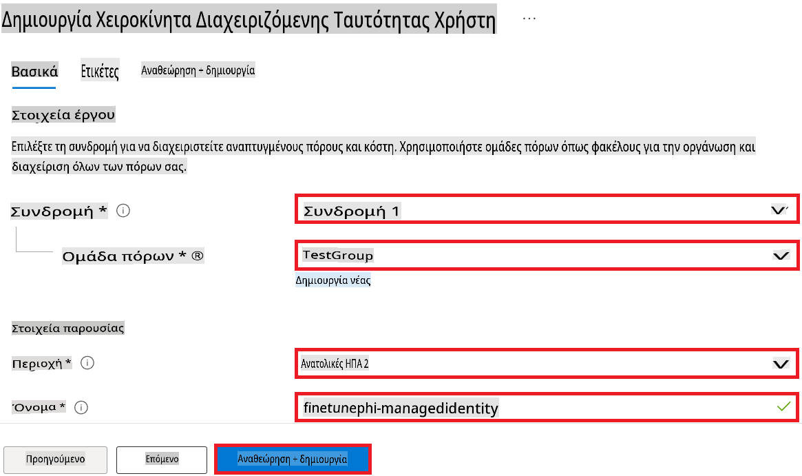

1. Επιλέξτε **Review + create**.

1. Επιλέξτε **+ Create**.

#### Προσθήκη ρόλου Contributor στη Διαχειριζόμενη Ταυτότητα

1. Μεταβείτε στον πόρο Διαχειριζόμενης Ταυτότητας που δημιουργήσατε.

1. Επιλέξτε **Azure role assignments** από την αριστερή καρτέλα.

1. Επιλέξτε **+Add role assignment** από το μενού πλοήγησης.

1. Στη σελίδα Add role assignment, εκτελέστε τις παρακάτω ενέργειες:
    - Επιλέξτε το **Scope** ως **Resource group**.
    - Επιλέξτε τη **Συνδρομή Azure** σας.
    - Επιλέξτε την **Ομάδα πόρων** που θα χρησιμοποιήσετε.
    - Επιλέξτε το **Ρόλο** ως **Contributor**.

    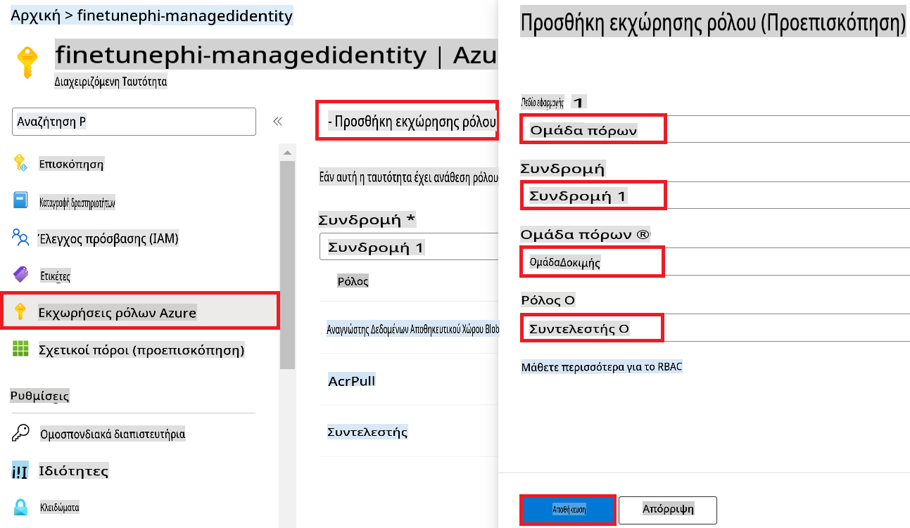

2. Επιλέξτε **Save**.

#### Προσθήκη ρόλου Storage Blob Data Reader στη Διαχειριζόμενη Ταυτότητα

1. Πληκτρολογήστε *storage accounts* στη **γραμμή αναζήτησης** στο επάνω μέρος της πύλης και επιλέξτε **Storage accounts** από τις επιλογές που εμφανίζονται.

    

1. Επιλέξτε τον λογαριασμό αποθήκευσης που συνδέεται με το Azure Machine Learning workspace που δημιουργήσατε. Για παράδειγμα, *finetunephistorage*.

1. Εκτελέστε τις παρακάτω ενέργειες για να μεταβείτε στη σελίδα Add role assignment:

    - Μεταβείτε στον λογαριασμό αποθήκευσης Azure που δημιουργήσατε.
    - Επιλέξτε **Access Control (IAM)** από την αριστερή καρτέλα.
    - Επιλέξτε **+ Add** από το μενού πλοήγησης.
    - Επιλέξτε **Add role assignment** από το μενού πλοήγησης.

    

1. Στη σελίδα Add role assignment, εκτελέστε τις παρακάτω ενέργειες:

    - Στη σελίδα Role, πληκτρολογήστε *Storage Blob Data Reader* στη **γραμμή αναζήτησης** και επιλέξτε **Storage Blob Data Reader** από τις επιλογές που εμφανίζονται.
    - Στη σελίδα Role, επιλέξτε **Next**.
    - Στη σελίδα Members, επιλέξτε **Assign access to** **Managed identity**.
    - Στη σελίδα Members, επιλέξτε **+ Select members**.
    - Στη σελίδα Select managed identities, επιλέξτε τη **Συνδρομή Azure** σας.
    - Στη σελίδα Select managed identities, επιλέξτε τη **Διαχειριζόμενη ταυτότητα** που δημιουργήσατε. Για παράδειγμα, *finetunephi-managedidentity*.
    - Στη σελίδα Select managed identities, επιλέξτε **Select**.

    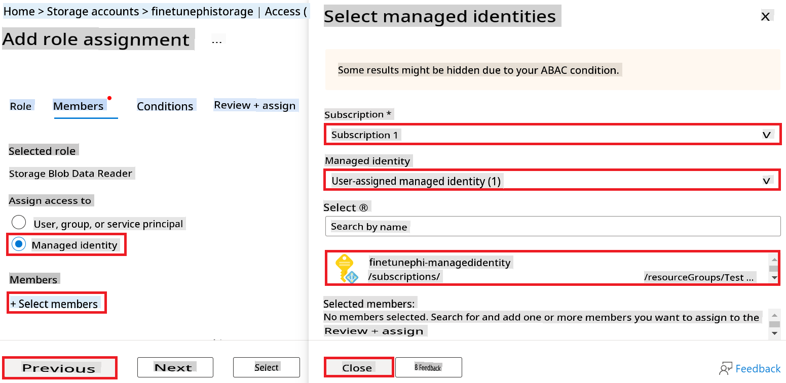

1. Επιλέξτε **Review + assign**.

#### Προσθήκη ρόλου AcrPull στη Διαχειριζόμενη Ταυτότητα

1. Πληκτρολογήστε *container registries* στη **γραμμή αναζήτησης** στο επάνω μέρος της πύλης και επιλέξτε **Container registries** από τις επιλογές που εμφανίζονται.

    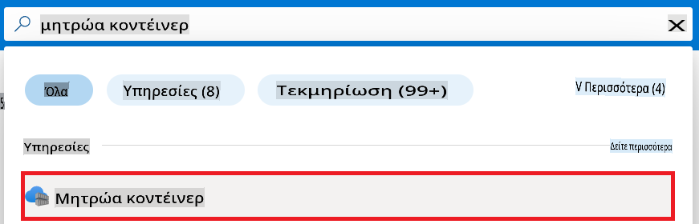

1. Επιλέξτε το container registry που συνδέεται με το Azure Machine Learning workspace. Για παράδειγμα, *finetunephicontainerregistry*.

1. Εκτελέστε τις παρακάτω ενέργειες για να μεταβείτε στη σελίδα Add role assignment:

    - Επιλέξτε **Access Control (IAM)** από την αριστερή καρτέλα.
    - Επιλέξτε **+ Add** από το μενού πλοήγησης.
    - Επιλέξτε **Add role assignment** από το μενού πλοήγησης.

1. Στη σελίδα Add role assignment, εκτελέστε τις παρακάτω ενέργειες:

    - Στη σελίδα Role, πληκτρολογήστε *AcrPull* στη **γραμμή αναζήτησης** και επιλέξτε **AcrPull** από τις επιλογές που εμφανίζονται.
    - Στη σελίδα Role, επιλέξτε **Next**.
    - Στη σελίδα Members, επιλέξτε **Assign access to** **Managed identity**.
    - Στη σελίδα Members, επιλέξτε **+ Select members**.
    - Στη σελίδα Select managed identities, επιλέξτε τη **Συνδρομή Azure** σας.
    - Στη σελίδα Select managed identities, επιλέξτε τη **Διαχειριζόμενη ταυτότητα** που δημιουργήσατε. Για παράδειγμα, *finetunephi-managedidentity*.
    - Στη σελίδα Select managed identities, επιλέξτε **Select**.
    - Επιλέξτε **Review + assign**.

### Ρύθμιση έργου

Για να κατεβάσετε τα σύνολα δεδομένων που απαιτούνται για την προσαρμογή, θα ρυθμίσετε ένα τοπικό περιβάλλον.

Σε αυτή την άσκηση, θα:

- Δημιουργήσετε έναν φάκελο για να εργαστείτε μέσα σε αυτόν.
- Δημιουργήσετε ένα εικονικό περιβάλλον.
- Εγκαταστήσετε τα απαιτούμενα πακέτα.
- Δημιουργήσετε ένα αρχείο *download_dataset.py* για να κατεβάσετε το σύνολο δεδομένων.

#### Δημιουργία φακέλου για εργασία

1. Ανοίξτε ένα τερματικό παράθυρο και πληκτρολογήστε την παρακάτω εντολή για να δημιουργήσετε έναν φάκελο με όνομα *finetune-phi* στην προεπιλεγμένη διαδρομή.

    ```console
    mkdir finetune-phi
    ```

2. Πληκτρολογήστε την παρακάτω εντολή στο τερματικό σας για να μεταβείτε στον φάκε
1. Επισκεφθείτε το [Azure ML Studio](https://ml.azure.com/home?wt.mc_id=studentamb_279723).

1. Επιλέξτε **Compute** από την καρτέλα στην αριστερή πλευρά.

1. Επιλέξτε **Compute clusters** από το μενού πλοήγησης.

1. Επιλέξτε **+ New**.

    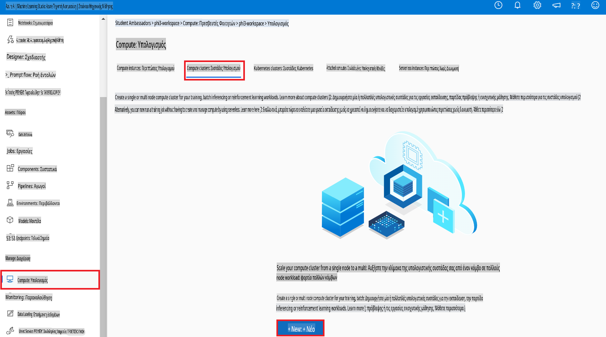

1. Εκτελέστε τις παρακάτω ενέργειες:

    - Επιλέξτε την **Περιοχή (Region)** που θέλετε να χρησιμοποιήσετε.
    - Ρυθμίστε το **Virtual machine tier** σε **Dedicated**.
    - Ρυθμίστε τον **Τύπο εικονικής μηχανής (Virtual machine type)** σε **GPU**.
    - Ορίστε το φίλτρο **Μέγεθος εικονικής μηχανής (Virtual machine size)** σε **Select from all options**.
    - Επιλέξτε το **Μέγεθος εικονικής μηχανής (Virtual machine size)** σε **Standard_NC24ads_A100_v4**.

    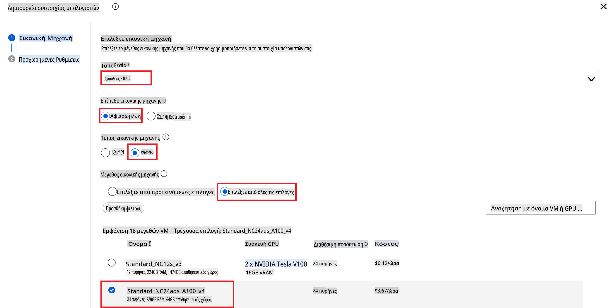

1. Επιλέξτε **Next**.

1. Εκτελέστε τις παρακάτω ενέργειες:

    - Εισάγετε **Compute name**. Πρέπει να είναι μοναδική τιμή.
    - Ορίστε τον **Ελάχιστο αριθμό κόμβων (Minimum number of nodes)** σε **0**.
    - Ορίστε τον **Μέγιστο αριθμό κόμβων (Maximum number of nodes)** σε **1**.
    - Ορίστε το **Idle seconds before scale down** σε **120**.

    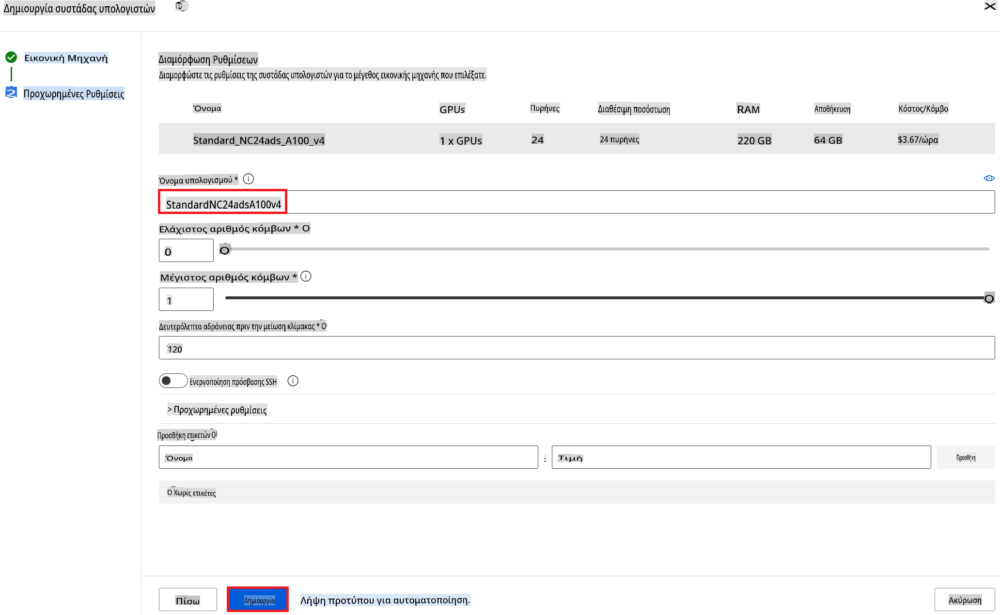

1. Επιλέξτε **Create**.

#### Fine-tune το μοντέλο Phi-3

1. Επισκεφθείτε το [Azure ML Studio](https://ml.azure.com/home?wt.mc_id=studentamb_279723).

1. Επιλέξτε το Azure Machine Learning workspace που δημιουργήσατε.

    

1. Εκτελέστε τις παρακάτω ενέργειες:

    - Επιλέξτε **Model catalog** από την καρτέλα στην αριστερή πλευρά.
    - Πληκτρολογήστε *phi-3-mini-4k* στη **γραμμή αναζήτησης** και επιλέξτε **Phi-3-mini-4k-instruct** από τις επιλογές που εμφανίζονται.

    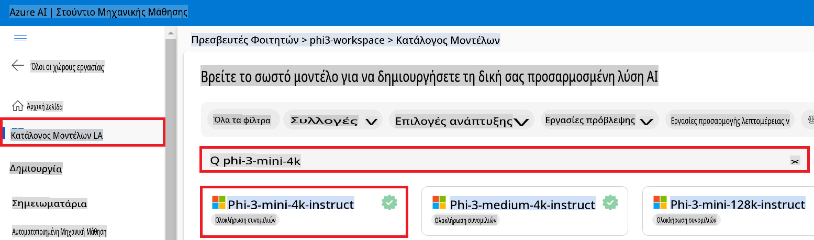

1. Επιλέξτε **Fine-tune** από το μενού πλοήγησης.

    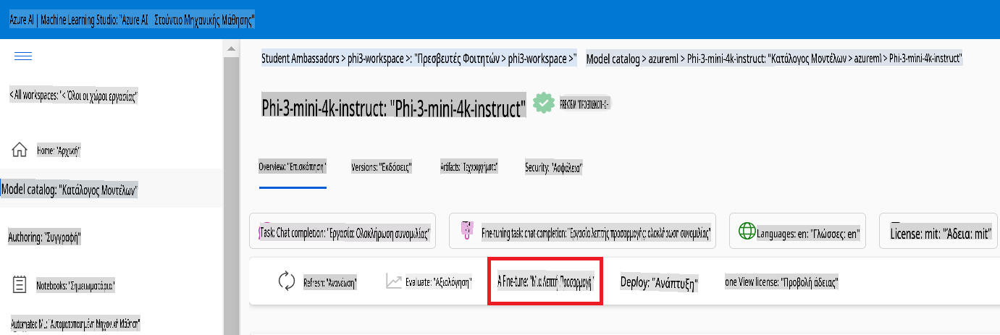

1. Εκτελέστε τις παρακάτω ενέργειες:

    - Ρυθμίστε το **Select task type** σε **Chat completion**.
    - Επιλέξτε **+ Select data** για να ανεβάσετε **Traning data**.
    - Ρυθμίστε τον τύπο μεταφόρτωσης δεδομένων επικύρωσης σε **Provide different validation data**.
    - Επιλέξτε **+ Select data** για να ανεβάσετε **Validation data**.

    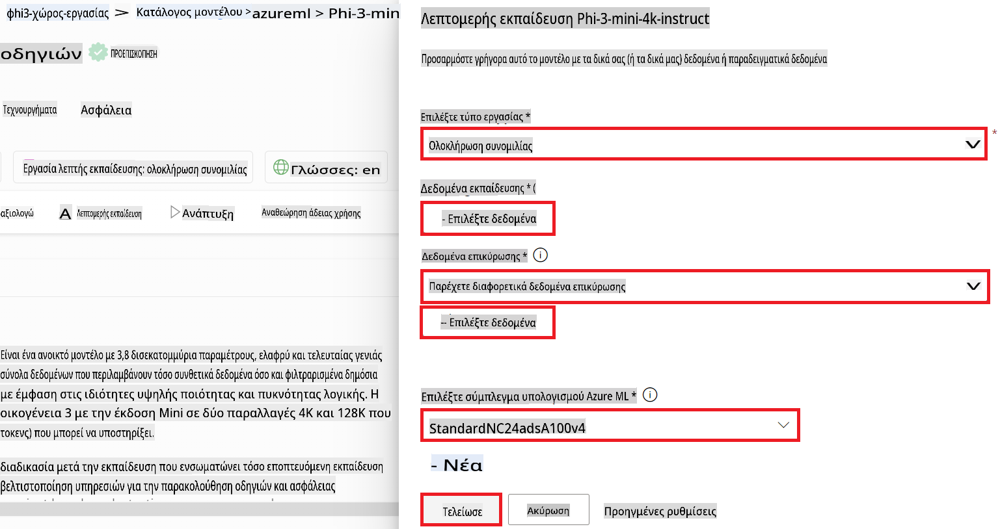

    > [!TIP]
    >
    > Μπορείτε να επιλέξετε **Advanced settings** για να προσαρμόσετε ρυθμίσεις, όπως το **learning_rate** και το **lr_scheduler_type**, ώστε να βελτιστοποιήσετε τη διαδικασία fine-tuning σύμφωνα με τις ανάγκες σας.

1. Επιλέξτε **Finish**.

1. Σε αυτήν την άσκηση, πραγματοποιήσατε επιτυχώς fine-tuning στο μοντέλο Phi-3 χρησιμοποιώντας το Azure Machine Learning. Σημειώστε ότι η διαδικασία fine-tuning μπορεί να διαρκέσει αρκετό χρόνο. Μετά την εκτέλεση της εργασίας fine-tuning, θα χρειαστεί να περιμένετε να ολοκληρωθεί. Μπορείτε να παρακολουθείτε την κατάσταση της εργασίας fine-tuning μεταβαίνοντας στην καρτέλα Jobs στην αριστερή πλευρά του Azure Machine Learning Workspace. Στη συνέχεια, θα αναπτύξετε το fine-tuned μοντέλο και θα το ενσωματώσετε στο Prompt flow.

    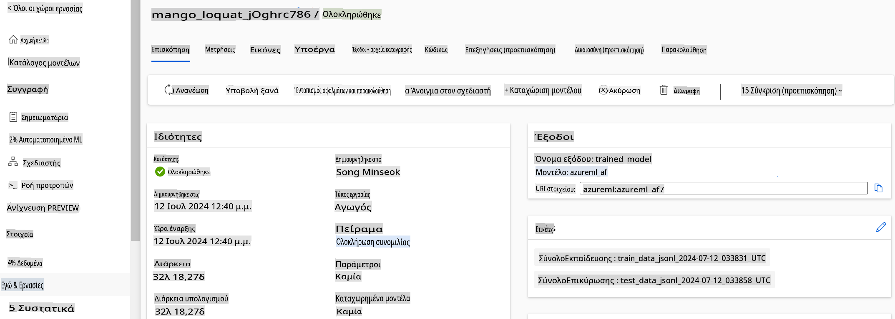

### Ανάπτυξη του fine-tuned μοντέλου Phi-3

Για να ενσωματώσετε το fine-tuned μοντέλο Phi-3 στο Prompt flow, πρέπει να το αναπτύξετε ώστε να είναι διαθέσιμο για πραγματικό χρόνο προβλέψεις. Αυτή η διαδικασία περιλαμβάνει την εγγραφή του μοντέλου, τη δημιουργία ενός online endpoint και την ανάπτυξη του μοντέλου.

Σε αυτήν την άσκηση, θα:

- Εγγράψετε το fine-tuned μοντέλο στο Azure Machine Learning workspace.
- Δημιουργήσετε ένα online endpoint.
- Αναπτύξετε το εγγεγραμμένο fine-tuned μοντέλο Phi-3.

#### Εγγραφή του fine-tuned μοντέλου

1. Επισκεφθείτε το [Azure ML Studio](https://ml.azure.com/home?wt.mc_id=studentamb_279723).

1. Επιλέξτε το Azure Machine Learning workspace που δημιουργήσατε.

    

1. Επιλέξτε **Models** από την καρτέλα στην αριστερή πλευρά.
1. Επιλέξτε **+ Register**.
1. Επιλέξτε **From a job output**.

    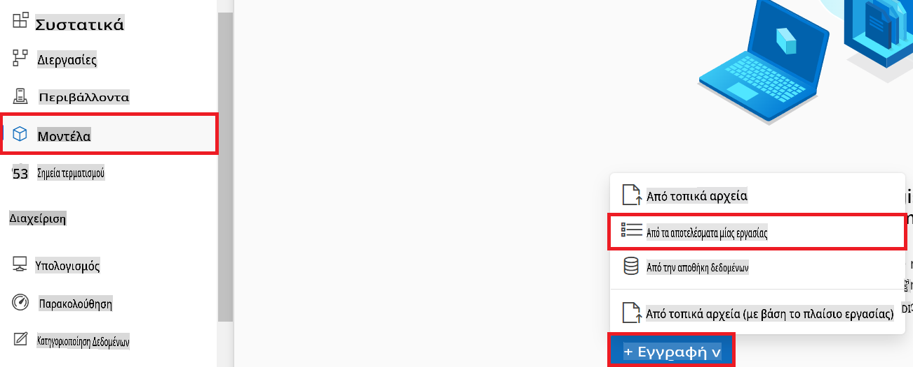

1. Επιλέξτε την εργασία που δημιουργήσατε.

    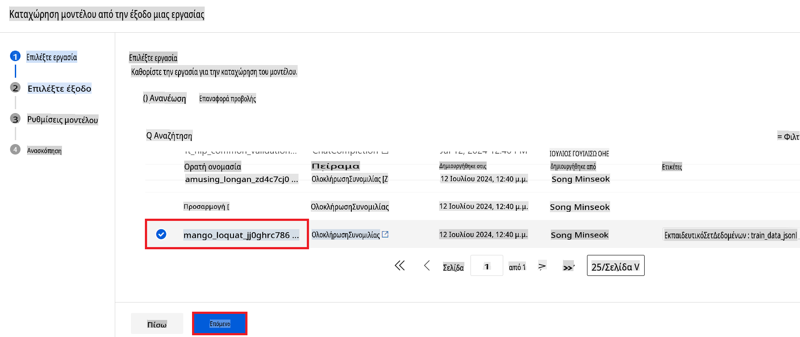

1. Επιλέξτε **Next**.

1. Ρυθμίστε το **Model type** σε **MLflow**.

1. Βεβαιωθείτε ότι είναι επιλεγμένο το **Job output**. Θα πρέπει να είναι αυτόματα επιλεγμένο.

    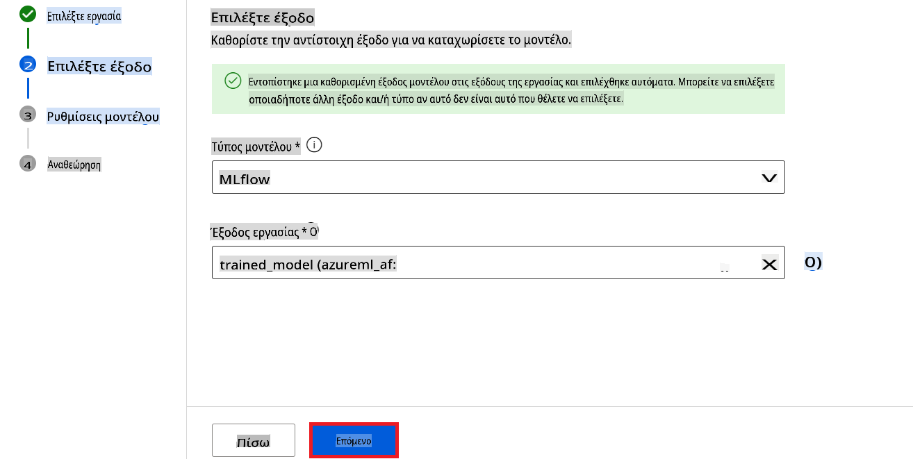

2. Επιλέξτε **Next**.

3. Επιλέξτε **Register**.

    

4. Μπορείτε να δείτε το εγγεγραμμένο μοντέλο σας μεταβαίνοντας στο μενού **Models** από την αριστερή πλευρά.

    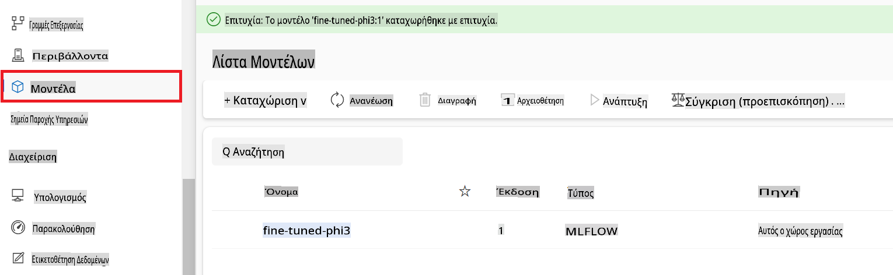

#### Ανάπτυξη του fine-tuned μοντέλου

1. Μεταβείτε στο Azure Machine Learning workspace που δημιουργήσατε.

1. Επιλέξτε **Endpoints** από την καρτέλα στην αριστερή πλευρά.

1. Επιλέξτε **Real-time endpoints** από το μενού πλοήγησης.

    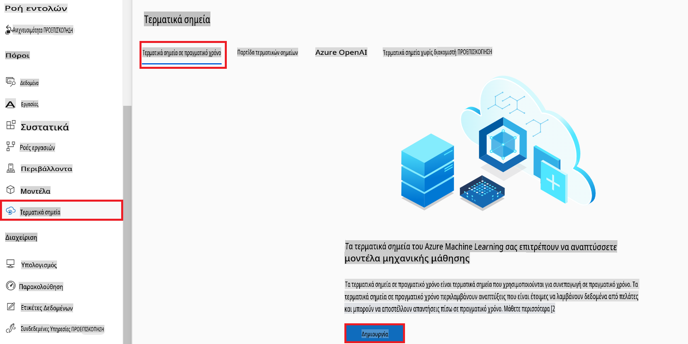

1. Επιλέξτε **Create**.

1. Επιλέξτε το εγγεγραμμένο μοντέλο που δημιουργήσατε.

    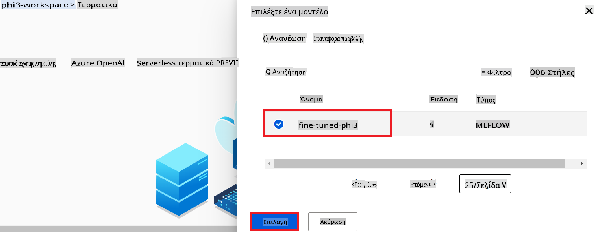

1. Επιλέξτε **Select**.

1. Εκτελέστε τις παρακάτω ενέργειες:

    - Ρυθμίστε το **Virtual machine** σε *Standard_NC6s_v3*.
    - Ορίστε τον **Αριθμό instances (Instance count)** που θέλετε να χρησιμοποιήσετε. Για παράδειγμα, *1*.
    - Ρυθμίστε το **Endpoint** σε **New** για να δημιουργήσετε ένα endpoint.
    - Εισάγετε **Endpoint name**. Πρέπει να είναι μοναδική τιμή.
    - Εισάγετε **Deployment name**. Πρέπει να είναι μοναδική τιμή.

    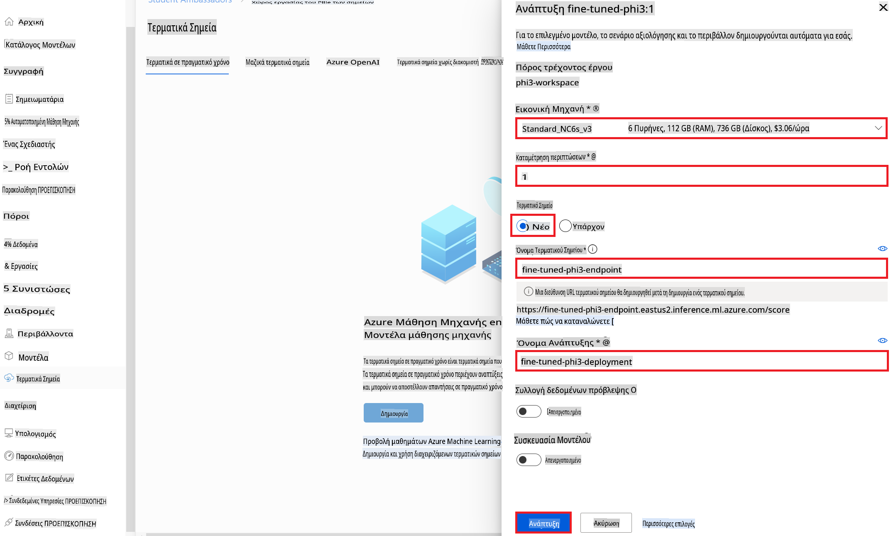

1. Επιλέξτε **Deploy**.

> [!WARNING]
> Για να αποφύγετε πρόσθετες χρεώσεις στον λογαριασμό σας, βεβαιωθείτε ότι διαγράψατε το δημιουργημένο endpoint στο Azure Machine Learning workspace.
>

#### Έλεγχος κατάστασης ανάπτυξης στο Azure Machine Learning Workspace

1. Μεταβείτε στο Azure Machine Learning workspace που δημιουργήσατε.

1. Επιλέξτε **Endpoints** από την καρτέλα στην αριστερή πλευρά.

1. Επιλέξτε το endpoint που δημιουργήσατε.

    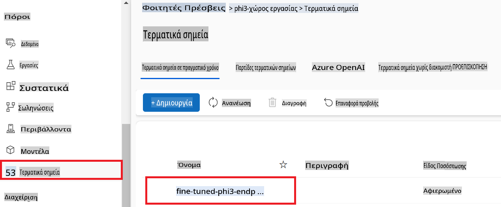

1. Σε αυτήν τη σελίδα, μπορείτε να διαχειριστείτε τα endpoints κατά τη διάρκεια της διαδικασίας ανάπτυξης.

> [!NOTE]
> Όταν ολοκληρωθεί η ανάπτυξη, βεβαιωθείτε ότι το **Live traffic** έχει οριστεί σε **100%**. Αν όχι, επιλέξτε **Update traffic** για να προσαρμόσετε τις ρυθμίσεις. Σημειώστε ότι δεν μπορείτε να δοκιμάσετε το μοντέλο αν το traffic είναι ρυθμισμένο στο 0%.
>
> 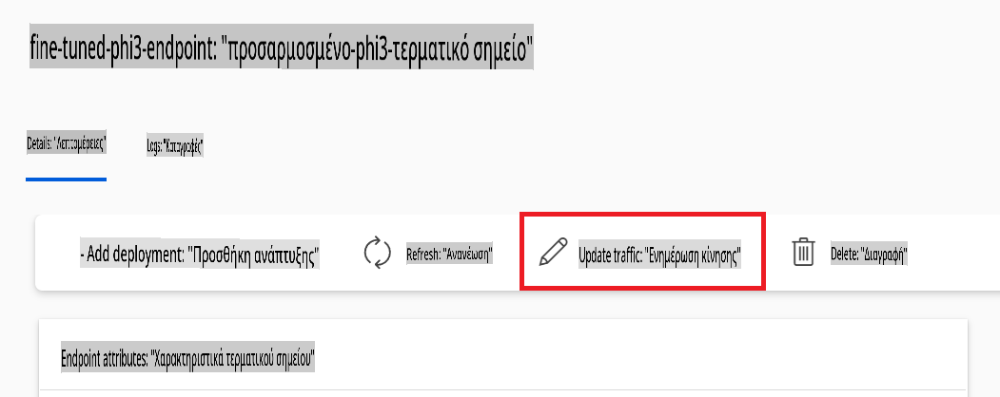
>

## Σενάριο 3: Ενσωμάτωση με το Prompt flow και συνομιλία με το προσαρμοσμένο μοντέλο σας στο Azure AI Foundry

### Ενσωμάτωση του προσαρμοσμένου μοντέλου Phi-3 με το Prompt flow

Αφού αναπτύξετε επιτυχώς το fine-tuned μοντέλο σας, μπορείτε τώρα να το ενσωματώσετε με το Prompt Flow για να το χρησιμοποιήσετε σε εφαρμογές πραγματικού χρόνου, επιτρέποντας μια ποικιλία διαδραστικών εργασιών με το προσαρμοσμένο μοντέλο Phi-3 σας.

Σε αυτήν την άσκηση, θα:

- Δημιουργήσετε το Azure AI Foundry Hub.
- Δημιουργήσετε το Azure AI Foundry Project.
- Δημιουργήσετε Prompt flow.
- Προσθέσετε μια προσαρμοσμένη σύνδεση για το fine-tuned μοντέλο Phi-3.
- Ρυθμίσετε το Prompt flow για συνομιλία με το προσαρμοσμένο μοντέλο Phi-3 σας.

> [!NOTE]
> Μπορείτε επίσης να ενσωματώσετε με το Promptflow χρησιμοποιώντας το Azure ML Studio. Η ίδια διαδικασία ενσωμάτωσης μπορεί να εφαρμοστεί και στο Azure ML Studio.

#### Δημιουργία Azure AI Foundry Hub

Πρέπει να δημιουργήσετε ένα Hub πριν δημιουργήσετε το Project. Το Hub λειτουργεί σαν Resource Group, επιτρέποντάς σας να οργανώνετε και να διαχειρίζεστε πολλαπλά Projects στο Azure AI Foundry.

1. Επισκεφθείτε το [Azure AI Foundry](https://ai.azure.com/?WT.mc_id=aiml-137032-kinfeylo).

1. Επιλέξτε **All hubs** από την καρτέλα στην αριστερή πλευρά.

1. Επιλέξτε **+ New hub** από το μενού πλοήγησης.

    

1. Εκτελέστε τις παρακάτω ενέργειες:

    - Εισάγετε **Hub name**. Πρέπει να είναι μοναδική τιμή.
    - Επιλέξτε την Azure **Subscription** σας.
    - Επιλέξτε το **Resource group** που θα χρησιμοποιήσετε (δημιουργήστε νέο αν χρειάζεται).
    - Επιλέξτε την **Τοποθεσία (Location)** που θέλετε να χρησιμοποιήσετε.
    - Επιλέξτε το **Connect Azure AI Services** που θα χρησιμοποιήσετε (δημιουργήστε νέο αν χρειάζεται).
    - Ρυθμίστε το **Connect Azure AI Search** σε **Skip connecting**.

    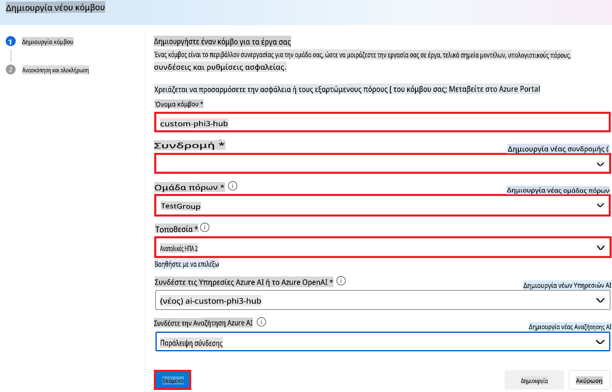

1. Επιλέξτε **Next**.

#### Δημιουργία Azure AI Foundry Project

1. Στο Hub που δημιουργήσατε, επιλέξτε **All projects** από την καρτέλα στην αριστερή πλευρά.

1. Επιλέξτε **+ New project** από το μενού πλοήγησης.

    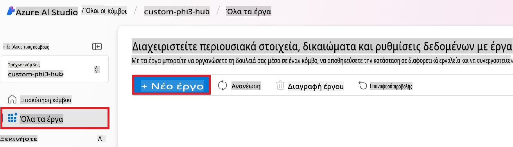

1. Εισάγετε **Project name**. Πρέπει να είναι μοναδική τιμή.

    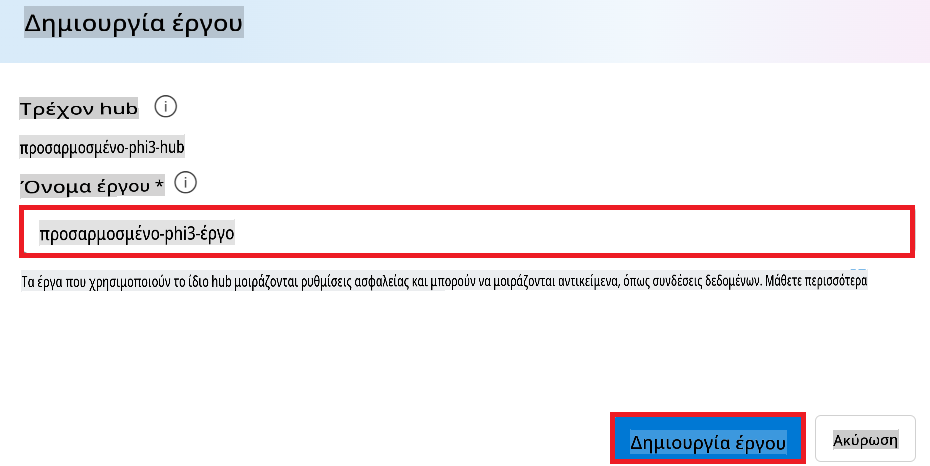

1. Επιλέξτε **Create a project**.

#### Προσθήκη προσαρμοσμένης σύνδεσης για το fine-tuned μοντέλο Phi-3

Για να ενσωματώσετε το προσαρμοσμένο μοντέλο Phi-3 σας με το Prompt flow, πρέπει να αποθηκεύσετε το endpoint και το κλειδί του μοντέλου σε μια προσαρμοσμένη σύνδεση. Αυτή η ρύθμιση εξασφαλίζει την πρόσβαση στο προσαρμοσμένο μοντέλο Phi-3 σας στο Prompt flow.

#### Ρύθμιση api key και endpoint uri του fine-tuned μοντέλου Phi-3

1. Επισκεφθείτε το [Azure ML Studio](https://ml.azure.com/home?WT.mc_id=aiml-137032-kinfeylo).

1. Μεταβείτε στο Azure Machine learning workspace που δημιουργήσατε.

1. Επιλέξτε **Endpoints** από την καρτέλα στην αριστερή πλευρά.

    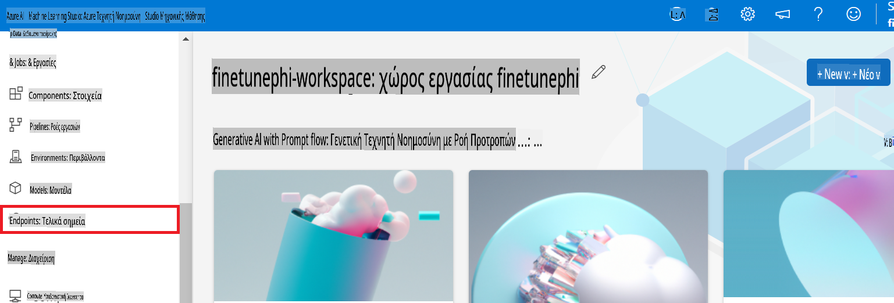

1. Επιλέξτε το endpoint που δημιουργήσατε.

    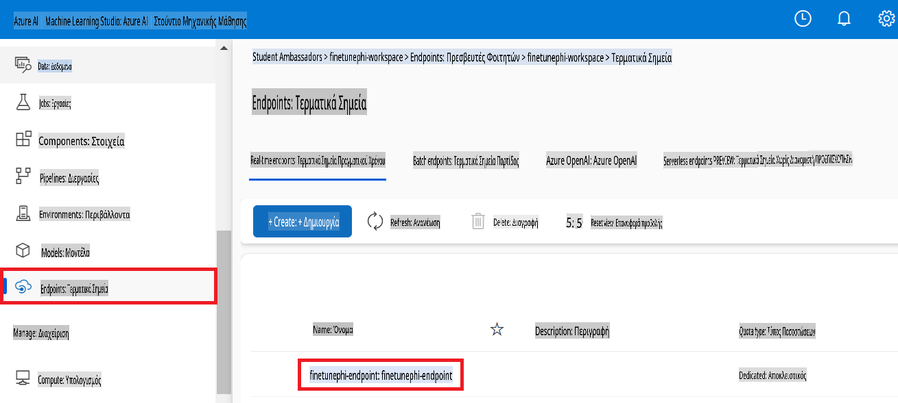

1. Επιλέξτε **Consume** από το μενού πλοήγησης.

1. Αντιγράψτε το **REST endpoint** και το **Primary key** σας.
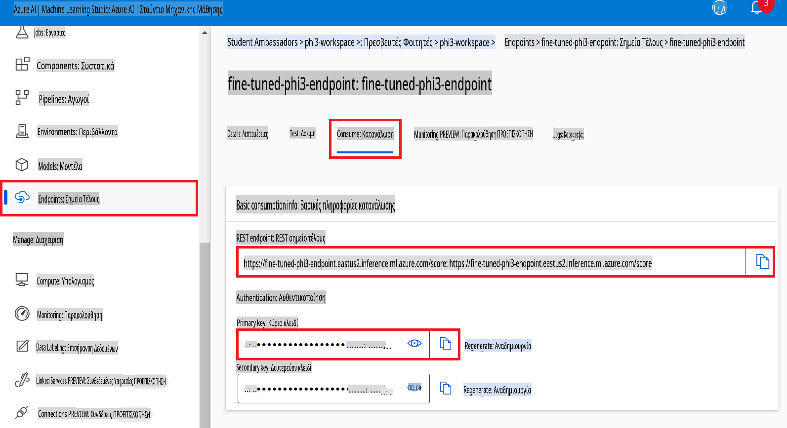

#### Προσθήκη Προσαρμοσμένης Σύνδεσης

1. Επισκεφθείτε το [Azure AI Foundry](https://ai.azure.com/?WT.mc_id=aiml-137032-kinfeylo).

1. Μεταβείτε στο έργο Azure AI Foundry που δημιουργήσατε.

1. Στο έργο που δημιουργήσατε, επιλέξτε **Ρυθμίσεις** από την αριστερή πλαϊνή καρτέλα.

1. Επιλέξτε **+ Νέα σύνδεση**.

    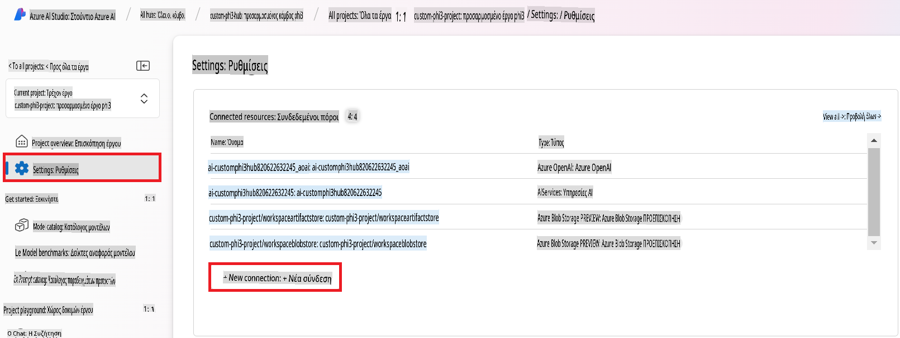

1. Επιλέξτε **Προσαρμοσμένα κλειδιά** από το μενού πλοήγησης.

    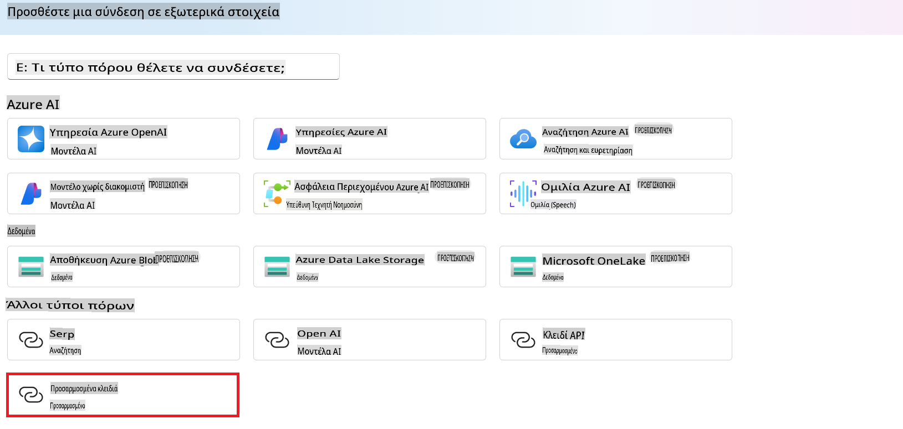

1. Εκτελέστε τις παρακάτω ενέργειες:

    - Επιλέξτε **+ Προσθήκη ζευγών κλειδιού-τιμής**.
    - Για το όνομα κλειδιού, εισάγετε **endpoint** και επικολλήστε το endpoint που αντιγράψατε από το Azure ML Studio στο πεδίο τιμής.
    - Επιλέξτε ξανά **+ Προσθήκη ζευγών κλειδιού-τιμής**.
    - Για το όνομα κλειδιού, εισάγετε **key** και επικολλήστε το κλειδί που αντιγράψατε από το Azure ML Studio στο πεδίο τιμής.
    - Αφού προσθέσετε τα κλειδιά, επιλέξτε **is secret** για να αποτρέψετε την έκθεση του κλειδιού.

    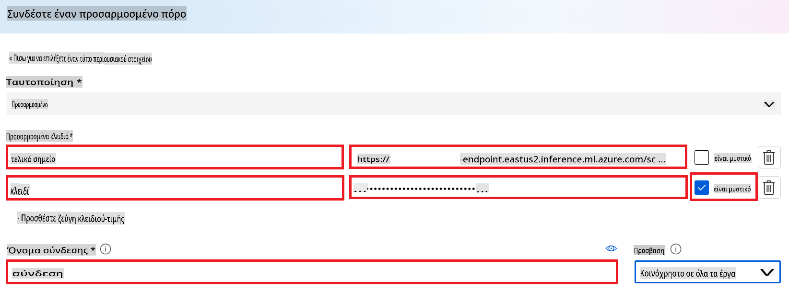

1. Επιλέξτε **Προσθήκη σύνδεσης**.

#### Δημιουργία Prompt Flow

Προσθέσατε μια προσαρμοσμένη σύνδεση στο Azure AI Foundry. Τώρα, ας δημιουργήσουμε ένα Prompt flow ακολουθώντας τα παρακάτω βήματα. Στη συνέχεια, θα συνδέσετε αυτό το Prompt flow με την προσαρμοσμένη σύνδεση ώστε να μπορείτε να χρησιμοποιήσετε το fine-tuned μοντέλο μέσα στο Prompt flow.

1. Μεταβείτε στο έργο Azure AI Foundry που δημιουργήσατε.

1. Επιλέξτε **Prompt flow** από την αριστερή πλαϊνή καρτέλα.

1. Επιλέξτε **+ Δημιουργία** από το μενού πλοήγησης.

    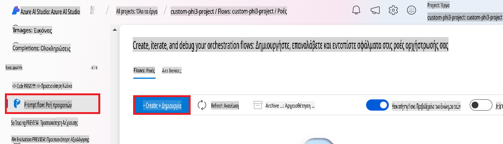

1. Επιλέξτε **Chat flow** από το μενού πλοήγησης.

    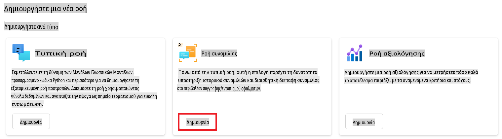

1. Εισάγετε **Όνομα φακέλου** που θέλετε να χρησιμοποιήσετε.

    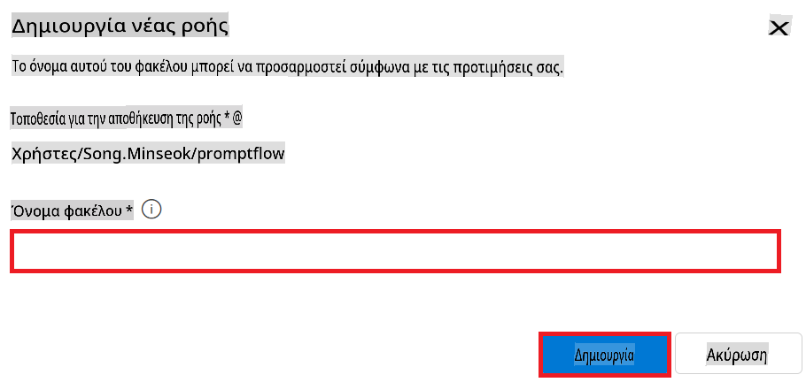

2. Επιλέξτε **Δημιουργία**.

#### Ρύθμιση Prompt Flow για συνομιλία με το προσαρμοσμένο μοντέλο Phi-3

Χρειάζεται να ενσωματώσετε το fine-tuned μοντέλο Phi-3 σε ένα Prompt flow. Ωστόσο, το υπάρχον Prompt flow που παρέχεται δεν είναι σχεδιασμένο για αυτόν τον σκοπό. Επομένως, πρέπει να ανασχεδιάσετε το Prompt flow για να επιτρέψετε την ενσωμάτωση του προσαρμοσμένου μοντέλου.

1. Στο Prompt flow, εκτελέστε τις παρακάτω ενέργειες για να αναδομήσετε τη ροή:

    - Επιλέξτε **Λειτουργία αρχείου Raw**.
    - Διαγράψτε όλο τον υπάρχοντα κώδικα στο αρχείο *flow.dag.yml*.
    - Προσθέστε τον παρακάτω κώδικα στο αρχείο *flow.dag.yml*.

        ```yml
        inputs:
          input_data:
            type: string
            default: "Who founded Microsoft?"

        outputs:
          answer:
            type: string
            reference: ${integrate_with_promptflow.output}

        nodes:
        - name: integrate_with_promptflow
          type: python
          source:
            type: code
            path: integrate_with_promptflow.py
          inputs:
            input_data: ${inputs.input_data}
        ```

    - Επιλέξτε **Αποθήκευση**.

    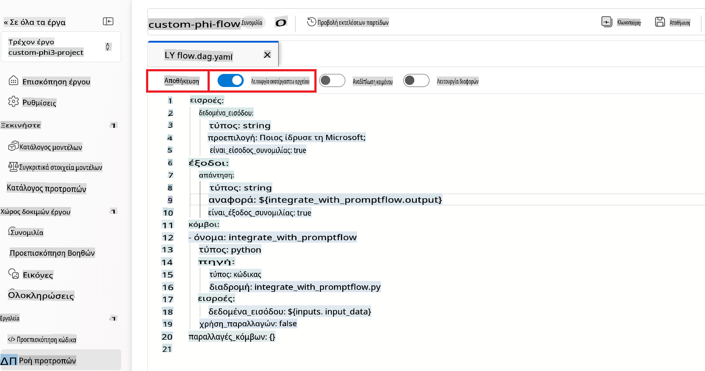

1. Προσθέστε τον παρακάτω κώδικα στο αρχείο *integrate_with_promptflow.py* για να χρησιμοποιήσετε το προσαρμοσμένο μοντέλο Phi-3 στο Prompt flow.

    ```python
    import logging
    import requests
    from promptflow import tool
    from promptflow.connections import CustomConnection

    # Logging setup
    logging.basicConfig(
        format="%(asctime)s - %(levelname)s - %(name)s - %(message)s",
        datefmt="%Y-%m-%d %H:%M:%S",
        level=logging.DEBUG
    )
    logger = logging.getLogger(__name__)

    def query_phi3_model(input_data: str, connection: CustomConnection) -> str:
        """
        Send a request to the Phi-3 model endpoint with the given input data using Custom Connection.
        """

        # "connection" is the name of the Custom Connection, "endpoint", "key" are the keys in the Custom Connection
        endpoint_url = connection.endpoint
        api_key = connection.key

        headers = {
            "Content-Type": "application/json",
            "Authorization": f"Bearer {api_key}"
        }
        data = {
            "input_data": {
                "input_string": [
                    {"role": "user", "content": input_data}
                ],
                "parameters": {
                    "temperature": 0.7,
                    "max_new_tokens": 128
                }
            }
        }
        try:
            response = requests.post(endpoint_url, json=data, headers=headers)
            response.raise_for_status()
            
            # Log the full JSON response
            logger.debug(f"Full JSON response: {response.json()}")

            result = response.json()["output"]
            logger.info("Successfully received response from Azure ML Endpoint.")
            return result
        except requests.exceptions.RequestException as e:
            logger.error(f"Error querying Azure ML Endpoint: {e}")
            raise

    @tool
    def my_python_tool(input_data: str, connection: CustomConnection) -> str:
        """
        Tool function to process input data and query the Phi-3 model.
        """
        return query_phi3_model(input_data, connection)

    ```

    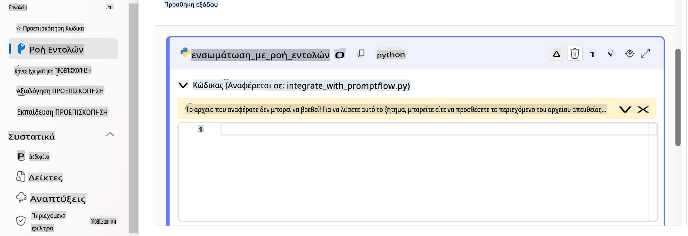

> [!NOTE]
> Για περισσότερες λεπτομέρειες σχετικά με τη χρήση του Prompt flow στο Azure AI Foundry, μπορείτε να ανατρέξετε στον οδηγό [Prompt flow στο Azure AI Foundry](https://learn.microsoft.com/azure/ai-studio/how-to/prompt-flow).

1. Επιλέξτε **Είσοδος συνομιλίας**, **Έξοδος συνομιλίας** για να ενεργοποιήσετε τη συνομιλία με το μοντέλο σας.

    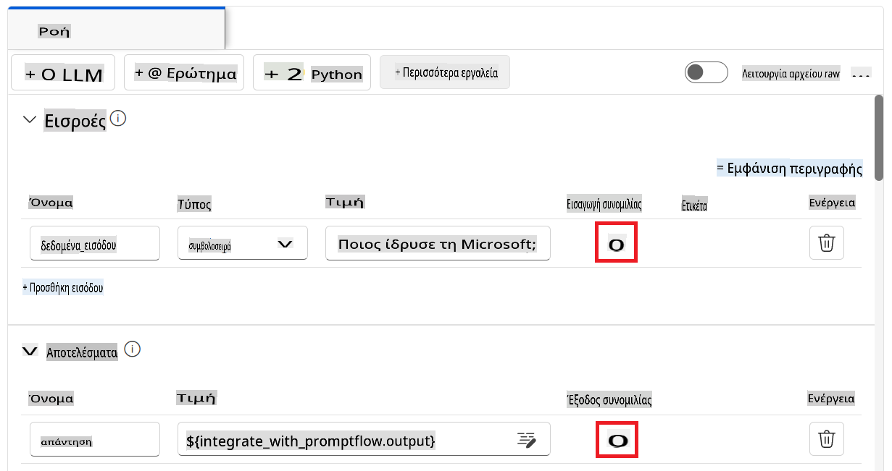

1. Τώρα είστε έτοιμοι να συνομιλήσετε με το προσαρμοσμένο μοντέλο Phi-3 σας. Στην επόμενη άσκηση, θα μάθετε πώς να ξεκινήσετε το Prompt flow και να το χρησιμοποιήσετε για συνομιλία με το fine-tuned μοντέλο Phi-3 σας.

> [!NOTE]
>
> Η αναδομημένη ροή θα πρέπει να μοιάζει με την παρακάτω εικόνα:
>
> 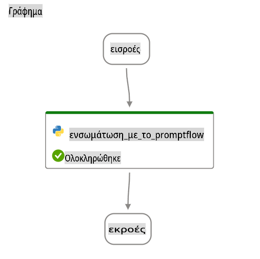
>

### Συνομιλήστε με το προσαρμοσμένο μοντέλο Phi-3 σας

Τώρα που έχετε fine-tuned και ενσωματώσει το προσαρμοσμένο μοντέλο Phi-3 σας με το Prompt flow, είστε έτοιμοι να ξεκινήσετε την αλληλεπίδραση με αυτό. Αυτή η άσκηση θα σας καθοδηγήσει στη διαδικασία ρύθμισης και έναρξης συνομιλίας με το μοντέλο σας χρησιμοποιώντας το Prompt flow. Ακολουθώντας αυτά τα βήματα, θα μπορείτε να αξιοποιήσετε πλήρως τις δυνατότητες του fine-tuned μοντέλου Phi-3 σας για διάφορες εργασίες και συνομιλίες.

- Συνομιλήστε με το προσαρμοσμένο μοντέλο Phi-3 σας χρησιμοποιώντας το Prompt flow.

#### Ξεκινήστε το Prompt Flow

1. Επιλέξτε **Έναρξη συνεδριών υπολογισμού** για να ξεκινήσετε το Prompt flow.

    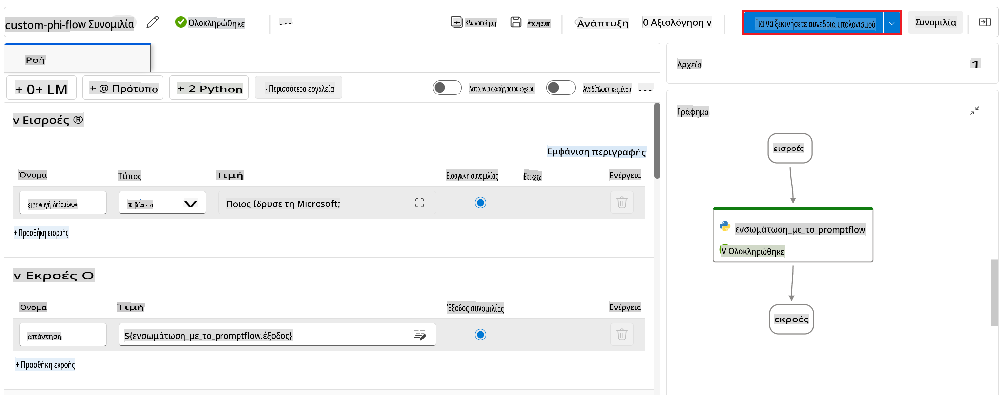

1. Επιλέξτε **Επικύρωση και ανάλυση εισόδου** για να ανανεώσετε τις παραμέτρους.

    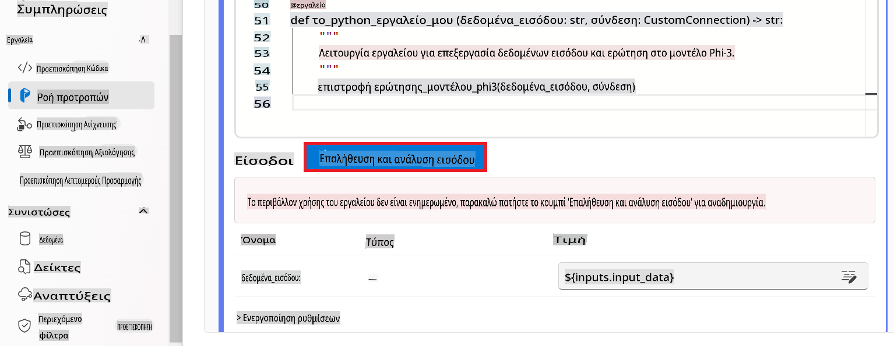

1. Επιλέξτε την **Τιμή** της **σύνδεσης** στην προσαρμοσμένη σύνδεση που δημιουργήσατε. Για παράδειγμα, *connection*.

    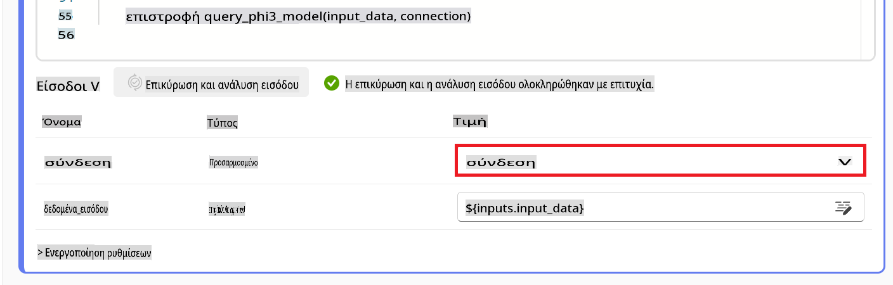

#### Συνομιλήστε με το προσαρμοσμένο μοντέλο σας

1. Επιλέξτε **Συνομιλία**.

    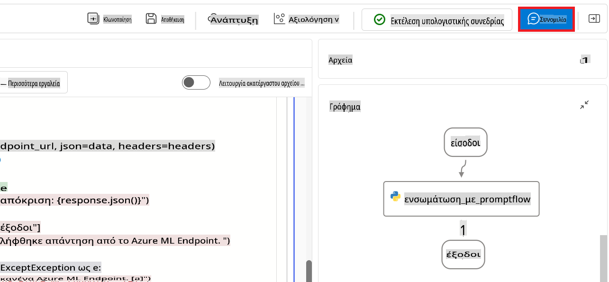

1. Να ένα παράδειγμα αποτελεσμάτων: Τώρα μπορείτε να συνομιλήσετε με το προσαρμοσμένο μοντέλο Phi-3 σας. Συνιστάται να κάνετε ερωτήσεις βάσει των δεδομένων που χρησιμοποιήθηκαν για το fine-tuning.

    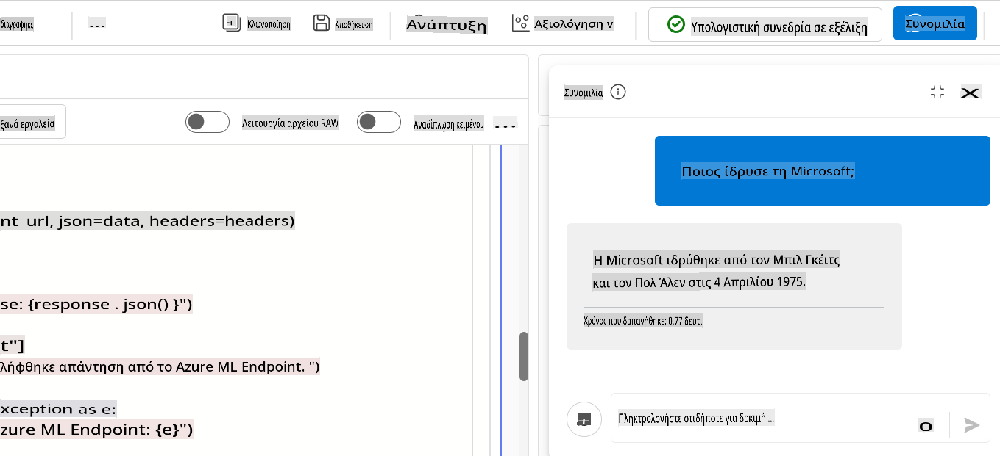

**Αποποίηση ευθύνης**:  
Αυτό το έγγραφο έχει μεταφραστεί χρησιμοποιώντας υπηρεσίες μετάφρασης που βασίζονται σε τεχνητή νοημοσύνη. Ενώ καταβάλλουμε προσπάθειες για ακρίβεια, παρακαλούμε να έχετε υπόψη ότι οι αυτοματοποιημένες μεταφράσεις ενδέχεται να περιέχουν σφάλματα ή ανακρίβειες. Το πρωτότυπο έγγραφο στη μητρική του γλώσσα θα πρέπει να θεωρείται η αυθεντική πηγή. Για κρίσιμες πληροφορίες, συνιστάται επαγγελματική ανθρώπινη μετάφραση. Δεν φέρουμε ευθύνη για τυχόν παρεξηγήσεις ή λανθασμένες ερμηνείες που προκύπτουν από τη χρήση αυτής της μετάφρασης.