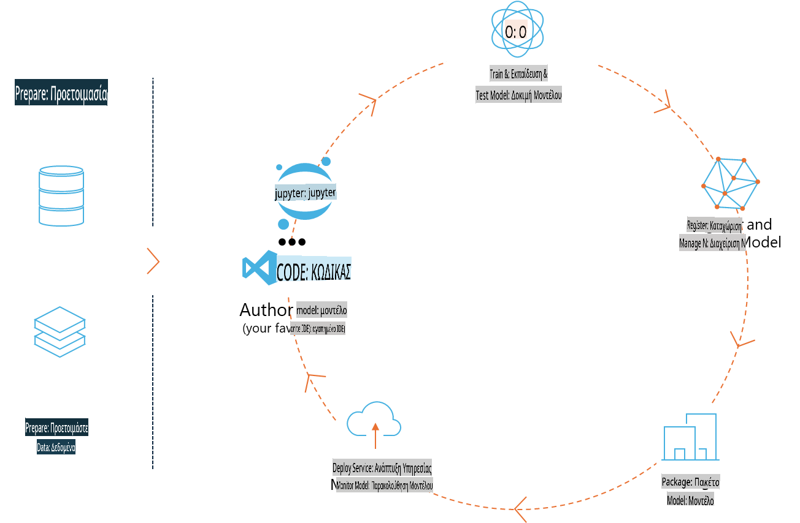
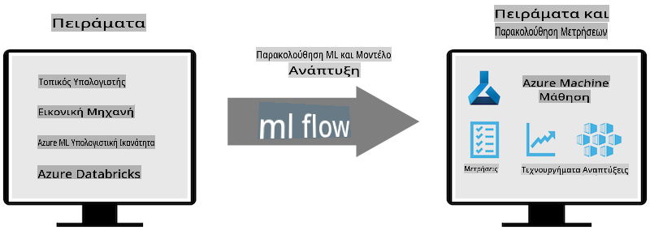
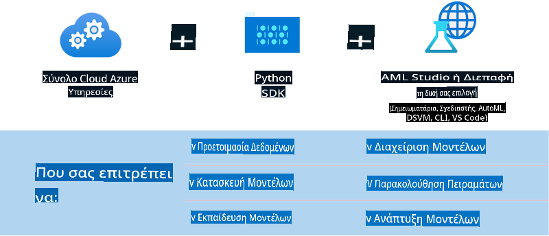

# MLflow

[MLflow](https://mlflow.org/) είναι μια ανοιχτού κώδικα πλατφόρμα σχεδιασμένη για τη διαχείριση του πλήρους κύκλου ζωής της μηχανικής μάθησης.



Το MLFlow χρησιμοποιείται για τη διαχείριση του κύκλου ζωής της μηχανικής μάθησης, συμπεριλαμβανομένων της πειραματικής διαδικασίας, της αναπαραγωγιμότητας, της ανάπτυξης και ενός κεντρικού μητρώου μοντέλων. Το MLFlow προσφέρει επί του παρόντος τέσσερα βασικά στοιχεία.

- **MLflow Tracking:** Καταγραφή και αναζήτηση πειραμάτων, κώδικα, δεδομένων διαμόρφωσης και αποτελεσμάτων.
- **MLflow Projects:** Συσκευασία κώδικα επιστήμης δεδομένων σε μορφή που επιτρέπει την αναπαραγωγή εκτελέσεων σε οποιαδήποτε πλατφόρμα.
- **MLflow Models:** Ανάπτυξη μοντέλων μηχανικής μάθησης σε διάφορα περιβάλλοντα εξυπηρέτησης.
- **Model Registry:** Αποθήκευση, σχολιασμός και διαχείριση μοντέλων σε ένα κεντρικό αποθετήριο.

Περιλαμβάνει δυνατότητες για την παρακολούθηση πειραμάτων, τη συσκευασία κώδικα σε αναπαραγώγιμες εκτελέσεις, καθώς και τη διαμοίραση και ανάπτυξη μοντέλων. Το MLFlow είναι ενσωματωμένο στο Databricks και υποστηρίζει μια ποικιλία βιβλιοθηκών μηχανικής μάθησης, καθιστώντας το ανεξάρτητο από τη βιβλιοθήκη. Μπορεί να χρησιμοποιηθεί με οποιαδήποτε βιβλιοθήκη μηχανικής μάθησης και σε οποιαδήποτε γλώσσα προγραμματισμού, καθώς παρέχει REST API και CLI για ευκολία.



Βασικά χαρακτηριστικά του MLFlow περιλαμβάνουν:

- **Παρακολούθηση Πειραμάτων:** Καταγραφή και σύγκριση παραμέτρων και αποτελεσμάτων.
- **Διαχείριση Μοντέλων:** Ανάπτυξη μοντέλων σε διάφορες πλατφόρμες εξυπηρέτησης και πρόβλεψης.
- **Μητρώο Μοντέλων:** Συνεργατική διαχείριση του κύκλου ζωής των μοντέλων MLflow, συμπεριλαμβανομένης της διαχείρισης εκδόσεων και σχολίων.
- **Projects:** Συσκευασία κώδικα ML για διαμοίραση ή χρήση σε παραγωγή.

Το MLFlow υποστηρίζει επίσης τον κύκλο MLOps, ο οποίος περιλαμβάνει την προετοιμασία δεδομένων, την καταχώρηση και διαχείριση μοντέλων, τη συσκευασία μοντέλων για εκτέλεση, την ανάπτυξη υπηρεσιών και την παρακολούθηση μοντέλων. Στόχος του είναι να απλοποιήσει τη διαδικασία μετάβασης από ένα πρωτότυπο σε ένα περιβάλλον παραγωγής, ειδικά σε περιβάλλοντα cloud και edge.

## Σενάριο E2E - Δημιουργία wrapper και χρήση του Phi-3 ως μοντέλου MLFlow

Σε αυτό το δείγμα E2E, θα δείξουμε δύο διαφορετικές προσεγγίσεις για τη δημιουργία ενός wrapper γύρω από το μικρό γλωσσικό μοντέλο Phi-3 (SLM) και στη συνέχεια την εκτέλεσή του ως μοντέλου MLFlow είτε τοπικά είτε στο cloud, π.χ., σε ένα Azure Machine Learning workspace.



| Project | Περιγραφή | Τοποθεσία |
| ------------ | ----------- | -------- |
| Transformer Pipeline | Το Transformer Pipeline είναι η πιο εύκολη επιλογή για να δημιουργήσετε ένα wrapper εάν θέλετε να χρησιμοποιήσετε ένα μοντέλο HuggingFace με τη δοκιμαστική λειτουργικότητα transformers του MLFlow. | [**TransformerPipeline.ipynb**](../../../../../../code/06.E2E/E2E_Phi-3-MLflow_TransformerPipeline.ipynb) |
| Custom Python Wrapper | Κατά τη στιγμή της συγγραφής, το transformer pipeline δεν υποστήριζε τη δημιουργία wrapper MLFlow για μοντέλα HuggingFace σε μορφή ONNX, ακόμη και με το πειραματικό πακέτο Python optimum. Για περιπτώσεις όπως αυτή, μπορείτε να δημιουργήσετε το δικό σας custom Python wrapper για το MLFlow. | [**CustomPythonWrapper.ipynb**](../../../../../../code/06.E2E/E2E_Phi-3-MLflow_CustomPythonWrapper.ipynb) |

## Project: Transformer Pipeline

1. Θα χρειαστείτε τα κατάλληλα πακέτα Python από το MLFlow και το HuggingFace:

    ``` Python
    import mlflow
    import transformers
    ```

2. Στη συνέχεια, πρέπει να ξεκινήσετε ένα transformer pipeline αναφερόμενοι στο μοντέλο Phi-3 που βρίσκεται στο registry του HuggingFace. Όπως φαίνεται από την κάρτα μοντέλου του _Phi-3-mini-4k-instruct_, ο τύπος της εργασίας του είναι "Text Generation":

    ``` Python
    pipeline = transformers.pipeline(
        task = "text-generation",
        model = "microsoft/Phi-3-mini-4k-instruct"
    )
    ```

3. Τώρα μπορείτε να αποθηκεύσετε το transformer pipeline του μοντέλου Phi-3 σε μορφή MLFlow και να παρέχετε επιπλέον λεπτομέρειες όπως τη διαδρομή των artifacts, τις συγκεκριμένες ρυθμίσεις διαμόρφωσης του μοντέλου και τον τύπο του inference API:

    ``` Python
    model_info = mlflow.transformers.log_model(
        transformers_model = pipeline,
        artifact_path = "phi3-mlflow-model",
        model_config = model_config,
        task = "llm/v1/chat"
    )
    ```

## Project: Custom Python Wrapper

1. Μπορούμε να χρησιμοποιήσουμε εδώ το [ONNX Runtime generate() API](https://github.com/microsoft/onnxruntime-genai) της Microsoft για την πρόβλεψη του μοντέλου ONNX και την κωδικοποίηση / αποκωδικοποίηση tokens. Πρέπει να επιλέξετε το πακέτο _onnxruntime_genai_ για τον στόχο υπολογισμού σας, με το παρακάτω παράδειγμα να στοχεύει CPU:

    ``` Python
    import mlflow
    from mlflow.models import infer_signature
    import onnxruntime_genai as og
    ```

1. Η προσαρμοσμένη κλάση μας υλοποιεί δύο μεθόδους: τη _load_context()_ για την αρχικοποίηση του **ONNX μοντέλου** του Phi-3 Mini 4K Instruct, των **παραμέτρων γεννήτριας** και του **tokenizer**· και τη _predict()_ για τη δημιουργία εξόδου tokens για το παρεχόμενο prompt:

    ``` Python
    class Phi3Model(mlflow.pyfunc.PythonModel):
        def load_context(self, context):
            # Retrieving model from the artifacts
            model_path = context.artifacts["phi3-mini-onnx"]
            model_options = {
                 "max_length": 300,
                 "temperature": 0.2,         
            }
        
            # Defining the model
            self.phi3_model = og.Model(model_path)
            self.params = og.GeneratorParams(self.phi3_model)
            self.params.set_search_options(**model_options)
            
            # Defining the tokenizer
            self.tokenizer = og.Tokenizer(self.phi3_model)
    
        def predict(self, context, model_input):
            # Retrieving prompt from the input
            prompt = model_input["prompt"][0]
            self.params.input_ids = self.tokenizer.encode(prompt)
    
            # Generating the model's response
            response = self.phi3_model.generate(self.params)
    
            return self.tokenizer.decode(response[0][len(self.params.input_ids):])
    ```

1. Τώρα μπορείτε να χρησιμοποιήσετε τη λειτουργία _mlflow.pyfunc.log_model()_ για να δημιουργήσετε ένα custom Python wrapper (σε μορφή pickle) για το μοντέλο Phi-3, μαζί με το αρχικό μοντέλο ONNX και τις απαραίτητες εξαρτήσεις:

    ``` Python
    model_info = mlflow.pyfunc.log_model(
        artifact_path = artifact_path,
        python_model = Phi3Model(),
        artifacts = {
            "phi3-mini-onnx": "cpu_and_mobile/cpu-int4-rtn-block-32-acc-level-4",
        },
        input_example = input_example,
        signature = infer_signature(input_example, ["Run"]),
        extra_pip_requirements = ["torch", "onnxruntime_genai", "numpy"],
    )
    ```

## Υπογραφές των παραγόμενων μοντέλων MLFlow

1. Στο βήμα 3 του παραπάνω Project Transformer Pipeline, ορίσαμε το task του μοντέλου MLFlow ως "_llm/v1/chat_". Αυτή η οδηγία δημιουργεί ένα API wrapper του μοντέλου, συμβατό με το Chat API της OpenAI, όπως φαίνεται παρακάτω:

    ``` Python
    {inputs: 
      ['messages': Array({content: string (required), name: string (optional), role: string (required)}) (required), 'temperature': double (optional), 'max_tokens': long (optional), 'stop': Array(string) (optional), 'n': long (optional), 'stream': boolean (optional)],
    outputs: 
      ['id': string (required), 'object': string (required), 'created': long (required), 'model': string (required), 'choices': Array({finish_reason: string (required), index: long (required), message: {content: string (required), name: string (optional), role: string (required)} (required)}) (required), 'usage': {completion_tokens: long (required), prompt_tokens: long (required), total_tokens: long (required)} (required)],
    params: 
      None}
    ```

1. Ως αποτέλεσμα, μπορείτε να υποβάλετε το prompt σας στη μορφή:

    ``` Python
    messages = [{"role": "user", "content": "What is the capital of Spain?"}]
    ```

1. Στη συνέχεια, χρησιμοποιήστε post-processing συμβατό με το API της OpenAI, π.χ., _response[0][‘choices’][0][‘message’][‘content’]_, για να διαμορφώσετε την έξοδο σας σε κάτι τέτοιο:

    ``` JSON
    Question: What is the capital of Spain?
    
    Answer: The capital of Spain is Madrid. It is the largest city in Spain and serves as the political, economic, and cultural center of the country. Madrid is located in the center of the Iberian Peninsula and is known for its rich history, art, and architecture, including the Royal Palace, the Prado Museum, and the Plaza Mayor.
    
    Usage: {'prompt_tokens': 11, 'completion_tokens': 73, 'total_tokens': 84}
    ```

1. Στο βήμα 3 του παραπάνω Project Custom Python Wrapper, επιτρέπουμε στο πακέτο MLFlow να δημιουργήσει την υπογραφή του μοντέλου από ένα δεδομένο παράδειγμα εισόδου. Η υπογραφή του wrapper του MLFlow θα μοιάζει κάπως έτσι:

    ``` Python
    {inputs: 
      ['prompt': string (required)],
    outputs: 
      [string (required)],
    params: 
      None}
    ```

1. Επομένως, το prompt μας θα πρέπει να περιέχει το κλειδί λεξικού "prompt", παρόμοιο με αυτό:

    ``` Python
    {"prompt": "<|system|>You are a stand-up comedian.<|end|><|user|>Tell me a joke about atom<|end|><|assistant|>",}
    ```

1. Η έξοδος του μοντέλου θα παρέχεται στη συνέχεια σε μορφή string:

    ``` JSON
    Alright, here's a little atom-related joke for you!
    
    Why don't electrons ever play hide and seek with protons?
    
    Because good luck finding them when they're always "sharing" their electrons!
    
    Remember, this is all in good fun, and we're just having a little atomic-level humor!
    ```

**Αποποίηση Ευθύνης**:  
Αυτό το έγγραφο έχει μεταφραστεί χρησιμοποιώντας υπηρεσίες μηχανικής μετάφρασης με τεχνητή νοημοσύνη. Παρόλο που καταβάλλουμε προσπάθειες για ακρίβεια, παρακαλούμε να έχετε υπόψη ότι οι αυτοματοποιημένες μεταφράσεις ενδέχεται να περιέχουν λάθη ή ανακρίβειες. Το αρχικό έγγραφο στη μητρική του γλώσσα θα πρέπει να θεωρείται η αυθεντική πηγή. Για κρίσιμες πληροφορίες, συνιστάται επαγγελματική ανθρώπινη μετάφραση. Δεν φέρουμε καμία ευθύνη για τυχόν παρανοήσεις ή παρερμηνείες που προκύπτουν από τη χρήση αυτής της μετάφρασης.