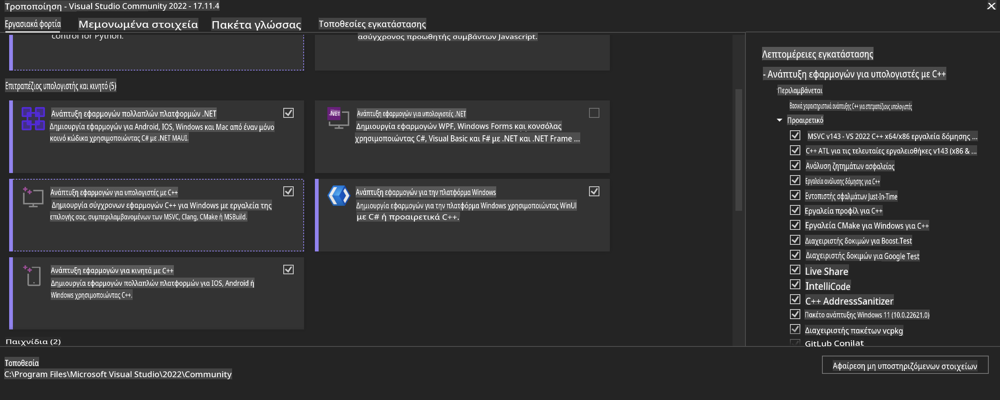
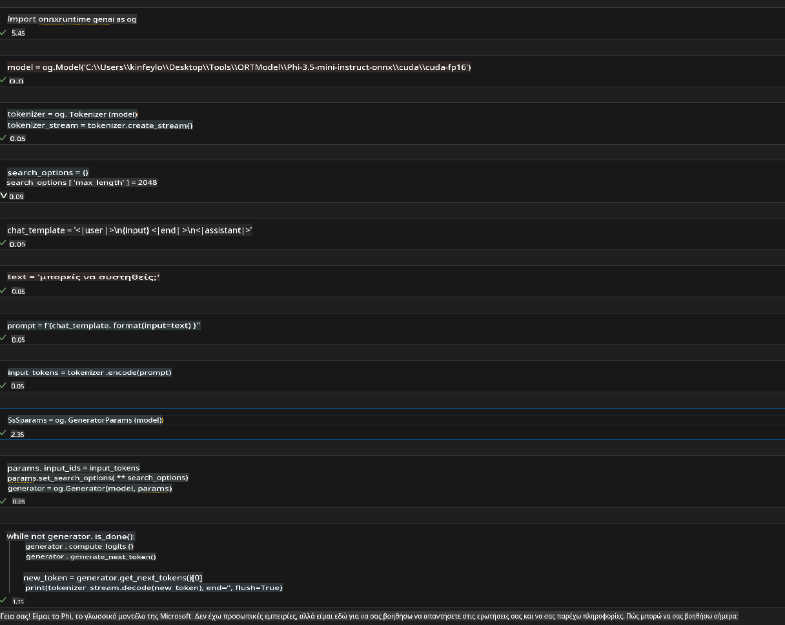

# **Οδηγίες για OnnxRuntime GenAI Windows GPU**

Αυτός ο οδηγός παρέχει βήματα για τη ρύθμιση και χρήση του ONNX Runtime (ORT) με GPUs σε Windows. Έχει σχεδιαστεί για να σας βοηθήσει να αξιοποιήσετε την επιτάχυνση GPU για τα μοντέλα σας, βελτιώνοντας την απόδοση και την αποδοτικότητα.

Το έγγραφο περιλαμβάνει καθοδήγηση για:

- Ρύθμιση Περιβάλλοντος: Οδηγίες για την εγκατάσταση των απαραίτητων εξαρτήσεων, όπως CUDA, cuDNN και ONNX Runtime.
- Διαμόρφωση: Πώς να διαμορφώσετε το περιβάλλον και το ONNX Runtime για να αξιοποιήσετε αποτελεσματικά τους πόρους της GPU.
- Συμβουλές Βελτιστοποίησης: Συμβουλές για τη ρύθμιση των παραμέτρων της GPU για βέλτιστη απόδοση.

### **1. Python 3.10.x /3.11.8**

   ***Σημείωση*** Συνιστάται η χρήση [miniforge](https://github.com/conda-forge/miniforge/releases/latest/download/Miniforge3-Windows-x86_64.exe) ως περιβάλλον Python.

   ```bash

   conda create -n pydev python==3.11.8

   conda activate pydev

   ```

   ***Υπενθύμιση*** Αν έχετε εγκαταστήσει οποιαδήποτε βιβλιοθήκη Python ONNX, παρακαλείστε να την απεγκαταστήσετε.

### **2. Εγκατάσταση του CMake με winget**

   ```bash

   winget install -e --id Kitware.CMake

   ```

### **3. Εγκατάσταση του Visual Studio 2022 - Desktop Development with C++**

   ***Σημείωση*** Αν δεν θέλετε να κάνετε compile, μπορείτε να παραλείψετε αυτό το βήμα.



### **4. Εγκατάσταση του NVIDIA Driver**

1. **NVIDIA GPU Driver** [https://www.nvidia.com/en-us/drivers/](https://www.nvidia.com/en-us/drivers/)

2. **NVIDIA CUDA 12.4** [https://developer.nvidia.com/cuda-12-4-0-download-archive](https://developer.nvidia.com/cuda-12-4-0-download-archive)

3. **NVIDIA CUDNN 9.4** [https://developer.nvidia.com/cudnn-downloads](https://developer.nvidia.com/cudnn-downloads)

***Υπενθύμιση*** Παρακαλείστε να χρησιμοποιήσετε τις προεπιλεγμένες ρυθμίσεις κατά τη ροή εγκατάστασης.

### **5. Ρύθμιση NVIDIA Περιβάλλοντος**

Αντιγράψτε τα αρχεία lib, bin, include του NVIDIA CUDNN 9.4 στους αντίστοιχους φακέλους του NVIDIA CUDA 12.4.

- Αντιγράψτε τα αρχεία από *'C:\Program Files\NVIDIA\CUDNN\v9.4\bin\12.6'* στον φάκελο *'C:\Program Files\NVIDIA GPU Computing Toolkit\CUDA\v12.4\bin'*.

- Αντιγράψτε τα αρχεία από *'C:\Program Files\NVIDIA\CUDNN\v9.4\include\12.6'* στον φάκελο *'C:\Program Files\NVIDIA GPU Computing Toolkit\CUDA\v12.4\include'*.

- Αντιγράψτε τα αρχεία από *'C:\Program Files\NVIDIA\CUDNN\v9.4\lib\12.6'* στον φάκελο *'C:\Program Files\NVIDIA GPU Computing Toolkit\CUDA\v12.4\lib\x64'*.

### **6. Λήψη του Phi-3.5-mini-instruct-onnx**

   ```bash

   winget install -e --id Git.Git

   winget install -e --id GitHub.GitLFS

   git lfs install

   git clone https://huggingface.co/microsoft/Phi-3.5-mini-instruct-onnx

   ```

### **7. Εκτέλεση του InferencePhi35Instruct.ipynb**

   Ανοίξτε το [Notebook](../../../../../../code/09.UpdateSamples/Aug/ortgpu-phi35-instruct.ipynb) και εκτελέστε το.



### **8. Compile του ORT GenAI GPU**

   ***Σημείωση***

   1. Παρακαλείστε να απεγκαταστήσετε πρώτα όλες τις βιβλιοθήκες που σχετίζονται με onnx, onnxruntime και onnxruntime-genai.

   ```bash

   pip list 
   
   ```

   Στη συνέχεια, απεγκαταστήστε όλες τις βιβλιοθήκες onnxruntime, π.χ.

   ```bash

   pip uninstall onnxruntime

   pip uninstall onnxruntime-genai

   pip uninstall onnxruntume-genai-cuda
   
   ```

   2. Ελέγξτε την υποστήριξη του Visual Studio Extension.

   Ελέγξτε τον φάκελο C:\Program Files\NVIDIA GPU Computing Toolkit\CUDA\v12.4\extras για να διασφαλίσετε ότι υπάρχει ο φάκελος C:\Program Files\NVIDIA GPU Computing Toolkit\CUDA\v12.4\extras\visual_studio_integration. 

   Αν δεν υπάρχει, ελέγξτε άλλους φακέλους του Cuda toolkit driver και αντιγράψτε τον φάκελο visual_studio_integration και τα περιεχόμενά του στο C:\Program Files\NVIDIA GPU Computing Toolkit\CUDA\v12.4\extras\visual_studio_integration.

   - Αν δεν θέλετε να κάνετε compile, μπορείτε να παραλείψετε αυτό το βήμα.

   ```bash

   git clone https://github.com/microsoft/onnxruntime-genai

   ```

   - Κατεβάστε [https://github.com/microsoft/onnxruntime/releases/download/v1.19.2/onnxruntime-win-x64-gpu-1.19.2.zip](https://github.com/microsoft/onnxruntime/releases/download/v1.19.2/onnxruntime-win-x64-gpu-1.19.2.zip).

   - Αποσυμπιέστε το onnxruntime-win-x64-gpu-1.19.2.zip, μετονομάστε το σε **ort** και αντιγράψτε τον φάκελο ort στο onnxruntime-genai.

   - Χρησιμοποιώντας το Windows Terminal, μεταβείτε στο Developer Command Prompt for VS 2022 και μεταβείτε στο onnxruntime-genai.


   - Κάντε compile με το περιβάλλον Python σας.

   ```bash

   cd onnxruntime-genai

   python build.py --use_cuda  --cuda_home "C:\Program Files\NVIDIA GPU Computing Toolkit\CUDA\v12.4" --config Release
 

   cd build/Windows/Release/Wheel

   pip install .whl

   ```

**Αποποίηση ευθύνης**:  
Αυτό το έγγραφο έχει μεταφραστεί χρησιμοποιώντας υπηρεσίες μετάφρασης που βασίζονται σε τεχνητή νοημοσύνη. Ενώ καταβάλλουμε προσπάθειες για ακρίβεια, παρακαλούμε να γνωρίζετε ότι οι αυτοματοποιημένες μεταφράσεις ενδέχεται να περιέχουν λάθη ή ανακρίβειες. Το πρωτότυπο έγγραφο στη μητρική του γλώσσα θα πρέπει να θεωρείται η αυθεντική πηγή. Για κρίσιμες πληροφορίες, συνιστάται επαγγελματική ανθρώπινη μετάφραση. Δεν φέρουμε καμία ευθύνη για τυχόν παρεξηγήσεις ή παρερμηνείες που προκύπτουν από τη χρήση αυτής της μετάφρασης.