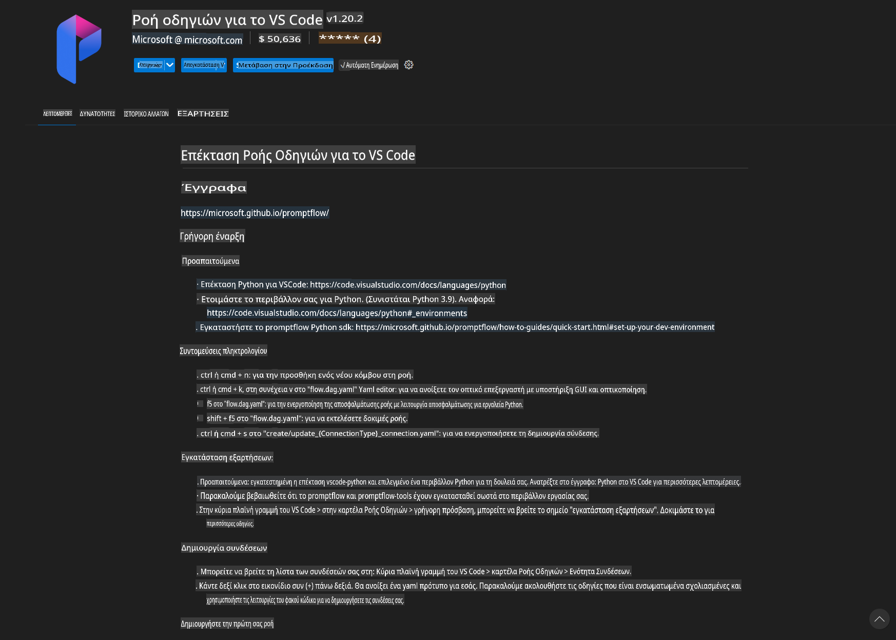
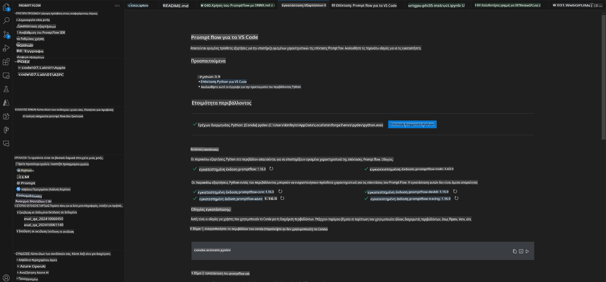
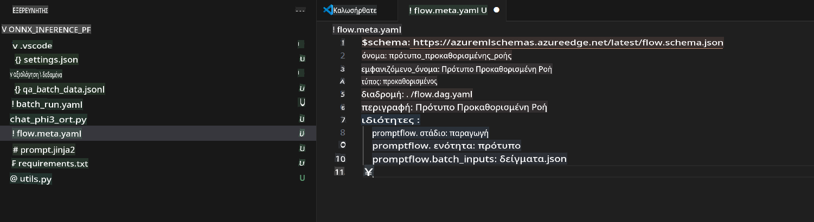
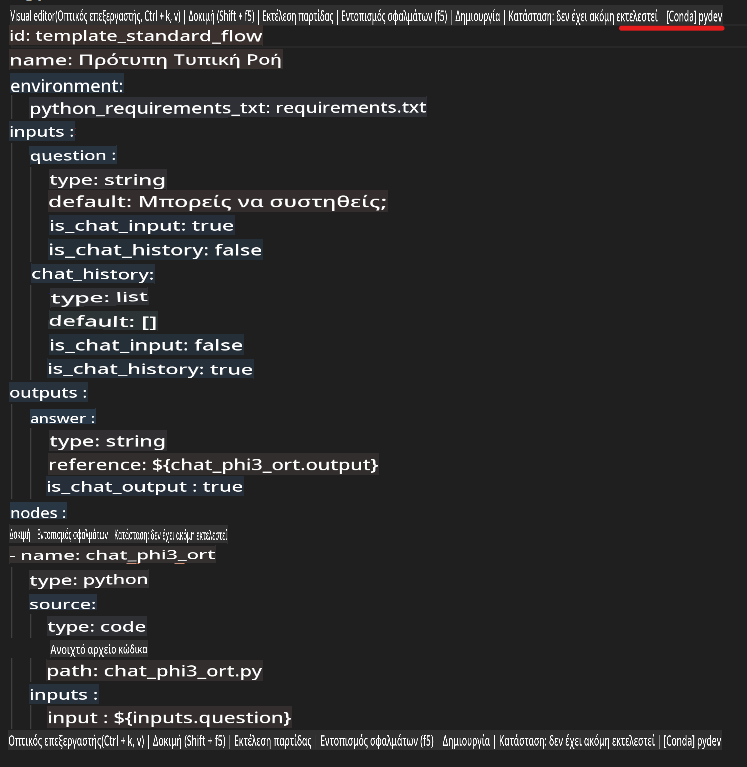
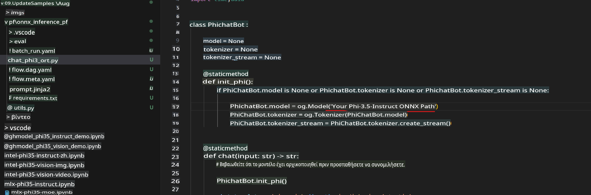
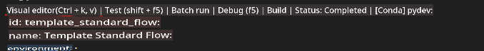
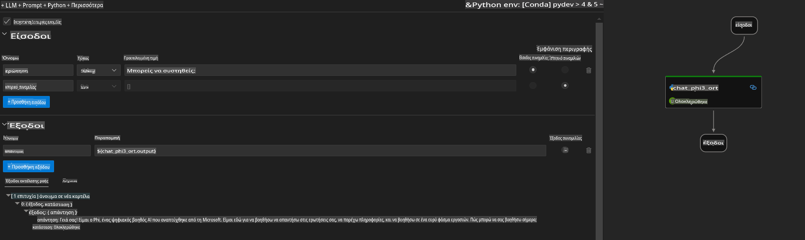
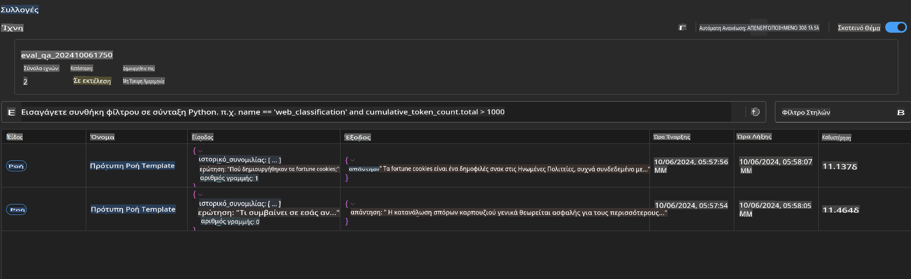

# Χρήση Windows GPU για τη δημιουργία λύσης Prompt flow με το Phi-3.5-Instruct ONNX

Το παρακάτω έγγραφο αποτελεί παράδειγμα για το πώς να χρησιμοποιήσετε το PromptFlow με το ONNX (Open Neural Network Exchange) για την ανάπτυξη εφαρμογών τεχνητής νοημοσύνης βασισμένων σε μοντέλα Phi-3.

Το PromptFlow είναι μια σειρά εργαλείων ανάπτυξης που έχουν σχεδιαστεί για να απλοποιούν τον κύκλο ανάπτυξης εφαρμογών AI που βασίζονται σε LLM (Μεγάλα Γλωσσικά Μοντέλα), από την ιδέα και τη δημιουργία πρωτοτύπων μέχρι τη δοκιμή και την αξιολόγηση.

Με την ενσωμάτωση του PromptFlow με το ONNX, οι προγραμματιστές μπορούν:

- **Βελτιστοποίηση Απόδοσης Μοντέλου**: Αξιοποιήστε το ONNX για αποδοτική ερμηνεία και ανάπτυξη μοντέλων.
- **Απλούστευση Ανάπτυξης**: Χρησιμοποιήστε το PromptFlow για να διαχειριστείτε τη ροή εργασίας και να αυτοματοποιήσετε επαναλαμβανόμενες εργασίες.
- **Ενίσχυση Συνεργασίας**: Διευκολύνετε τη συνεργασία μεταξύ των μελών της ομάδας παρέχοντας ένα ενιαίο περιβάλλον ανάπτυξης.

Το **Prompt flow** είναι μια σειρά εργαλείων ανάπτυξης που έχουν σχεδιαστεί για να απλοποιούν τον κύκλο ανάπτυξης εφαρμογών AI βασισμένων σε LLM, από την ιδέα, τη δημιουργία πρωτοτύπων, τη δοκιμή, την αξιολόγηση, μέχρι την ανάπτυξη στην παραγωγή και την παρακολούθηση. Διευκολύνει την επεξεργασία προτροπών και σας επιτρέπει να δημιουργήσετε εφαρμογές LLM με ποιότητα παραγωγής.

Το Prompt flow μπορεί να συνδεθεί με το OpenAI, το Azure OpenAI Service και παραμετροποιήσιμα μοντέλα (Huggingface, τοπικά LLM/SLM). Ελπίζουμε να αναπτύξουμε το κβαντισμένο μοντέλο ONNX του Phi-3.5 σε τοπικές εφαρμογές. Το Prompt flow μπορεί να μας βοηθήσει να σχεδιάσουμε καλύτερα την επιχειρηματική μας στρατηγική και να ολοκληρώσουμε τοπικές λύσεις βασισμένες στο Phi-3.5. Σε αυτό το παράδειγμα, θα συνδυάσουμε τη βιβλιοθήκη ONNX Runtime GenAI για να ολοκληρώσουμε τη λύση Prompt flow με βάση τα Windows GPU.

## **Εγκατάσταση**

### **ONNX Runtime GenAI για Windows GPU**

Διαβάστε αυτή την οδηγία για να ρυθμίσετε το ONNX Runtime GenAI για Windows GPU [click here](./ORTWindowGPUGuideline.md)

### **Ρύθμιση του Prompt flow στο VSCode**

1. Εγκαταστήστε την επέκταση Prompt flow για το VS Code



2. Μετά την εγκατάσταση της επέκτασης Prompt flow για το VS Code, κάντε κλικ στην επέκταση και επιλέξτε **Installation dependencies**. Ακολουθήστε αυτή την οδηγία για να εγκαταστήσετε το Prompt flow SDK στο περιβάλλον σας.



3. Κατεβάστε [Sample Code](../../../../../../code/09.UpdateSamples/Aug/pf/onnx_inference_pf) και ανοίξτε αυτό το δείγμα με το VS Code.



4. Ανοίξτε το **flow.dag.yaml** για να επιλέξετε το περιβάλλον Python σας.



   Ανοίξτε το **chat_phi3_ort.py** για να αλλάξετε τη θέση του μοντέλου Phi-3.5-instruct ONNX.



5. Εκτελέστε το prompt flow σας για δοκιμή.

Ανοίξτε το **flow.dag.yaml** και κάντε κλικ στον οπτικό επεξεργαστή.



Μετά το κλικ, εκτελέστε το για δοκιμή.



1. Μπορείτε να εκτελέσετε μαζικά εντολές στο τερματικό για να ελέγξετε περισσότερα αποτελέσματα.

```bash

pf run create --file batch_run.yaml --stream --name 'Your eval qa name'    

```

Μπορείτε να ελέγξετε τα αποτελέσματα στο προεπιλεγμένο πρόγραμμα περιήγησής σας.



**Αποποίηση ευθυνών**:  
Αυτό το έγγραφο έχει μεταφραστεί χρησιμοποιώντας υπηρεσίες αυτόματης μετάφρασης με τεχνητή νοημοσύνη. Παρόλο που καταβάλλουμε προσπάθειες για ακρίβεια, παρακαλούμε να έχετε υπόψη ότι οι αυτοματοποιημένες μεταφράσεις ενδέχεται να περιέχουν λάθη ή ανακρίβειες. Το πρωτότυπο έγγραφο στη μητρική του γλώσσα θα πρέπει να θεωρείται η έγκυρη πηγή. Για κρίσιμες πληροφορίες, συνιστάται επαγγελματική ανθρώπινη μετάφραση. Δεν φέρουμε ευθύνη για τυχόν παρεξηγήσεις ή εσφαλμένες ερμηνείες που προκύπτουν από τη χρήση αυτής της μετάφρασης.