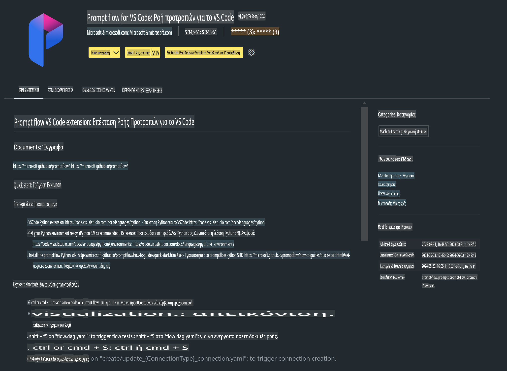

# **Εργαστήριο 0 - Εγκατάσταση**

Όταν εισέλθουμε στο Εργαστήριο, πρέπει να ρυθμίσουμε το σχετικό περιβάλλον:


### **1. Python 3.11+**

Συνιστάται να χρησιμοποιήσετε το miniforge για να ρυθμίσετε το περιβάλλον Python σας.

Για να ρυθμίσετε το miniforge, παρακαλώ ανατρέξτε στο [https://github.com/conda-forge/miniforge](https://github.com/conda-forge/miniforge).

Μετά τη ρύθμιση του miniforge, εκτελέστε την παρακάτω εντολή στο Power Shell:

```bash

conda create -n pyenv python==3.11.8 -y

conda activate pyenv

```


### **2. Εγκατάσταση Prompt flow SDK**

Στο Εργαστήριο 1, θα χρησιμοποιήσουμε το Prompt flow, οπότε χρειάζεται να ρυθμίσετε το Prompt flow SDK.

```bash

pip install promptflow --upgrade

```

Μπορείτε να ελέγξετε το promptflow sdk με αυτή την εντολή:

```bash

pf --version

```


### **3. Εγκατάσταση Visual Studio Code Prompt flow Extension**




### **4. Βιβλιοθήκη Επιτάχυνσης Intel NPU**

Οι νέας γενιάς επεξεργαστές της Intel υποστηρίζουν NPU. Αν θέλετε να χρησιμοποιήσετε το NPU για να τρέξετε LLMs / SLMs τοπικά, μπορείτε να χρησιμοποιήσετε τη ***Βιβλιοθήκη Επιτάχυνσης Intel NPU***. Για περισσότερες πληροφορίες, μπορείτε να διαβάσετε [https://github.com/microsoft/PhiCookBook/blob/main/md/01.Introduction/03/AIPC_Inference.md](https://github.com/microsoft/PhiCookBook/blob/main/md/01.Introduction/03/AIPC_Inference.md).

Εγκαταστήστε τη Βιβλιοθήκη Επιτάχυνσης Intel NPU στο bash:

```bash

pip install intel-npu-acceleration-library

```

***Σημείωση***: Λάβετε υπόψη ότι αυτή η βιβλιοθήκη υποστηρίζει transformers ***4.40.2***, παρακαλώ επιβεβαιώστε την έκδοση.


### **5. Άλλες Βιβλιοθήκες Python**

Δημιουργήστε ένα αρχείο requirements.txt και προσθέστε το παρακάτω περιεχόμενο:

```txt

notebook
numpy 
scipy 
scikit-learn 
matplotlib 
pandas 
pillow 
graphviz

```


### **6. Εγκατάσταση NVM**

Εγκαταστήστε το nvm στο Powershell:

```bash

winget install -e --id CoreyButler.NVMforWindows

```

Εγκαταστήστε το nodejs 18.20:

```bash

nvm install 18.20.0

nvm use 18.20.0

```


### **7. Εγκατάσταση Υποστήριξης Ανάπτυξης για Visual Studio Code**

```bash

npm install --global yo generator-code

```

Συγχαρητήρια! Έχετε ρυθμίσει επιτυχώς το SDK. Στη συνέχεια, προχωρήστε στα πρακτικά βήματα.

**Αποποίηση ευθύνης**:  
Αυτό το έγγραφο έχει μεταφραστεί χρησιμοποιώντας υπηρεσίες μηχανικής μετάφρασης με τεχνητή νοημοσύνη. Παρόλο που καταβάλλουμε προσπάθειες για ακρίβεια, παρακαλούμε να έχετε υπόψη ότι οι αυτοματοποιημένες μεταφράσεις ενδέχεται να περιέχουν λάθη ή ανακρίβειες. Το πρωτότυπο έγγραφο στη μητρική του γλώσσα θα πρέπει να θεωρείται η αυθεντική πηγή. Για κρίσιμες πληροφορίες, συνιστάται επαγγελματική ανθρώπινη μετάφραση. Δεν φέρουμε ευθύνη για τυχόν παρανοήσεις ή παρερμηνείες που προκύπτουν από τη χρήση αυτής της μετάφρασης.