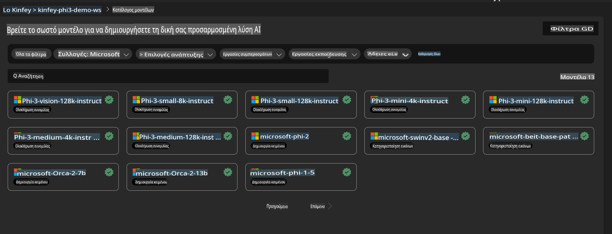
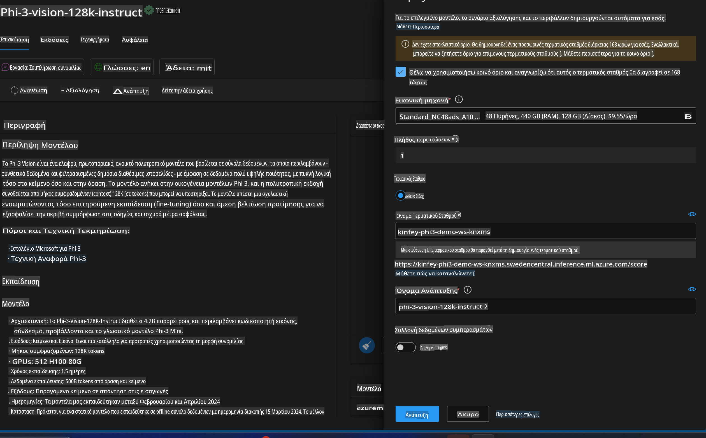
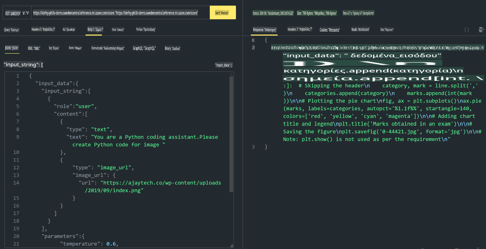

# **Εργαστήριο 3 - Ανάπτυξη του Phi-3-vision στην Υπηρεσία Azure Machine Learning**

Χρησιμοποιούμε NPU για να ολοκληρώσουμε την παραγωγική ανάπτυξη τοπικού κώδικα και στη συνέχεια θέλουμε να εισαγάγουμε τη δυνατότητα του PHI-3-VISION για να μετατρέπουμε εικόνες σε κώδικα.

Σε αυτή την εισαγωγή, μπορούμε γρήγορα να δημιουργήσουμε μια υπηρεσία Model As Service Phi-3 Vision στην Υπηρεσία Azure Machine Learning.

***Σημείωση***: Το Phi-3 Vision απαιτεί υπολογιστική ισχύ για να δημιουργεί περιεχόμενο με ταχύτερη ταχύτητα. Χρειαζόμαστε υπολογιστική ισχύ από το cloud για να το πετύχουμε αυτό.


### **1. Δημιουργία Υπηρεσίας Azure Machine Learning**

Πρέπει να δημιουργήσουμε μια Υπηρεσία Azure Machine Learning στο Azure Portal. Αν θέλετε να μάθετε πώς, επισκεφθείτε αυτόν τον σύνδεσμο [https://learn.microsoft.com/azure/machine-learning/quickstart-create-resources?view=azureml-api-2](https://learn.microsoft.com/azure/machine-learning/quickstart-create-resources?view=azureml-api-2)


### **2. Επιλογή του Phi-3 Vision στην Υπηρεσία Azure Machine Learning**




### **3. Ανάπτυξη του Phi-3-Vision στο Azure**




### **4. Δοκιμή του Endpoint στο Postman**




***Σημείωση***

1. Οι παράμετροι που πρέπει να μεταδοθούν πρέπει να περιλαμβάνουν Authorization, azureml-model-deployment, και Content-Type. Πρέπει να ελέγξετε τις πληροφορίες ανάπτυξης για να τις αποκτήσετε.

2. Για τη μετάδοση παραμέτρων, το Phi-3-Vision χρειάζεται να μεταδώσει έναν σύνδεσμο εικόνας. Παρακαλώ ανατρέξτε στη μέθοδο του GPT-4-Vision για τη μετάδοση παραμέτρων, όπως

```json

{
  "input_data":{
    "input_string":[
      {
        "role":"user",
        "content":[ 
          {
            "type": "text",
            "text": "You are a Python coding assistant.Please create Python code for image "
          },
          {
              "type": "image_url",
              "image_url": {
                "url": "https://ajaytech.co/wp-content/uploads/2019/09/index.png"
              }
          }
        ]
      }
    ],
    "parameters":{
          "temperature": 0.6,
          "top_p": 0.9,
          "do_sample": false,
          "max_new_tokens": 2048
    }
  }
}

```

3. Κλήση του **/score** χρησιμοποιώντας τη μέθοδο Post

**Συγχαρητήρια**! Ολοκληρώσατε την ταχεία ανάπτυξη του PHI-3-VISION και δοκιμάσατε πώς να χρησιμοποιείτε εικόνες για να δημιουργείτε κώδικα. Στη συνέχεια, μπορούμε να δημιουργήσουμε εφαρμογές συνδυάζοντας NPUs και cloud.

**Αποποίηση Ευθύνης**:  
Αυτό το έγγραφο έχει μεταφραστεί χρησιμοποιώντας υπηρεσίες αυτόματης μετάφρασης με τεχνητή νοημοσύνη. Ενώ καταβάλλουμε προσπάθειες για ακρίβεια, παρακαλούμε να γνωρίζετε ότι οι αυτόματες μεταφράσεις ενδέχεται να περιέχουν λάθη ή ανακρίβειες. Το πρωτότυπο έγγραφο στη μητρική του γλώσσα θα πρέπει να θεωρείται η αυθεντική πηγή. Για κρίσιμες πληροφορίες, συνιστάται επαγγελματική ανθρώπινη μετάφραση. Δεν φέρουμε ευθύνη για τυχόν παρεξηγήσεις ή εσφαλμένες ερμηνείες που προκύπτουν από τη χρήση αυτής της μετάφρασης.