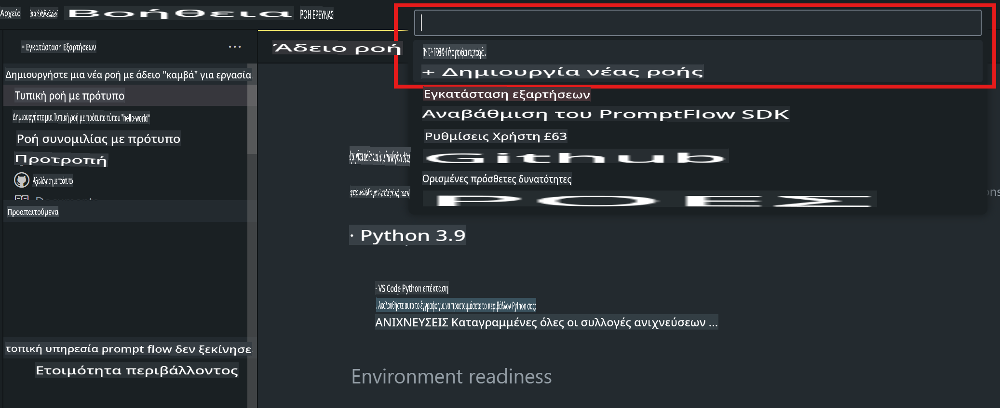
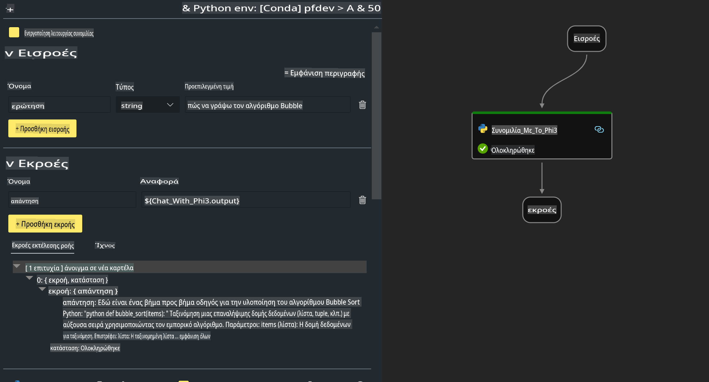

# **Εργαστήριο 2 - Εκτέλεση Prompt flow με Phi-3-mini σε AIPC**

## **Τι είναι το Prompt flow**

Το Prompt flow είναι ένα σύνολο εργαλείων ανάπτυξης που έχουν σχεδιαστεί για να απλοποιούν τον κύκλο ανάπτυξης εφαρμογών AI βασισμένων σε LLM, από την ιδέα, τον πρωτοτυπικό σχεδιασμό, τη δοκιμή, την αξιολόγηση έως την παραγωγική ανάπτυξη και την παρακολούθηση. Κάνει την επεξεργασία προτροπών πολύ πιο εύκολη και σας επιτρέπει να δημιουργήσετε εφαρμογές LLM με ποιότητα παραγωγής.

Με το Prompt flow, μπορείτε:

- Να δημιουργήσετε ροές που συνδέουν LLMs, προτροπές, κώδικα Python και άλλα εργαλεία σε μια εκτελέσιμη ροή εργασίας.

- Να αποσφαλματώσετε και να βελτιώσετε τις ροές σας, ειδικά την αλληλεπίδραση με τα LLMs, εύκολα.

- Να αξιολογήσετε τις ροές σας και να υπολογίσετε μετρικές ποιότητας και απόδοσης με μεγαλύτερα σύνολα δεδομένων.

- Να ενσωματώσετε τη δοκιμή και την αξιολόγηση στο σύστημα CI/CD σας για να διασφαλίσετε την ποιότητα της ροής σας.

- Να αναπτύξετε τις ροές σας στην πλατφόρμα εξυπηρέτησης που προτιμάτε ή να τις ενσωματώσετε εύκολα στη βάση κώδικα της εφαρμογής σας.

- (Προαιρετικό αλλά συνιστάται θερμά) Να συνεργαστείτε με την ομάδα σας χρησιμοποιώντας την έκδοση cloud του Prompt flow στο Azure AI.


## **Δημιουργία ροών παραγωγής κώδικα σε Apple Silicon**

***Σημείωση***: Εάν δεν έχετε ολοκληρώσει την εγκατάσταση του περιβάλλοντος, επισκεφθείτε [Lab 0 - Εγκαταστάσεις](./01.Installations.md)

1. Ανοίξτε την επέκταση Prompt flow στο Visual Studio Code και δημιουργήστε ένα κενό έργο ροής.



2. Προσθέστε παραμέτρους Εισόδου και Εξόδου και προσθέστε Κώδικα Python ως νέα ροή.



Μπορείτε να ανατρέξετε σε αυτή τη δομή (flow.dag.yaml) για να κατασκευάσετε τη ροή σας.

```yaml

inputs:
  prompt:
    type: string
    default: Write python code for Fibonacci serie. Please use markdown as output
outputs:
  result:
    type: string
    reference: ${gen_code_by_phi3.output}
nodes:
- name: gen_code_by_phi3
  type: python
  source:
    type: code
    path: gen_code_by_phi3.py
  inputs:
    prompt: ${inputs.prompt}


```

3. Ποσοτικοποίηση του phi-3-mini

Θέλουμε να εκτελούμε καλύτερα το SLM σε τοπικές συσκευές. Γενικά, ποσοτικοποιούμε το μοντέλο (INT4, FP16, FP32).

```bash

python -m mlx_lm.convert --hf-path microsoft/Phi-3-mini-4k-instruct

```

**Σημείωση:** Ο προεπιλεγμένος φάκελος είναι mlx_model.

4. Προσθέστε κώδικα στο ***Chat_With_Phi3.py***.

```python


from promptflow import tool

from mlx_lm import load, generate


# The inputs section will change based on the arguments of the tool function, after you save the code
# Adding type to arguments and return value will help the system show the types properly
# Please update the function name/signature per need
@tool
def my_python_tool(prompt: str) -> str:

    model_id = './mlx_model_phi3_mini'

    model, tokenizer = load(model_id)

    # <|user|>\nWrite python code for Fibonacci serie. Please use markdown as output<|end|>\n<|assistant|>

    response = generate(model, tokenizer, prompt="<|user|>\n" + prompt  + "<|end|>\n<|assistant|>", max_tokens=2048, verbose=True)

    return response


```

4. Μπορείτε να δοκιμάσετε τη ροή από Debug ή Run για να ελέγξετε αν η παραγωγή κώδικα είναι εντάξει.


5. Εκτελέστε τη ροή ως API ανάπτυξης στο τερματικό.

```

pf flow serve --source ./ --port 8080 --host localhost   

```

Μπορείτε να το δοκιμάσετε στο Postman / Thunder Client.


### **Σημειώσεις**

1. Η πρώτη εκτέλεση διαρκεί αρκετό χρόνο. Συνιστάται να κατεβάσετε το μοντέλο phi-3 από το Hugging face CLI.

2. Λαμβάνοντας υπόψη την περιορισμένη υπολογιστική ισχύ της Intel NPU, συνιστάται να χρησιμοποιήσετε το Phi-3-mini-4k-instruct.

3. Χρησιμοποιούμε την επιτάχυνση Intel NPU για την ποσοτικοποίηση της μετατροπής INT4, αλλά αν επανεκτελέσετε την υπηρεσία, θα χρειαστεί να διαγράψετε τους φακέλους cache και nc_workshop.


## **Πόροι**

1. Μάθετε το Promptflow [https://microsoft.github.io/promptflow/](https://microsoft.github.io/promptflow/)

2. Μάθετε την επιτάχυνση Intel NPU [https://github.com/intel/intel-npu-acceleration-library](https://github.com/intel/intel-npu-acceleration-library)

3. Δείγμα Κώδικα, κατεβάστε [Local NPU Agent Sample Code](../../../../../../../../../code/07.Lab/01/AIPC/local-npu-agent)

**Αποποίηση ευθύνης**:  
Αυτό το έγγραφο έχει μεταφραστεί χρησιμοποιώντας υπηρεσίες μετάφρασης βασισμένες σε τεχνητή νοημοσύνη. Παρόλο που καταβάλλουμε προσπάθειες για ακρίβεια, παρακαλούμε να έχετε υπόψη ότι οι αυτοματοποιημένες μεταφράσεις ενδέχεται να περιέχουν λάθη ή ανακρίβειες. Το αρχικό έγγραφο στη μητρική του γλώσσα θα πρέπει να θεωρείται η αυθεντική πηγή. Για κρίσιμες πληροφορίες, συνιστάται επαγγελματική ανθρώπινη μετάφραση. Δεν φέρουμε ευθύνη για τυχόν παρεξηγήσεις ή παρερμηνείες που προκύπτουν από τη χρήση αυτής της μετάφρασης.