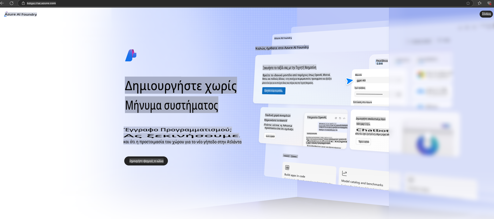

# **Χρήση του Phi-3 στο Azure AI Foundry**

Με την ανάπτυξη της Γεννητικής Τεχνητής Νοημοσύνης, ελπίζουμε να χρησιμοποιήσουμε μια ενοποιημένη πλατφόρμα για τη διαχείριση διαφορετικών LLM και SLM, την ενσωμάτωση δεδομένων επιχειρήσεων, τις λειτουργίες fine-tuning/RAG, καθώς και την αξιολόγηση διαφορετικών επιχειρηματικών εφαρμογών μετά την ενσωμάτωση των LLM και SLM, ώστε οι έξυπνες εφαρμογές Γεννητικής Τεχνητής Νοημοσύνης να υλοποιούνται πιο αποτελεσματικά. Το [Azure AI Foundry](https://ai.azure.com) είναι μια πλατφόρμα γεννητικής τεχνητής νοημοσύνης επιπέδου επιχείρησης.

Με το Azure AI Foundry, μπορείτε να αξιολογήσετε τις αποκρίσεις μεγάλων γλωσσικών μοντέλων (LLM) και να οργανώσετε τα στοιχεία εφαρμογής των prompts μέσω του prompt flow για καλύτερη απόδοση. Η πλατφόρμα διευκολύνει την κλιμάκωση, μετατρέποντας τα proof of concepts σε πλήρεις παραγωγικές εφαρμογές με ευκολία. Η συνεχής παρακολούθηση και βελτίωση υποστηρίζει τη μακροπρόθεσμη επιτυχία.

Μπορούμε να αναπτύξουμε γρήγορα το μοντέλο Phi-3 στο Azure AI Foundry μέσω απλών βημάτων και στη συνέχεια να χρησιμοποιήσουμε το Azure AI Foundry για να ολοκληρώσουμε σχετικές εργασίες με το Phi-3, όπως Playground/Chat, Fine-tuning, αξιολόγηση κ.λπ.

## **1. Προετοιμασία**

Εάν έχετε ήδη εγκαταστήσει το [Azure Developer CLI](https://learn.microsoft.com/azure/developer/azure-developer-cli/overview?WT.mc_id=aiml-138114-kinfeylo) στον υπολογιστή σας, η χρήση αυτού του προτύπου είναι τόσο απλή όσο η εκτέλεση αυτής της εντολής σε έναν νέο φάκελο.

## Δημιουργία Χειροκίνητα

Η δημιουργία ενός έργου και ενός hub στο Microsoft Azure AI Foundry είναι ένας εξαιρετικός τρόπος για να οργανώσετε και να διαχειριστείτε τη δουλειά σας στην τεχνητή νοημοσύνη. Ακολουθεί ένας οδηγός βήμα προς βήμα για να ξεκινήσετε:

### Δημιουργία Έργου στο Azure AI Foundry

1. **Μεταβείτε στο Azure AI Foundry**: Συνδεθείτε στο portal του Azure AI Foundry.
2. **Δημιουργήστε Ένα Έργο**:
   - Εάν βρίσκεστε ήδη σε ένα έργο, επιλέξτε "Azure AI Foundry" στην επάνω αριστερή γωνία της σελίδας για να μεταβείτε στην Αρχική σελίδα.
   - Επιλέξτε "+ Δημιουργία έργου".
   - Εισάγετε ένα όνομα για το έργο.
   - Εάν έχετε ήδη ένα hub, αυτό θα επιλεγεί από προεπιλογή. Εάν έχετε πρόσβαση σε περισσότερα από ένα hubs, μπορείτε να επιλέξετε διαφορετικό από το αναπτυσσόμενο μενού. Εάν θέλετε να δημιουργήσετε ένα νέο hub, επιλέξτε "Δημιουργία νέου hub" και εισάγετε ένα όνομα.
   - Επιλέξτε "Δημιουργία".

### Δημιουργία Hub στο Azure AI Foundry

1. **Μεταβείτε στο Azure AI Foundry**: Συνδεθείτε με τον λογαριασμό σας στο Azure.
2. **Δημιουργήστε Ένα Hub**:
   - Επιλέξτε το Κέντρο Διαχείρισης από το αριστερό μενού.
   - Επιλέξτε "Όλοι οι πόροι" και στη συνέχεια το βελάκι δίπλα στο "+ Νέο έργο" και επιλέξτε "+ Νέο hub".
   - Στο παράθυρο "Δημιουργία νέου hub", εισάγετε ένα όνομα για το hub σας (π.χ., contoso-hub) και τροποποιήστε τα υπόλοιπα πεδία όπως επιθυμείτε.
   - Επιλέξτε "Επόμενο", ελέγξτε τις πληροφορίες και στη συνέχεια επιλέξτε "Δημιουργία".

Για πιο λεπτομερείς οδηγίες, μπορείτε να ανατρέξετε στην επίσημη [τεκμηρίωση της Microsoft](https://learn.microsoft.com/azure/ai-studio/how-to/create-projects).

Μετά την επιτυχή δημιουργία, μπορείτε να έχετε πρόσβαση στο studio που δημιουργήσατε μέσω του [ai.azure.com](https://ai.azure.com/)

Σε ένα AI Foundry μπορούν να υπάρχουν πολλαπλά έργα. Δημιουργήστε ένα έργο στο AI Foundry για να προετοιμαστείτε.

Δημιουργία στο Azure AI Foundry [QuickStarts](https://learn.microsoft.com/azure/ai-studio/quickstarts/get-started-code)

## **2. Ανάπτυξη του μοντέλου Phi στο Azure AI Foundry**

Κάντε κλικ στην επιλογή Explore του έργου για να μπείτε στον Κατάλογο Μοντέλων και να επιλέξετε το Phi-3.

Επιλέξτε Phi-3-mini-4k-instruct.

Κάντε κλικ στο 'Deploy' για να αναπτύξετε το μοντέλο Phi-3-mini-4k-instruct.

> [!NOTE]
>
> Μπορείτε να επιλέξετε την υπολογιστική ισχύ κατά την ανάπτυξη.

## **3. Playground Chat Phi στο Azure AI Foundry**

Μεταβείτε στη σελίδα ανάπτυξης, επιλέξτε Playground και συνομιλήστε με το Phi-3 του Azure AI Foundry.

## **4. Ανάπτυξη του Μοντέλου από το Azure AI Foundry**

Για να αναπτύξετε ένα μοντέλο από τον Κατάλογο Μοντέλων του Azure, μπορείτε να ακολουθήσετε τα παρακάτω βήματα:

- Συνδεθείτε στο Azure AI Foundry.
- Επιλέξτε το μοντέλο που θέλετε να αναπτύξετε από τον κατάλογο μοντέλων του Azure AI Foundry.
- Στη σελίδα Λεπτομερειών του μοντέλου, επιλέξτε Deploy και στη συνέχεια Serverless API με το Azure AI Content Safety.
- Επιλέξτε το έργο στο οποίο θέλετε να αναπτύξετε τα μοντέλα σας. Για να χρησιμοποιήσετε την προσφορά Serverless API, το workspace σας πρέπει να ανήκει στην περιοχή East US 2 ή Sweden Central. Μπορείτε να προσαρμόσετε το όνομα της Ανάπτυξης.
- Στον οδηγό ανάπτυξης, επιλέξτε τις Τιμές και τους Όρους για να μάθετε περισσότερα σχετικά με την τιμολόγηση και τους όρους χρήσης.
- Επιλέξτε Deploy. Περιμένετε μέχρι η ανάπτυξη να είναι έτοιμη και να ανακατευθυνθείτε στη σελίδα Αναπτύξεων.
- Επιλέξτε Open in playground για να αρχίσετε να αλληλεπιδράτε με το μοντέλο.
- Μπορείτε να επιστρέψετε στη σελίδα Αναπτύξεων, να επιλέξετε την ανάπτυξη και να σημειώσετε το Target URL του endpoint και το Secret Key, που μπορείτε να χρησιμοποιήσετε για να καλέσετε την ανάπτυξη και να δημιουργήσετε απαντήσεις.
- Μπορείτε πάντα να βρείτε τις λεπτομέρειες του endpoint, τη διεύθυνση URL και τα access keys μεταβαίνοντας στην καρτέλα Build και επιλέγοντας Deployments από την ενότητα Components.

> [!NOTE]
> Παρακαλώ σημειώστε ότι ο λογαριασμός σας πρέπει να έχει δικαιώματα Azure AI Developer role στο Resource Group για να εκτελέσετε αυτά τα βήματα.

## **5. Χρήση του Phi API στο Azure AI Foundry**

Μπορείτε να έχετε πρόσβαση στο https://{Το όνομα του έργου σας}.region.inference.ml.azure.com/swagger.json μέσω του Postman GET και να το συνδυάσετε με το Key για να μάθετε για τα διαθέσιμα interfaces.

Μπορείτε να αποκτήσετε πολύ εύκολα τις παραμέτρους αιτήματος, καθώς και τις παραμέτρους απόκρισης.

**Αποποίηση ευθυνών**:  
Αυτό το έγγραφο έχει μεταφραστεί χρησιμοποιώντας υπηρεσίες αυτόματης μετάφρασης με τεχνητή νοημοσύνη. Παρόλο που καταβάλλουμε προσπάθειες για ακρίβεια, παρακαλούμε να έχετε υπόψη ότι οι αυτόματες μεταφράσεις ενδέχεται να περιέχουν λάθη ή ανακρίβειες. Το αρχικό έγγραφο στη μητρική του γλώσσα θα πρέπει να θεωρείται η έγκυρη πηγή. Για κρίσιμες πληροφορίες, συνιστάται επαγγελματική ανθρώπινη μετάφραση. Δεν φέρουμε ευθύνη για τυχόν παρανοήσεις ή παρερμηνείες που προκύπτουν από τη χρήση αυτής της μετάφρασης.