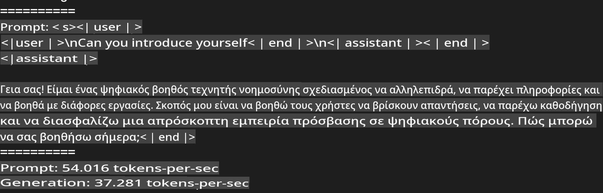
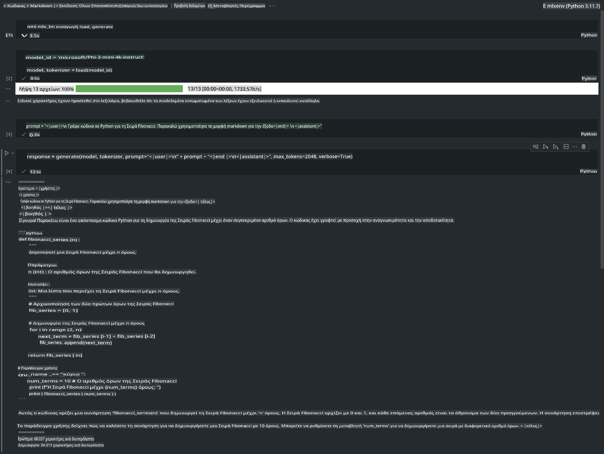

# **Inference Phi-3 με το Apple MLX Framework**

## **Τι είναι το MLX Framework**

Το MLX είναι ένα framework για έρευνα στη μηχανική μάθηση που έχει αναπτυχθεί από την Apple και είναι σχεδιασμένο για συσκευές με Apple silicon.

Το MLX έχει σχεδιαστεί από ερευνητές μηχανικής μάθησης για ερευνητές μηχανικής μάθησης. Στόχος του είναι να είναι φιλικό προς τον χρήστη, ενώ παραμένει αποδοτικό για την εκπαίδευση και την ανάπτυξη μοντέλων. Η ίδια η σχεδίαση του framework είναι επίσης απλή, ώστε να διευκολύνει τους ερευνητές να το επεκτείνουν και να το βελτιώσουν, με στόχο την ταχύτερη εξερεύνηση νέων ιδεών.

Τα LLMs μπορούν να επιταχυνθούν σε συσκευές Apple Silicon μέσω του MLX, και τα μοντέλα μπορούν να εκτελούνται τοπικά με μεγάλη ευκολία.

## **Χρήση του MLX για inference του Phi-3-mini**

### **1. Ρύθμιση περιβάλλοντος MLX**

1. Python 3.11.x  
2. Εγκατάσταση της βιβλιοθήκης MLX  

```bash

pip install mlx-lm

```

### **2. Εκτέλεση του Phi-3-mini στο Terminal με το MLX**

```bash

python -m mlx_lm.generate --model microsoft/Phi-3-mini-4k-instruct --max-token 2048 --prompt  "<|user|>\nCan you introduce yourself<|end|>\n<|assistant|>"

```

Το αποτέλεσμα (το περιβάλλον μου είναι Apple M1 Max, 64GB) είναι:


### **3. Κβαντοποίηση του Phi-3-mini με το MLX στο Terminal**

```bash

python -m mlx_lm.convert --hf-path microsoft/Phi-3-mini-4k-instruct

```

***Σημείωση:*** Το μοντέλο μπορεί να κβαντοποιηθεί μέσω της mlx_lm.convert, με την προεπιλεγμένη κβαντοποίηση να είναι INT4. Σε αυτό το παράδειγμα, το Phi-3-mini κβαντοποιείται σε INT4.

Μετά την κβαντοποίηση, το μοντέλο αποθηκεύεται στον προεπιλεγμένο φάκελο ./mlx_model.

Μπορούμε να δοκιμάσουμε το κβαντοποιημένο μοντέλο μέσω του MLX από το terminal:

```bash

python -m mlx_lm.generate --model ./mlx_model/ --max-token 2048 --prompt  "<|user|>\nCan you introduce yourself<|end|>\n<|assistant|>"

```

Το αποτέλεσμα είναι:



### **4. Εκτέλεση του Phi-3-mini με το MLX σε Jupyter Notebook**



***Σημείωση:*** Παρακαλώ διαβάστε αυτό το παράδειγμα [πατήστε εδώ](../../../../../code/03.Inference/MLX/MLX_DEMO.ipynb).

## **Πηγές**

1. Μάθετε περισσότερα για το Apple MLX Framework [https://ml-explore.github.io](https://ml-explore.github.io/mlx/build/html/index.html)  

2. Αποθετήριο Apple MLX στο GitHub [https://github.com/ml-explore](https://github.com/ml-explore)  

**Αποποίηση ευθύνης**:  
Αυτό το έγγραφο έχει μεταφραστεί χρησιμοποιώντας υπηρεσίες μετάφρασης με τεχνητή νοημοσύνη. Παρόλο που καταβάλλουμε προσπάθειες για ακρίβεια, παρακαλούμε να γνωρίζετε ότι οι αυτόματες μεταφράσεις ενδέχεται να περιέχουν λάθη ή ανακρίβειες. Το πρωτότυπο έγγραφο στη μητρική του γλώσσα θα πρέπει να θεωρείται η έγκυρη πηγή. Για κρίσιμες πληροφορίες, συνιστάται επαγγελματική μετάφραση από άνθρωπο. Δεν φέρουμε ευθύνη για τυχόν παρανοήσεις ή παρερμηνείες που προκύπτουν από τη χρήση αυτής της μετάφρασης.