# Προσαρμογή του Phi-3 με το Azure AI Foundry

Ας εξερευνήσουμε πώς να προσαρμόσουμε το γλωσσικό μοντέλο Phi-3 Mini της Microsoft χρησιμοποιώντας το Azure AI Foundry. Η προσαρμογή επιτρέπει την προσαρμογή του Phi-3 Mini σε συγκεκριμένες εργασίες, καθιστώντας το ακόμα πιο ισχυρό και ευαισθητοποιημένο στο πλαίσιο.

## Σημεία προς εξέταση

- **Δυνατότητες:** Ποια μοντέλα μπορούν να προσαρμοστούν; Σε τι μπορεί να προσαρμοστεί το βασικό μοντέλο;
- **Κόστος:** Ποιο είναι το μοντέλο τιμολόγησης για την προσαρμογή;
- **Προσαρμοστικότητα:** Πόσο μπορώ να τροποποιήσω το βασικό μοντέλο – και με ποιους τρόπους;
- **Ευκολία:** Πώς γίνεται η προσαρμογή – χρειάζεται να γράψω προσαρμοσμένο κώδικα; Πρέπει να φέρω δική μου υπολογιστική υποδομή;
- **Ασφάλεια:** Τα προσαρμοσμένα μοντέλα είναι γνωστό ότι ενέχουν κινδύνους ασφάλειας – υπάρχουν μηχανισμοί προστασίας για την αποφυγή ακούσιας βλάβης;

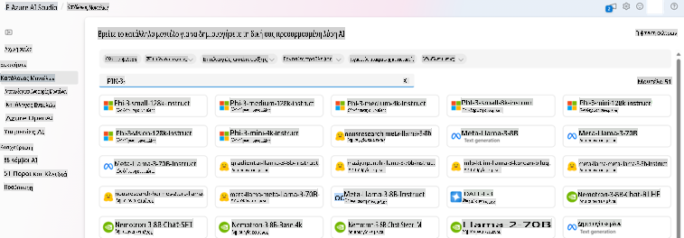

## Προετοιμασία για προσαρμογή

### Προαπαιτούμενα

> [!NOTE]
> Για τα μοντέλα της οικογένειας Phi-3, η δυνατότητα προσαρμογής μέσω του μοντέλου pay-as-you-go είναι διαθέσιμη μόνο με hubs που έχουν δημιουργηθεί στις περιοχές **East US 2**.

- Μια συνδρομή Azure. Αν δεν έχετε συνδρομή Azure, δημιουργήστε έναν [πληρωμένο λογαριασμό Azure](https://azure.microsoft.com/pricing/purchase-options/pay-as-you-go) για να ξεκινήσετε.

- Ένα [έργο AI Foundry](https://ai.azure.com?WT.mc_id=aiml-138114-kinfeylo).
- Τα Azure role-based access controls (Azure RBAC) χρησιμοποιούνται για την παροχή πρόσβασης στις λειτουργίες του Azure AI Foundry. Για να εκτελέσετε τα βήματα αυτού του άρθρου, ο λογαριασμός χρήστη σας πρέπει να έχει ανατεθεί στον ρόλο __Azure AI Developer__ στην ομάδα πόρων.

### Εγγραφή παρόχου συνδρομής

Επιβεβαιώστε ότι η συνδρομή είναι εγγεγραμμένη στον πάροχο πόρων `Microsoft.Network`.

1. Συνδεθείτε στο [Azure portal](https://portal.azure.com).
1. Επιλέξτε **Subscriptions** από το αριστερό μενού.
1. Επιλέξτε τη συνδρομή που θέλετε να χρησιμοποιήσετε.
1. Επιλέξτε **AI project settings** > **Resource providers** από το αριστερό μενού.
1. Επιβεβαιώστε ότι το **Microsoft.Network** βρίσκεται στη λίστα των παρόχων πόρων. Αν όχι, προσθέστε το.

### Προετοιμασία δεδομένων

Προετοιμάστε τα δεδομένα εκπαίδευσης και επικύρωσης για την προσαρμογή του μοντέλου σας. Τα σύνολα δεδομένων εκπαίδευσης και επικύρωσης αποτελούνται από παραδείγματα εισόδου και εξόδου που αντικατοπτρίζουν την επιθυμητή λειτουργία του μοντέλου.

Βεβαιωθείτε ότι όλα τα παραδείγματα εκπαίδευσης ακολουθούν την αναμενόμενη μορφή για συμπεράσματα. Για αποτελεσματική προσαρμογή μοντέλων, εξασφαλίστε ένα ισορροπημένο και ποικίλο σύνολο δεδομένων.

Αυτό περιλαμβάνει τη διατήρηση ισορροπίας δεδομένων, την ενσωμάτωση διαφόρων σεναρίων και την περιοδική βελτίωση των δεδομένων εκπαίδευσης ώστε να ανταποκρίνονται στις πραγματικές προσδοκίες, οδηγώντας τελικά σε πιο ακριβείς και ισορροπημένες απαντήσεις του μοντέλου.

Διαφορετικοί τύποι μοντέλων απαιτούν διαφορετική μορφή δεδομένων εκπαίδευσης.

### Ολοκλήρωση συνομιλίας

Τα δεδομένα εκπαίδευσης και επικύρωσης που χρησιμοποιείτε **πρέπει** να έχουν μορφοποιηθεί ως έγγραφο JSON Lines (JSONL). Για `Phi-3-mini-128k-instruct` το σύνολο δεδομένων προσαρμογής πρέπει να είναι στη μορφή συνομιλίας που χρησιμοποιείται από το API ολοκλήρωσης συνομιλιών.

### Παράδειγμα μορφής αρχείου

```json
    {"messages": [{"role": "system", "content": "You are an Xbox customer support agent whose primary goal is to help users with issues they are experiencing with their Xbox devices. You are friendly and concise. You only provide factual answers to queries, and do not provide answers that are not related to Xbox."}, {"role": "user", "content": "Is Xbox better than PlayStation?"}, {"role": "assistant", "content": "I apologize, but I cannot provide personal opinions. My primary job is to assist you with any issues related to your Xbox device. Do you have any Xbox-related issues that need addressing?"}]}
    {"messages": [{"role": "system", "content": "You are an Xbox customer support agent whose primary goal is to help users with issues they are experiencing with their Xbox devices. You are friendly and concise. You only provide factual answers to queries, and do not provide answers that are not related to Xbox."}, {"role": "user", "content": "Can I play PC games on my Xbox?"}, {"role": "assistant", "content": "While Xbox consoles don't natively support PC games, they can play an array of Xbox games, many of which are also available on PC. Can I assist you with finding games compatible with your Xbox device?"}]}
    {"messages": [{"role": "system", "content": "You are an Xbox customer support agent whose primary goal is to help users with issues they are experiencing with their Xbox devices. You are friendly and concise. You only provide factual answers to queries, and do not provide answers that are not related to Xbox."}, {"role": "user", "content": "I'm having trouble connecting my Xbox to the Wi-Fi."}, {"role": "assistant", "content": "No worries, let's go through the network settings on your Xbox. Can you please tell me what happens when you try to connect it to the Wi-Fi?"}]}
```

Ο υποστηριζόμενος τύπος αρχείου είναι JSON Lines. Τα αρχεία ανεβαίνουν στο προεπιλεγμένο datastore και γίνονται διαθέσιμα στο έργο σας.

## Προσαρμογή του Phi-3 με το Azure AI Foundry

Το Azure AI Foundry σας επιτρέπει να προσαρμόσετε μεγάλα γλωσσικά μοντέλα στα δικά σας δεδομένα χρησιμοποιώντας τη διαδικασία της προσαρμογής. Η προσαρμογή προσφέρει σημαντική αξία, επιτρέποντας εξατομίκευση και βελτιστοποίηση για συγκεκριμένες εργασίες και εφαρμογές. Οδηγεί σε βελτιωμένη απόδοση, οικονομική αποδοτικότητα, μειωμένη καθυστέρηση και εξατομικευμένα αποτελέσματα.

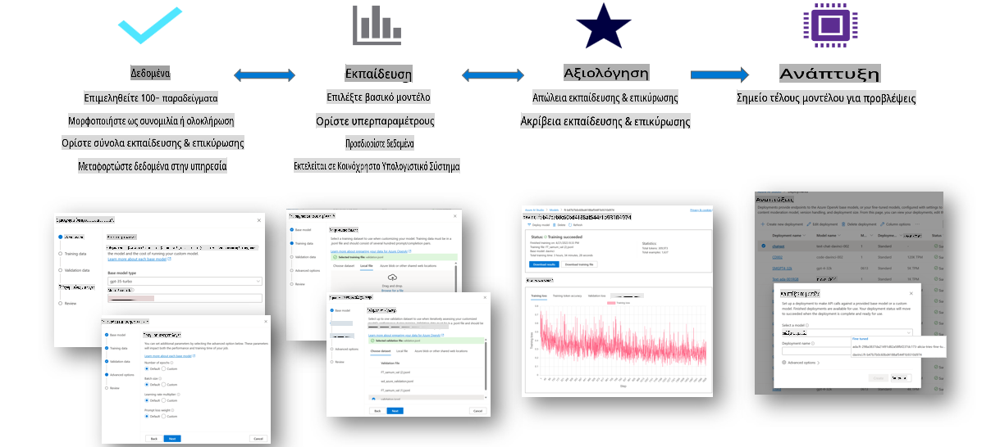

### Δημιουργία Νέου Έργου

1. Συνδεθείτε στο [Azure AI Foundry](https://ai.azure.com).

1. Επιλέξτε **+New project** για να δημιουργήσετε νέο έργο στο Azure AI Foundry.

    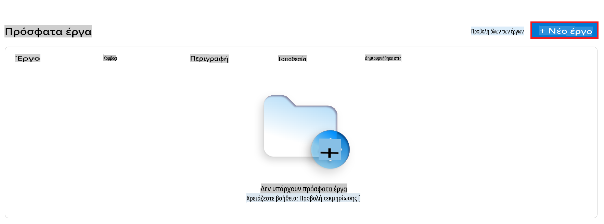

1. Εκτελέστε τις παρακάτω ενέργειες:

    - Όνομα **Hub του έργου**. Πρέπει να είναι μοναδικό.
    - Επιλέξτε το **Hub** που θα χρησιμοποιήσετε (δημιουργήστε ένα νέο αν χρειάζεται).

    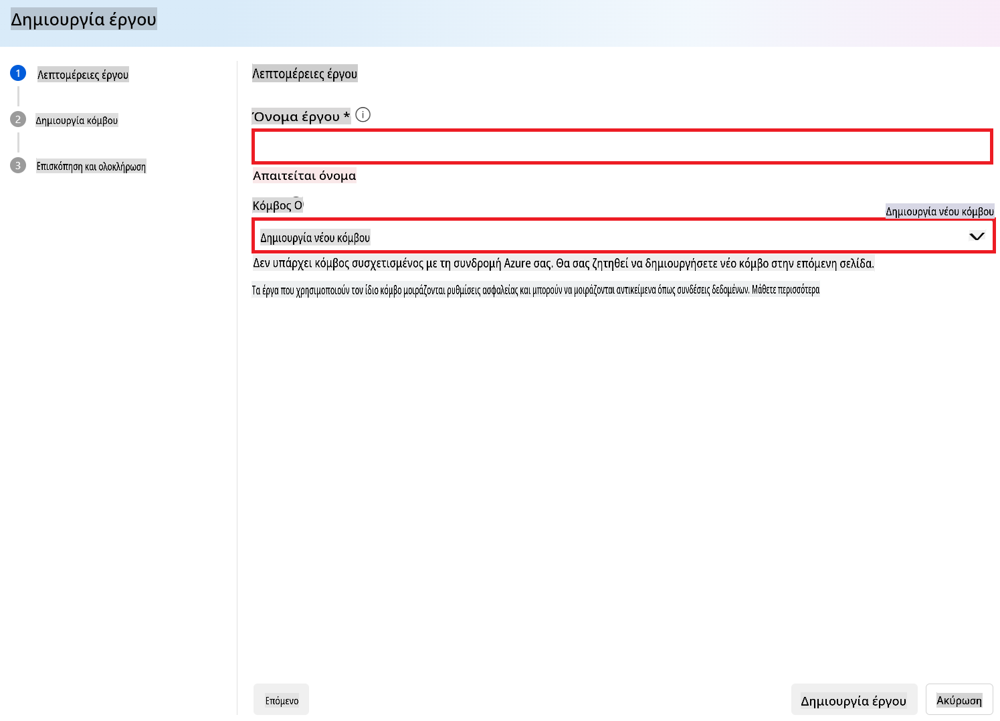

1. Εκτελέστε τις παρακάτω ενέργειες για να δημιουργήσετε νέο hub:

    - Εισαγάγετε **Όνομα Hub**. Πρέπει να είναι μοναδικό.
    - Επιλέξτε τη συνδρομή **Azure** σας.
    - Επιλέξτε την **Ομάδα πόρων** που θα χρησιμοποιήσετε (δημιουργήστε μία νέα αν χρειάζεται).
    - Επιλέξτε την **Τοποθεσία** που θέλετε να χρησιμοποιήσετε.
    - Επιλέξτε το **Connect Azure AI Services** που θα χρησιμοποιήσετε (δημιουργήστε ένα νέο αν χρειάζεται).
    - Επιλέξτε **Connect Azure AI Search** για να **Παραλείψετε τη σύνδεση**.

    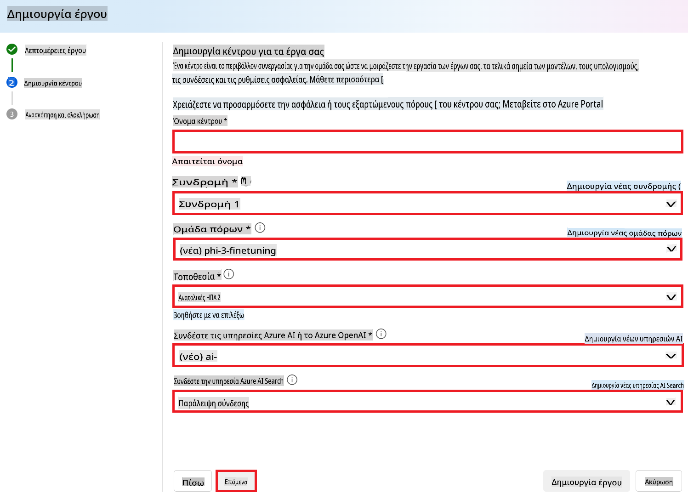

1. Επιλέξτε **Επόμενο**.
1. Επιλέξτε **Δημιουργία έργου**.

### Προετοιμασία δεδομένων

Πριν την προσαρμογή, συλλέξτε ή δημιουργήστε ένα σύνολο δεδομένων σχετικό με την εργασία σας, όπως οδηγίες συνομιλίας, ζεύγη ερωτήσεων-απαντήσεων ή οποιοδήποτε άλλο σχετικό κείμενο. Καθαρίστε και επεξεργαστείτε αυτά τα δεδομένα αφαιρώντας θόρυβο, διαχειριζόμενοι τις ελλείψεις και κάνοντας tokenization του κειμένου.

### Προσαρμογή μοντέλων Phi-3 στο Azure AI Foundry

> [!NOTE]
> Η προσαρμογή των μοντέλων Phi-3 υποστηρίζεται επί του παρόντος σε έργα που βρίσκονται στο East US 2.

1. Επιλέξτε **Κατάλογος μοντέλων** από την αριστερή καρτέλα.

1. Πληκτρολογήστε *phi-3* στη **γραμμή αναζήτησης** και επιλέξτε το μοντέλο phi-3 που θέλετε να χρησιμοποιήσετε.

    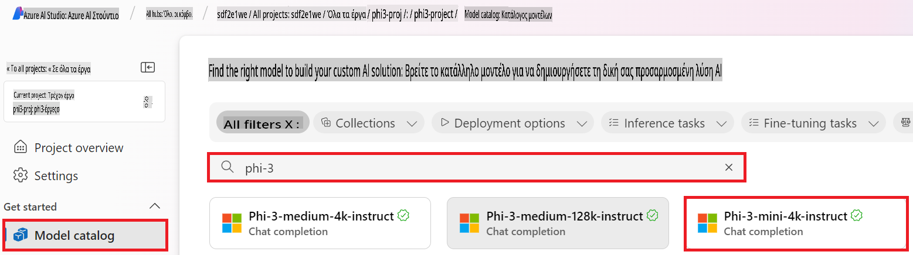

1. Επιλέξτε **Fine-tune**.

    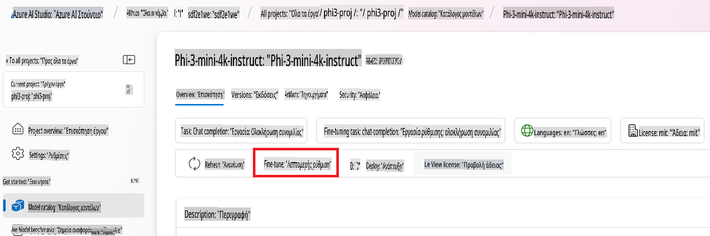

1. Εισαγάγετε το **Όνομα προσαρμοσμένου μοντέλου**.

    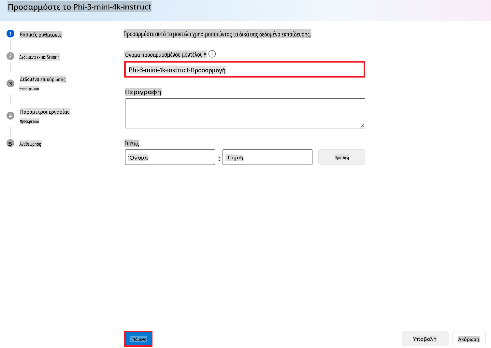

1. Επιλέξτε **Επόμενο**.

1. Εκτελέστε τις παρακάτω ενέργειες:

    - Επιλέξτε **τύπο εργασίας** σε **Ολοκλήρωση συνομιλίας**.
    - Επιλέξτε τα **Δεδομένα εκπαίδευσης** που θέλετε να χρησιμοποιήσετε. Μπορείτε να τα ανεβάσετε μέσω του Azure AI Foundry ή από το τοπικό σας περιβάλλον.

    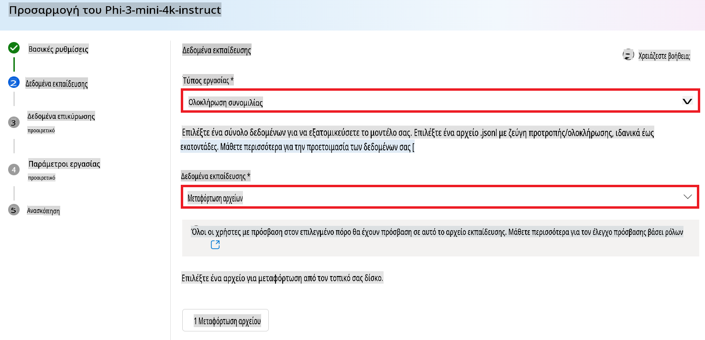

1. Επιλέξτε **Επόμενο**.

1. Ανεβάστε τα **Δεδομένα επικύρωσης** που θέλετε να χρησιμοποιήσετε ή επιλέξτε **Αυτόματη διαίρεση δεδομένων εκπαίδευσης**.

    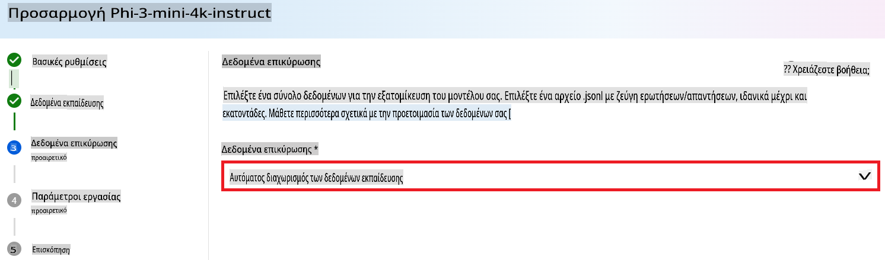

1. Επιλέξτε **Επόμενο**.

1. Εκτελέστε τις παρακάτω ενέργειες:

    - Επιλέξτε τον **Πολλαπλασιαστή μεγέθους παρτίδας** που θέλετε να χρησιμοποιήσετε.
    - Επιλέξτε τον **Ρυθμό εκμάθησης** που θέλετε να χρησιμοποιήσετε.
    - Επιλέξτε τις **Εποχές** που θέλετε να χρησιμοποιήσετε.

    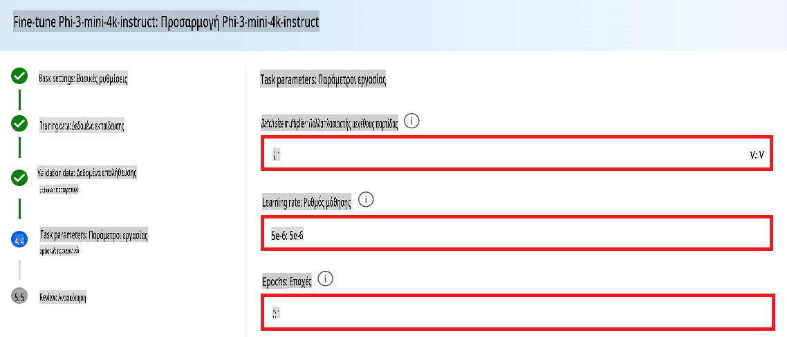

1. Επιλέξτε **Υποβολή** για να ξεκινήσετε τη διαδικασία προσαρμογής.

    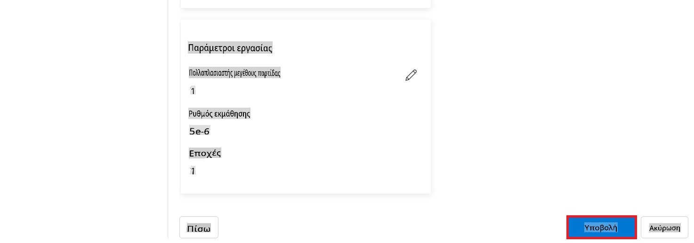

1. Μόλις ολοκληρωθεί η προσαρμογή του μοντέλου σας, η κατάσταση θα εμφανιστεί ως **Ολοκληρωμένο**, όπως φαίνεται στην παρακάτω εικόνα. Τώρα μπορείτε να αναπτύξετε το μοντέλο και να το χρησιμοποιήσετε στη δική σας εφαρμογή, στο playground ή στο prompt flow. Για περισσότερες πληροφορίες, δείτε [Πώς να αναπτύξετε την οικογένεια μοντέλων μικρής γλώσσας Phi-3 με το Azure AI Foundry](https://learn.microsoft.com/azure/ai-studio/how-to/deploy-models-phi-3?tabs=phi-3-5&pivots=programming-language-python).

    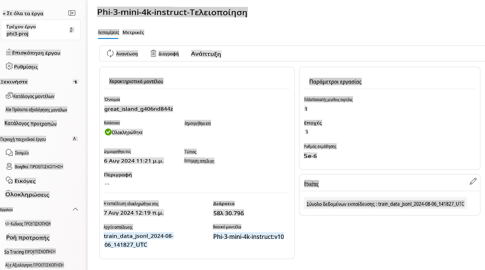

> [!NOTE]
> Για περισσότερες λεπτομέρειες σχετικά με την προσαρμογή του Phi-3, επισκεφθείτε [Fine-tune Phi-3 models in Azure AI Foundry](https://learn.microsoft.com/azure/ai-studio/how-to/fine-tune-phi-3?tabs=phi-3-mini).

## Καθαρισμός προσαρμοσμένων μοντέλων

Μπορείτε να διαγράψετε ένα προσαρμοσμένο μοντέλο από τη λίστα προσαρμοσμένων μοντέλων στο [Azure AI Foundry](https://ai.azure.com) ή από τη σελίδα λεπτομερειών του μοντέλου. Επιλέξτε το προσαρμοσμένο μοντέλο που θέλετε να διαγράψετε από τη σελίδα Fine-tuning και, στη συνέχεια, επιλέξτε το κουμπί Διαγραφή για να διαγράψετε το προσαρμοσμένο μοντέλο.

> [!NOTE]
> Δεν μπορείτε να διαγράψετε ένα προσαρμοσμένο μοντέλο αν έχει υπάρχουσα ανάπτυξη. Πρέπει πρώτα να διαγράψετε την ανάπτυξη του μοντέλου πριν μπορέσετε να διαγράψετε το προσαρμοσμένο μοντέλο.

## Κόστος και ποσοστώσεις

### Σκέψεις κόστους και ποσοστώσεων για προσαρμογή μοντέλων Phi-3 ως υπηρεσία

Τα μοντέλα Phi που προσαρμόζονται ως υπηρεσία προσφέρονται από τη Microsoft και ενσωματώνονται με το Azure AI Foundry για χρήση. Μπορείτε να βρείτε την τιμολόγηση κατά την [ανάπτυξη](https://learn.microsoft.com/azure/ai-studio/how-to/deploy-models-phi-3?tabs=phi-3-5&pivots=programming-language-python) ή την προσαρμογή των μοντέλων στην καρτέλα Τιμολόγηση και όροι στον οδηγό ανάπτυξης.

## Φιλτράρισμα περιεχομένου

Τα μοντέλα που αναπτύσσονται ως υπηρεσία με το μοντέλο pay-as-you-go προστατεύονται από το Azure AI Content Safety. Κατά την ανάπτυξη σε πραγματικούς χρόνους endpoints, μπορείτε να απενεργοποιήσετε αυτή τη δυνατότητα. Με ενεργοποιημένο το Azure AI content safety, τόσο το prompt όσο και η ολοκλήρωση περνούν από ένα σύνολο μοντέλων ταξινόμησης που στοχεύουν στον εντοπισμό και την αποτροπή της παραγωγής επιβλαβούς περιεχομένου. Το σύστημα φιλτραρίσματος περιεχομένου εντοπίζει και λαμβάνει δράση σε συγκεκριμένες κατηγορίες δυνητικά επιβλαβούς περιεχομένου τόσο στις εισαγωγικές εντολές όσο και στις απαντήσεις. Μάθετε περισσότερα για το [Azure AI Content Safety](https://learn.microsoft.com/azure/ai-studio/concepts/content-filtering).

**Ρύθμιση προσαρμογής**

Υπερπαράμετροι: Ορίστε υπερπαραμέτρους όπως ρυθμό εκμάθησης, μέγεθος παρτίδας και αριθμό εποχών εκπαίδευσης.

**Συνάρτηση απώλειας**

Επιλέξτε μια κατάλληλη συνάρτηση απώλειας για την εργασία σας (π.χ. cross-entropy).

**Βελτιστοποιητής**

Επιλέξτε έναν βελτιστοποιητή (π.χ. Adam) για ενημερώσεις βαθμίδων κατά την εκπαίδευση.

**Διαδικασία προσαρμογής**

- Φορτώστε το Προεκπαιδευμένο Μοντέλο: Φορτώστε το checkpoint του Phi-3 Mini.
- Προσθέστε Προσαρμοσμένα Επίπεδα: Προσθέστε επίπεδα ειδικά για την εργασία (π.χ. κεφάλι ταξινόμησης για οδηγίες συνομιλίας).

**Εκπαίδευση Μοντέλου**
Προσαρμόστε το μοντέλο χρησιμοποιώντας το προετοιμασμένο σύνολο δεδομένων σας. Παρακολουθήστε την πρόοδο της εκπαίδευσης και προσαρμόστε τις υπερπαραμέτρους αν χρειαστεί.

**Αξιολόγηση και Επικύρωση**

Σύνολο Επικύρωσης: Διαχωρίστε τα δεδομένα σας σε σύνολα εκπαίδευσης και επικύρωσης.

**Αξιολόγηση Απόδοσης**

Χρησιμοποιήστε μετρικές όπως ακρίβεια, F1-score ή perplexity για να αξιολογήσετε την απόδοση του μοντέλου.

## Αποθήκευση Προσαρμοσμένου Μοντέλου

**Checkpoint**
Αποθηκεύστε το checkpoint του προσαρμοσμένου μοντέλου για μελλοντική χρήση.

## Ανάπτυξη

- Ανάπτυξη ως Υπηρεσία Ιστού: Αναπτύξτε το προσαρμοσμένο μοντέλο σας ως υπηρεσία ιστού στο Azure AI Foundry.
- Δοκιμή του Endpoint: Στείλτε δοκιμαστικά ερωτήματα στο αναπτυγμένο endpoint για να επαληθεύσετε τη λειτουργικότητά του.

## Επανάληψη και Βελτίωση

Επανάληψη: Αν η απόδοση δεν είναι ικανοποιητική, επαναλάβετε προσαρμόζοντας υπερπαραμέτρους, προσθέτοντας περισσότερα δεδομένα ή προσαρμόζοντας για επιπλέον εποχές.

## Παρακολούθηση και Βελτίωση

Παρακολουθήστε συνεχώς τη συμπεριφορά του μοντέλου και βελτιώστε το αν χρειαστεί.

## Εξατομίκευση και Επέκταση

Προσαρμοσμένες Εργασίες: Το Phi-3 Mini μπορεί να προσαρμοστεί για διάφορες εργασίες πέρα από οδηγίες συνομιλίας. Εξερευνήστε άλλες περιπτώσεις χρήσης!
Πειραματισμός: Δοκιμάστε διαφορετικές αρχιτεκτονικές, συνδυασμούς επιπέδων και τεχνικές για να βελτιώσετε την απόδοση.

> [!NOTE]
> Η προσαρμογή είναι μια επαναληπτική διαδικασία. Πειραματιστείτε, μάθετε και προσαρμόστε το μοντέλο σας για να πετύχετε τα καλύτερα αποτελέσματα για τη συγκεκριμένη εργασία σας!

**Αποποίηση Ευθύνης**:  
Αυτό το έγγραφο έχει μεταφραστεί χρησιμοποιώντας υπηρεσίες αυτόματης μετάφρασης με βάση την τεχνητή νοημοσύνη. Ενώ καταβάλλουμε προσπάθειες για ακρίβεια, παρακαλούμε να έχετε υπόψη ότι οι αυτόματες μεταφράσεις ενδέχεται να περιέχουν λάθη ή ανακρίβειες. Το αρχικό έγγραφο στη μητρική του γλώσσα θα πρέπει να θεωρείται η αυθεντική πηγή. Για κρίσιμες πληροφορίες, συνιστάται επαγγελματική μετάφραση από άνθρωπο. Δεν φέρουμε ευθύνη για τυχόν παρανοήσεις ή εσφαλμένες ερμηνείες που προκύπτουν από τη χρήση αυτής της μετάφρασης.