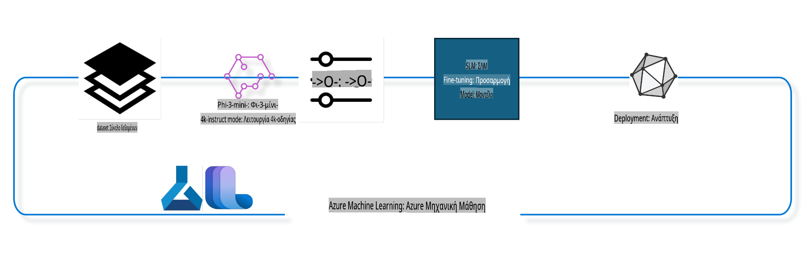

## Πώς να χρησιμοποιήσετε τα chat-completion components από το Azure ML system registry για fine-tuning ενός μοντέλου

Σε αυτό το παράδειγμα θα πραγματοποιήσουμε fine-tuning του μοντέλου Phi-3-mini-4k-instruct για να ολοκληρώσουμε μια συνομιλία μεταξύ δύο ατόμων, χρησιμοποιώντας το dataset ultrachat_200k.



Το παράδειγμα θα σας δείξει πώς να κάνετε fine-tuning χρησιμοποιώντας το Azure ML SDK και Python και στη συνέχεια να αναπτύξετε το fine-tuned μοντέλο σε ένα online endpoint για real-time inference.

### Δεδομένα εκπαίδευσης

Θα χρησιμοποιήσουμε το dataset ultrachat_200k. Πρόκειται για μια εκτενώς φιλτραρισμένη έκδοση του UltraChat dataset, που χρησιμοποιήθηκε για την εκπαίδευση του Zephyr-7B-β, ενός state-of-the-art μοντέλου συνομιλίας με 7 δισεκατομμύρια παραμέτρους.

### Μοντέλο

Θα χρησιμοποιήσουμε το μοντέλο Phi-3-mini-4k-instruct για να δείξουμε πώς μπορεί κάποιος να κάνει fine-tuning ενός μοντέλου για το task της ολοκλήρωσης συνομιλίας. Αν ανοίξατε αυτό το notebook από μια συγκεκριμένη σελίδα μοντέλου, θυμηθείτε να αντικαταστήσετε το όνομα του μοντέλου με το αντίστοιχο.

### Tasks

- Επιλογή μοντέλου για fine-tuning.
- Επιλογή και εξερεύνηση δεδομένων εκπαίδευσης.
- Ρύθμιση της εργασίας fine-tuning.
- Εκτέλεση της εργασίας fine-tuning.
- Ανασκόπηση των metrics εκπαίδευσης και αξιολόγησης.
- Καταχώριση του fine-tuned μοντέλου.
- Ανάπτυξη του fine-tuned μοντέλου για real-time inference.
- Καθαρισμός πόρων.

## 1. Προετοιμασία προαπαιτούμενων

- Εγκατάσταση εξαρτήσεων.
- Σύνδεση στο AzureML Workspace. Μάθετε περισσότερα στο set up SDK authentication. Αντικαταστήστε <WORKSPACE_NAME>, <RESOURCE_GROUP> και <SUBSCRIPTION_ID> παρακάτω.
- Σύνδεση στο azureml system registry.
- Ορισμός προαιρετικού ονόματος πειράματος.
- Έλεγχος ή δημιουργία compute.

> [!NOTE]
> Απαιτείται ένας GPU node, ο οποίος μπορεί να περιέχει πολλαπλές GPU κάρτες. Για παράδειγμα, σε έναν node του Standard_NC24rs_v3 υπάρχουν 4 NVIDIA V100 GPUs, ενώ στο Standard_NC12s_v3 υπάρχουν 2 NVIDIA V100 GPUs. Ανατρέξτε στα docs για περισσότερες πληροφορίες. Ο αριθμός των GPU καρτών ανά node ορίζεται στην παράμετρο gpus_per_node παρακάτω. Η σωστή ρύθμιση αυτής της τιμής διασφαλίζει την πλήρη αξιοποίηση των GPUs στον node. Οι προτεινόμενες GPU compute SKUs βρίσκονται εδώ και εδώ.

### Βιβλιοθήκες Python

Εγκαταστήστε τις εξαρτήσεις εκτελώντας το παρακάτω cell. Αυτό δεν είναι προαιρετικό βήμα αν εργάζεστε σε νέο περιβάλλον.

```bash
pip install azure-ai-ml
pip install azure-identity
pip install datasets==2.9.0
pip install mlflow
pip install azureml-mlflow
```

### Επικοινωνία με το Azure ML

1. Αυτό το Python script χρησιμοποιείται για επικοινωνία με την υπηρεσία Azure Machine Learning (Azure ML). Εδώ είναι μια περίληψη του τι κάνει:

    - Εισάγει τα απαραίτητα modules από τα azure.ai.ml, azure.identity και azure.ai.ml.entities. Επίσης εισάγει το module time.

    - Προσπαθεί να αυθεντικοποιηθεί χρησιμοποιώντας το DefaultAzureCredential(), που παρέχει μια απλοποιημένη εμπειρία αυθεντικοποίησης για γρήγορη εκκίνηση ανάπτυξης εφαρμογών στο Azure cloud. Αν αποτύχει, χρησιμοποιεί το InteractiveBrowserCredential(), που παρέχει διαδραστική προτροπή σύνδεσης.

    - Δημιουργεί ένα MLClient instance χρησιμοποιώντας τη μέθοδο from_config, που διαβάζει τη διαμόρφωση από το προεπιλεγμένο config αρχείο (config.json). Αν αποτύχει, δημιουργεί το MLClient παρέχοντας χειροκίνητα το subscription_id, resource_group_name, και workspace_name.

    - Δημιουργεί ένα ακόμη MLClient instance, αυτή τη φορά για το Azure ML registry με το όνομα "azureml". Αυτό το registry είναι όπου αποθηκεύονται τα μοντέλα, τα pipelines fine-tuning και τα environments.

    - Ορίζει το experiment_name σε "chat_completion_Phi-3-mini-4k-instruct".

    - Δημιουργεί ένα μοναδικό timestamp μετατρέποντας τον τρέχοντα χρόνο (σε δευτερόλεπτα από την epoch) σε ακέραιο και στη συνέχεια σε string. Αυτό το timestamp μπορεί να χρησιμοποιηθεί για τη δημιουργία μοναδικών ονομάτων και εκδόσεων.

    ```python
    # Import necessary modules from Azure ML and Azure Identity
    from azure.ai.ml import MLClient
    from azure.identity import (
        DefaultAzureCredential,
        InteractiveBrowserCredential,
    )
    from azure.ai.ml.entities import AmlCompute
    import time  # Import time module
    
    # Try to authenticate using DefaultAzureCredential
    try:
        credential = DefaultAzureCredential()
        credential.get_token("https://management.azure.com/.default")
    except Exception as ex:  # If DefaultAzureCredential fails, use InteractiveBrowserCredential
        credential = InteractiveBrowserCredential()
    
    # Try to create an MLClient instance using the default config file
    try:
        workspace_ml_client = MLClient.from_config(credential=credential)
    except:  # If that fails, create an MLClient instance by manually providing the details
        workspace_ml_client = MLClient(
            credential,
            subscription_id="<SUBSCRIPTION_ID>",
            resource_group_name="<RESOURCE_GROUP>",
            workspace_name="<WORKSPACE_NAME>",
        )
    
    # Create another MLClient instance for the Azure ML registry named "azureml"
    # This registry is where models, fine-tuning pipelines, and environments are stored
    registry_ml_client = MLClient(credential, registry_name="azureml")
    
    # Set the experiment name
    experiment_name = "chat_completion_Phi-3-mini-4k-instruct"
    
    # Generate a unique timestamp that can be used for names and versions that need to be unique
    timestamp = str(int(time.time()))
    ```

## 2. Επιλογή μοντέλου για fine-tuning

1. Το Phi-3-mini-4k-instruct είναι ένα μοντέλο 3.8 δισεκατομμυρίων παραμέτρων, ελαφρύ και state-of-the-art, βασισμένο σε datasets που χρησιμοποιήθηκαν για το Phi-2. Ανήκει στην οικογένεια μοντέλων Phi-3, και η έκδοση Mini έρχεται σε δύο παραλλαγές, 4K και 128K, που είναι το context length (σε tokens) που μπορεί να υποστηρίξει. Χρειάζεται fine-tuning για την εξυπηρέτηση του συγκεκριμένου σκοπού μας. Μπορείτε να περιηγηθείτε σε αυτά τα μοντέλα στον Model Catalog στο AzureML Studio, φιλτράροντας για το task της ολοκλήρωσης συνομιλίας. Σε αυτό το παράδειγμα, χρησιμοποιούμε το μοντέλο Phi-3-mini-4k-instruct. Αν έχετε ανοίξει αυτό το notebook για διαφορετικό μοντέλο, αντικαταστήστε το όνομα και την έκδοση του μοντέλου αναλόγως.

    > [!NOTE]
    > η ιδιότητα model id του μοντέλου. Αυτή θα περαστεί ως input στη δουλειά fine-tuning. Είναι επίσης διαθέσιμη ως πεδίο Asset ID στη σελίδα λεπτομερειών του μοντέλου στο AzureML Studio Model Catalog.

2. Αυτό το Python script επικοινωνεί με την υπηρεσία Azure Machine Learning (Azure ML). Εδώ είναι μια περίληψη του τι κάνει:

    - Ορίζει το model_name ως "Phi-3-mini-4k-instruct".

    - Χρησιμοποιεί τη μέθοδο get της ιδιότητας models του αντικειμένου registry_ml_client για να ανακτήσει την τελευταία έκδοση του μοντέλου με το συγκεκριμένο όνομα από το Azure ML registry. Η μέθοδος get καλείται με δύο ορίσματα: το όνομα του μοντέλου και μια ετικέτα που καθορίζει ότι πρέπει να ανακτηθεί η τελευταία έκδοση του μοντέλου.

    - Εκτυπώνει ένα μήνυμα στην κονσόλα που δείχνει το όνομα, την έκδοση και το id του μοντέλου που θα χρησιμοποιηθεί για το fine-tuning. Η μέθοδος format του string χρησιμοποιείται για να εισαγάγει το όνομα, την έκδοση και το id του μοντέλου στο μήνυμα. Τα όνομα, έκδοση και id του μοντέλου αποκτώνται ως ιδιότητες του αντικειμένου foundation_model.

    ```python
    # Set the model name
    model_name = "Phi-3-mini-4k-instruct"
    
    # Get the latest version of the model from the Azure ML registry
    foundation_model = registry_ml_client.models.get(model_name, label="latest")
    
    # Print the model name, version, and id
    # This information is useful for tracking and debugging
    print(
        "\n\nUsing model name: {0}, version: {1}, id: {2} for fine tuning".format(
            foundation_model.name, foundation_model.version, foundation_model.id
        )
    )
    ```

## 3. Δημιουργία compute για χρήση στη δουλειά

Η εργασία fine-tuning λειτουργεί ΜΟΝΟ με GPU compute. Το μέγεθος του compute εξαρτάται από το πόσο μεγάλο είναι το μοντέλο και σε πολλές περιπτώσεις είναι δύσκολο να εντοπιστεί το κατάλληλο compute για τη δουλειά. Σε αυτό το cell, καθοδηγούμε τον χρήστη να επιλέξει το κατάλληλο compute για τη δουλειά.

> [!NOTE]
> Τα computes που αναφέρονται παρακάτω λειτουργούν με την πιο βελτιστοποιημένη διαμόρφωση. Οποιεσδήποτε αλλαγές στη διαμόρφωση μπορεί να οδηγήσουν σε Cuda Out Of Memory error. Σε τέτοιες περιπτώσεις, δοκιμάστε να αναβαθμίσετε το compute σε μεγαλύτερο μέγεθος.

> [!NOTE]
> Κατά την επιλογή του compute_cluster_size παρακάτω, βεβαιωθείτε ότι το compute είναι διαθέσιμο στην ομάδα πόρων σας. Αν κάποιο συγκεκριμένο compute δεν είναι διαθέσιμο, μπορείτε να κάνετε αίτηση για πρόσβαση στους πόρους compute.

### Έλεγχος Μοντέλου για Υποστήριξη Fine-Tuning

1. Αυτό το Python script επικοινωνεί με ένα μοντέλο του Azure Machine Learning (Azure ML). Εδώ είναι μια περίληψη του τι κάνει:

    - Εισάγει το module ast, που παρέχει συναρτήσεις για την επεξεργασία δέντρων της γραμματικής αφηρημένης σύνταξης της Python.

    - Ελέγχει αν το αντικείμενο foundation_model (που αντιπροσωπεύει ένα μοντέλο στο Azure ML) έχει tag με το όνομα finetune_compute_allow_list. Τα tags στο Azure ML είναι ζεύγη κλειδιών-τιμών που μπορείτε να δημιουργήσετε και να χρησιμοποιήσετε για φιλτράρισμα και ταξινόμηση μοντέλων.

    - Αν το tag finetune_compute_allow_list είναι παρόν, χρησιμοποιεί τη συνάρτηση ast.literal_eval για να αναλύσει με ασφάλεια την τιμή του tag (ένα string) σε λίστα της Python. Αυτή η λίστα στη συνέχεια αποδίδεται στη μεταβλητή computes_allow_list. Στη συνέχεια, εκτυπώνει ένα μήνυμα που υποδεικνύει ότι πρέπει να δημιουργηθεί compute από τη λίστα.

    - Αν το tag finetune_compute_allow_list δεν είναι παρόν, ορίζει το computes_allow_list σε None και εκτυπώνει μήνυμα που υποδεικνύει ότι το tag finetune_compute_allow_list δεν είναι μέρος των tags του μοντέλου.

    - Συνοπτικά, αυτό το script ελέγχει για ένα συγκεκριμένο tag στα μεταδεδομένα του μοντέλου, μετατρέπει την τιμή του tag σε λίστα αν υπάρχει, και παρέχει ανατροφοδότηση στον χρήστη αναλόγως.

    ```python
    # Import the ast module, which provides functions to process trees of the Python abstract syntax grammar
    import ast
    
    # Check if the 'finetune_compute_allow_list' tag is present in the model's tags
    if "finetune_compute_allow_list" in foundation_model.tags:
        # If the tag is present, use ast.literal_eval to safely parse the tag's value (a string) into a Python list
        computes_allow_list = ast.literal_eval(
            foundation_model.tags["finetune_compute_allow_list"]
        )  # convert string to python list
        # Print a message indicating that a compute should be created from the list
        print(f"Please create a compute from the above list - {computes_allow_list}")
    else:
        # If the tag is not present, set computes_allow_list to None
        computes_allow_list = None
        # Print a message indicating that the 'finetune_compute_allow_list' tag is not part of the model's tags
        print("`finetune_compute_allow_list` is not part of model tags")
    ```
### Ρύθμιση αγωγού εκπαίδευσης

Αυτό το Python script ρυθμίζει έναν αγωγό μηχανικής μάθησης με βάση διάφορες παραμέτρους και εμφανίζει το όνομα προβολής.  
```python
    # Define a function to generate a display name for the training pipeline
    def get_pipeline_display_name():
        # Calculate the total batch size by multiplying the per-device batch size, the number of gradient accumulation steps, the number of GPUs per node, and the number of nodes used for fine-tuning
        batch_size = (
            int(finetune_parameters.get("per_device_train_batch_size", 1))
            * int(finetune_parameters.get("gradient_accumulation_steps", 1))
            * int(gpus_per_node)
            * int(finetune_parameters.get("num_nodes_finetune", 1))
        )
        # Retrieve the learning rate scheduler type
        scheduler = finetune_parameters.get("lr_scheduler_type", "linear")
        # Retrieve whether DeepSpeed is applied
        deepspeed = finetune_parameters.get("apply_deepspeed", "false")
        # Retrieve the DeepSpeed stage
        ds_stage = finetune_parameters.get("deepspeed_stage", "2")
        # If DeepSpeed is applied, include "ds" followed by the DeepSpeed stage in the display name; if not, include "nods"
        if deepspeed == "true":
            ds_string = f"ds{ds_stage}"
        else:
            ds_string = "nods"
        # Retrieve whether Layer-wise Relevance Propagation (LoRa) is applied
        lora = finetune_parameters.get("apply_lora", "false")
        # If LoRa is applied, include "lora" in the display name; if not, include "nolora"
        if lora == "true":
            lora_string = "lora"
        else:
            lora_string = "nolora"
        # Retrieve the limit on the number of model checkpoints to keep
        save_limit = finetune_parameters.get("save_total_limit", -1)
        # Retrieve the maximum sequence length
        seq_len = finetune_parameters.get("max_seq_length", -1)
        # Construct the display name by concatenating all these parameters, separated by hyphens
        return (
            model_name
            + "-"
            + "ultrachat"
            + "-"
            + f"bs{batch_size}"
            + "-"
            + f"{scheduler}"
            + "-"
            + ds_string
            + "-"
            + lora_string
            + f"-save_limit{save_limit}"
            + f"-seqlen{seq_len}"
        )
    
    # Call the function to generate the display name
    pipeline_display_name = get_pipeline_display_name()
    # Print the display name
    print(f"Display name used for the run: {pipeline_display_name}")
    ```  

### Διαμόρφωση Αγωγού

Αυτό το Python script ορίζει και διαμορφώνει έναν αγωγό μηχανικής μάθησης χρησιμοποιώντας το Azure Machine Learning SDK. Ακολουθεί μια ανάλυση του τι κάνει:

1. Εισάγει τα απαραίτητα modules από το Azure AI ML SDK.  
2. Ανακτά ένα στοιχείο αγωγού με το όνομα "chat_completion_pipeline" από το registry.  
3. Ορίζει μια εργασία αγωγού χρησιμοποιώντας τη διακοσμητική `@pipeline`.  
   - ` decorator and the function `create_pipeline`. The name of the pipeline is set to `pipeline_display_name`.

1. Inside the `create_pipeline` function, it initializes the fetched pipeline component with various parameters, including the model path, compute clusters for different stages, dataset splits for training and testing, the number of GPUs to use for fine-tuning, and other fine-tuning parameters.

1. It maps the output of the fine-tuning job to the output of the pipeline job. This is done so that the fine-tuned model can be easily registered, which is required to deploy the model to an online or batch endpoint.

1. It creates an instance of the pipeline by calling the `create_pipeline` function.

1. It sets the `force_rerun` setting of the pipeline to `True`, meaning that cached results from previous jobs will not be used.

1. It sets the `continue_on_step_failure` setting of the pipeline to `False. Αυτό σημαίνει ότι ο αγωγός θα σταματήσει εάν αποτύχει οποιοδήποτε βήμα.  
4. Συνοπτικά, αυτό το script ορίζει και διαμορφώνει έναν αγωγό μηχανικής μάθησης για εργασία ολοκλήρωσης συνομιλίας χρησιμοποιώντας το Azure Machine Learning SDK.  

```python
    # Import necessary modules from the Azure AI ML SDK
    from azure.ai.ml.dsl import pipeline
    from azure.ai.ml import Input
    
    # Fetch the pipeline component named "chat_completion_pipeline" from the registry
    pipeline_component_func = registry_ml_client.components.get(
        name="chat_completion_pipeline", label="latest"
    )
    
    # Define the pipeline job using the @pipeline decorator and the function create_pipeline
    # The name of the pipeline is set to pipeline_display_name
    @pipeline(name=pipeline_display_name)
    def create_pipeline():
        # Initialize the fetched pipeline component with various parameters
        # These include the model path, compute clusters for different stages, dataset splits for training and testing, the number of GPUs to use for fine-tuning, and other fine-tuning parameters
        chat_completion_pipeline = pipeline_component_func(
            mlflow_model_path=foundation_model.id,
            compute_model_import=compute_cluster,
            compute_preprocess=compute_cluster,
            compute_finetune=compute_cluster,
            compute_model_evaluation=compute_cluster,
            # Map the dataset splits to parameters
            train_file_path=Input(
                type="uri_file", path="./ultrachat_200k_dataset/train_sft.jsonl"
            ),
            test_file_path=Input(
                type="uri_file", path="./ultrachat_200k_dataset/test_sft.jsonl"
            ),
            # Training settings
            number_of_gpu_to_use_finetuning=gpus_per_node,  # Set to the number of GPUs available in the compute
            **finetune_parameters
        )
        return {
            # Map the output of the fine tuning job to the output of pipeline job
            # This is done so that we can easily register the fine tuned model
            # Registering the model is required to deploy the model to an online or batch endpoint
            "trained_model": chat_completion_pipeline.outputs.mlflow_model_folder
        }
    
    # Create an instance of the pipeline by calling the create_pipeline function
    pipeline_object = create_pipeline()
    
    # Don't use cached results from previous jobs
    pipeline_object.settings.force_rerun = True
    
    # Set continue on step failure to False
    # This means that the pipeline will stop if any step fails
    pipeline_object.settings.continue_on_step_failure = False
    ```  

### Υποβολή Εργασίας

1. Αυτό το Python script υποβάλλει μια εργασία αγωγού μηχανικής μάθησης σε έναν Azure Machine Learning workspace και περιμένει να ολοκληρωθεί η εργασία. Ακολουθεί μια ανάλυση του τι κάνει:

   - Καλεί τη μέθοδο create_or_update του αντικειμένου jobs στον workspace_ml_client για να υποβάλει την εργασία αγωγού. Ο αγωγός που θα εκτελεστεί καθορίζεται από το pipeline_object, και το πείραμα κάτω από το οποίο εκτελείται η εργασία καθορίζεται από το experiment_name.  
   - Στη συνέχεια, καλεί τη μέθοδο stream του αντικειμένου jobs στον workspace_ml_client για να περιμένει να ολοκληρωθεί η εργασία του αγωγού. Η εργασία που θα περιμένει καθορίζεται από το attribute name του αντικειμένου pipeline_job.  
   - Συνοπτικά, αυτό το script υποβάλλει μια εργασία αγωγού μηχανικής μάθησης σε έναν Azure Machine Learning workspace και περιμένει να ολοκληρωθεί η εργασία.  

```python
    # Submit the pipeline job to the Azure Machine Learning workspace
    # The pipeline to be run is specified by pipeline_object
    # The experiment under which the job is run is specified by experiment_name
    pipeline_job = workspace_ml_client.jobs.create_or_update(
        pipeline_object, experiment_name=experiment_name
    )
    
    # Wait for the pipeline job to complete
    # The job to wait for is specified by the name attribute of the pipeline_job object
    workspace_ml_client.jobs.stream(pipeline_job.name)
    ```  

## 6. Καταχώρηση του μοντέλου που έχει προσαρμοστεί στο workspace

Θα καταχωρήσουμε το μοντέλο από το αποτέλεσμα της εργασίας προσαρμογής. Αυτό θα παρακολουθεί τη σύνδεση μεταξύ του προσαρμοσμένου μοντέλου και της εργασίας προσαρμογής. Η εργασία προσαρμογής, επιπλέον, παρακολουθεί τη σύνδεση με το θεμελιώδες μοντέλο, τα δεδομένα και τον κώδικα εκπαίδευσης.  

### Καταχώρηση Μοντέλου Μηχανικής Μάθησης  

1. Αυτό το Python script καταχωρεί ένα μοντέλο μηχανικής μάθησης που εκπαιδεύτηκε σε έναν αγωγό του Azure Machine Learning. Ακολουθεί μια ανάλυση του τι κάνει:

   - Εισάγει τα απαραίτητα modules από το Azure AI ML SDK.  
   - Ελέγχει αν το trained_model output είναι διαθέσιμο από την εργασία αγωγού καλώντας τη μέθοδο get του αντικειμένου jobs στον workspace_ml_client και αποκτώντας πρόσβαση στο attribute outputs.  
   - Δημιουργεί μια διαδρομή προς το εκπαιδευμένο μοντέλο μορφοποιώντας μια συμβολοσειρά με το όνομα της εργασίας αγωγού και το όνομα του output ("trained_model").  
   - Ορίζει ένα όνομα για το προσαρμοσμένο μοντέλο προσθέτοντας "-ultrachat-200k" στο αρχικό όνομα του μοντέλου και αντικαθιστώντας οποιαδήποτε κάθετο με παύλες.  
   - Προετοιμάζεται να καταχωρήσει το μοντέλο δημιουργώντας ένα αντικείμενο Model με διάφορες παραμέτρους, συμπεριλαμβανομένης της διαδρομής προς το μοντέλο, του τύπου του μοντέλου (MLflow model), του ονόματος και της έκδοσης του μοντέλου, και μιας περιγραφής του μοντέλου.  
   - Καταχωρεί το μοντέλο καλώντας τη μέθοδο create_or_update του αντικειμένου models στον workspace_ml_client με το αντικείμενο Model ως όρισμα.  
   - Εμφανίζει το καταχωρημένο μοντέλο.  
   
   - Συνοπτικά, αυτό το script καταχωρεί ένα μοντέλο μηχανικής μάθησης που εκπαιδεύτηκε σε έναν αγωγό του Azure Machine Learning.  

```python
    # Import necessary modules from the Azure AI ML SDK
    from azure.ai.ml.entities import Model
    from azure.ai.ml.constants import AssetTypes
    
    # Check if the `trained_model` output is available from the pipeline job
    print("pipeline job outputs: ", workspace_ml_client.jobs.get(pipeline_job.name).outputs)
    
    # Construct a path to the trained model by formatting a string with the name of the pipeline job and the name of the output ("trained_model")
    model_path_from_job = "azureml://jobs/{0}/outputs/{1}".format(
        pipeline_job.name, "trained_model"
    )
    
    # Define a name for the fine-tuned model by appending "-ultrachat-200k" to the original model name and replacing any slashes with hyphens
    finetuned_model_name = model_name + "-ultrachat-200k"
    finetuned_model_name = finetuned_model_name.replace("/", "-")
    
    print("path to register model: ", model_path_from_job)
    
    # Prepare to register the model by creating a Model object with various parameters
    # These include the path to the model, the type of the model (MLflow model), the name and version of the model, and a description of the model
    prepare_to_register_model = Model(
        path=model_path_from_job,
        type=AssetTypes.MLFLOW_MODEL,
        name=finetuned_model_name,
        version=timestamp,  # Use timestamp as version to avoid version conflict
        description=model_name + " fine tuned model for ultrachat 200k chat-completion",
    )
    
    print("prepare to register model: \n", prepare_to_register_model)
    
    # Register the model by calling the create_or_update method of the models object in the workspace_ml_client with the Model object as the argument
    registered_model = workspace_ml_client.models.create_or_update(
        prepare_to_register_model
    )
    
    # Print the registered model
    print("registered model: \n", registered_model)
    ```  

## 7. Ανάπτυξη του προσαρμοσμένου μοντέλου σε online endpoint  

Τα online endpoints παρέχουν ένα ανθεκτικό REST API που μπορεί να χρησιμοποιηθεί για ενσωμάτωση με εφαρμογές που χρειάζονται το μοντέλο.  

### Διαχείριση Endpoint  

1. Αυτό το Python script δημιουργεί ένα διαχειριζόμενο online endpoint στο Azure Machine Learning για ένα καταχωρημένο μοντέλο. Ακολουθεί μια ανάλυση του τι κάνει:

   - Εισάγει τα απαραίτητα modules από το Azure AI ML SDK.  
   - Ορίζει ένα μοναδικό όνομα για το online endpoint προσθέτοντας μια χρονική σήμανση στη συμβολοσειρά "ultrachat-completion-".  
   - Προετοιμάζεται να δημιουργήσει το online endpoint δημιουργώντας ένα αντικείμενο ManagedOnlineEndpoint με διάφορες παραμέτρους, όπως το όνομα του endpoint, μια περιγραφή του endpoint και τη λειτουργία αυθεντικοποίησης ("key").  
   - Δημιουργεί το online endpoint καλώντας τη μέθοδο begin_create_or_update του workspace_ml_client με το αντικείμενο ManagedOnlineEndpoint ως όρισμα. Στη συνέχεια περιμένει να ολοκληρωθεί η λειτουργία δημιουργίας καλώντας τη μέθοδο wait.  

   - Συνοπτικά, αυτό το script δημιουργεί ένα διαχειριζόμενο online endpoint στο Azure Machine Learning για ένα καταχωρημένο μοντέλο.  

```python
    # Import necessary modules from the Azure AI ML SDK
    from azure.ai.ml.entities import (
        ManagedOnlineEndpoint,
        ManagedOnlineDeployment,
        ProbeSettings,
        OnlineRequestSettings,
    )
    
    # Define a unique name for the online endpoint by appending a timestamp to the string "ultrachat-completion-"
    online_endpoint_name = "ultrachat-completion-" + timestamp
    
    # Prepare to create the online endpoint by creating a ManagedOnlineEndpoint object with various parameters
    # These include the name of the endpoint, a description of the endpoint, and the authentication mode ("key")
    endpoint = ManagedOnlineEndpoint(
        name=online_endpoint_name,
        description="Online endpoint for "
        + registered_model.name
        + ", fine tuned model for ultrachat-200k-chat-completion",
        auth_mode="key",
    )
    
    # Create the online endpoint by calling the begin_create_or_update method of the workspace_ml_client with the ManagedOnlineEndpoint object as the argument
    # Then wait for the creation operation to complete by calling the wait method
    workspace_ml_client.begin_create_or_update(endpoint).wait()
    ```  

> [!NOTE]  
> Μπορείτε να βρείτε εδώ τη λίστα των SKU που υποστηρίζονται για ανάπτυξη - [Managed online endpoints SKU list](https://learn.microsoft.com/azure/machine-learning/reference-managed-online-endpoints-vm-sku-list)  

### Ανάπτυξη Μοντέλου Μηχανικής Μάθησης  

1. Αυτό το Python script αναπτύσσει ένα καταχωρημένο μοντέλο μηχανικής μάθησης σε ένα διαχειριζόμενο online endpoint στο Azure Machine Learning. Ακολουθεί μια ανάλυση του τι κάνει:

   - Εισάγει το module ast, το οποίο παρέχει συναρτήσεις για επεξεργασία δέντρων της συντακτικής γραμματικής Python.  
   - Ορίζει τον τύπο instance για την ανάπτυξη σε "Standard_NC6s_v3".  
   - Ελέγχει αν η ετικέτα inference_compute_allow_list υπάρχει στο θεμελιώδες μοντέλο. Αν υπάρχει, μετατρέπει την τιμή της ετικέτας από συμβολοσειρά σε λίστα Python και την αναθέτει στο inference_computes_allow_list. Αν δεν υπάρχει, την ορίζει ως None.  
   - Ελέγχει αν ο συγκεκριμένος τύπος instance είναι στη λίστα επιτρεπόμενων. Αν δεν είναι, εμφανίζει ένα μήνυμα ζητώντας από τον χρήστη να επιλέξει έναν τύπο instance από τη λίστα επιτρεπόμενων.  
   - Προετοιμάζεται να δημιουργήσει την ανάπτυξη δημιουργώντας ένα αντικείμενο ManagedOnlineDeployment με διάφορες παραμέτρους, όπως το όνομα της ανάπτυξης, το όνομα του endpoint, το ID του μοντέλου, τον τύπο και τον αριθμό των instances, τις ρυθμίσεις liveness probe, και τις ρυθμίσεις αιτήσεων.  
   - Δημιουργεί την ανάπτυξη καλώντας τη μέθοδο begin_create_or_update του workspace_ml_client με το αντικείμενο ManagedOnlineDeployment ως όρισμα. Στη συνέχεια περιμένει να ολοκληρωθεί η λειτουργία δημιουργίας καλώντας τη μέθοδο wait.  
   - Ορίζει την κίνηση του endpoint να κατευθύνει το 100% της κίνησης στην ανάπτυξη "demo".  
   - Ενημερώνει το endpoint καλώντας τη μέθοδο begin_create_or_update του workspace_ml_client με το αντικείμενο endpoint ως όρισμα. Στη συνέχεια περιμένει να ολοκληρωθεί η λειτουργία ενημέρωσης καλώντας τη μέθοδο result.  

   - Συνοπτικά, αυτό το script αναπτύσσει ένα καταχωρημένο μοντέλο μηχανικής μάθησης σε ένα διαχειριζόμενο online endpoint στο Azure Machine Learning.  

```python
    # Import the ast module, which provides functions to process trees of the Python abstract syntax grammar
    import ast
    
    # Set the instance type for the deployment
    instance_type = "Standard_NC6s_v3"
    
    # Check if the `inference_compute_allow_list` tag is present in the foundation model
    if "inference_compute_allow_list" in foundation_model.tags:
        # If it is, convert the tag value from a string to a Python list and assign it to `inference_computes_allow_list`
        inference_computes_allow_list = ast.literal_eval(
            foundation_model.tags["inference_compute_allow_list"]
        )
        print(f"Please create a compute from the above list - {computes_allow_list}")
    else:
        # If it's not, set `inference_computes_allow_list` to `None`
        inference_computes_allow_list = None
        print("`inference_compute_allow_list` is not part of model tags")
    
    # Check if the specified instance type is in the allow list
    if (
        inference_computes_allow_list is not None
        and instance_type not in inference_computes_allow_list
    ):
        print(
            f"`instance_type` is not in the allow listed compute. Please select a value from {inference_computes_allow_list}"
        )
    
    # Prepare to create the deployment by creating a `ManagedOnlineDeployment` object with various parameters
    demo_deployment = ManagedOnlineDeployment(
        name="demo",
        endpoint_name=online_endpoint_name,
        model=registered_model.id,
        instance_type=instance_type,
        instance_count=1,
        liveness_probe=ProbeSettings(initial_delay=600),
        request_settings=OnlineRequestSettings(request_timeout_ms=90000),
    )
    
    # Create the deployment by calling the `begin_create_or_update` method of the `workspace_ml_client` with the `ManagedOnlineDeployment` object as the argument
    # Then wait for the creation operation to complete by calling the `wait` method
    workspace_ml_client.online_deployments.begin_create_or_update(demo_deployment).wait()
    
    # Set the traffic of the endpoint to direct 100% of the traffic to the "demo" deployment
    endpoint.traffic = {"demo": 100}
    
    # Update the endpoint by calling the `begin_create_or_update` method of the `workspace_ml_client` with the `endpoint` object as the argument
    # Then wait for the update operation to complete by calling the `result` method
    workspace_ml_client.begin_create_or_update(endpoint).result()
    ```  

## 8. Δοκιμή του endpoint με δείγμα δεδομένων  

Θα ανακτήσουμε κάποια δείγματα δεδομένων από το dataset δοκιμής και θα τα υποβάλουμε στο online endpoint για inference. Στη συνέχεια, θα εμφανίσουμε τις ετικέτες που βαθμολογήθηκαν μαζί με τις πραγματικές ετικέτες.  

### Ανάγνωση των αποτελεσμάτων  

1. Αυτό το Python script διαβάζει ένα αρχείο JSON Lines σε ένα pandas DataFrame, παίρνει ένα τυχαίο δείγμα και επαναφέρει τον δείκτη. Ακολουθεί μια ανάλυση του τι κάνει:

   - Διαβάζει το αρχείο ./ultrachat_200k_dataset/test_gen.jsonl σε ένα pandas DataFrame. Η συνάρτηση read_json χρησιμοποιείται με το επιχείρημα lines=True επειδή το αρχείο είναι σε μορφή JSON Lines, όπου κάθε γραμμή είναι ένα ξεχωριστό αντικείμενο JSON.  
   - Παίρνει ένα τυχαίο δείγμα 1 γραμμής από το DataFrame. Η συνάρτηση sample χρησιμοποιείται με το επιχείρημα n=1 για να καθοριστεί ο αριθμός των τυχαίων γραμμών που θα επιλεγούν.  
   - Επαναφέρει τον δείκτη του DataFrame. Η συνάρτηση reset_index χρησιμοποιείται με το επιχείρημα drop=True για να απορρίψει τον αρχικό δείκτη και να τον αντικαταστήσει με έναν νέο δείκτη προεπιλεγμένων ακέραιων τιμών.  
   - Εμφανίζει τις πρώτες 2 γραμμές του DataFrame χρησιμοποιώντας τη συνάρτηση head με το επιχείρημα 2. Ωστόσο, δεδομένου ότι το DataFrame περιέχει μόνο μία γραμμή μετά τη δειγματοληψία, αυτό θα εμφανίσει μόνο αυτή τη γραμμή.  

   - Συνοπτικά, αυτό το script διαβάζει ένα αρχείο JSON Lines σε ένα pandas DataFrame, παίρνει ένα τυχαίο δείγμα 1 γραμμής, επαναφέρει τον δείκτη και εμφανίζει την πρώτη γραμμή.  

```python
    # Import pandas library
    import pandas as pd
    
    # Read the JSON Lines file './ultrachat_200k_dataset/test_gen.jsonl' into a pandas DataFrame
    # The 'lines=True' argument indicates that the file is in JSON Lines format, where each line is a separate JSON object
    test_df = pd.read_json("./ultrachat_200k_dataset/test_gen.jsonl", lines=True)
    
    # Take a random sample of 1 row from the DataFrame
    # The 'n=1' argument specifies the number of random rows to select
    test_df = test_df.sample(n=1)
    
    # Reset the index of the DataFrame
    # The 'drop=True' argument indicates that the original index should be dropped and replaced with a new index of default integer values
    # The 'inplace=True' argument indicates that the DataFrame should be modified in place (without creating a new object)
    test_df.reset_index(drop=True, inplace=True)
    
    # Display the first 2 rows of the DataFrame
    # However, since the DataFrame only contains one row after the sampling, this will only display that one row
    test_df.head(2)
    ```  

### Δημιουργία Αντικειμένου JSON  

1. Αυτό το Python script δημιουργεί ένα αντικείμενο JSON με συγκεκριμένες παραμέτρους και το αποθηκεύει σε ένα αρχείο. Ακολουθεί μια ανάλυση του τι κάνει:

   - Εισάγει το module json, το οποίο παρέχει συναρτήσεις για εργασία με δεδομένα JSON.  
   - Δημιουργεί ένα dictionary parameters με κλειδιά και τιμές που αντιπροσωπεύουν παραμέτρους για ένα μοντέλο μηχανικής μάθησης. Τα κλειδιά είναι "temperature", "top_p", "do_sample" και "max_new_tokens", και οι αντίστοιχες τιμές τους είναι 0.6, 0.9, True και 200.  
   - Δημιουργεί ένα άλλο dictionary test_json με δύο κλειδιά: "input_data" και "params". Η τιμή του "input_data" είναι ένα άλλο dictionary με κλειδιά "input_string" και "parameters". Η τιμή του "input_string" είναι μια λίστα που περιέχει το πρώτο μήνυμα από το DataFrame test_df. Η τιμή του "parameters" είναι το dictionary parameters που δημιουργήθηκε νωρίτερα. Η τιμή του "params" είναι ένα κενό dictionary.  
   - Ανοίγει ένα αρχείο με το όνομα sample_score.json.  

```python
    # Import the json module, which provides functions to work with JSON data
    import json
    
    # Create a dictionary `parameters` with keys and values that represent parameters for a machine learning model
    # The keys are "temperature", "top_p", "do_sample", and "max_new_tokens", and their corresponding values are 0.6, 0.9, True, and 200 respectively
    parameters = {
        "temperature": 0.6,
        "top_p": 0.9,
        "do_sample": True,
        "max_new_tokens": 200,
    }
    
    # Create another dictionary `test_json` with two keys: "input_data" and "params"
    # The value of "input_data" is another dictionary with keys "input_string" and "parameters"
    # The value of "input_string" is a list containing the first message from the `test_df` DataFrame
    # The value of "parameters" is the `parameters` dictionary created earlier
    # The value of "params" is an empty dictionary
    test_json = {
        "input_data": {
            "input_string": [test_df["messages"][0]],
            "parameters": parameters,
        },
        "params": {},
    }
    
    # Open a file named `sample_score.json` in the `./ultrachat_200k_dataset` directory in write mode
    with open("./ultrachat_200k_dataset/sample_score.json", "w") as f:
        # Write the `test_json` dictionary to the file in JSON format using the `json.dump` function
        json.dump(test_json, f)
    ```  

### Επίκληση Endpoint  

1. Αυτό το Python script καλεί ένα online endpoint στο Azure Machine Learning για να βαθμολογήσει ένα αρχείο JSON. Ακολουθεί μια ανάλυση του τι κάνει:

   - Καλεί τη μέθοδο invoke της ιδιότητας online_endpoints του αντικειμένου workspace_ml_client. Αυτή η μέθοδος χρησιμοποιείται για την αποστολή ενός αιτήματος σε ένα online endpoint και την απόκτηση μιας απόκρισης.  
   - Καθορίζει το όνομα του endpoint και της ανάπτυξης με τα επιχειρήματα endpoint_name και deployment_name. Στην προκειμένη περίπτωση, το όνομα του endpoint αποθηκεύεται στη μεταβλητή online_endpoint_name και το όνομα της ανάπτυξης είναι "demo".  
   - Καθορίζει τη διαδρομή προς το αρχείο JSON που θα βαθμολογηθεί με το επιχείρημα request_file. Στην προκειμένη περίπτωση, το αρχείο είναι ./ultrachat_200k_dataset/sample_score.json.  
   - Αποθηκεύει την απόκριση από το endpoint στη μεταβλητή response.  
   - Εμφανίζει την ακατέργαστη απόκριση.  

   - Συνοπτικά, αυτό το script καλεί ένα online endpoint στο Azure Machine Learning για να βαθμολογήσει ένα αρχείο JSON και εμφανίζει την απόκριση.  

```python
    # Invoke the online endpoint in Azure Machine Learning to score the `sample_score.json` file
    # The `invoke` method of the `online_endpoints` property of the `workspace_ml_client` object is used to send a request to an online endpoint and get a response
    # The `endpoint_name` argument specifies the name of the endpoint, which is stored in the `online_endpoint_name` variable
    # The `deployment_name` argument specifies the name of the deployment, which is "demo"
    # The `request_file` argument specifies the path to the JSON file to be scored, which is `./ultrachat_200k_dataset/sample_score.json`
    response = workspace_ml_client.online_endpoints.invoke(
        endpoint_name=online_endpoint_name,
        deployment_name="demo",
        request_file="./ultrachat_200k_dataset/sample_score.json",
    )
    
    # Print the raw response from the endpoint
    print("raw response: \n", response, "\n")
    ```  

## 9. Διαγραφή του online endpoint  

1. Μην ξεχάσετε να διαγράψετε το online endpoint, διαφορετικά ο μετρητής χρέωσης θα παραμείνει ενεργός για τους πόρους υπολογισμού που χρησιμοποιούνται από το endpoint. Αυτή η γραμμή Python κώδικα διαγράφει ένα online endpoint στο Azure Machine Learning. Ακολουθεί μια ανάλυση του τι κάνει:

   - Καλεί τη μέθοδο begin_delete της ιδιότητας online_endpoints του αντικειμένου workspace_ml_client. Αυτή η μέθοδος χρησιμοποιείται για να ξεκινήσει η διαγραφή ενός online endpoint.  
   - Καθορίζει το όνομα του endpoint που θα διαγραφεί με το όρισμα name. Στην προκειμένη περίπτωση, το όνομα του endpoint αποθηκεύεται στη μεταβλητή online_endpoint_name.  
   - Καλεί τη μέθοδο wait για να περιμένει να ολοκληρωθεί η λειτουργία διαγραφής. Αυτή είναι μια λειτουργία αποκλεισμού, που σημαίνει ότι θα αποτρέψει το script από το να συνεχίσει μέχρι να ολοκληρωθεί η διαγραφή.  

   - Συνοπτικά, αυτή η γραμμή κώδικα ξεκινά τη διαγραφή ενός online endpoint στο Azure Machine Learning και περιμένει να ολοκληρωθεί η λειτουργία.  

```python
    # Delete the online endpoint in Azure Machine Learning
    # The `begin_delete` method of the `online_endpoints` property of the `workspace_ml_client` object is used to start the deletion of an online endpoint
    # The `name` argument specifies the name of the endpoint to be deleted, which is stored in the `online_endpoint_name` variable
    # The `wait` method is called to wait for the deletion operation to complete. This is a blocking operation, meaning that it will prevent the script from continuing until the deletion is finished
    workspace_ml_client.online_endpoints.begin_delete(name=online_endpoint_name).wait()
    ```  

**Αποποίηση ευθύνης**:  
Αυτό το έγγραφο έχει μεταφραστεί χρησιμοποιώντας υπηρεσίες αυτόματης μετάφρασης που βασίζονται σε τεχνητή νοημοσύνη. Παρόλο που καταβάλλουμε προσπάθειες για ακρίβεια, παρακαλούμε να έχετε υπόψη σας ότι οι αυτόματες μεταφράσεις ενδέχεται να περιέχουν λάθη ή ανακρίβειες. Το πρωτότυπο έγγραφο στη μητρική του γλώσσα θα πρέπει να θεωρείται η έγκυρη πηγή. Για κρίσιμες πληροφορίες, συνιστάται επαγγελματική ανθρώπινη μετάφραση. Δεν φέρουμε ευθύνη για τυχόν παρεξηγήσεις ή εσφαλμένες ερμηνείες που προκύπτουν από τη χρήση αυτής της μετάφρασης.