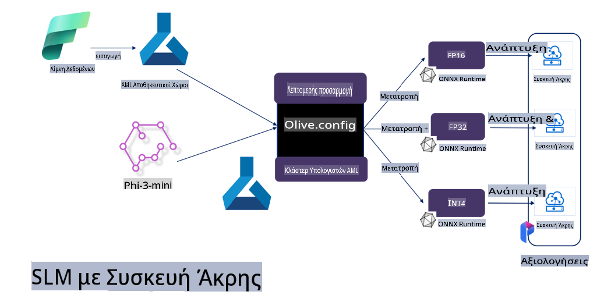

# **Φιλο-3 Προσαρμογή με το Microsoft Olive**

[Olive](https://github.com/microsoft/OLive?WT.mc_id=aiml-138114-kinfeylo) είναι ένα εύχρηστο εργαλείο βελτιστοποίησης μοντέλων με επίγνωση υλικού, το οποίο συγκεντρώνει κορυφαίες τεχνικές της βιομηχανίας στους τομείς της συμπίεσης, βελτιστοποίησης και μεταγλώττισης μοντέλων.

Σχεδιάστηκε για να απλοποιήσει τη διαδικασία βελτιστοποίησης μοντέλων μηχανικής μάθησης, εξασφαλίζοντας τη μέγιστη αποδοτικότητα σε συγκεκριμένες αρχιτεκτονικές υλικού.

Είτε εργάζεστε σε εφαρμογές που βασίζονται στο cloud είτε σε συσκευές edge, το Olive σας επιτρέπει να βελτιστοποιείτε τα μοντέλα σας εύκολα και αποτελεσματικά.

## Κύρια Χαρακτηριστικά:
- Το Olive συγκεντρώνει και αυτοματοποιεί τεχνικές βελτιστοποίησης για συγκεκριμένους στόχους υλικού.
- Καθώς καμία τεχνική βελτιστοποίησης δεν ταιριάζει σε όλες τις περιπτώσεις, το Olive προσφέρει επεκτασιμότητα, επιτρέποντας σε ειδικούς της βιομηχανίας να ενσωματώσουν τις καινοτομίες τους.

## Μείωση Προσπάθειας Μηχανικών:
- Οι προγραμματιστές συχνά χρειάζεται να μάθουν και να χρησιμοποιήσουν διαφορετικά εργαλεία συγκεκριμένων κατασκευαστών υλικού για να προετοιμάσουν και να βελτιστοποιήσουν εκπαιδευμένα μοντέλα για ανάπτυξη.
- Το Olive απλοποιεί αυτή την εμπειρία, αυτοματοποιώντας τις τεχνικές βελτιστοποίησης για το επιθυμητό υλικό.

## Έτοιμη Λύση Βελτιστοποίησης από Άκρη σε Άκρη:

Συνδυάζοντας και ρυθμίζοντας ολοκληρωμένες τεχνικές, το Olive προσφέρει μια ενιαία λύση για βελτιστοποίηση από άκρη σε άκρη. Λαμβάνει υπόψη περιορισμούς όπως η ακρίβεια και η καθυστέρηση κατά τη βελτιστοποίηση των μοντέλων.

## Χρήση του Microsoft Olive για προσαρμογή

Το Microsoft Olive είναι ένα εξαιρετικά εύχρηστο εργαλείο βελτιστοποίησης ανοιχτού κώδικα που καλύπτει τόσο την προσαρμογή όσο και την αναφορά στον τομέα της γενετικής τεχνητής νοημοσύνης. Απαιτεί μόνο απλή ρύθμιση και, σε συνδυασμό με τη χρήση μικρών μοντέλων γλώσσας ανοιχτού κώδικα και σχετικών περιβαλλόντων εκτέλεσης (AzureML / τοπικό GPU, CPU, DirectML), μπορείτε να ολοκληρώσετε την προσαρμογή ή την αναφορά του μοντέλου μέσω αυτόματης βελτιστοποίησης και να βρείτε το καλύτερο μοντέλο για ανάπτυξη στο cloud ή σε συσκευές edge. Επιτρέπει στις επιχειρήσεις να δημιουργούν δικά τους κάθετα μοντέλα βιομηχανίας τοπικά και στο cloud.


## Προσαρμογή Φιλο-3 με Microsoft Olive 



## Δείγμα Κώδικα και Παράδειγμα για Φιλο-3 Olive
Σε αυτό το παράδειγμα, θα χρησιμοποιήσετε το Olive για:

- Προσαρμογή ενός LoRA adapter για την ταξινόμηση φράσεων σε Sad, Joy, Fear, Surprise.
- Συγχώνευση των βαρών του adapter στο βασικό μοντέλο.
- Βελτιστοποίηση και Κβαντοποίηση του μοντέλου σε int4.

[Sample Code](../../code/03.Finetuning/olive-ort-example/README.md)

### Εγκατάσταση Microsoft Olive

Η εγκατάσταση του Microsoft Olive είναι πολύ απλή και μπορεί να γίνει για CPU, GPU, DirectML και Azure ML.

```bash
pip install olive-ai
```

Εάν θέλετε να εκτελέσετε ένα μοντέλο ONNX με CPU, μπορείτε να χρησιμοποιήσετε

```bash
pip install olive-ai[cpu]
```

Εάν θέλετε να εκτελέσετε ένα μοντέλο ONNX με GPU, μπορείτε να χρησιμοποιήσετε

```python
pip install olive-ai[gpu]
```

Εάν θέλετε να χρησιμοποιήσετε το Azure ML, χρησιμοποιήστε

```python
pip install git+https://github.com/microsoft/Olive#egg=olive-ai[azureml]
```

**Σημείωση**
Απαιτήσεις λειτουργικού συστήματος: Ubuntu 20.04 / 22.04 

### **Το Config.json του Microsoft Olive**

Μετά την εγκατάσταση, μπορείτε να ρυθμίσετε διαφορετικές παραμέτρους που αφορούν το μοντέλο μέσω του αρχείου Config, συμπεριλαμβανομένων δεδομένων, υπολογιστικής ισχύος, εκπαίδευσης, ανάπτυξης και δημιουργίας μοντέλου.

**1. Δεδομένα**

Στο Microsoft Olive, υποστηρίζεται η εκπαίδευση με τοπικά δεδομένα και δεδομένα στο cloud, και αυτό μπορεί να ρυθμιστεί στις παραμέτρους.

*Ρυθμίσεις τοπικών δεδομένων*

Μπορείτε απλά να ορίσετε το σύνολο δεδομένων που χρειάζεται να εκπαιδευτεί για την προσαρμογή, συνήθως σε μορφή json, και να το προσαρμόσετε στο πρότυπο δεδομένων. Αυτό πρέπει να προσαρμοστεί με βάση τις απαιτήσεις του μοντέλου (για παράδειγμα, προσαρμογή στη μορφή που απαιτείται από το Microsoft Phi-3-mini. Εάν έχετε άλλα μοντέλα, παρακαλώ ανατρέξτε στις απαιτούμενες μορφές προσαρμογής για άλλα μοντέλα).

```json

    "data_configs": [
        {
            "name": "dataset_default_train",
            "type": "HuggingfaceContainer",
            "load_dataset_config": {
                "params": {
                    "data_name": "json", 
                    "data_files":"dataset/dataset-classification.json",
                    "split": "train"
                }
            },
            "pre_process_data_config": {
                "params": {
                    "dataset_type": "corpus",
                    "text_cols": [
                            "phrase",
                            "tone"
                    ],
                    "text_template": "### Text: {phrase}\n### The tone is:\n{tone}",
                    "corpus_strategy": "join",
                    "source_max_len": 2048,
                    "pad_to_max_len": false,
                    "use_attention_mask": false
                }
            }
        }
    ],
```

**Ρυθμίσεις πηγών δεδομένων στο cloud**

Συνδέοντας το datastore του Azure AI Studio/Azure Machine Learning Service, μπορείτε να εισάγετε διαφορετικές πηγές δεδομένων μέσω του Microsoft Fabric και του Azure Data για την υποστήριξη της προσαρμογής των δεδομένων.

```json

    "data_configs": [
        {
            "name": "dataset_default_train",
            "type": "HuggingfaceContainer",
            "load_dataset_config": {
                "params": {
                    "data_name": "json", 
                    "data_files": {
                        "type": "azureml_datastore",
                        "config": {
                            "azureml_client": {
                                "subscription_id": "Your Azure Subscrition ID",
                                "resource_group": "Your Azure Resource Group",
                                "workspace_name": "Your Azure ML Workspaces name"
                            },
                            "datastore_name": "workspaceblobstore",
                            "relative_path": "Your train_data.json Azure ML Location"
                        }
                    },
                    "split": "train"
                }
            },
            "pre_process_data_config": {
                "params": {
                    "dataset_type": "corpus",
                    "text_cols": [
                            "Question",
                            "Best Answer"
                    ],
                    "text_template": "<|user|>\n{Question}<|end|>\n<|assistant|>\n{Best Answer}\n<|end|>",
                    "corpus_strategy": "join",
                    "source_max_len": 2048,
                    "pad_to_max_len": false,
                    "use_attention_mask": false
                }
            }
        }
    ],
    
```

**2. Ρύθμιση Υπολογιστικής Ισχύος**

Εάν χρειάζεστε τοπική εκτέλεση, μπορείτε να χρησιμοποιήσετε απευθείας τοπικούς πόρους δεδομένων. Εάν θέλετε να χρησιμοποιήσετε πόρους του Azure AI Studio / Azure Machine Learning Service, πρέπει να ρυθμίσετε τις σχετικές παραμέτρους Azure, όπως το όνομα της υπολογιστικής ισχύος.

```json

    "systems": {
        "aml": {
            "type": "AzureML",
            "config": {
                "accelerators": ["gpu"],
                "hf_token": true,
                "aml_compute": "Your Azure AI Studio / Azure Machine Learning Service Compute Name",
                "aml_docker_config": {
                    "base_image": "Your Azure AI Studio / Azure Machine Learning Service docker",
                    "conda_file_path": "conda.yaml"
                }
            }
        },
        "azure_arc": {
            "type": "AzureML",
            "config": {
                "accelerators": ["gpu"],
                "aml_compute": "Your Azure AI Studio / Azure Machine Learning Service Compute Name",
                "aml_docker_config": {
                    "base_image": "Your Azure AI Studio / Azure Machine Learning Service docker",
                    "conda_file_path": "conda.yaml"
                }
            }
        }
    },
```

***Σημείωση***

Επειδή η εκτέλεση γίνεται μέσω container στο Azure AI Studio/Azure Machine Learning Service, πρέπει να ρυθμίσετε το απαιτούμενο περιβάλλον. Αυτό γίνεται μέσω του αρχείου conda.yaml.

```yaml

name: project_environment
channels:
  - defaults
dependencies:
  - python=3.8.13
  - pip=22.3.1
  - pip:
      - einops
      - accelerate
      - azure-keyvault-secrets
      - azure-identity
      - bitsandbytes
      - datasets
      - huggingface_hub
      - peft
      - scipy
      - sentencepiece
      - torch>=2.2.0
      - transformers
      - git+https://github.com/microsoft/Olive@jiapli/mlflow_loading_fix#egg=olive-ai[gpu]
      - --extra-index-url https://aiinfra.pkgs.visualstudio.com/PublicPackages/_packaging/ORT-Nightly/pypi/simple/ 
      - ort-nightly-gpu==1.18.0.dev20240307004
      - --extra-index-url https://aiinfra.pkgs.visualstudio.com/PublicPackages/_packaging/onnxruntime-genai/pypi/simple/
      - onnxruntime-genai-cuda

    

```

**3. Επιλογή SLM**

Μπορείτε να χρησιμοποιήσετε το μοντέλο απευθείας από το Hugging Face ή να το συνδυάσετε με το Model Catalog του Azure AI Studio / Azure Machine Learning. Στο παρακάτω παράδειγμα κώδικα θα χρησιμοποιήσουμε το Microsoft Phi-3-mini.

Εάν έχετε το μοντέλο τοπικά, μπορείτε να χρησιμοποιήσετε αυτή τη μέθοδο:

```json

    "input_model":{
        "type": "PyTorchModel",
        "config": {
            "hf_config": {
                "model_name": "model-cache/microsoft/phi-3-mini",
                "task": "text-generation",
                "model_loading_args": {
                    "trust_remote_code": true
                }
            }
        }
    },
```

Εάν θέλετε να χρησιμοποιήσετε μοντέλο από το Azure AI Studio / Azure Machine Learning Service, μπορείτε να χρησιμοποιήσετε αυτή τη μέθοδο:

```json

    "input_model":{
        "type": "PyTorchModel",
        "config": {
            "model_path": {
                "type": "azureml_registry_model",
                "config": {
                    "name": "microsoft/Phi-3-mini-4k-instruct",
                    "registry_name": "azureml-msr",
                    "version": "11"
                }
            },
             "model_file_format": "PyTorch.MLflow",
             "hf_config": {
                "model_name": "microsoft/Phi-3-mini-4k-instruct",
                "task": "text-generation",
                "from_pretrained_args": {
                    "trust_remote_code": true
                }
            }
        }
    },
```

**Σημείωση:**
Πρέπει να ενσωματωθείτε με το Azure AI Studio / Azure Machine Learning Service. Κατά τη ρύθμιση του μοντέλου, παρακαλώ ανατρέξτε στον αριθμό έκδοσης και τη σχετική ονομασία.

Όλα τα μοντέλα στο Azure πρέπει να ρυθμίζονται ως PyTorch.MLflow.

Χρειάζεστε λογαριασμό στο Hugging Face και πρέπει να συνδέσετε το κλειδί σας με το Key value του Azure AI Studio / Azure Machine Learning.

**4. Αλγόριθμος**

Το Microsoft Olive έχει ενσωματώσει πολύ καλά τους αλγόριθμους Lora και QLora για προσαρμογή. Το μόνο που χρειάζεται είναι να ρυθμίσετε ορισμένες σχετικές παραμέτρους. Εδώ, παίρνουμε ως παράδειγμα το QLora.

```json
        "lora": {
            "type": "LoRA",
            "config": {
                "target_modules": [
                    "o_proj",
                    "qkv_proj"
                ],
                "double_quant": true,
                "lora_r": 64,
                "lora_alpha": 64,
                "lora_dropout": 0.1,
                "train_data_config": "dataset_default_train",
                "eval_dataset_size": 0.3,
                "training_args": {
                    "seed": 0,
                    "data_seed": 42,
                    "per_device_train_batch_size": 1,
                    "per_device_eval_batch_size": 1,
                    "gradient_accumulation_steps": 4,
                    "gradient_checkpointing": false,
                    "learning_rate": 0.0001,
                    "num_train_epochs": 3,
                    "max_steps": 10,
                    "logging_steps": 10,
                    "evaluation_strategy": "steps",
                    "eval_steps": 187,
                    "group_by_length": true,
                    "adam_beta2": 0.999,
                    "max_grad_norm": 0.3
                }
            }
        },
```

Εάν θέλετε μετατροπή κβαντοποίησης, η κύρια έκδοση του Microsoft Olive υποστηρίζει ήδη τη μέθοδο onnxruntime-genai. Μπορείτε να τη ρυθμίσετε ανάλογα με τις ανάγκες σας:

1. Συγχώνευση βαρών adapter στο βασικό μοντέλο.
2. Μετατροπή του μοντέλου σε μοντέλο ONNX με την απαιτούμενη ακρίβεια μέσω του ModelBuilder.

Για παράδειγμα, μετατροπή σε κβαντισμένο INT4:

```json

        "merge_adapter_weights": {
            "type": "MergeAdapterWeights"
        },
        "builder": {
            "type": "ModelBuilder",
            "config": {
                "precision": "int4"
            }
        }
```

**Σημείωση** 
- Εάν χρησιμοποιείτε QLoRA, η μετατροπή κβαντοποίησης με ONNXRuntime-genai δεν υποστηρίζεται προς το παρόν.

- Πρέπει να σημειωθεί ότι μπορείτε να ρυθμίσετε τα παραπάνω βήματα ανάλογα με τις ανάγκες σας. Δεν είναι απαραίτητο να ρυθμίσετε πλήρως όλα τα παραπάνω βήματα. Ανάλογα με τις ανάγκες σας, μπορείτε να χρησιμοποιήσετε τα βήματα του αλγορίθμου χωρίς προσαρμογή. Τέλος, χρειάζεται να ρυθμίσετε τις σχετικές μηχανές.

```json

    "engine": {
        "log_severity_level": 0,
        "host": "aml",
        "target": "aml",
        "search_strategy": false,
        "execution_providers": ["CUDAExecutionProvider"],
        "cache_dir": "../model-cache/models/phi3-finetuned/cache",
        "output_dir" : "../model-cache/models/phi3-finetuned"
    }
```

**5. Ολοκλήρωση της προσαρμογής**

Στη γραμμή εντολών, εκτελέστε στον κατάλογο του olive-config.json:

```bash
olive run --config olive-config.json  
```

**Αποποίηση ευθυνών**:  
Αυτό το έγγραφο έχει μεταφραστεί χρησιμοποιώντας υπηρεσίες μηχανικής μετάφρασης με τεχνητή νοημοσύνη. Παρόλο που καταβάλλουμε προσπάθειες για ακρίβεια, παρακαλούμε να έχετε υπόψη ότι οι αυτοματοποιημένες μεταφράσεις ενδέχεται να περιέχουν λάθη ή ανακρίβειες. Το πρωτότυπο έγγραφο στη μητρική του γλώσσα θα πρέπει να θεωρείται η αυθεντική πηγή. Για κρίσιμες πληροφορίες, συνιστάται επαγγελματική μετάφραση από άνθρωπο. Δεν φέρουμε καμία ευθύνη για τυχόν παρεξηγήσεις ή εσφαλμένες ερμηνείες που προκύπτουν από τη χρήση αυτής της μετάφρασης.