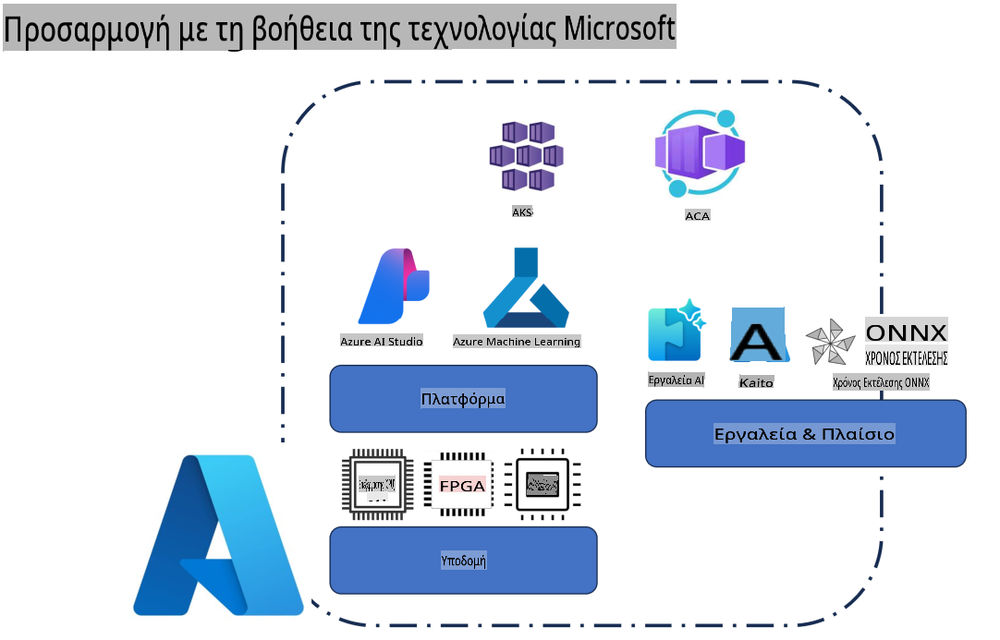
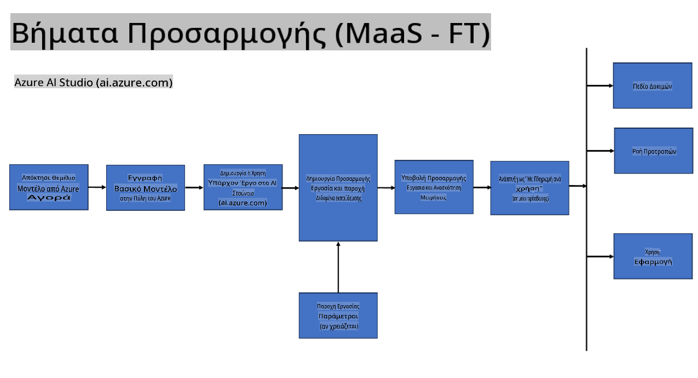
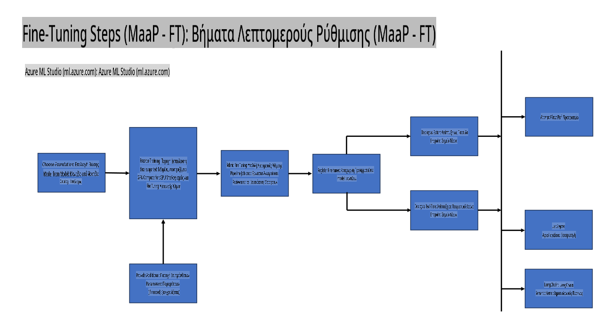
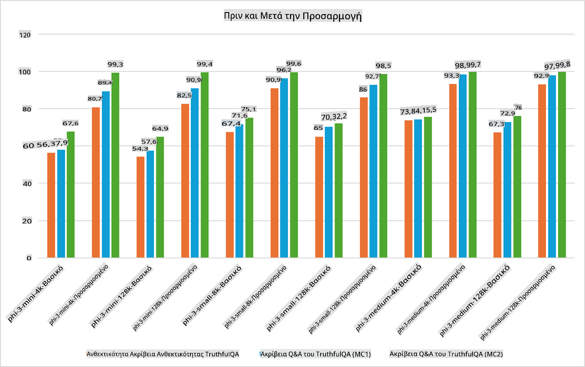

## Σενάρια Προσαρμογής

**Πλατφόρμα** Περιλαμβάνει διάφορες τεχνολογίες όπως Azure AI Foundry, Azure Machine Learning, AI Tools, Kaito και ONNX Runtime.

**Υποδομή** Περιλαμβάνει τη CPU και το FPGA, που είναι απαραίτητα για τη διαδικασία προσαρμογής. Δείτε τα εικονίδια για καθεμία από αυτές τις τεχνολογίες.

**Εργαλεία & Πλαίσια** Περιλαμβάνει το ONNX Runtime και το ONNX Runtime. Δείτε τα εικονίδια για καθεμία από αυτές τις τεχνολογίες.  
[Εισαγωγή εικονιδίων για ONNX Runtime και ONNX Runtime]

Η διαδικασία προσαρμογής με τεχνολογίες της Microsoft περιλαμβάνει διάφορα στοιχεία και εργαλεία. Με την κατανόηση και τη χρήση αυτών των τεχνολογιών, μπορούμε να προσαρμόσουμε αποτελεσματικά τις εφαρμογές μας και να δημιουργήσουμε καλύτερες λύσεις.

## Μοντέλο ως Υπηρεσία

Προσαρμόστε το μοντέλο χρησιμοποιώντας φιλοξενούμενη προσαρμογή, χωρίς την ανάγκη δημιουργίας και διαχείρισης υποδομής.

Η προσαρμογή χωρίς διακομιστές είναι διαθέσιμη για τα μοντέλα Phi-3-mini και Phi-3-medium, επιτρέποντας στους προγραμματιστές να προσαρμόσουν γρήγορα και εύκολα τα μοντέλα για σενάρια cloud και edge χωρίς να χρειάζεται να φροντίσουν για υποδομή. Ανακοινώσαμε επίσης ότι το μοντέλο Phi-3-small είναι πλέον διαθέσιμο μέσω της προσφοράς Models-as-a-Service, ώστε οι προγραμματιστές να μπορούν να ξεκινήσουν γρήγορα και εύκολα την ανάπτυξη AI χωρίς να διαχειρίζονται την υποκείμενη υποδομή.

## Μοντέλο ως Πλατφόρμα

Οι χρήστες διαχειρίζονται τη δική τους υποδομή για να προσαρμόσουν τα μοντέλα τους.

[Δείγμα Προσαρμογής](https://github.com/Azure/azureml-examples/blob/main/sdk/python/foundation-models/system/finetune/chat-completion/chat-completion.ipynb)

## Σενάρια Προσαρμογής

| | | | | | | |
|-|-|-|-|-|-|-|
|Σενάριο|LoRA|QLoRA|PEFT|DeepSpeed|ZeRO|DORA|
|Προσαρμογή προεκπαιδευμένων LLMs σε συγκεκριμένα καθήκοντα ή τομείς|Ναι|Ναι|Ναι|Ναι|Ναι|Ναι|
|Προσαρμογή για εργασίες NLP όπως ταξινόμηση κειμένου, αναγνώριση ονομάτων οντοτήτων και μηχανική μετάφραση|Ναι|Ναι|Ναι|Ναι|Ναι|Ναι|
|Προσαρμογή για εργασίες ερωταπαντήσεων|Ναι|Ναι|Ναι|Ναι|Ναι|Ναι|
|Προσαρμογή για δημιουργία ανθρώπινων απαντήσεων σε chatbots|Ναι|Ναι|Ναι|Ναι|Ναι|Ναι|
|Προσαρμογή για δημιουργία μουσικής, τέχνης ή άλλων μορφών δημιουργικότητας|Ναι|Ναι|Ναι|Ναι|Ναι|Ναι|
|Μείωση υπολογιστικού και οικονομικού κόστους|Ναι|Ναι|Όχι|Ναι|Ναι|Όχι|
|Μείωση χρήσης μνήμης|Όχι|Ναι|Όχι|Ναι|Ναι|Ναι|
|Χρήση λιγότερων παραμέτρων για αποδοτική προσαρμογή|Όχι|Ναι|Ναι|Όχι|Όχι|Ναι|
|Αποδοτική χρήση μνήμης με μορφή παράλληλης επεξεργασίας δεδομένων που αξιοποιεί τη συνολική μνήμη GPU όλων των διαθέσιμων συσκευών GPU|Όχι|Όχι|Όχι|Ναι|Ναι|Ναι|

## Παραδείγματα Απόδοσης Προσαρμογής

**Αποποίηση ευθύνης**:  
Αυτό το έγγραφο έχει μεταφραστεί χρησιμοποιώντας υπηρεσίες αυτόματης μετάφρασης βασισμένες σε τεχνητή νοημοσύνη. Παρόλο που καταβάλλουμε προσπάθειες για ακρίβεια, παρακαλούμε να έχετε υπόψη ότι οι αυτόματες μεταφράσεις ενδέχεται να περιέχουν λάθη ή ανακρίβειες. Το πρωτότυπο έγγραφο στη μητρική του γλώσσα θα πρέπει να θεωρείται η αυθεντική πηγή. Για κρίσιμες πληροφορίες, συνιστάται επαγγελματική ανθρώπινη μετάφραση. Δεν φέρουμε ευθύνη για τυχόν παρεξηγήσεις ή εσφαλμένες ερμηνείες που προκύπτουν από τη χρήση αυτής της μετάφρασης.