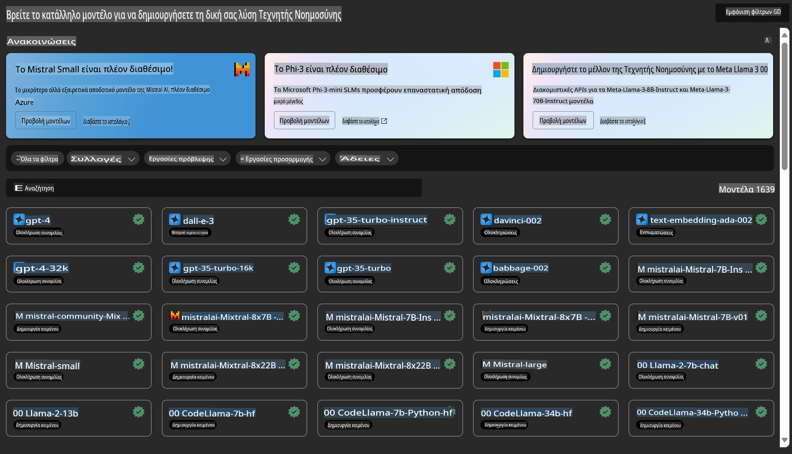

# **Γνωριμία με την Υπηρεσία Azure Machine Learning**

[Azure Machine Learning](https://ml.azure.com?WT.mc_id=aiml-138114-kinfeylo) είναι μια υπηρεσία cloud που επιταχύνει και διαχειρίζεται τον κύκλο ζωής ενός έργου μηχανικής μάθησης (ML).

Οι επαγγελματίες ML, επιστήμονες δεδομένων και μηχανικοί μπορούν να τη χρησιμοποιήσουν στην καθημερινή τους εργασία για να:

- Εκπαιδεύσουν και να αναπτύξουν μοντέλα.
- Διαχειριστούν τις λειτουργίες μηχανικής μάθησης (MLOps).
- Μπορείτε να δημιουργήσετε ένα μοντέλο στο Azure Machine Learning ή να χρησιμοποιήσετε ένα μοντέλο από πλατφόρμες ανοικτού κώδικα, όπως PyTorch, TensorFlow ή scikit-learn.
- Τα εργαλεία MLOps σας βοηθούν να παρακολουθείτε, να επανεκπαιδεύετε και να επαναδιανέμετε μοντέλα.

## Για ποιον είναι το Azure Machine Learning;

**Επιστήμονες Δεδομένων και Μηχανικοί ML**

Μπορούν να χρησιμοποιούν εργαλεία που επιταχύνουν και αυτοματοποιούν τις καθημερινές τους ροές εργασίας. 
Το Azure ML παρέχει δυνατότητες για δικαιοσύνη, εξηγησιμότητα, παρακολούθηση και δυνατότητα ελέγχου.

**Προγραμματιστές Εφαρμογών**

Μπορούν να ενσωματώσουν μοντέλα σε εφαρμογές ή υπηρεσίες χωρίς δυσκολία.

**Προγραμματιστές Πλατφόρμας**

Έχουν πρόσβαση σε ένα ισχυρό σύνολο εργαλείων που υποστηρίζονται από ανθεκτικά APIs του Azure Resource Manager.
Αυτά τα εργαλεία επιτρέπουν τη δημιουργία προηγμένων εργαλείων ML.

**Επιχειρήσεις**

Λειτουργώντας στο cloud της Microsoft Azure, οι επιχειρήσεις επωφελούνται από γνωστές λύσεις ασφάλειας και ελέγχου πρόσβασης βάσει ρόλων.
Μπορείτε να ρυθμίσετε έργα για να ελέγχετε την πρόσβαση σε προστατευμένα δεδομένα και συγκεκριμένες λειτουργίες.

## Παραγωγικότητα για Όλους στην Ομάδα
Τα έργα ML συχνά απαιτούν μια ομάδα με διαφορετικές δεξιότητες για να τα κατασκευάσουν και να τα διατηρήσουν.

Το Azure ML παρέχει εργαλεία που σας επιτρέπουν να:
- Συνεργάζεστε με την ομάδα σας μέσω κοινών notebooks, υπολογιστικών πόρων, serverless υπολογιστικής, δεδομένων και περιβαλλόντων.
- Αναπτύσσετε μοντέλα με δικαιοσύνη, εξηγησιμότητα, παρακολούθηση και δυνατότητα ελέγχου για να πληρούνται οι απαιτήσεις συμμόρφωσης.
- Αναπτύσσετε μοντέλα ML γρήγορα και εύκολα σε μεγάλη κλίμακα, και να τα διαχειρίζεστε αποτελεσματικά με MLOps.
- Εκτελείτε φορτία εργασίας μηχανικής μάθησης οπουδήποτε με ενσωματωμένη διακυβέρνηση, ασφάλεια και συμμόρφωση.

## Διαλειτουργικά Εργαλεία Πλατφόρμας

Οποιοδήποτε μέλος μιας ομάδας ML μπορεί να χρησιμοποιήσει τα εργαλεία που προτιμά για να ολοκληρώσει τη δουλειά του.
Είτε κάνετε γρήγορα πειράματα, ρύθμιση υπερπαραμέτρων, δημιουργία pipelines ή διαχείριση προβλέψεων, μπορείτε να χρησιμοποιήσετε γνωστά interfaces, όπως:
- Azure Machine Learning Studio
- Python SDK (v2)
- Azure CLI (v2)
- Azure Resource Manager REST APIs

Καθώς βελτιώνετε τα μοντέλα σας και συνεργάζεστε κατά τη διάρκεια του κύκλου ανάπτυξης, μπορείτε να μοιράζεστε και να βρίσκετε assets, πόρους και μετρήσεις μέσα από το περιβάλλον εργασίας του Azure Machine Learning studio.

## **LLM/SLM στο Azure ML**

Το Azure ML έχει προσθέσει πολλές λειτουργίες που σχετίζονται με LLM/SLM, συνδυάζοντας LLMOps και SLMOps για τη δημιουργία μιας τεχνολογικής πλατφόρμας γενετικής τεχνητής νοημοσύνης για επιχειρήσεις.

### **Κατάλογος Μοντέλων**

Οι επιχειρηματικοί χρήστες μπορούν να αναπτύξουν διαφορετικά μοντέλα ανάλογα με διαφορετικά επιχειρηματικά σενάρια μέσω του Καταλόγου Μοντέλων και να παρέχουν υπηρεσίες ως Model as Service, ώστε οι επιχειρηματικοί προγραμματιστές ή χρήστες να έχουν πρόσβαση.

Ο Κατάλογος Μοντέλων στο Azure Machine Learning studio είναι το κέντρο για να ανακαλύψετε και να χρησιμοποιήσετε μια μεγάλη ποικιλία μοντέλων που σας επιτρέπουν να δημιουργείτε εφαρμογές Γενετικής Τεχνητής Νοημοσύνης. Ο κατάλογος περιλαμβάνει εκατοντάδες μοντέλα από παρόχους, όπως Azure OpenAI service, Mistral, Meta, Cohere, Nvidia, Hugging Face, συμπεριλαμβανομένων μοντέλων που έχουν εκπαιδευτεί από τη Microsoft. Τα μοντέλα από παρόχους εκτός της Microsoft είναι Προϊόντα Μη-Microsoft, όπως ορίζεται στους Όρους Χρήσης Προϊόντων της Microsoft, και υπόκεινται στους όρους που παρέχονται με το μοντέλο.

### **Pipeline Εργασιών**

Η καρδιά ενός pipeline μηχανικής μάθησης είναι να διαιρεί μια πλήρη εργασία μηχανικής μάθησης σε μια πολύβημα ροή εργασίας. Κάθε βήμα είναι ένα διαχειρίσιμο στοιχείο που μπορεί να αναπτυχθεί, να βελτιστοποιηθεί, να ρυθμιστεί και να αυτοματοποιηθεί ξεχωριστά. Τα βήματα συνδέονται μέσω καλά καθορισμένων διεπαφών. Η υπηρεσία pipeline του Azure Machine Learning ορχηστρώνει αυτόματα όλες τις εξαρτήσεις μεταξύ των βημάτων του pipeline.

Στην προσαρμογή SLM/LLM, μπορούμε να διαχειριστούμε τα δεδομένα, την εκπαίδευση και τις διαδικασίες παραγωγής μας μέσω Pipeline.

### **Prompt flow**

**Οφέλη από τη χρήση του Azure Machine Learning prompt flow**
Το Azure Machine Learning prompt flow προσφέρει μια σειρά από οφέλη που βοηθούν τους χρήστες να μεταβούν από την ιδέα στον πειραματισμό και, τελικά, στην παραγωγή εφαρμογών βασισμένων σε LLM:

**Ευελιξία στην κατασκευή prompts**

- Διαδραστική εμπειρία συγγραφής: Το Azure Machine Learning prompt flow παρέχει μια οπτική αναπαράσταση της δομής του flow, επιτρέποντας στους χρήστες να κατανοούν και να πλοηγούνται εύκολα στα έργα τους. Προσφέρει επίσης μια εμπειρία κωδικοποίησης τύπου notebook για αποτελεσματική ανάπτυξη και αποσφαλμάτωση flows.
- Παραλλαγές για ρύθμιση prompts: Οι χρήστες μπορούν να δημιουργούν και να συγκρίνουν πολλαπλές παραλλαγές prompts, διευκολύνοντας τη διαδικασία βελτίωσης.
- Αξιολόγηση: Ενσωματωμένες ροές αξιολόγησης επιτρέπουν στους χρήστες να αξιολογούν την ποιότητα και την αποτελεσματικότητα των prompts και των flows.
- Πλήρεις πόροι: Το Azure Machine Learning prompt flow περιλαμβάνει μια βιβλιοθήκη με ενσωματωμένα εργαλεία, δείγματα και πρότυπα που λειτουργούν ως σημείο εκκίνησης για την ανάπτυξη, εμπνέοντας δημιουργικότητα και επιταχύνοντας τη διαδικασία.

**Επιχειρηματική ετοιμότητα για εφαρμογές βασισμένες σε LLM**

- Συνεργασία: Το Azure Machine Learning prompt flow υποστηρίζει τη συνεργασία ομάδας, επιτρέποντας σε πολλούς χρήστες να εργάζονται μαζί σε έργα prompt engineering, να μοιράζονται γνώση και να διατηρούν τον έλεγχο εκδόσεων.
- Ενιαία πλατφόρμα: Το Azure Machine Learning prompt flow απλοποιεί ολόκληρη τη διαδικασία prompt engineering, από την ανάπτυξη και την αξιολόγηση έως την ανάπτυξη και την παρακολούθηση. Οι χρήστες μπορούν να αναπτύσσουν flows ως endpoints του Azure Machine Learning και να παρακολουθούν την απόδοσή τους σε πραγματικό χρόνο, εξασφαλίζοντας βέλτιστη λειτουργία και συνεχή βελτίωση.

Οι λύσεις επιχειρηματικής ετοιμότητας του Azure Machine Learning: Το prompt flow αξιοποιεί τις ισχυρές λύσεις επιχειρηματικής ετοιμότητας του Azure Machine Learning, παρέχοντας μια ασφαλή, επεκτάσιμη και αξιόπιστη βάση για την ανάπτυξη, τον πειραματισμό και την ανάπτυξη flows.

Με το Azure Machine Learning prompt flow, οι χρήστες μπορούν να αξιοποιήσουν την ευελιξία στην κατασκευή prompts, να συνεργαστούν αποτελεσματικά και να εκμεταλλευτούν λύσεις επιχειρηματικής κλάσης για επιτυχημένη ανάπτυξη και υλοποίηση εφαρμογών βασισμένων σε LLM.

Συνδυάζοντας την υπολογιστική ισχύ, τα δεδομένα και τα διαφορετικά στοιχεία του Azure ML, οι επιχειρηματικοί προγραμματιστές μπορούν εύκολα να δημιουργήσουν τις δικές τους εφαρμογές τεχνητής νοημοσύνης.

**Αποποίηση ευθυνών**:  
Αυτό το έγγραφο έχει μεταφραστεί χρησιμοποιώντας υπηρεσίες μετάφρασης βασισμένες σε τεχνητή νοημοσύνη. Ενώ καταβάλλουμε προσπάθειες για ακρίβεια, παρακαλούμε να έχετε υπόψη ότι οι αυτοματοποιημένες μεταφράσεις ενδέχεται να περιέχουν σφάλματα ή ανακρίβειες. Το πρωτότυπο έγγραφο στη μητρική του γλώσσα πρέπει να θεωρείται η αυθεντική πηγή. Για κρίσιμες πληροφορίες, συνιστάται επαγγελματική ανθρώπινη μετάφραση. Δεν φέρουμε ευθύνη για τυχόν παρεξηγήσεις ή εσφαλμένες ερμηνείες που προκύπτουν από τη χρήση αυτής της μετάφρασης.