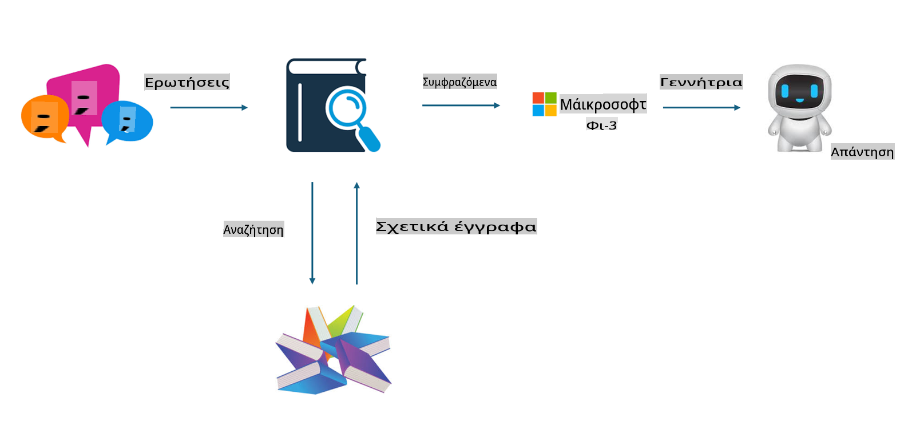
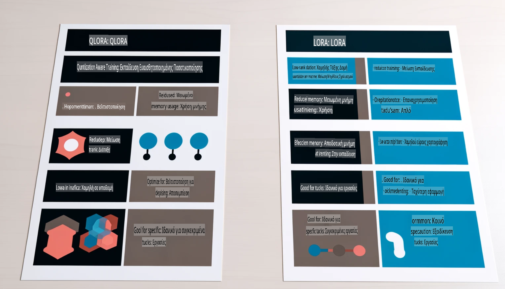

# **Ας κάνουμε το Phi-3 έναν ειδικό της βιομηχανίας**

Για να εισάγετε το μοντέλο Phi-3 σε μια βιομηχανία, χρειάζεται να προσθέσετε δεδομένα επιχειρηματικού κλάδου στο μοντέλο Phi-3. Έχουμε δύο διαφορετικές επιλογές, η πρώτη είναι η RAG (Retrieval Augmented Generation) και η δεύτερη είναι η Fine Tuning.

## **RAG vs Fine-Tuning**

### **Retrieval Augmented Generation**

Η RAG είναι συνδυασμός ανάκτησης δεδομένων και δημιουργίας κειμένου. Τα δομημένα και μη δομημένα δεδομένα της επιχείρησης αποθηκεύονται στη βάση δεδομένων διανυσμάτων. Κατά την αναζήτηση σχετικού περιεχομένου, βρίσκονται οι σχετικές περιλήψεις και το περιεχόμενο για να σχηματιστεί ένα πλαίσιο, και η ικανότητα ολοκλήρωσης κειμένου του LLM/SLM συνδυάζεται για να παραχθεί περιεχόμενο.

### **Fine-tuning**

Η Fine-tuning βασίζεται στη βελτίωση ενός υπάρχοντος μοντέλου. Δεν χρειάζεται να ξεκινήσετε από τον αλγόριθμο του μοντέλου, αλλά απαιτείται συνεχής συσσώρευση δεδομένων. Εάν επιθυμείτε πιο ακριβή ορολογία και έκφραση στη γλώσσα για εφαρμογές της βιομηχανίας, η Fine-tuning είναι η καλύτερη επιλογή. Ωστόσο, αν τα δεδομένα σας αλλάζουν συχνά, η Fine-tuning μπορεί να γίνει περίπλοκη.

### **Πώς να επιλέξετε**

1. Εάν η απάντησή μας απαιτεί την εισαγωγή εξωτερικών δεδομένων, η RAG είναι η καλύτερη επιλογή.

2. Εάν χρειάζεστε σταθερή και ακριβή εξειδικευμένη γνώση, η Fine-tuning είναι καλή επιλογή. Η RAG δίνει προτεραιότητα στην ανάκτηση σχετικού περιεχομένου, αλλά μπορεί να μην αποδίδει πάντα τις εξειδικευμένες λεπτομέρειες.

3. Η Fine-tuning απαιτεί ένα ποιοτικό σύνολο δεδομένων, και αν πρόκειται για μικρό εύρος δεδομένων, δεν θα κάνει μεγάλη διαφορά. Η RAG είναι πιο ευέλικτη.

4. Η Fine-tuning είναι ένα «μαύρο κουτί», μια μεταφυσική διαδικασία, και είναι δύσκολο να κατανοηθεί ο εσωτερικός μηχανισμός. Αντίθετα, η RAG διευκολύνει την εύρεση της πηγής των δεδομένων, καθιστώντας πιο αποτελεσματική την προσαρμογή λαθών ή ανακριβειών και παρέχοντας μεγαλύτερη διαφάνεια.

### **Σενάρια**

1. Σε κάθετες βιομηχανίες που απαιτούν εξειδικευμένη ορολογία και εκφράσεις, η ***Fine-tuning*** είναι η καλύτερη επιλογή.

2. Σε συστήματα ερωταπαντήσεων που περιλαμβάνουν σύνθεση διαφορετικών σημείων γνώσης, η ***RAG*** είναι η καλύτερη επιλογή.

3. Για συνδυασμό αυτοματοποιημένων επιχειρησιακών ροών, ο συνδυασμός ***RAG + Fine-tuning*** είναι η καλύτερη επιλογή.

## **Πώς να χρησιμοποιήσετε την RAG**

Μια βάση δεδομένων διανυσμάτων είναι μια συλλογή δεδομένων αποθηκευμένων σε μαθηματική μορφή. Οι βάσεις δεδομένων διανυσμάτων διευκολύνουν τα μοντέλα μηχανικής μάθησης να θυμούνται προηγούμενες εισόδους, επιτρέποντας τη χρήση της μηχανικής μάθησης για υποστήριξη περιπτώσεων χρήσης όπως αναζήτηση, συστάσεις και δημιουργία κειμένου. Τα δεδομένα μπορούν να αναγνωριστούν με βάση μετρικές ομοιότητας αντί για ακριβείς αντιστοιχίες, επιτρέποντας στα υπολογιστικά μοντέλα να κατανοούν το πλαίσιο των δεδομένων.

Η βάση δεδομένων διανυσμάτων είναι το κλειδί για την υλοποίηση της RAG. Μπορούμε να μετατρέψουμε δεδομένα σε αποθήκευση διανυσμάτων μέσω μοντέλων διανυσμάτων, όπως τα text-embedding-3, jina-ai-embedding, κ.λπ.

Μάθετε περισσότερα για τη δημιουργία εφαρμογής RAG [https://github.com/microsoft/Phi-3CookBook](https://github.com/microsoft/Phi-3CookBook?WT.mc_id=aiml-138114-kinfeylo)

## **Πώς να χρησιμοποιήσετε την Fine-tuning**

Οι συνήθεις αλγόριθμοι στην Fine-tuning είναι οι Lora και QLora. Πώς να επιλέξετε;
- [Μάθετε περισσότερα με αυτό το notebook](../../../../code/04.Finetuning/Phi_3_Inference_Finetuning.ipynb)
- [Παράδειγμα Python FineTuning Sample](../../../../code/04.Finetuning/FineTrainingScript.py)

### **Lora και QLora**

Το LoRA (Low-Rank Adaptation) και το QLoRA (Quantized Low-Rank Adaptation) είναι τεχνικές που χρησιμοποιούνται για την προσαρμογή μεγάλων μοντέλων γλώσσας (LLMs) με Parameter Efficient Fine Tuning (PEFT). Οι τεχνικές PEFT έχουν σχεδιαστεί για πιο αποδοτική εκπαίδευση μοντέλων σε σχέση με τις παραδοσιακές μεθόδους.

Το LoRA είναι μια αυτόνομη τεχνική fine-tuning που μειώνει τη χρήση μνήμης εφαρμόζοντας μια προσεγγιστική μήτρα χαμηλής διάστασης για την ενημέρωση των βαρών. Προσφέρει γρήγορους χρόνους εκπαίδευσης και διατηρεί απόδοση κοντά στις παραδοσιακές μεθόδους fine-tuning.

Το QLoRA είναι μια επεκταμένη έκδοση του LoRA που ενσωματώνει τεχνικές ποσοτικοποίησης για περαιτέρω μείωση της χρήσης μνήμης. Το QLoRA ποσοτικοποιεί την ακρίβεια των παραμέτρων βαρών στο προεκπαιδευμένο LLM σε ακρίβεια 4-bit, η οποία είναι πιο αποδοτική από πλευράς μνήμης σε σχέση με το LoRA. Ωστόσο, η εκπαίδευση με QLoRA είναι περίπου 30% πιο αργή λόγω των πρόσθετων βημάτων ποσοτικοποίησης και αποποσοτικοποίησης.

Το QLoRA χρησιμοποιεί το LoRA ως υποστήριξη για τη διόρθωση των λαθών που εισάγονται κατά την ποσοτικοποίηση. Το QLoRA επιτρέπει την προσαρμογή τεράστιων μοντέλων με δισεκατομμύρια παραμέτρους σε σχετικά μικρές, εύκολα διαθέσιμες GPUs. Για παράδειγμα, το QLoRA μπορεί να προσαρμόσει ένα μοντέλο 70B παραμέτρων που απαιτεί 36 GPUs με μόνο 2.

**Αποποίηση Ευθύνης**:  
Αυτό το έγγραφο έχει μεταφραστεί χρησιμοποιώντας υπηρεσίες αυτόματης μετάφρασης με τεχνητή νοημοσύνη. Παρόλο που καταβάλλουμε προσπάθειες για ακρίβεια, παρακαλούμε να έχετε υπόψη ότι οι αυτοματοποιημένες μεταφράσεις ενδέχεται να περιέχουν λάθη ή ανακρίβειες. Το πρωτότυπο έγγραφο στη γλώσσα που συντάχθηκε θα πρέπει να θεωρείται η αυθεντική πηγή. Για κρίσιμες πληροφορίες, συνιστάται επαγγελματική ανθρώπινη μετάφραση. Δεν φέρουμε ευθύνη για τυχόν παρεξηγήσεις ή εσφαλμένες ερμηνείες που προκύπτουν από τη χρήση αυτής της μετάφρασης.