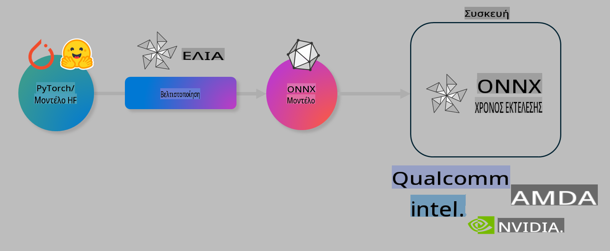

# Εργαστήριο. Βελτιστοποίηση AI μοντέλων για εκτέλεση σε συσκευές

## Εισαγωγή

> [!IMPORTANT]
> Αυτό το εργαστήριο απαιτεί μια **Nvidia A10 ή A100 GPU** με τους αντίστοιχους οδηγούς και το CUDA toolkit (έκδοση 12+) εγκατεστημένα.

> [!NOTE]
> Πρόκειται για ένα εργαστήριο διάρκειας **35 λεπτών** που θα σας δώσει πρακτική εισαγωγή στις βασικές έννοιες της βελτιστοποίησης μοντέλων για εκτέλεση σε συσκευές χρησιμοποιώντας το OLIVE.

## Στόχοι Μάθησης

Με την ολοκλήρωση αυτού του εργαστηρίου, θα μπορείτε να χρησιμοποιείτε το OLIVE για να:

- Ποσοτικοποιείτε ένα AI μοντέλο χρησιμοποιώντας τη μέθοδο ποσοτικοποίησης AWQ.
- Τελειοποιείτε ένα AI μοντέλο για μια συγκεκριμένη εργασία.
- Δημιουργείτε LoRA adapters (μοντέλα που έχουν τελειοποιηθεί) για αποδοτική εκτέλεση σε συσκευές με το ONNX Runtime.

### Τι είναι το Olive

Το Olive (*O*NNX *live*) είναι ένα εργαλείο βελτιστοποίησης μοντέλων με συνοδευτικό CLI που σας επιτρέπει να παραδίδετε μοντέλα για το ONNX runtime +++https://onnxruntime.ai+++ με υψηλή ποιότητα και απόδοση.



Η είσοδος στο Olive είναι συνήθως ένα μοντέλο PyTorch ή Hugging Face, και η έξοδος είναι ένα βελτιστοποιημένο ONNX μοντέλο που εκτελείται σε μια συσκευή (στόχος ανάπτυξης) με το ONNX runtime. Το Olive θα βελτιστοποιήσει το μοντέλο για τον επιταχυντή AI (NPU, GPU, CPU) του στόχου ανάπτυξης που παρέχεται από έναν κατασκευαστή υλικού όπως η Qualcomm, AMD, Nvidia ή Intel.

Το Olive εκτελεί μια *ροή εργασίας*, που είναι μια σειρά από ατομικές εργασίες βελτιστοποίησης μοντέλου που ονομάζονται *περάσματα* - παραδείγματα περιλαμβάνουν: συμπίεση μοντέλου, σύλληψη γραφήματος, ποσοτικοποίηση, βελτιστοποίηση γραφήματος. Κάθε πέρασμα έχει ένα σύνολο παραμέτρων που μπορούν να ρυθμιστούν για την επίτευξη των καλύτερων μετρικών, όπως η ακρίβεια και η καθυστέρηση, που αξιολογούνται από τον αντίστοιχο αξιολογητή. Το Olive χρησιμοποιεί μια στρατηγική αναζήτησης με έναν αλγόριθμο αναζήτησης για την αυτόματη ρύθμιση κάθε περάσματος μεμονωμένα ή σε συνδυασμό.

#### Πλεονεκτήματα του Olive

- **Μείωση απογοήτευσης και χρόνου** που απαιτείται για δοκιμές και πειραματισμούς με διαφορετικές τεχνικές βελτιστοποίησης γραφήματος, συμπίεσης και ποσοτικοποίησης. Ορίστε τις απαιτήσεις ποιότητας και απόδοσης και αφήστε το Olive να βρει αυτόματα το καλύτερο μοντέλο για εσάς.
- **Περισσότερα από 40 ενσωματωμένα εξαρτήματα βελτιστοποίησης μοντέλων** που καλύπτουν τις πιο πρόσφατες τεχνικές σε ποσοτικοποίηση, συμπίεση, βελτιστοποίηση γραφήματος και τελειοποίηση.
- **Εύχρηστο CLI** για κοινές εργασίες βελτιστοποίησης μοντέλων. Για παράδειγμα, olive quantize, olive auto-opt, olive finetune.
- Ενσωματωμένη συσκευασία και ανάπτυξη μοντέλων.
- Υποστήριξη για δημιουργία μοντέλων για **Multi LoRA serving**.
- Δημιουργία ροών εργασίας χρησιμοποιώντας YAML/JSON για οργάνωση εργασιών βελτιστοποίησης και ανάπτυξης μοντέλων.
- Ενσωμάτωση με **Hugging Face** και **Azure AI**.
- Ενσωματωμένος μηχανισμός **caching** για **εξοικονόμηση κόστους**.

## Οδηγίες Εργαστηρίου
> [!NOTE]
> Βεβαιωθείτε ότι έχετε προετοιμάσει το Azure AI Hub και το Project σας και έχετε ρυθμίσει τον υπολογιστή A100 σύμφωνα με το Εργαστήριο 1.

### Βήμα 0: Σύνδεση με το Azure AI Compute

Θα συνδεθείτε με το Azure AI Compute χρησιμοποιώντας τη δυνατότητα απομακρυσμένης σύνδεσης στο **VS Code.**

1. Ανοίξτε την εφαρμογή επιφάνειας εργασίας **VS Code**:
1. Ανοίξτε την **παλέτα εντολών** χρησιμοποιώντας **Shift+Ctrl+P**.
1. Στην παλέτα εντολών αναζητήστε **AzureML - remote: Connect to compute instance in New Window**.
1. Ακολουθήστε τις οδηγίες στην οθόνη για να συνδεθείτε με το Compute. Αυτό περιλαμβάνει την επιλογή της συνδρομής Azure, του Resource Group, του Project και του Compute name που ρυθμίσατε στο Εργαστήριο 1.
1. Μόλις συνδεθείτε με τον κόμβο Azure ML Compute, αυτό θα εμφανιστεί **στο κάτω αριστερό μέρος του Visual Code** `><Azure ML: Compute Name`.

### Βήμα 1: Κλωνοποιήστε αυτό το αποθετήριο

Στο VS Code, μπορείτε να ανοίξετε ένα νέο τερματικό με **Ctrl+J** και να κλωνοποιήσετε αυτό το αποθετήριο:

Στο τερματικό θα δείτε την προτροπή

```
azureuser@computername:~/cloudfiles/code$ 
```
Κλωνοποιήστε τη λύση 

```bash
cd ~/localfiles
git clone https://github.com/microsoft/phi-3cookbook.git
```

### Βήμα 2: Άνοιγμα φακέλου στο VS Code

Για να ανοίξετε το VS Code στον σχετικό φάκελο, εκτελέστε την ακόλουθη εντολή στο τερματικό, η οποία θα ανοίξει ένα νέο παράθυρο:

```bash
code phi-3cookbook/code/04.Finetuning/Olive-lab
```

Εναλλακτικά, μπορείτε να ανοίξετε τον φάκελο επιλέγοντας **File** > **Open Folder**. 

### Βήμα 3: Εξαρτήσεις

Ανοίξτε ένα τερματικό παράθυρο στο VS Code στον κόμβο Azure AI Compute (συμβουλή: **Ctrl+J**) και εκτελέστε τις ακόλουθες εντολές για να εγκαταστήσετε τις εξαρτήσεις:

```bash
conda create -n olive-ai python=3.11 -y
conda activate olive-ai
pip install -r requirements.txt
az extension remove -n azure-cli-ml
az extension add -n ml
```

> [!NOTE]
> Η εγκατάσταση όλων των εξαρτήσεων θα διαρκέσει ~5 λεπτά.

Σε αυτό το εργαστήριο, θα κατεβάσετε και θα ανεβάσετε μοντέλα στον κατάλογο μοντέλων Azure AI. Για να έχετε πρόσβαση στον κατάλογο μοντέλων, θα χρειαστεί να συνδεθείτε στο Azure χρησιμοποιώντας:

```bash
az login
```

> [!NOTE]
> Κατά τη σύνδεση, θα σας ζητηθεί να επιλέξετε τη συνδρομή σας. Βεβαιωθείτε ότι έχετε επιλέξει τη συνδρομή που παρέχεται για αυτό το εργαστήριο.

### Βήμα 4: Εκτέλεση εντολών Olive 

Ανοίξτε ένα τερματικό παράθυρο στο VS Code στον κόμβο Azure AI Compute (συμβουλή: **Ctrl+J**) και βεβαιωθείτε ότι το περιβάλλον `olive-ai` conda είναι ενεργοποιημένο:

```bash
conda activate olive-ai
```

Στη συνέχεια, εκτελέστε τις ακόλουθες εντολές Olive στη γραμμή εντολών.

1. **Επιθεώρηση δεδομένων:** Σε αυτό το παράδειγμα, θα τελειοποιήσετε το μοντέλο Phi-3.5-Mini ώστε να εξειδικευτεί στην απάντηση ερωτήσεων που σχετίζονται με ταξίδια. Ο παρακάτω κώδικας εμφανίζει τα πρώτα αρχεία της βάσης δεδομένων, τα οποία είναι σε μορφή JSON lines:
   
    ```bash
    head data/data_sample_travel.jsonl
    ```
1. **Ποσοτικοποίηση μοντέλου:** Πριν εκπαιδεύσετε το μοντέλο, πρώτα το ποσοτικοποιείτε με την παρακάτω εντολή που χρησιμοποιεί μια τεχνική που ονομάζεται Active Aware Quantization (AWQ) +++https://arxiv.org/abs/2306.00978+++. Το AWQ ποσοτικοποιεί τα βάρη ενός μοντέλου λαμβάνοντας υπόψη τις ενεργοποιήσεις που παράγονται κατά την εκτέλεση. Αυτό σημαίνει ότι η διαδικασία ποσοτικοποίησης λαμβάνει υπόψη την πραγματική κατανομή δεδομένων στις ενεργοποιήσεις, οδηγώντας σε καλύτερη διατήρηση της ακρίβειας του μοντέλου σε σύγκριση με τις παραδοσιακές μεθόδους ποσοτικοποίησης βαρών.
    
    ```bash
    olive quantize \
       --model_name_or_path microsoft/Phi-3.5-mini-instruct \
       --trust_remote_code \
       --algorithm awq \
       --output_path models/phi/awq \
       --log_level 1
    ```
    
    Η διαδικασία διαρκεί **~8 λεπτά** για να ολοκληρωθεί και θα **μειώσει το μέγεθος του μοντέλου από ~7.5GB σε ~2.5GB**.
   
   Σε αυτό το εργαστήριο, σας δείχνουμε πώς να εισάγετε μοντέλα από το Hugging Face (για παράδειγμα: `microsoft/Phi-3.5-mini-instruct`). However, Olive also allows you to input models from the Azure AI catalog by updating the `model_name_or_path` argument to an Azure AI asset ID (for example:  `azureml://registries/azureml/models/Phi-3.5-mini-instruct/versions/4`). 

1. **Train the model:** Next, the `olive finetune` η εντολή τελειοποιεί το ποσοτικοποιημένο μοντέλο. Η ποσοτικοποίηση του μοντέλου *πριν* από την τελειοποίηση αντί για μετά προσφέρει καλύτερη ακρίβεια, καθώς η διαδικασία τελειοποίησης ανακτά μέρος της απώλειας από την ποσοτικοποίηση.
    
    ```bash
    olive finetune \
        --method lora \
        --model_name_or_path models/phi/awq \
        --data_files "data/data_sample_travel.jsonl" \
        --data_name "json" \
        --text_template "<|user|>\n{prompt}<|end|>\n<|assistant|>\n{response}<|end|>" \
        --max_steps 100 \
        --output_path ./models/phi/ft \
        --log_level 1
    ```
    
    Η τελειοποίηση διαρκεί **~6 λεπτά** (με 100 βήματα).

1. **Βελτιστοποίηση:** Με το μοντέλο εκπαιδευμένο, τώρα το βελτιστοποιείτε χρησιμοποιώντας την εντολή `auto-opt` command, which will capture the ONNX graph and automatically perform a number of optimizations to improve the model performance for CPU by compressing the model and doing fusions. It should be noted, that you can also optimize for other devices such as NPU or GPU by just updating the `--device` and `--provider` του Olive - αλλά για τους σκοπούς αυτού του εργαστηρίου, θα χρησιμοποιήσουμε CPU.

    ```bash
    olive auto-opt \
       --model_name_or_path models/phi/ft/model \
       --adapter_path models/phi/ft/adapter \
       --device cpu \
       --provider CPUExecutionProvider \
       --use_ort_genai \
       --output_path models/phi/onnx-ao \
       --log_level 1
    ```
    
    Η διαδικασία διαρκεί **~5 λεπτά** για να ολοκληρωθεί.

### Βήμα 5: Γρήγορη δοκιμή εκτέλεσης μοντέλου

Για να δοκιμάσετε την εκτέλεση του μοντέλου, δημιουργήστε ένα αρχείο Python στον φάκελό σας με όνομα **app.py** και αντιγράψτε-επικολλήστε τον παρακάτω κώδικα:

```python
import onnxruntime_genai as og
import numpy as np

print("loading model and adapters...", end="", flush=True)
model = og.Model("models/phi/onnx-ao/model")
adapters = og.Adapters(model)
adapters.load("models/phi/onnx-ao/model/adapter_weights.onnx_adapter", "travel")
print("DONE!")

tokenizer = og.Tokenizer(model)
tokenizer_stream = tokenizer.create_stream()

params = og.GeneratorParams(model)
params.set_search_options(max_length=100, past_present_share_buffer=False)
user_input = "what is the best thing to see in chicago"
params.input_ids = tokenizer.encode(f"<|user|>\n{user_input}<|end|>\n<|assistant|>\n")

generator = og.Generator(model, params)

generator.set_active_adapter(adapters, "travel")

print(f"{user_input}")

while not generator.is_done():
    generator.compute_logits()
    generator.generate_next_token()

    new_token = generator.get_next_tokens()[0]
    print(tokenizer_stream.decode(new_token), end='', flush=True)

print("\n")
```

Εκτελέστε τον κώδικα χρησιμοποιώντας:

```bash
python app.py
```

### Βήμα 6: Ανέβασμα μοντέλου στο Azure AI

Η αποστολή του μοντέλου σε ένα αποθετήριο μοντέλων Azure AI το καθιστά διαθέσιμο για κοινή χρήση με άλλα μέλη της ομάδας σας και παρέχει επίσης έλεγχο εκδόσεων του μοντέλου. Για να ανεβάσετε το μοντέλο, εκτελέστε την ακόλουθη εντολή:

> [!NOTE]
> Ενημερώστε τα `{}` placeholders with the name of your resource group and Azure AI Project Name. 

To find your resource group `"resourceGroup"και το όνομα του Azure AI Project, και εκτελέστε την ακόλουθη εντολή 

```
az ml workspace show
```

Ή πηγαίνοντας στο +++ai.azure.com+++ και επιλέγοντας **management center** **project** **overview**.

Ενημερώστε τα `{}` placeholders με το όνομα του resource group σας και του Azure AI Project Name.

```bash
az ml model create \
    --name ft-for-travel \
    --version 1 \
    --path ./models/phi/onnx-ao \
    --resource-group {RESOURCE_GROUP_NAME} \
    --workspace-name {PROJECT_NAME}
```
Στη συνέχεια, μπορείτε να δείτε το ανεβασμένο μοντέλο σας και να το αναπτύξετε στη διεύθυνση https://ml.azure.com/model/list

**Αποποίηση Ευθυνών**:  
Αυτό το έγγραφο έχει μεταφραστεί χρησιμοποιώντας υπηρεσίες αυτόματης μετάφρασης με βάση την τεχνητή νοημοσύνη. Παρόλο που καταβάλλουμε προσπάθειες για ακρίβεια, παρακαλούμε να έχετε υπόψη ότι οι αυτόματες μεταφράσεις ενδέχεται να περιέχουν λάθη ή ανακρίβειες. Το πρωτότυπο έγγραφο στη μητρική του γλώσσα θα πρέπει να θεωρείται η αυθεντική πηγή. Για κρίσιμες πληροφορίες, συνιστάται επαγγελματική μετάφραση από άνθρωπο. Δεν φέρουμε ευθύνη για τυχόν παρεξηγήσεις ή εσφαλμένες ερμηνείες που προκύπτουν από τη χρήση αυτής της μετάφρασης.