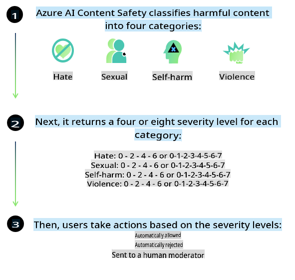
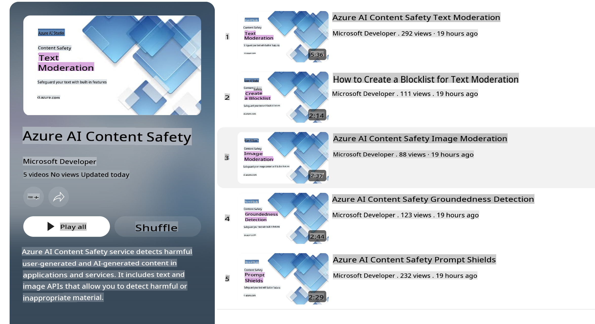

# AI Safety for Phi Models

The Phi family of models was developed in alignment with the [Microsoft Responsible AI Standard](https://query.prod.cms.rt.microsoft.com/cms/api/am/binary/RE5cmFl), a company-wide set of guidelines based on six principles: accountability, transparency, fairness, reliability and safety, privacy and security, and inclusiveness. These principles form the foundation of [Microsoft’s Responsible AI principles](https://www.microsoft.com/ai/responsible-ai).

As with previous Phi models, a comprehensive safety evaluation and post-training safety approach were employed, with additional measures to address the multilingual capabilities of this release. Our approach to safety training and evaluation, including testing across various languages and risk categories, is detailed in the [Phi Safety Post-Training Paper](https://arxiv.org/abs/2407.13833). While the Phi models benefit from these efforts, developers should adopt responsible AI best practices, including identifying, measuring, and mitigating risks relevant to their specific use case and cultural and linguistic context.

## Best Practices

Like other models, the Phi family of models may exhibit behaviors that are unfair, unreliable, or offensive.

Some limitations of SLMs and LLMs that you should be aware of include:

- **Quality of Service:** The Phi models are primarily trained on English text. Performance in languages other than English will be lower. Varieties of English that are underrepresented in the training data may also perform worse than standard American English.
- **Representation of Harms & Perpetuation of Stereotypes:** These models may over- or under-represent certain groups, omit representation of some groups, or reinforce harmful stereotypes. Despite post-training safety measures, these limitations can persist due to differences in the representation of groups or the presence of negative stereotypes in the training data, which reflect real-world patterns and societal biases.
- **Inappropriate or Offensive Content:** The models may generate inappropriate or offensive content, making them unsuitable for deployment in sensitive contexts without additional mitigations tailored to the specific use case.
- **Information Reliability:** Language models can produce nonsensical or fabricated content that may sound plausible but is inaccurate or outdated.
- **Limited Scope for Code:** Most of the Phi-3 training data is based on Python and common packages such as "typing, math, random, collections, datetime, itertools." If the model generates Python scripts using other packages or scripts in other languages, we strongly recommend manually verifying all API usage.

Developers should adhere to responsible AI best practices and ensure their specific use case complies with relevant laws and regulations (e.g., privacy, trade, etc.).

## Responsible AI Considerations

Similar to other language models, the Phi series models may exhibit behaviors that are unfair, unreliable, or offensive. Key limitations to consider include:

**Quality of Service:** The Phi models are primarily trained on English text. Performance in languages other than English will be lower. Varieties of English that are underrepresented in the training data may also perform worse than standard American English.

**Representation of Harms & Perpetuation of Stereotypes:** These models may over- or under-represent certain groups, omit representation of some groups, or reinforce harmful stereotypes. Despite post-training safety measures, these limitations can persist due to differences in the representation of groups or the presence of negative stereotypes in the training data, which reflect real-world patterns and societal biases.

**Inappropriate or Offensive Content:** The models may generate inappropriate or offensive content, making them unsuitable for deployment in sensitive contexts without additional mitigations tailored to the specific use case.

**Information Reliability:** Language models can produce nonsensical or fabricated content that may sound plausible but is inaccurate or outdated.

**Limited Scope for Code:** Most of the Phi-3 training data is based on Python and common packages such as "typing, math, random, collections, datetime, itertools." If the model generates Python scripts using other packages or scripts in other languages, we strongly recommend manually verifying all API usage.

Developers should adhere to responsible AI best practices and ensure their specific use case complies with relevant laws and regulations (e.g., privacy, trade, etc.). Important considerations include:

**Allocation:** Models may not be suitable for scenarios that significantly impact legal status, resource distribution, or life opportunities (e.g., housing, employment, credit) without further assessments and additional debiasing techniques.

**High-Risk Scenarios:** Developers should evaluate the appropriateness of using models in high-risk situations where unfair, unreliable, or offensive outputs could have severe consequences or cause harm. This includes providing advice in sensitive or expert domains where accuracy and reliability are critical (e.g., legal or health advice). Additional safeguards should be implemented at the application level, depending on the deployment context.

**Misinformation:** Models may produce inaccurate information. Developers should follow transparency best practices and inform end-users that they are interacting with an AI system. At the application level, developers can implement feedback mechanisms and pipelines to ground responses in contextual, use-case-specific information, a technique known as Retrieval Augmented Generation (RAG).

**Generation of Harmful Content:** Developers should evaluate outputs in their specific context and use available safety classifiers or custom solutions tailored to their use case.

**Misuse:** Misuse such as fraud, spam, or malware production may be possible. Developers should ensure their applications comply with applicable laws and regulations.

### Fine-Tuning and AI Content Safety

After fine-tuning a model, we strongly recommend using [Azure AI Content Safety](https://learn.microsoft.com/azure/ai-services/content-safety/overview) to monitor the content generated by the models and identify and block potential risks, threats, and quality issues.

[Azure AI Content Safety](https://learn.microsoft.com/azure/ai-services/content-safety/overview) supports both text and image content. It can be deployed in the cloud, as disconnected containers, or on edge/embedded devices.

## Overview of Azure AI Content Safety

Azure AI Content Safety is not a one-size-fits-all solution; it can be tailored to align with a business’s specific policies. Additionally, its multilingual models enable it to understand multiple languages simultaneously.

- **Azure AI Content Safety**
- **Microsoft Developer**
- **5 videos**

The Azure AI Content Safety service detects harmful user-generated and AI-generated content in applications and services. It includes text and image APIs to identify harmful or inappropriate material.

[AI Content Safety Playlist](https://www.youtube.com/playlist?list=PLlrxD0HtieHjaQ9bJjyp1T7FeCbmVcPkQ)

**Disclaimer**:  
This document has been translated using machine-based AI translation services. While we strive for accuracy, please be aware that automated translations may contain errors or inaccuracies. The original document in its native language should be considered the authoritative source. For critical information, professional human translation is recommended. We are not liable for any misunderstandings or misinterpretations arising from the use of this translation.