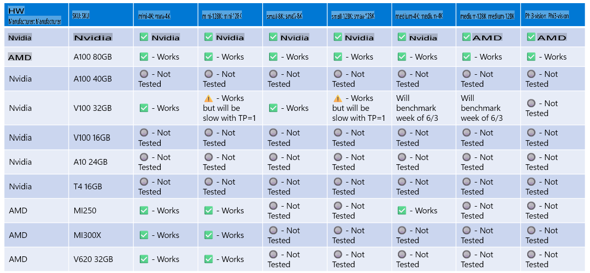

# Phi Hardware Support

Microsoft Phi is optimized for ONNX Runtime and supports Windows DirectML. It performs well across a variety of hardware, including GPUs, CPUs, and even mobile devices.

## Device Hardware
Specifically, the supported hardware includes:

- GPU SKU: RTX 4090 (DirectML)
- GPU SKU: 1 A100 80GB (CUDA)
- CPU SKU: Standard F64s v2 (64 vCPUs, 128 GiB memory)

## Mobile SKU

- Android - Samsung Galaxy S21
- Apple iPhone 14 or newer with A16/A17 Processor

## Phi Hardware Specification

- Minimum Configuration Required:
  - Windows: DirectX 12-capable GPU and at least 4GB of combined RAM
  - CUDA: NVIDIA GPU with Compute Capability >= 7.02



## Running onnxruntime on multiple GPUs

Currently, the available Phi ONNX models are designed for a single GPU. While it's technically possible to support multiple GPUs for Phi models, using ORT with 2 GPUs does not guarantee higher throughput compared to running two separate instances of ORT. For the latest updates, please refer to [ONNX Runtime](https://onnxruntime.ai/).

At [Build 2024, the GenAI ONNX Team](https://youtu.be/WLW4SE8M9i8?si=EtG04UwDvcjunyfC) announced that they had enabled multi-instance support instead of multi-GPU for Phi models.

This currently allows you to run one onnxruntime or onnxruntime-genai instance using the CUDA_VISIBLE_DEVICES environment variable, as shown below:

```Python
CUDA_VISIBLE_DEVICES=0 python infer.py
CUDA_VISIBLE_DEVICES=1 python infer.py
```

Feel free to explore more about Phi at [Azure AI Foundry](https://ai.azure.com).

**Disclaimer**:  
This document has been translated using machine-based AI translation services. While we strive for accuracy, please be aware that automated translations may contain errors or inaccuracies. The original document in its native language should be considered the authoritative source. For critical information, professional human translation is recommended. We are not liable for any misunderstandings or misinterpretations arising from the use of this translation.