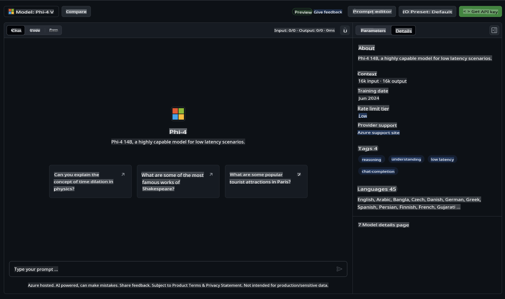

## Phi Family in GitHub Models

Welcome to [GitHub Models](https://github.com/marketplace/models)! We’ve got everything set up for you to explore AI Models hosted on Azure AI.


For more details about the Models available on GitHub Models, visit the [GitHub Model Marketplace](https://github.com/marketplace/models).

## Models Available

Each model comes with a dedicated playground and sample code.



### Phi Family in GitHub Model Catalog

- [Phi-4](https://github.com/marketplace/models/azureml/Phi-4)

- [Phi-3.5-MoE instruct (128k)](https://github.com/marketplace/models/azureml/Phi-3-5-MoE-instruct)

- [Phi-3.5-vision instruct (128k)](https://github.com/marketplace/models/azureml/Phi-3-5-vision-instruct)

- [Phi-3.5-mini instruct (128k)](https://github.com/marketplace/models/azureml/Phi-3-5-mini-instruct)

- [Phi-3-Medium-128k-Instruct](https://github.com/marketplace/models/azureml/Phi-3-medium-128k-instruct)

- [Phi-3-medium-4k-instruct](https://github.com/marketplace/models/azureml/Phi-3-medium-4k-instruct)

- [Phi-3-mini-128k-instruct](https://github.com/marketplace/models/azureml/Phi-3-mini-128k-instruct)

- [Phi-3-mini-4k-instruct](https://github.com/marketplace/models/azureml/Phi-3-mini-4k-instruct)

- [Phi-3-small-128k-instruct](https://github.com/marketplace/models/azureml/Phi-3-small-128k-instruct)

- [Phi-3-small-8k-instruct](https://github.com/marketplace/models/azureml/Phi-3-small-8k-instruct)

## Getting Started

We’ve prepared some basic examples for you to run. You can find them in the samples directory. If you prefer to start with your favorite programming language, examples are available in the following languages:

- Python
- JavaScript
- C#
- Java
- cURL

There’s also a dedicated Codespaces Environment for running the samples and models.


## Sample Code

Below are some example code snippets for different use cases. For more information about Azure AI Inference SDK, refer to the full documentation and samples.

## Setup

1. Create a personal access token  
   You don’t need to grant any permissions to the token. Note that the token will be sent to a Microsoft service.

To use the code snippets below, create an environment variable to set your token as the key for the client code.

If you’re using bash:  
```
export GITHUB_TOKEN="<your-github-token-goes-here>"
```  
If you’re in PowerShell:  
```
$Env:GITHUB_TOKEN="<your-github-token-goes-here>"
```  

If you’re using the Windows command prompt:  
```
set GITHUB_TOKEN=<your-github-token-goes-here>
```  

## Python Sample

### Install dependencies  
Install the Azure AI Inference SDK using pip (Requires: Python >=3.8):  
```
pip install azure-ai-inference
```  

### Run a basic code sample  

This sample shows how to make a basic call to the chat completion API. It uses the GitHub AI model inference endpoint and your GitHub token. The call is synchronous.  
```python
import os
from azure.ai.inference import ChatCompletionsClient
from azure.ai.inference.models import SystemMessage, UserMessage
from azure.core.credentials import AzureKeyCredential

endpoint = "https://models.inference.ai.azure.com"
model_name = "Phi-4"
token = os.environ["GITHUB_TOKEN"]

client = ChatCompletionsClient(
    endpoint=endpoint,
    credential=AzureKeyCredential(token),
)

response = client.complete(
    messages=[
        UserMessage(content="I have $20,000 in my savings account, where I receive a 4% profit per year and payments twice a year. Can you please tell me how long it will take for me to become a millionaire? Also, can you please explain the math step by step as if you were explaining it to an uneducated person?"),
    ],
    temperature=0.4,
    top_p=1.0,
    max_tokens=2048,
    model=model_name
)

print(response.choices[0].message.content)
```  

### Run a multi-turn conversation  

This sample demonstrates a multi-turn conversation using the chat completion API. When building a chat application, you’ll need to manage the conversation history and send the latest messages to the model.  
```
import os
from azure.ai.inference import ChatCompletionsClient
from azure.ai.inference.models import AssistantMessage, SystemMessage, UserMessage
from azure.core.credentials import AzureKeyCredential

token = os.environ["GITHUB_TOKEN"]
endpoint = "https://models.inference.ai.azure.com"
# Replace Model_Name
model_name = "Phi-4"

client = ChatCompletionsClient(
    endpoint=endpoint,
    credential=AzureKeyCredential(token),
)

messages = [
    SystemMessage(content="You are a helpful assistant."),
    UserMessage(content="What is the capital of France?"),
    AssistantMessage(content="The capital of France is Paris."),
    UserMessage(content="What about Spain?"),
]

response = client.complete(messages=messages, model=model_name)

print(response.choices[0].message.content)
```  

### Stream the output  

For a smoother user experience, you can stream the model’s response so that the first token appears early, avoiding long wait times for responses.  
```
import os
from azure.ai.inference import ChatCompletionsClient
from azure.ai.inference.models import SystemMessage, UserMessage
from azure.core.credentials import AzureKeyCredential

token = os.environ["GITHUB_TOKEN"]
endpoint = "https://models.inference.ai.azure.com"
# Replace Model_Name
model_name = "Phi-4"

client = ChatCompletionsClient(
    endpoint=endpoint,
    credential=AzureKeyCredential(token),
)

response = client.complete(
    stream=True,
    messages=[
        SystemMessage(content="You are a helpful assistant."),
        UserMessage(content="Give me 5 good reasons why I should exercise every day."),
    ],
    model=model_name,
)

for update in response:
    if update.choices:
        print(update.choices[0].delta.content or "", end="")

client.close()
```  

## FREE Usage and Rate Limits for GitHub Models


The [rate limits for the playground and free API usage](https://docs.github.com/en/github-models/prototyping-with-ai-models#rate-limits) are designed to help you experiment with models and prototype your AI application. For usage beyond these limits, or to scale your application, you’ll need to provision resources from an Azure account and authenticate through it instead of using your GitHub personal access token. No changes to your code are required. Use this link to learn how to exceed the free tier limits in Azure AI.

### Disclosures  

Keep in mind that when interacting with a model, you are experimenting with AI, and errors in the content are possible.

This feature is subject to various limits (including requests per minute, requests per day, tokens per request, and concurrent requests) and is not intended for production use cases.

GitHub Models use Azure AI Content Safety. These filters cannot be disabled as part of the GitHub Models experience. If you decide to use models through a paid service, configure your content filters to meet your needs.

This service is governed by GitHub’s Pre-release Terms.

**Disclaimer**:  
This document has been translated using machine-based AI translation services. While we strive for accuracy, please note that automated translations may contain errors or inaccuracies. The original document in its native language should be regarded as the authoritative source. For critical information, professional human translation is recommended. We are not responsible for any misunderstandings or misinterpretations resulting from the use of this translation.