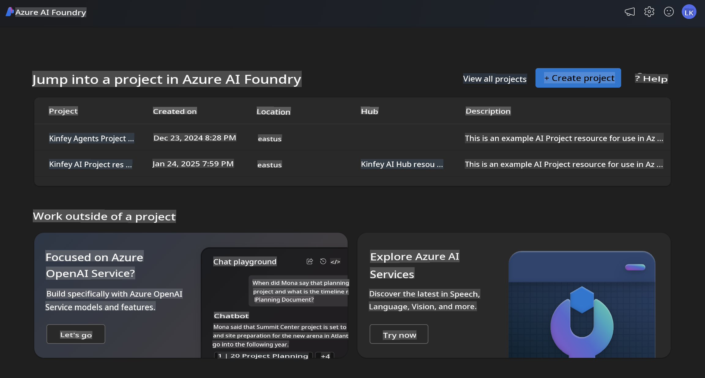
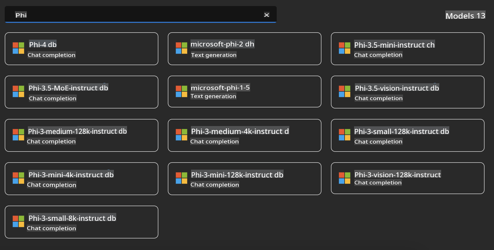
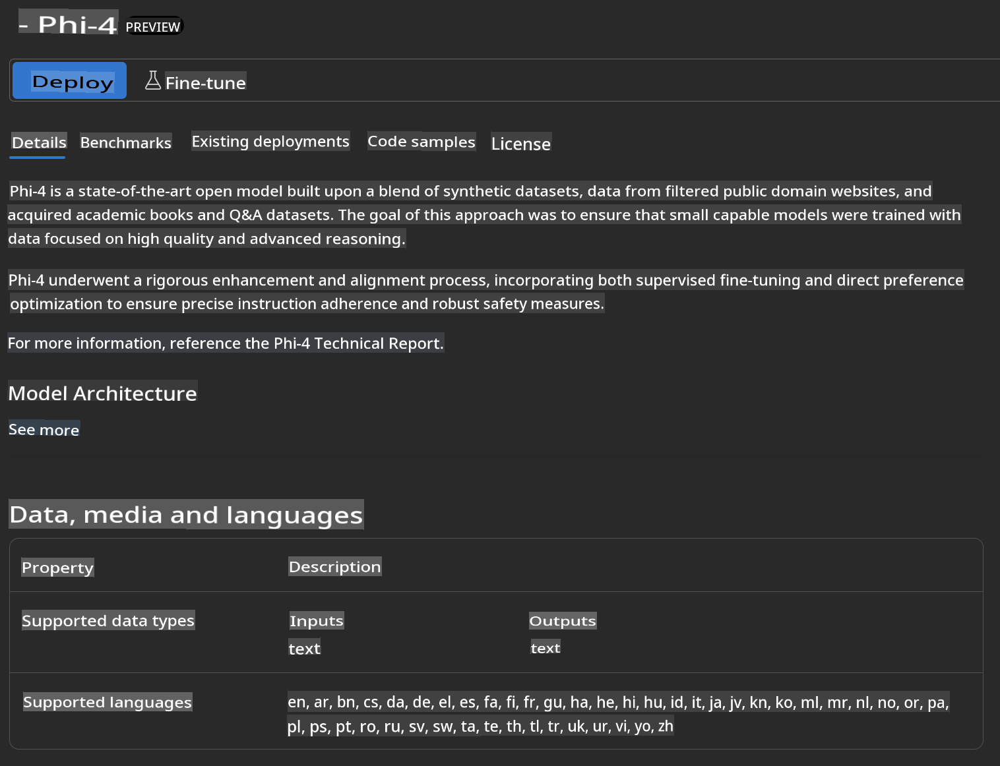
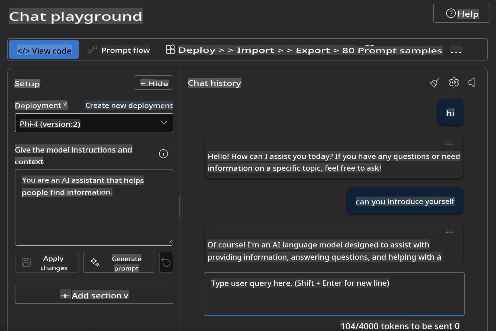

## Phi Family in Azure AI Foundry

[Azure AI Foundry](https://ai.azure.com) is a reliable platform that enables developers to innovate and shape the future with AI in a secure, safe, and responsible manner.

[Azure AI Foundry](https://ai.azure.com) is designed to help developers:

- Build generative AI applications on a platform built for enterprise use.
- Explore, create, test, and deploy using advanced AI tools and ML models, all grounded in responsible AI principles.
- Collaborate with a team throughout the entire application development lifecycle.

With Azure AI Foundry, you can explore a wide range of models, services, and capabilities to build AI applications that align with your goals. The platform supports scalability, making it easier to transform proof-of-concept ideas into fully operational production applications. Continuous monitoring and optimization ensure long-term success.



In addition to leveraging Azure AOAI Service within Azure AI Foundry, you can also use third-party models available in the Azure AI Foundry Model Catalog. This is a great option if you want to use Azure AI Foundry as your primary AI solution platform.

The Phi Family Models can be quickly deployed through the Model Catalog in Azure AI Foundry.



### **Deploy Phi-4 in Azure AI Foundry**



### **Test Phi-4 in Azure AI Foundry Playground**



### **Running Python Code to call Azure AI Foundry Phi-4**

```python

import os  
import base64
from openai import AzureOpenAI  
from azure.identity import DefaultAzureCredential, get_bearer_token_provider  
        
endpoint = os.getenv("ENDPOINT_URL", "Your Azure AOAI Service Endpoint")  
deployment = os.getenv("DEPLOYMENT_NAME", "Phi-4")  
      
token_provider = get_bearer_token_provider(  
    DefaultAzureCredential(),  
    "https://cognitiveservices.azure.com/.default"  
)  
  
client = AzureOpenAI(  
    azure_endpoint=endpoint,  
    azure_ad_token_provider=token_provider,  
    api_version="2024-05-01-preview",  
)  
  

chat_prompt = [
    {
        "role": "system",
        "content": "You are an AI assistant that helps people find information."
    },
    {
        "role": "user",
        "content": "can you introduce yourself"
    }
] 
    
# Include speech result if speech is enabled  
messages = chat_prompt 

completion = client.chat.completions.create(  
    model=deployment,  
    messages=messages,
    max_tokens=800,  
    temperature=0.7,  
    top_p=0.95,  
    frequency_penalty=0,  
    presence_penalty=0,
    stop=None,  
    stream=False  
)  
  
print(completion.to_json())  

```

**Disclaimer**:  
This document has been translated using machine-based AI translation services. While we strive for accuracy, please note that automated translations may contain errors or inaccuracies. The original document in its native language should be regarded as the authoritative source. For critical information, professional human translation is recommended. We are not responsible for any misunderstandings or misinterpretations resulting from the use of this translation.