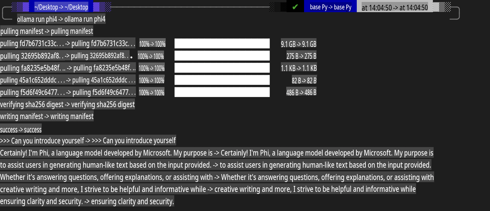
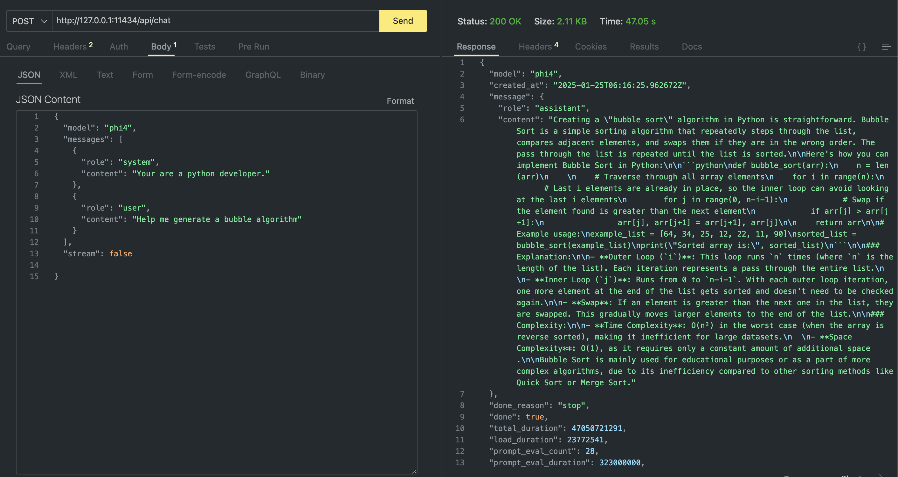

## Phi Family in Ollama

[Ollama](https://ollama.com) makes it easier for more people to deploy open-source LLM or SLM directly through simple scripts. It can also create APIs to support local Copilot application scenarios.

## **1. Installation**

Ollama is compatible with Windows, macOS, and Linux. You can download Ollama using this link: ([https://ollama.com/download](https://ollama.com/download)). Once installed, you can use the Ollama script to call Phi-3 directly from the terminal. You can view all the [available libraries in Ollama](https://ollama.com/library). If you open this repository in a Codespace, Ollama will already be installed.

```bash

ollama run phi4

```

> [!NOTE]
> The model will be downloaded the first time you run it. Alternatively, you can specify the downloaded Phi-4 model directly. In this example, we use WSL to run the command. After the model is downloaded successfully, you can interact directly in the terminal.



## **2. Call the Phi-4 API from Ollama**

To call the Phi-4 API generated by Ollama, use the following command in the terminal to start the Ollama server.

```bash

ollama serve

```

> [!NOTE]
> If you're using macOS or Linux, you might encounter the following error: **"Error: listen tcp 127.0.0.1:11434: bind: address already in use."** This typically means the server is already running. You can either ignore the error or stop and restart Ollama:

**macOS**

```bash

brew services restart ollama

```

**Linux**

```bash

sudo systemctl stop ollama

```

Ollama provides two APIs: generate and chat. Depending on your needs, you can call the model API provided by Ollama by sending requests to the local service running on port 11434.

**Chat**

```bash

curl http://127.0.0.1:11434/api/chat -d '{
  "model": "phi3",
  "messages": [
    {
      "role": "system",
      "content": "Your are a python developer."
    },
    {
      "role": "user",
      "content": "Help me generate a bubble algorithm"
    }
  ],
  "stream": false
  
}'

This is the result in Postman



## Additional Resources

Check the list of available models in Ollama in [their library](https://ollama.com/library).

Pull your model from the Ollama server using this command

```bash
ollama pull phi4
```

Run the model using this command

```bash
ollama run phi4
```

***Note:*** Visit this link [https://github.com/ollama/ollama/blob/main/docs/api.md](https://github.com/ollama/ollama/blob/main/docs/api.md) to learn more

## Calling Ollama from Python

You can use `requests` or `urllib3` to make requests to the local server endpoints used above. However, a popular way to use Ollama in Python is via the [openai](https://pypi.org/project/openai/) SDK, since Ollama provides OpenAI-compatible server endpoints as well.

Here is an example for phi3-mini:

```python
import openai

client = openai.OpenAI(
    base_url="http://localhost:11434/v1",
    api_key="nokeyneeded",
)

response = client.chat.completions.create(
    model="phi4",
    temperature=0.7,
    n=1,
    messages=[
        {"role": "system", "content": "You are a helpful assistant."},
        {"role": "user", "content": "Write a haiku about a hungry cat"},
    ],
)

print("Response:")
print(response.choices[0].message.content)
```

## Calling Ollama from JavaScript 

```javascript
// Example of Summarizing a file with Phi-4
script({
    model: "ollama:phi4",
    title: "Summarize with Phi-4",
    system: ["system"],
})

// Example of summarize
const file = def("FILE", env.files)
$`Summarize ${file} in a single paragraph.`
```

## Calling Ollama from C#

Create a new C# Console application and add the following NuGet package:

```bash
dotnet add package Microsoft.SemanticKernel --version 1.34.0
```

Then replace this code in the `Program.cs` file

```csharp
using Microsoft.SemanticKernel;
using Microsoft.SemanticKernel.ChatCompletion;

// add chat completion service using the local ollama server endpoint
#pragma warning disable SKEXP0001, SKEXP0003, SKEXP0010, SKEXP0011, SKEXP0050, SKEXP0052
builder.AddOpenAIChatCompletion(
    modelId: "phi4",
    endpoint: new Uri("http://localhost:11434/"),
    apiKey: "non required");

// invoke a simple prompt to the chat service
string prompt = "Write a joke about kittens";
var response = await kernel.InvokePromptAsync(prompt);
Console.WriteLine(response.GetValue<string>());
```

Run the app with the command:

```bash
dotnet run

**Disclaimer**:  
This document has been translated using machine-based AI translation services. While we strive for accuracy, please be aware that automated translations may contain errors or inaccuracies. The original document in its native language should be considered the authoritative source. For critical information, professional human translation is recommended. We are not liable for any misunderstandings or misinterpretations arising from the use of this translation.