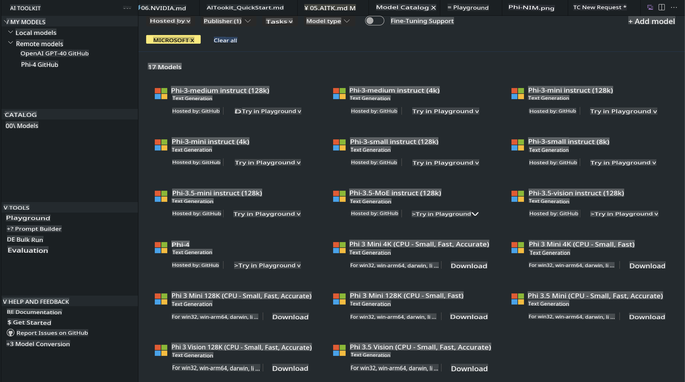
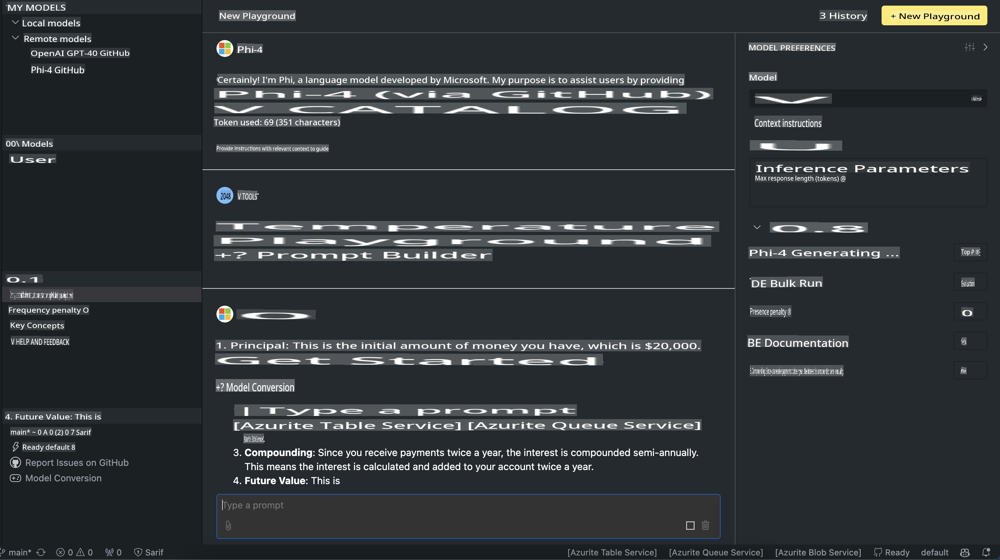

# Phi Family in AITK

[AI Toolkit for VS Code](https://marketplace.visualstudio.com/items?itemName=ms-windows-ai-studio.windows-ai-studio) simplifies the development of generative AI applications by combining state-of-the-art AI development tools and models from the Azure AI Foundry Catalog and other sources like Hugging Face. You can browse AI model catalogs powered by GitHub Models and Azure AI Foundry Model Catalogs, download them locally or remotely, fine-tune, test, and integrate them into your applications.

The AI Toolkit Preview operates locally. Depending on the model you choose, tasks like local inference or fine-tuning may require a GPU, such as an NVIDIA CUDA GPU. You can also directly run GitHub Models with AITK.

## Getting Started

[Learn more about installing Windows Subsystem for Linux](https://learn.microsoft.com/windows/wsl/install?WT.mc_id=aiml-137032-kinfeylo)

and [changing the default distribution](https://learn.microsoft.com/windows/wsl/install#change-the-default-linux-distribution-installed).

[AI Toolkit GitHub Repo](https://github.com/microsoft/vscode-ai-toolkit/)

- Windows, Linux, macOS

- For fine-tuning on both Windows and Linux, an Nvidia GPU is required. Additionally, **Windows** requires the Windows Subsystem for Linux with an Ubuntu distribution version 18.4 or later. [Learn more about installing the Windows Subsystem for Linux](https://learn.microsoft.com/windows/wsl/install) and [changing the default distribution](https://learn.microsoft.com/windows/wsl/install#change-the-default-linux-distribution-installed).

### Install AI Toolkit

The AI Toolkit is provided as a [Visual Studio Code Extension](https://code.visualstudio.com/docs/setup/additional-components#_vs-code-extensions), so you’ll first need to install [VS Code](https://code.visualstudio.com/docs/setup/windows?WT.mc_id=aiml-137032-kinfeylo) and then download the AI Toolkit from the [VS Marketplace](https://marketplace.visualstudio.com/items?itemName=ms-windows-ai-studio.windows-ai-studio).  
The [AI Toolkit is available in the Visual Studio Marketplace](https://marketplace.visualstudio.com/items?itemName=ms-windows-ai-studio.windows-ai-studio) and can be installed just like any other VS Code extension.

If you’re new to installing VS Code extensions, follow these steps:

### Sign In

1. In the Activity Bar in VS Code, select **Extensions**.
2. In the Extensions Search bar, type "AI Toolkit".
3. Select "AI Toolkit for Visual Studio Code".
4. Click **Install**.

Now you’re ready to use the extension!

You’ll be prompted to sign in to GitHub. Please click "Allow" to proceed. You’ll be redirected to the GitHub sign-in page.

Log in and follow the steps provided. Once the process is complete, you’ll be redirected to VS Code.

After installation, the AI Toolkit icon will appear in your Activity Bar.

Let’s explore the available features!

### Available Actions

The main sidebar of the AI Toolkit is divided into:

- **Models**
- **Resources**
- **Playground**
- **Fine-tuning**
- **Evaluation**

These features are available in the Resources section. To begin, select **Model Catalog**.

### Download a Model from the Catalog

When you launch the AI Toolkit from the VS Code sidebar, you can choose from the following options:



- Search for a supported model in the **Model Catalog** and download it locally.
- Test model inference in the **Model Playground**.
- Fine-tune the model locally or remotely in **Model Fine-tuning**.
- Deploy fine-tuned models to the cloud via the AI Toolkit command palette.
- Evaluate models.

> [!NOTE]
>
> **GPU vs CPU**
>
> The model cards display the model size, platform, and accelerator type (CPU, GPU). For optimal performance on **Windows devices with at least one GPU**, choose model versions specifically designed for Windows.
>
> This ensures the model is optimized for the DirectML accelerator.
>
> The model names follow the format:
>
> - `{model_name}-{accelerator}-{quantization}-{format}`.
>
> To check if your Windows device has a GPU, open **Task Manager** and go to the **Performance** tab. If GPUs are available, they will appear as "GPU 0," "GPU 1," and so on.

### Run the Model in the Playground

Once all parameters are set, click **Generate Project**.

After downloading your model, select **Load in Playground** from the model card in the catalog:

- Start the model download.
- Install all necessary prerequisites and dependencies.
- Create a VS Code workspace.



### Use the REST API in Your Application

The AI Toolkit includes a local REST API web server **on port 5272** that follows the [OpenAI chat completions format](https://platform.openai.com/docs/api-reference/chat/create).

This allows you to test your application locally without relying on a cloud-based AI model service. For example, the following JSON file demonstrates how to configure the request body:

```json
{
    "model": "Phi-4",
    "messages": [
        {
            "role": "user",
            "content": "what is the golden ratio?"
        }
    ],
    "temperature": 0.7,
    "top_p": 1,
    "top_k": 10,
    "max_tokens": 100,
    "stream": true
}
```

You can test the REST API using tools like [Postman](https://www.postman.com/) or the CURL (Client URL) utility:

```bash
curl -vX POST http://127.0.0.1:5272/v1/chat/completions -H 'Content-Type: application/json' -d @body.json
```

### Using the OpenAI Client Library for Python

```python
from openai import OpenAI

client = OpenAI(
    base_url="http://127.0.0.1:5272/v1/", 
    api_key="x" # required for the API but not used
)

chat_completion = client.chat.completions.create(
    messages=[
        {
            "role": "user",
            "content": "what is the golden ratio?",
        }
    ],
    model="Phi-4",
)

print(chat_completion.choices[0].message.content)
```

### Using the Azure OpenAI Client Library for .NET

Add the [Azure OpenAI client library for .NET](https://www.nuget.org/packages/Azure.AI.OpenAI/) to your project using NuGet:

```bash
dotnet add {project_name} package Azure.AI.OpenAI --version 1.0.0-beta.17
```

Create a C# file called **OverridePolicy.cs** in your project and paste the following code:

```csharp
// OverridePolicy.cs
using Azure.Core.Pipeline;
using Azure.Core;

internal partial class OverrideRequestUriPolicy(Uri overrideUri)
    : HttpPipelineSynchronousPolicy
{
    private readonly Uri _overrideUri = overrideUri;

    public override void OnSendingRequest(HttpMessage message)
    {
        message.Request.Uri.Reset(_overrideUri);
    }
}
```

Then, add the following code to your **Program.cs** file:

```csharp
// Program.cs
using Azure.AI.OpenAI;

Uri localhostUri = new("http://localhost:5272/v1/chat/completions");

OpenAIClientOptions clientOptions = new();
clientOptions.AddPolicy(
    new OverrideRequestUriPolicy(localhostUri),
    Azure.Core.HttpPipelinePosition.BeforeTransport);
OpenAIClient client = new(openAIApiKey: "unused", clientOptions);

ChatCompletionsOptions options = new()
{
    DeploymentName = "Phi-4",
    Messages =
    {
        new ChatRequestSystemMessage("You are a helpful assistant. Be brief and succinct."),
        new ChatRequestUserMessage("What is the golden ratio?"),
    }
};

StreamingResponse<StreamingChatCompletionsUpdate> streamingChatResponse
    = await client.GetChatCompletionsStreamingAsync(options);

await foreach (StreamingChatCompletionsUpdate chatChunk in streamingChatResponse)
{
    Console.Write(chatChunk.ContentUpdate);
}
```

## Fine-Tuning with AI Toolkit

- Begin with model discovery and the playground.
- Perform model fine-tuning and inference using local computing resources.
- Conduct remote fine-tuning and inference using Azure resources.

[Fine-Tuning with AI Toolkit](../../03.FineTuning/Finetuning_VSCodeaitoolkit.md)

## AI Toolkit Q&A Resources

For common issues and solutions, refer to our [Q&A page](https://github.com/microsoft/vscode-ai-toolkit/blob/main/archive/QA.md).

**Disclaimer**:  
This document has been translated using machine-based AI translation services. While we strive for accuracy, please note that automated translations may contain errors or inaccuracies. The original document in its native language should be regarded as the authoritative source. For critical information, professional human translation is recommended. We are not responsible for any misunderstandings or misinterpretations resulting from the use of this translation.