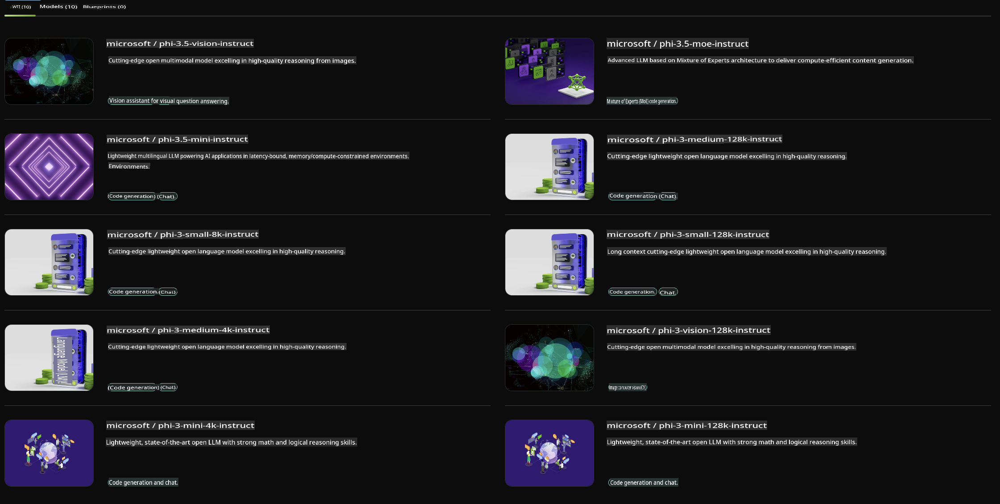

## Phi Family in NVIDIA NIM

NVIDIA NIM is a suite of user-friendly microservices designed to streamline the deployment of generative AI models across cloud, data center, and workstation environments. NIMs are organized by model family and individual models. For instance, NVIDIA NIM for large language models (LLMs) empowers enterprise applications with cutting-edge LLMs, offering unmatched natural language processing and understanding capabilities.

NIM enables IT and DevOps teams to self-host large language models (LLMs) within their own managed environments, while still providing developers with industry-standard APIs. These APIs allow them to create powerful copilots, chatbots, and AI assistants that can transform their business operations. By leveraging NVIDIA’s state-of-the-art GPU acceleration and scalable deployment, NIM delivers the fastest path to inference with exceptional performance.

You can use NVIDIA NIM to run inference on Phi Family Models.



### **Examples - Phi-3-Vision in NVIDIA NIM**

Imagine you have an image (`demo.png`) and you want to generate Python code to process this image and save a new version of it (`phi-3-vision.jpg`).

The code below automates this process by:

1. Setting up the environment and necessary configurations.
2. Creating a prompt to instruct the model to generate the required Python code.
3. Sending the prompt to the model and retrieving the generated code.
4. Extracting and executing the generated code.
5. Displaying the original and processed images.

This method harnesses the power of AI to automate image processing tasks, making it faster and more efficient to achieve your objectives.

[Sample Code Solution](../../../../../code/06.E2E/E2E_Nvidia_NIM_Phi3_Vision.ipynb)

Here’s a step-by-step breakdown of what the entire code does:

1. **Install Required Package**:
    ```python
    !pip install langchain_nvidia_ai_endpoints -U
    ```
    This command ensures the `langchain_nvidia_ai_endpoints` package is installed and up to date.

2. **Import Necessary Modules**:
    ```python
    from langchain_nvidia_ai_endpoints import ChatNVIDIA
    import getpass
    import os
    import base64
    ```
    These imports include modules for interacting with NVIDIA AI endpoints, securely handling passwords, interacting with the operating system, and encoding/decoding data in base64 format.

3. **Set Up API Key**:
    ```python
    if not os.getenv("NVIDIA_API_KEY"):
        os.environ["NVIDIA_API_KEY"] = getpass.getpass("Enter your NVIDIA API key: ")
    ```
    This code verifies if the `NVIDIA_API_KEY` environment variable is set. If not, it securely prompts the user to input their API key.

4. **Define Model and Image Path**:
    ```python
    model = 'microsoft/phi-3-vision-128k-instruct'
    chat = ChatNVIDIA(model=model)
    img_path = './imgs/demo.png'
    ```
    This specifies the model to use, initializes an instance of `ChatNVIDIA` with the chosen model, and defines the path to the image file.

5. **Create Text Prompt**:
    ```python
    text = "Please create Python code for image, and use plt to save the new picture under imgs/ and name it phi-3-vision.jpg."
    ```
    This defines a text prompt instructing the model to generate Python code for processing an image.

6. **Encode Image in Base64**:
    ```python
    with open(img_path, "rb") as f:
        image_b64 = base64.b64encode(f.read()).decode()
    image = f''
    ```
    This reads the image file, encodes it in base64, and creates an HTML image tag with the encoded data.

7. **Combine Text and Image into Prompt**:
    ```python
    prompt = f"{text} {image}"
    ```
    This combines the text prompt and the HTML image tag into one string.

8. **Generate Code Using ChatNVIDIA**:
    ```python
    code = ""
    for chunk in chat.stream(prompt):
        print(chunk.content, end="")
        code += chunk.content
    ```
    This sends the prompt to the `ChatNVIDIA` model and collects the generated code in chunks, printing and appending each chunk to the `code` string.

9. **Extract Python Code from Generated Content**:
    ```python
    begin = code.index('```python') + 9
    code = code[begin:]
    end = code.index('```')
    code = code[:end]
    ```
    This extracts the Python code from the generated content, stripping out the markdown formatting.

10. **Run the Generated Code**:
    ```python
    import subprocess
    result = subprocess.run(["python", "-c", code], capture_output=True)
    ```
    This executes the extracted Python code as a subprocess and captures its output.

11. **Display Images**:
    ```python
    from IPython.display import Image, display
    display(Image(filename='./imgs/phi-3-vision.jpg'))
    display(Image(filename='./imgs/demo.png'))
    ```
    These lines use the `IPython.display` module to display the original and processed images.

**Disclaimer**:  
This document has been translated using machine-based AI translation services. While we strive for accuracy, please note that automated translations may contain errors or inaccuracies. The original document in its native language should be regarded as the authoritative source. For critical information, professional human translation is recommended. We are not responsible for any misunderstandings or misinterpretations resulting from the use of this translation.