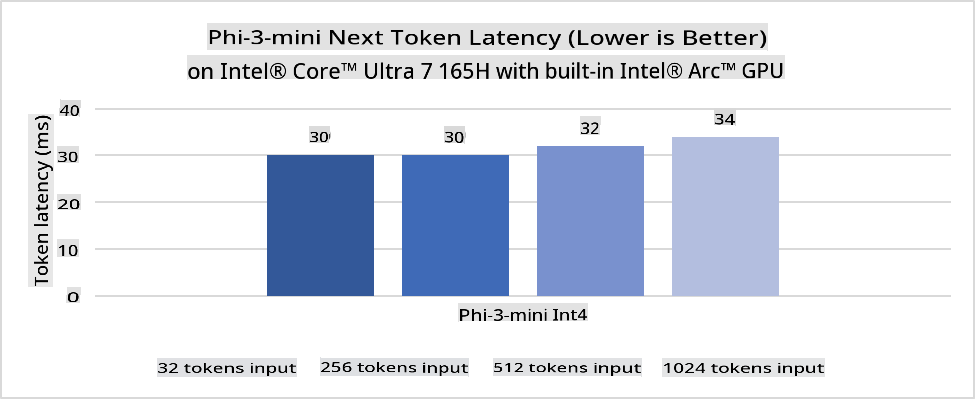
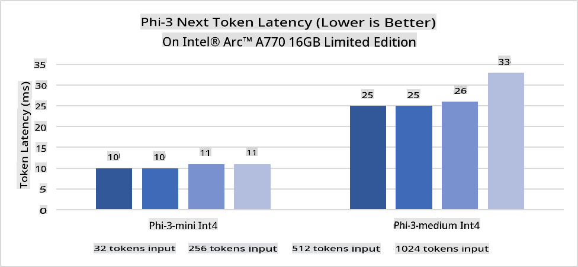
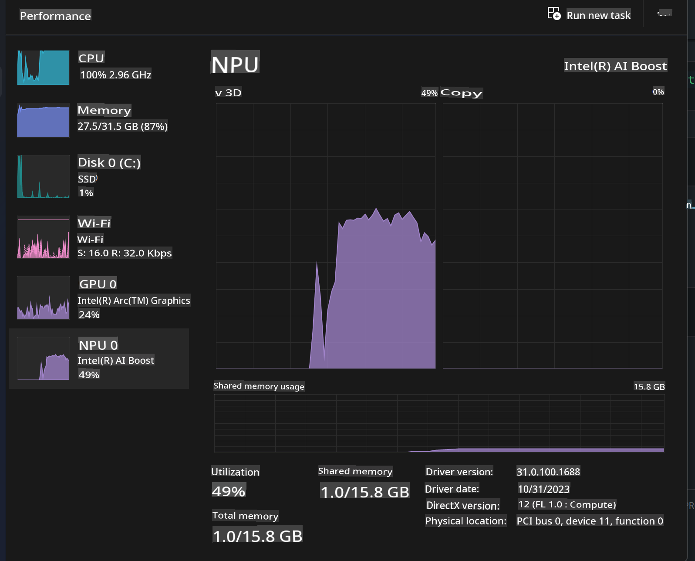
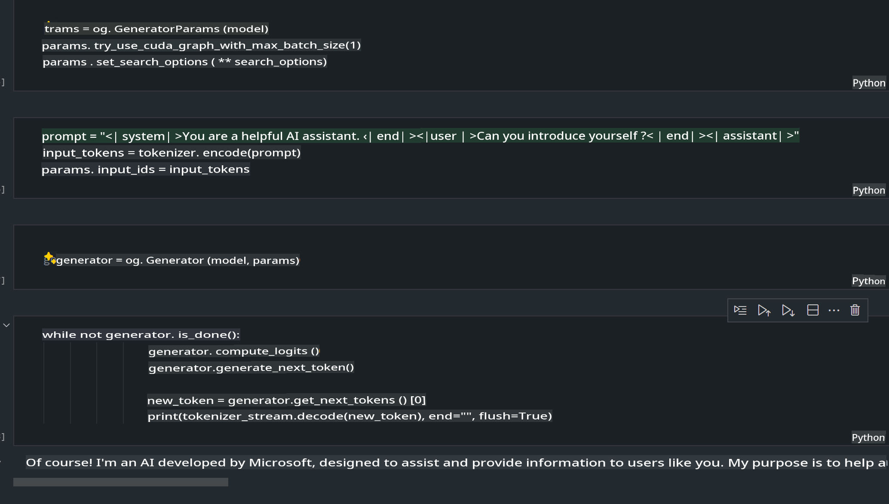
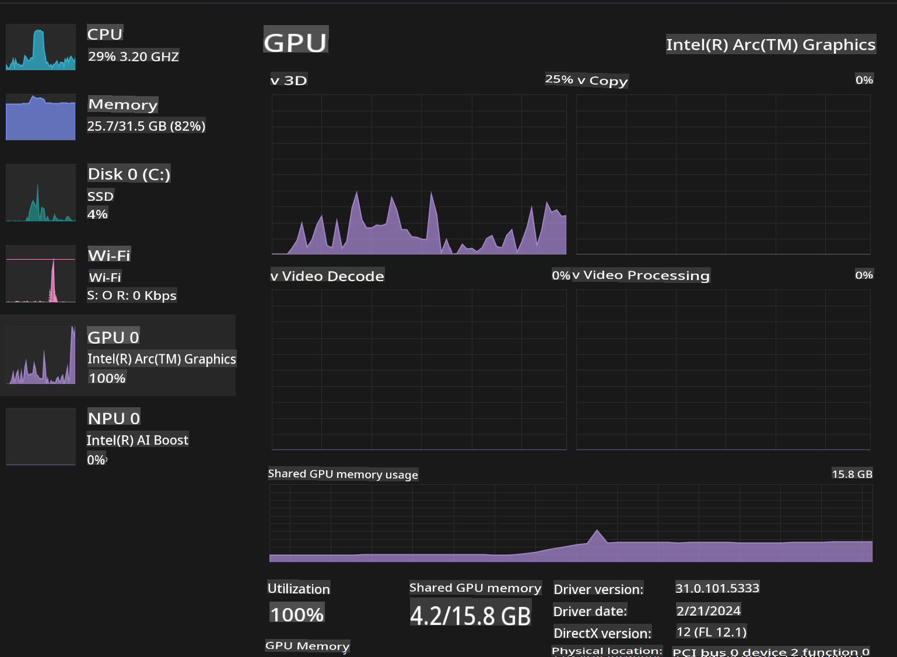

# **Inference Phi-3 in AI PC**

With the advancement of generative AI and improvements in edge device hardware, more generative AI models can now be integrated into users' Bring Your Own Device (BYOD) devices. AI PCs are among these developments. Starting in 2024, Intel, AMD, and Qualcomm have partnered with PC manufacturers to launch AI PCs that enable localized deployment of generative AI models through hardware enhancements. In this discussion, we will focus on Intel AI PCs and explore how to deploy Phi-3 on an Intel AI PC.

### What's NPU

An NPU (Neural Processing Unit) is a specialized processor or processing unit within a larger SoC, designed specifically to accelerate neural network operations and AI tasks. Unlike general-purpose CPUs and GPUs, NPUs are optimized for data-driven parallel computing, making them highly efficient at processing large multimedia datasets like videos and images, as well as handling neural network data. They are especially suited for AI-related tasks such as speech recognition, background blurring during video calls, and photo or video editing processes like object detection.

## NPU vs GPU

While many AI and machine learning workloads run on GPUs, there is an important distinction between GPUs and NPUs.  
GPUs are known for their parallel computing capabilities, but not all GPUs are equally efficient beyond graphics processing. NPUs, on the other hand, are purpose-built for the complex computations involved in neural network operations, making them highly effective for AI tasks.

In summary, NPUs are the math experts that supercharge AI computations and play a crucial role in the emerging era of AI PCs!

***This example is based on Intel's latest Intel Core Ultra Processor***

## **1. Use NPU to run Phi-3 model**

The Intel® NPU device is an AI inference accelerator integrated into Intel client CPUs, starting from the Intel® Core™ Ultra generation (formerly known as Meteor Lake). It enables energy-efficient execution of artificial neural network tasks.





**Intel NPU Acceleration Library**

The Intel NPU Acceleration Library [https://github.com/intel/intel-npu-acceleration-library](https://github.com/intel/intel-npu-acceleration-library) is a Python library designed to improve the efficiency of your applications by leveraging the power of the Intel Neural Processing Unit (NPU) for high-speed computations on compatible hardware.

Example of Phi-3-mini on an AI PC powered by Intel® Core™ Ultra processors.


Install the Python Library with pip

```bash

   pip install intel-npu-acceleration-library

```

***Note*** The project is still under development, but the reference model is already quite comprehensive.

### **Running Phi-3 with Intel NPU Acceleration Library**

Using Intel NPU acceleration, this library does not interfere with the traditional encoding process. You only need to use this library to quantize the original Phi-3 model into formats like FP16, INT8, INT4, etc.

```python
from transformers import AutoTokenizer, pipeline,TextStreamer
from intel_npu_acceleration_library import NPUModelForCausalLM, int4
from intel_npu_acceleration_library.compiler import CompilerConfig
import warnings

model_id = "microsoft/Phi-3-mini-4k-instruct"

compiler_conf = CompilerConfig(dtype=int4)
model = NPUModelForCausalLM.from_pretrained(
    model_id, use_cache=True, config=compiler_conf, attn_implementation="sdpa"
).eval()

tokenizer = AutoTokenizer.from_pretrained(model_id)

text_streamer = TextStreamer(tokenizer, skip_prompt=True)
```

Once quantization is successful, proceed to call the NPU to run the Phi-3 model.

```python
generation_args = {
   "max_new_tokens": 1024,
   "return_full_text": False,
   "temperature": 0.3,
   "do_sample": False,
   "streamer": text_streamer,
}

pipe = pipeline(
   "text-generation",
   model=model,
   tokenizer=tokenizer,
)

query = "<|system|>You are a helpful AI assistant.<|end|><|user|>Can you introduce yourself?<|end|><|assistant|>"

with warnings.catch_warnings():
    warnings.simplefilter("ignore")
    pipe(query, **generation_args)
```

When executing the code, you can monitor the NPU's running status through Task Manager.



***Samples*** : [AIPC_NPU_DEMO.ipynb](../../../../../code/03.Inference/AIPC/AIPC_NPU_DEMO.ipynb)

## **2. Use DirectML + ONNX Runtime to run Phi-3 Model**

### **What is DirectML**

[DirectML](https://github.com/microsoft/DirectML) is a high-performance, hardware-accelerated DirectX 12 library for machine learning. DirectML provides GPU acceleration for common machine learning tasks across a wide range of supported hardware and drivers, including all DirectX 12-capable GPUs from vendors like AMD, Intel, NVIDIA, and Qualcomm.

When used independently, the DirectML API is a low-level DirectX 12 library, suitable for high-performance, low-latency applications such as frameworks, games, and other real-time applications. Its seamless interoperability with Direct3D 12, low overhead, and consistency across hardware make DirectML ideal for accelerating machine learning when high performance and reliable, predictable results across hardware are critical.

***Note*** : The latest DirectML already supports NPU(https://devblogs.microsoft.com/directx/introducing-neural-processor-unit-npu-support-in-directml-developer-preview/)

### DirectML and CUDA in terms of their capabilities and performance:

**DirectML** is a machine learning library developed by Microsoft. It accelerates machine learning workloads on Windows devices, including desktops, laptops, and edge devices.  
- DX12-Based: DirectML is built on DirectX 12 (DX12), offering broad hardware support across GPUs, including NVIDIA and AMD.  
- Wider Support: Leveraging DX12, DirectML works with any GPU supporting DX12, including integrated GPUs.  
- Image Processing: DirectML handles image and data processing with neural networks, suitable for tasks like image recognition and object detection.  
- Ease of Setup: Setting up DirectML is simple and doesn't require specific SDKs or libraries from GPU vendors.  
- Performance: In some cases, DirectML performs well and can even surpass CUDA for specific workloads.  
- Limitations: However, DirectML may be slower in scenarios like float16 with large batch sizes.

**CUDA** is NVIDIA's parallel computing platform and programming model, designed to harness NVIDIA GPUs for general-purpose computing, including machine learning and scientific simulations.  
- NVIDIA-Specific: CUDA is tightly integrated with NVIDIA GPUs and tailored for them.  
- Highly Optimized: It delivers exceptional performance for GPU-accelerated tasks, especially on NVIDIA GPUs.  
- Widely Used: Many machine learning frameworks (like TensorFlow and PyTorch) support CUDA.  
- Customization: Developers can fine-tune CUDA for specific tasks to achieve optimal performance.  
- Limitations: CUDA's reliance on NVIDIA hardware limits its compatibility with other GPUs.

### Choosing Between DirectML and CUDA

The choice depends on your use case, hardware, and preferences.  
For broader compatibility and ease of setup, DirectML is a good choice. However, if you have NVIDIA GPUs and need optimized performance, CUDA is a strong option. In summary, consider your requirements and hardware when deciding.

### **Generative AI with ONNX Runtime**

In the AI era, model portability is essential. ONNX Runtime simplifies deploying trained models across devices. Developers can use a unified API for inference without focusing on the underlying framework. For generative AI, ONNX Runtime has optimized its code (https://onnxruntime.ai/docs/genai/), allowing quantized generative models to run on various devices. With ONNX Runtime, you can use APIs in Python, C#, and C/C++. Deployment on iPhones can leverage the C++ API.

[Sample Code](https://github.com/Azure-Samples/Phi-3MiniSamples/tree/main/onnx)

***Compile generative AI with ONNX Runtime library***

```bash

winget install --id=Kitware.CMake  -e

git clone https://github.com/microsoft/onnxruntime.git

cd .\onnxruntime\

./build.bat --build_shared_lib --skip_tests --parallel --use_dml --config Release

cd ../

git clone https://github.com/microsoft/onnxruntime-genai.git

cd .\onnxruntime-genai\

mkdir ort

cd ort

mkdir include

mkdir lib

copy ..\onnxruntime\include\onnxruntime\core\providers\dml\dml_provider_factory.h ort\include

copy ..\onnxruntime\include\onnxruntime\core\session\onnxruntime_c_api.h ort\include

copy ..\onnxruntime\build\Windows\Release\Release\*.dll ort\lib

copy ..\onnxruntime\build\Windows\Release\Release\onnxruntime.lib ort\lib

python build.py --use_dml


```

**Install library**

```bash

pip install .\onnxruntime_genai_directml-0.3.0.dev0-cp310-cp310-win_amd64.whl

```

This is the output:



***Samples*** : [AIPC_DirectML_DEMO.ipynb](../../../../../code/03.Inference/AIPC/AIPC_DirectML_DEMO.ipynb)

## **3. Use Intel OpenVino to run Phi-3 Model**

### **What is OpenVINO**

[OpenVINO](https://github.com/openvinotoolkit/openvino) is an open-source toolkit for optimizing and deploying deep learning models. It enhances performance for vision, audio, and language models from frameworks like TensorFlow and PyTorch. OpenVINO can also run Phi-3 models using CPUs and GPUs.

***Note***: Currently, OpenVINO does not support NPUs.

### **Install OpenVINO Library**

```bash

 pip install git+https://github.com/huggingface/optimum-intel.git

 pip install git+https://github.com/openvinotoolkit/nncf.git

 pip install openvino-nightly

```

### **Running Phi-3 with OpenVINO**

Similar to NPU, OpenVINO handles generative AI models by running quantized models. First, quantize the Phi-3 model via the command line using optimum-cli.

**INT4**

```bash

optimum-cli export openvino --model "microsoft/Phi-3-mini-4k-instruct" --task text-generation-with-past --weight-format int4 --group-size 128 --ratio 0.6  --sym  --trust-remote-code ./openvinomodel/phi3/int4

```

**FP16**

```bash

optimum-cli export openvino --model "microsoft/Phi-3-mini-4k-instruct" --task text-generation-with-past --weight-format fp16 --trust-remote-code ./openvinomodel/phi3/fp16

```

The converted format looks like this:


Load the model paths (model_dir), configurations (ov_config = {"PERFORMANCE_HINT": "LATENCY", "NUM_STREAMS": "1", "CACHE_DIR": ""}), and hardware-accelerated devices (GPU.0) using OVModelForCausalLM.

```python

ov_model = OVModelForCausalLM.from_pretrained(
     model_dir,
     device='GPU.0',
     ov_config=ov_config,
     config=AutoConfig.from_pretrained(model_dir, trust_remote_code=True),
     trust_remote_code=True,
)

```

When executing the code, you can monitor the GPU's running status through Task Manager.



***Samples*** : [AIPC_OpenVino_Demo.ipynb](../../../../../code/03.Inference/AIPC/AIPC_OpenVino_Demo.ipynb)

### ***Note*** : All three methods have their own advantages, but using NPU acceleration is recommended for AI PC inference.

**Disclaimer**:  
This document has been translated using machine-based AI translation services. While we strive for accuracy, please be aware that automated translations may contain errors or inaccuracies. The original document in its native language should be considered the authoritative source. For critical information, professional human translation is recommended. We are not liable for any misunderstandings or misinterpretations arising from the use of this translation.