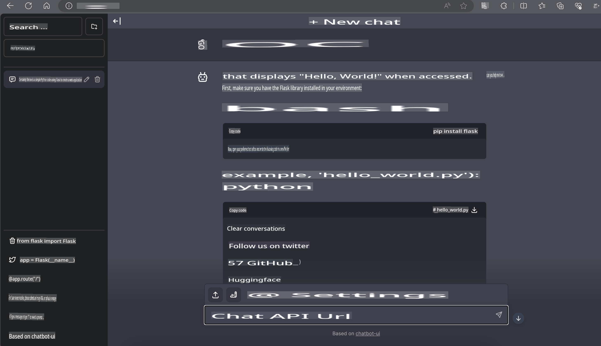

# **Inference Phi-3 on Nvidia Jetson**

Nvidia Jetson is a series of embedded computing boards developed by Nvidia. The Jetson TK1, TX1, and TX2 models all feature a Tegra processor (or SoC) from Nvidia, which includes a central processing unit (CPU) based on the ARM architecture. Jetson is a low-power system designed to accelerate machine learning applications. Nvidia Jetson is utilized by professional developers to create groundbreaking AI products across various industries and by students and enthusiasts for hands-on AI learning and innovative projects. SLM is deployed on edge devices like Jetson, enabling more effective implementation of industrial generative AI application scenarios.

## Deployment on NVIDIA Jetson:
Developers working on autonomous robotics and embedded devices can take advantage of Phi-3 Mini. Phi-3's relatively small size makes it an excellent choice for edge deployment. Parameters have been carefully fine-tuned during training to ensure high accuracy in responses.

### TensorRT-LLM Optimization:
NVIDIA's [TensorRT-LLM library](https://github.com/NVIDIA/TensorRT-LLM?WT.mc_id=aiml-138114-kinfeylo) optimizes inference for large language models. It supports Phi-3 Mini's extended context window, improving both throughput and latency. The optimizations include techniques like LongRoPE, FP8, and inflight batching.

### Availability and Deployment:
Developers can explore Phi-3 Mini with its 128K context window on [NVIDIA's AI](https://www.nvidia.com/en-us/ai-data-science/generative-ai/). It is packaged as an NVIDIA NIM, a microservice with a standard API that can be deployed anywhere. Additionally, the [TensorRT-LLM implementations are available on GitHub](https://github.com/NVIDIA/TensorRT-LLM).

## **1. Preparation**

a. Jetson Orin NX / Jetson NX

b. JetPack 5.1.2+

c. Cuda 11.8

d. Python 3.8+

## **2. Running Phi-3 on Jetson**

You can choose between [Ollama](https://ollama.com) or [LlamaEdge](https://llamaedge.com).

If you want to use gguf both in the cloud and on edge devices, LlamaEdge can be considered as WasmEdge. (WasmEdge is a lightweight, high-performance, and scalable WebAssembly runtime suitable for cloud-native, edge, and decentralized applications. It supports serverless applications, embedded functions, microservices, smart contracts, and IoT devices. Using LlamaEdge, you can deploy gguf's quantized model to both edge devices and the cloud.)


Here are the steps to use it:

1. Install and download the necessary libraries and files:

```bash

curl -sSf https://raw.githubusercontent.com/WasmEdge/WasmEdge/master/utils/install.sh | bash -s -- --plugin wasi_nn-ggml

curl -LO https://github.com/LlamaEdge/LlamaEdge/releases/latest/download/llama-api-server.wasm

curl -LO https://github.com/LlamaEdge/chatbot-ui/releases/latest/download/chatbot-ui.tar.gz

tar xzf chatbot-ui.tar.gz

```

**Note**: The files llama-api-server.wasm and chatbot-ui must be in the same directory.

2. Run the scripts in the terminal:

```bash

wasmedge --dir .:. --nn-preload default:GGML:AUTO:{Your gguf path} llama-api-server.wasm -p phi-3-chat

```

Here is the output:



***Sample code*** [Phi-3 Mini WASM Notebook Sample](https://github.com/Azure-Samples/Phi-3MiniSamples/tree/main/wasm)

In conclusion, Phi-3 Mini represents a significant advancement in language modeling, combining efficiency, context awareness, and NVIDIA's optimization expertise. Whether you're developing robots or edge applications, Phi-3 Mini is a powerful tool worth exploring.

**Disclaimer**:  
This document has been translated using machine-based AI translation services. While we strive for accuracy, please be aware that automated translations may contain errors or inaccuracies. The original document in its native language should be considered the authoritative source. For critical information, professional human translation is recommended. We are not liable for any misunderstandings or misinterpretations arising from the use of this translation.