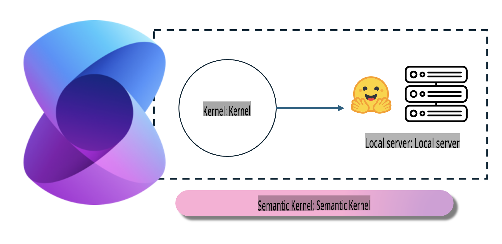
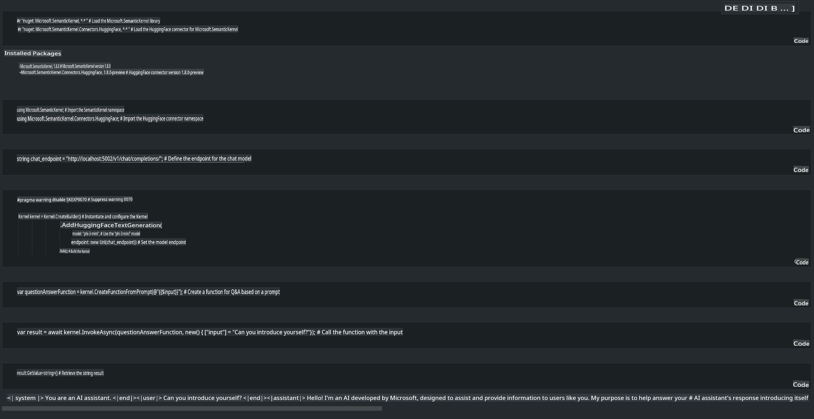

# **Inference Phi-3 on a Local Server**

Phi-3 can be deployed on a local server. Users can choose solutions like [Ollama](https://ollama.com) or [LM Studio](https://llamaedge.com), or write their own custom code. You can connect Phi-3's local services via [Semantic Kernel](https://github.com/microsoft/semantic-kernel?WT.mc_id=aiml-138114-kinfeylo) or [Langchain](https://www.langchain.com/) to build Copilot applications.

## **Using Semantic Kernel to Access Phi-3-mini**

In Copilot applications, we create solutions using Semantic Kernel or LangChain. This type of application framework is generally compatible with Azure OpenAI Service/OpenAI models, and it also supports open-source models on Hugging Face as well as local models. So, what should we do to use Semantic Kernel to access Phi-3-mini? Using .NET as an example, we can integrate it with the Hugging Face Connector in Semantic Kernel. By default, it corresponds to the model ID on Hugging Face (the first time you use it, the model will be downloaded from Hugging Face, which may take some time). Alternatively, you can connect to a locally hosted service. Between the two options, we recommend the latter because it offers greater autonomy, especially for enterprise applications.

As shown in the figure, accessing local services through Semantic Kernel allows for seamless integration with the self-hosted Phi-3-mini model server. Below is the output of the process:

***Sample Code*** https://github.com/kinfey/Phi3MiniSamples/tree/main/semantickernel

**Disclaimer**:  
This document has been translated using machine-based AI translation services. While we strive for accuracy, please note that automated translations may contain errors or inaccuracies. The original document in its native language should be regarded as the authoritative source. For critical information, professional human translation is recommended. We are not responsible for any misunderstandings or misinterpretations resulting from the use of this translation.