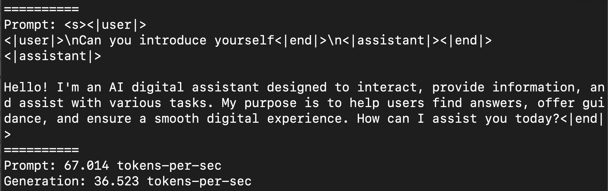
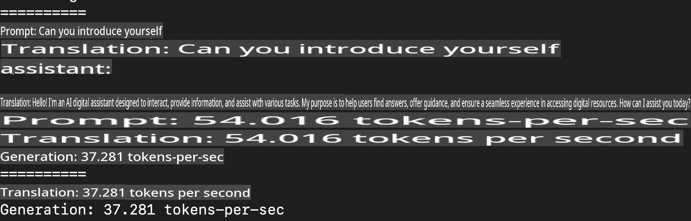
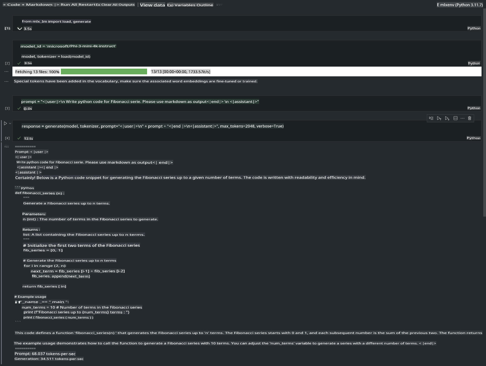

# **Inference Phi-3 with Apple MLX Framework**

## **What is MLX Framework**

MLX is a framework for machine learning research on Apple silicon, developed by Apple's machine learning research team.

MLX is built by researchers, for researchers. It aims to be both user-friendly and efficient for training and deploying models. The framework itself is conceptually straightforward, making it easy for researchers to extend and enhance MLX, enabling rapid exploration of new ideas.

Large Language Models (LLMs) can be accelerated on Apple Silicon devices using MLX, allowing models to run locally with ease.

## **Using MLX to inference Phi-3-mini**

### **1. Set up your MLX environment**

1. Python 3.11.x  
2. Install the MLX library  

```bash

pip install mlx-lm

```

### **2. Running Phi-3-mini in the terminal with MLX**

```bash

python -m mlx_lm.generate --model microsoft/Phi-3-mini-4k-instruct --max-token 2048 --prompt  "<|user|>\nCan you introduce yourself<|end|>\n<|assistant|>"

```

The result (my environment: Apple M1 Max, 64GB) is:



### **3. Quantizing Phi-3-mini with MLX in the terminal**

```bash

python -m mlx_lm.convert --hf-path microsoft/Phi-3-mini-4k-instruct

```

***Note:*** The model can be quantized using mlx_lm.convert, and the default quantization format is INT4. In this example, Phi-3-mini is quantized to INT4.  

After quantization, the model will be stored in the default directory: `./mlx_model`.

You can test the quantized model with MLX from the terminal:

```bash

python -m mlx_lm.generate --model ./mlx_model/ --max-token 2048 --prompt  "<|user|>\nCan you introduce yourself<|end|>\n<|assistant|>"

```

The result is:



### **4. Running Phi-3-mini with MLX in Jupyter Notebook**



***Note:*** Please refer to this example [click this link](../../../../../code/03.Inference/MLX/MLX_DEMO.ipynb).

## **Resources**

1. Learn more about the Apple MLX Framework: [https://ml-explore.github.io](https://ml-explore.github.io/mlx/build/html/index.html)  

2. Apple MLX GitHub Repository: [https://github.com/ml-explore](https://github.com/ml-explore)  

**Disclaimer**:  
This document has been translated using machine-based AI translation services. While we strive for accuracy, please note that automated translations may contain errors or inaccuracies. The original document in its native language should be regarded as the authoritative source. For critical information, professional human translation is recommended. We are not responsible for any misunderstandings or misinterpretations resulting from the use of this translation.