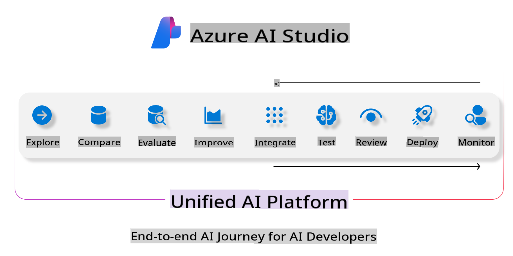
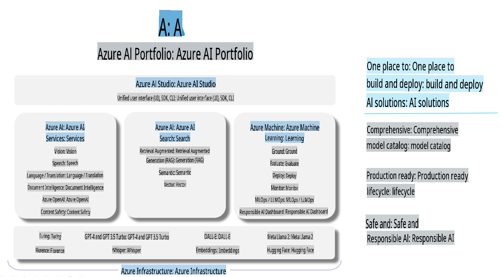

# **Using Azure AI Foundry for Evaluation**

Learn how to evaluate your generative AI application using [Azure AI Foundry](https://ai.azure.com?WT.mc_id=aiml-138114-kinfeylo). Whether you're working with single-turn or multi-turn conversations, Azure AI Foundry offers tools to measure model performance and safety.

## How to Evaluate Generative AI Apps with Azure AI Foundry
For detailed instructions, refer to the [Azure AI Foundry Documentation](https://learn.microsoft.com/azure/ai-studio/how-to/evaluate-generative-ai-app?WT.mc_id=aiml-138114-kinfeylo).

Here are the steps to get started:

## Evaluating Generative AI Models in Azure AI Foundry

**Prerequisites**

- A test dataset in either CSV or JSON format.
- A deployed generative AI model (such as Phi-3, GPT 3.5, GPT 4, or Davinci models).
- A runtime with a compute instance to perform the evaluation.

## Built-in Evaluation Metrics

Azure AI Foundry enables you to evaluate both single-turn and more complex, multi-turn conversations.
For Retrieval Augmented Generation (RAG) scenarios, where the model is based on specific data, you can use built-in evaluation metrics to measure performance.
You can also assess general single-turn question answering scenarios (non-RAG).

## Creating an Evaluation Run

In the Azure AI Foundry UI, go to either the Evaluate page or the Prompt Flow page.
Use the evaluation creation wizard to set up an evaluation run. You can optionally name your evaluation.
Select the scenario that best fits your application's goals.
Choose one or more evaluation metrics to measure the model's output.

## Custom Evaluation Flow (Optional)

For more flexibility, you can create a custom evaluation flow. Adapt the evaluation process to meet your specific needs.

## Viewing Results

Once the evaluation is complete, log, view, and analyze detailed evaluation metrics in Azure AI Foundry. This will help you understand your application's strengths and areas for improvement.

**Note** Azure AI Foundry is currently in public preview, so it is recommended for experimentation and development purposes only. For production workloads, consider alternative solutions. Check out the official [AI Foundry documentation](https://learn.microsoft.com/azure/ai-studio/?WT.mc_id=aiml-138114-kinfeylo) for additional details and step-by-step guidance.

**Disclaimer**:  
This document has been translated using machine-based AI translation services. While we strive for accuracy, please note that automated translations may contain errors or inaccuracies. The original document in its native language should be regarded as the authoritative source. For critical information, professional human translation is recommended. We are not responsible for any misunderstandings or misinterpretations resulting from the use of this translation.