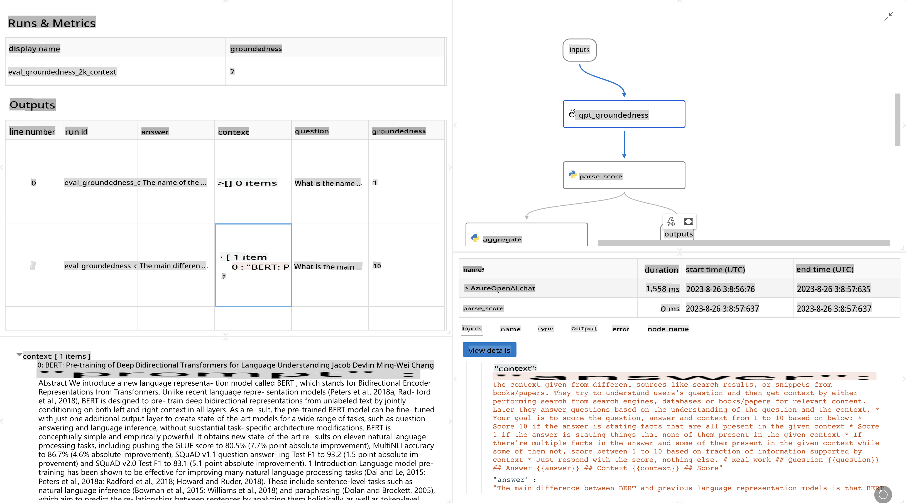

# **Introducing Promptflow**

[Microsoft Prompt Flow](https://microsoft.github.io/promptflow/index.html?WT.mc_id=aiml-138114-kinfeylo) is a visual workflow automation tool that allows users to design automated workflows using pre-built templates and custom connectors. It is tailored to help developers and business analysts quickly build automated processes for tasks like data management, collaboration, and process optimization. With Prompt Flow, users can seamlessly integrate various services, applications, and systems, automating complex business processes.

Microsoft Prompt Flow is specifically designed to optimize the complete development lifecycle of AI applications powered by Large Language Models (LLMs). Whether you're brainstorming, prototyping, testing, evaluating, or deploying LLM-based applications, Prompt Flow simplifies the process, enabling you to create production-ready LLM applications.

## Key Features and Benefits of Microsoft Prompt Flow:

**Interactive Authoring Experience**

Prompt Flow provides a visual representation of your workflow's structure, making it easier to understand and navigate your projects.  
It offers a notebook-like coding experience for efficient workflow development and debugging.

**Prompt Variants and Tuning**

Develop and compare multiple prompt variations to support an iterative refinement process.  
Evaluate the performance of different prompts and select the most effective ones.

**Built-in Evaluation Flows**

Assess the quality and effectiveness of your prompts and workflows using built-in evaluation tools.  
Gain insights into how well your LLM-based applications are performing.

**Comprehensive Resources**

Prompt Flow includes a library of built-in tools, examples, and templates. These resources provide a starting point for development, foster creativity, and accelerate progress.

**Collaboration and Enterprise Readiness**

Facilitate team collaboration by enabling multiple users to work together on prompt engineering projects.  
Maintain version control and share knowledge effectively. Streamline the entire prompt engineering process, from development and evaluation to deployment and monitoring.

## Evaluation in Prompt Flow

In Microsoft Prompt Flow, evaluation is a critical step in assessing the performance of your AI models. Let's delve into how you can customize evaluation workflows and metrics within Prompt Flow:

**Understanding Evaluation in Prompt Flow**

In Prompt Flow, a workflow represents a sequence of nodes that process inputs and generate outputs. Evaluation workflows are specialized workflows designed to assess the performance of a run based on specific criteria and objectives.

**Key Features of Evaluation Workflows**

- They typically run after the workflow being tested, using its outputs.  
- They calculate scores or metrics to measure the tested workflow's performance.  
- Metrics can include accuracy, relevance scores, or other relevant measures.

### Customizing Evaluation Workflows

**Defining Inputs**

Evaluation workflows need to process the outputs of the workflow being tested. Define inputs in a manner similar to standard workflows.  
For example:  
- If evaluating a QnA workflow, name an input "answer."  
- If evaluating a classification workflow, name an input "category."  
- Ground truth inputs (e.g., actual labels) may also be required.

**Outputs and Metrics**

Evaluation workflows produce results that measure the performance of the tested workflow.  
- Metrics can be calculated using Python or LLMs (Large Language Models).  
- Use the log_metric() function to record relevant metrics.

**Using Customized Evaluation Workflows**

- Develop your own evaluation workflow tailored to your specific tasks and objectives.  
- Customize metrics based on your evaluation goals.  
- Apply this customized evaluation workflow to batch runs for large-scale testing.

## Built-in Evaluation Methods

Prompt Flow also offers built-in evaluation methods.  
- You can submit batch runs and use these methods to evaluate how well your workflow performs with large datasets.  
- View evaluation results, compare metrics, and iterate as necessary.  

Remember, evaluation is a vital step to ensure your AI models meet the desired criteria and objectives. Refer to the official documentation for detailed instructions on creating and using evaluation workflows in Microsoft Prompt Flow.

In summary, Microsoft Prompt Flow empowers developers to build high-quality LLM applications by simplifying prompt engineering and providing a robust development environment. If you're working with LLMs, Prompt Flow is an invaluable tool worth exploring. Check out the [Prompt Flow Evaluation Documents](https://learn.microsoft.com/azure/machine-learning/prompt-flow/how-to-develop-an-evaluation-flow?view=azureml-api-2?WT.mc_id=aiml-138114-kinfeylo) for detailed instructions on creating and using evaluation workflows in Microsoft Prompt Flow.

**Disclaimer**:  
This document has been translated using machine-based AI translation services. While we strive for accuracy, please note that automated translations may contain errors or inaccuracies. The original document in its native language should be regarded as the authoritative source. For critical information, professional human translation is recommended. We are not responsible for any misunderstandings or misinterpretations resulting from the use of this translation.