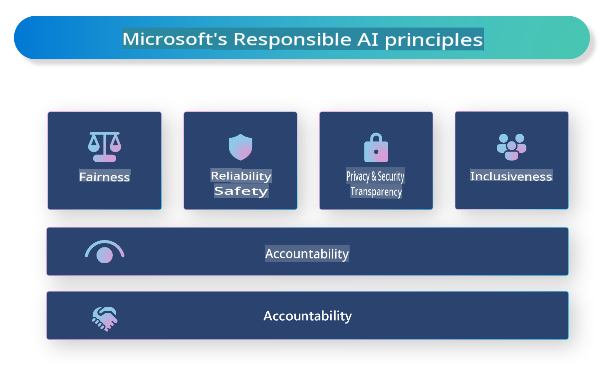

# **Introducing Responsible AI**

[Microsoft Responsible AI](https://www.microsoft.com/ai/responsible-ai?WT.mc_id=aiml-138114-kinfeylo) is an initiative designed to assist developers and organizations in creating AI systems that are transparent, trustworthy, and accountable. The initiative offers guidance and resources to develop responsible AI solutions aligned with ethical principles such as privacy, fairness, and transparency. Additionally, we will discuss the challenges and best practices involved in building responsible AI systems.

## Overview of Microsoft Responsible AI 

**Ethical Principles** 

Microsoft Responsible AI is grounded in a set of ethical principles, including privacy, fairness, transparency, accountability, and safety. These principles are intended to ensure AI systems are developed ethically and responsibly.

**Transparent AI**

Microsoft Responsible AI highlights the importance of transparency in AI systems. This includes providing clear explanations of how AI models function and ensuring data sources and algorithms are publicly accessible.

**Accountable AI** 

[Microsoft Responsible AI](https://www.microsoft.com/ai/responsible-ai?WT.mc_id=aiml-138114-kinfeylo) supports the creation of accountable AI systems that offer insights into how AI models make decisions. This helps users understand and trust the outputs generated by these systems.

**Inclusiveness** 

AI systems should be designed to benefit everyone. Microsoft is committed to developing inclusive AI that incorporates diverse perspectives and avoids bias or discrimination.

**Reliability and Safety**

Ensuring AI systems are reliable and safe is essential. Microsoft focuses on building robust models that perform consistently and prevent harmful outcomes.

**Fairness in AI** 

Microsoft Responsible AI acknowledges that AI systems can reinforce biases if trained on biased data or algorithms. The initiative provides guidelines to create fair AI systems that avoid discrimination based on factors like race, gender, or age.

**Privacy and Security** 

Microsoft Responsible AI underscores the importance of protecting user privacy and securing data in AI systems. This includes implementing robust data encryption, access controls, and regular audits to identify vulnerabilities.

**Accountability and Responsibility** 

Microsoft Responsible AI encourages accountability and responsibility in the development and deployment of AI. This includes ensuring developers and organizations understand the potential risks of AI systems and take proactive measures to address them.

## Best Practices for Building Responsible AI Systems

**Use Diverse Data Sets for AI Models** 

To minimize bias in AI systems, it’s crucial to use diverse data sets that reflect a variety of perspectives and experiences.

**Adopt Explainable AI Techniques** 

Explainable AI techniques can help users understand how AI models make decisions, fostering greater trust in the system.

**Conduct Regular Audits for Vulnerabilities** 

Regularly auditing AI systems can help identify risks and vulnerabilities that need to be addressed.

**Implement Strong Data Encryption and Access Controls** 

Protecting user privacy and security in AI systems can be achieved through robust data encryption and access control measures.

**Follow Ethical Principles in AI Development** 

Adhering to ethical principles like fairness, transparency, and accountability can help build trust in AI systems and ensure they are developed responsibly.

## Using AI Foundry for Responsible AI 

[Azure AI Foundry](https://ai.azure.com?WT.mc_id=aiml-138114-kinfeylo) is a robust platform that enables developers and organizations to quickly create intelligent, cutting-edge, market-ready, and responsible applications. Below are some of its key features and capabilities:

**Pre-Built APIs and Models** 

Azure AI Foundry offers customizable and ready-to-use APIs and models for a variety of AI tasks, including generative AI, natural language processing for conversations, search, monitoring, translation, speech, vision, and decision-making.

**Prompt Flow** 

The prompt flow feature in Azure AI Foundry allows you to design conversational AI experiences. It simplifies the creation of chatbots, virtual assistants, and other interactive applications by enabling you to design and manage conversation flows.

**Retrieval Augmented Generation (RAG)** 

RAG combines retrieval-based and generative-based approaches to enhance the quality of responses by utilizing both pre-existing knowledge (retrieval) and creative generation.

**Evaluation and Monitoring Metrics for Generative AI** 

Azure AI Foundry includes tools for assessing and monitoring generative AI models. You can evaluate their performance, fairness, and other critical metrics to ensure responsible use. Additionally, if you’ve developed a dashboard, you can use Azure Machine Learning Studio’s no-code UI to generate and customize a Responsible AI Dashboard and scorecard based on the [Responsible AI Toolbox](https://responsibleaitoolbox.ai/?WT.mc_id=aiml-138114-kinfeylo) Python libraries. This scorecard allows you to share key insights, such as fairness and feature importance, with both technical and non-technical stakeholders.

To integrate AI Foundry with responsible AI practices, follow these steps:

**Define the Problem and Objectives of Your AI System**

Clearly outline the problem or objective your AI system aims to address before development begins. This helps determine the necessary data, algorithms, and resources to build an effective model.

**Collect and Preprocess Relevant Data** 

The quality and quantity of data used for training significantly impact an AI system’s performance. It’s important to gather relevant data, clean and preprocess it, and ensure it represents the population or problem being addressed.

**Select Appropriate Evaluation Methods** 

There are various evaluation methods available. It’s crucial to choose the most suitable approach based on your data and problem.

**Evaluate and Interpret the Model** 

After building an AI model, evaluate its performance using appropriate metrics and interpret the results transparently. This helps identify biases or limitations in the model and make necessary improvements.

**Ensure Transparency and Explainability** 

AI systems should be transparent and explainable so users can understand how they function and make decisions. This is particularly important for applications with significant impacts on human lives, such as healthcare, finance, and legal systems.

**Monitor and Update the Model** 

AI systems require continuous monitoring and updates to maintain accuracy and effectiveness over time. This involves ongoing maintenance, testing, and retraining of the model.

In conclusion, Microsoft Responsible AI is an initiative designed to assist developers and organizations in creating AI systems that are transparent, trustworthy, and accountable. Responsible AI implementation is vital, and Azure AI Foundry provides practical tools to achieve this. By adhering to ethical principles and best practices, we can ensure AI systems are developed and deployed responsibly, benefiting society as a whole.

**Disclaimer**:  
This document has been translated using machine-based AI translation services. While we strive for accuracy, please note that automated translations may contain errors or inaccuracies. The original document in its native language should be regarded as the authoritative source. For critical information, professional human translation is recommended. We are not responsible for any misunderstandings or misinterpretations resulting from the use of this translation.