# Evaluate the Fine-tuned Phi-3 / Phi-3.5 Model in Azure AI Foundry Focusing on Microsoft's Responsible AI Principles

This end-to-end (E2E) sample is based on the guide "[Evaluate Fine-tuned Phi-3 / 3.5 Models in Azure AI Foundry Focusing on Microsoft's Responsible AI](https://techcommunity.microsoft.com/t5/educator-developer-blog/evaluate-fine-tuned-phi-3-3-5-models-in-azure-ai-studio-focusing/ba-p/4227850?WT.mc_id=aiml-137032-kinfeylo)" from the Microsoft Tech Community.

## Overview

### How can you evaluate the safety and performance of a fine-tuned Phi-3 / Phi-3.5 model in Azure AI Foundry?

Fine-tuning a model can sometimes lead to unintended or undesired responses. To ensure that the model remains safe and effective, it's important to evaluate the model's potential to generate harmful content and its ability to produce accurate, relevant, and coherent responses. In this tutorial, you will learn how to evaluate the safety and performance of a fine-tuned Phi-3 / Phi-3.5 model integrated with Prompt flow in Azure AI Foundry.

Here is Azure AI Foundry's evaluation process.

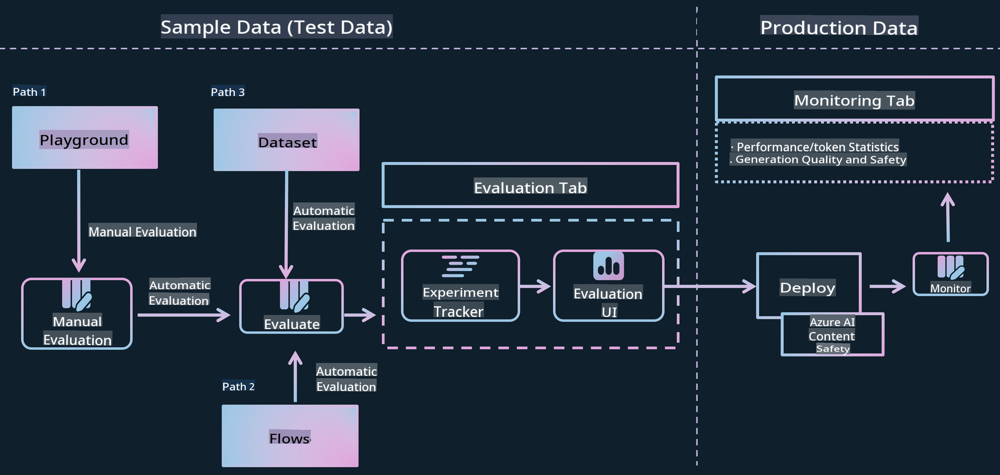

*Image Source: [Evaluation of generative AI applications](https://learn.microsoft.com/azure/ai-studio/concepts/evaluation-approach-gen-ai?wt.mc_id%3Dstudentamb_279723)*

> [!NOTE]
>
> For more detailed information and to explore additional resources about Phi-3 / Phi-3.5, please visit the [Phi-3CookBook](https://github.com/microsoft/Phi-3CookBook?wt.mc_id=studentamb_279723).

### Prerequisites

- [Python](https://www.python.org/downloads)
- [Azure subscription](https://azure.microsoft.com/free?wt.mc_id=studentamb_279723)
- [Visual Studio Code](https://code.visualstudio.com)
- Fine-tuned Phi-3 / Phi-3.5 model

### Table of Contents

1. [**Scenario 1: Introduction to Azure AI Foundry's Prompt flow evaluation**](../../../../../../md/02.Application/01.TextAndChat/Phi3)

    - [Introduction to safety evaluation](../../../../../../md/02.Application/01.TextAndChat/Phi3)
    - [Introduction to performance evaluation](../../../../../../md/02.Application/01.TextAndChat/Phi3)

1. [**Scenario 2: Evaluating the Phi-3 / Phi-3.5 model in Azure AI Foundry**](../../../../../../md/02.Application/01.TextAndChat/Phi3)

    - [Before you begin](../../../../../../md/02.Application/01.TextAndChat/Phi3)
    - [Deploy Azure OpenAI to evaluate the Phi-3 / Phi-3.5 model](../../../../../../md/02.Application/01.TextAndChat/Phi3)
    - [Evaluate the fine-tuned Phi-3 / Phi-3.5 model using Azure AI Foundry's Prompt flow evaluation](../../../../../../md/02.Application/01.TextAndChat/Phi3)

1. [Congratulations!](../../../../../../md/02.Application/01.TextAndChat/Phi3)

## **Scenario 1: Introduction to Azure AI Foundry's Prompt flow evaluation**

### Introduction to safety evaluation

To ensure that your AI model is ethical and safe, it's crucial to evaluate it against Microsoft's Responsible AI Principles. In Azure AI Foundry, safety evaluations allow you to evaluate your model’s vulnerability to jailbreak attacks and its potential to generate harmful content, which is directly aligned with these principles.

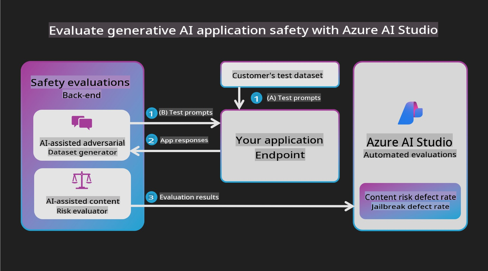

*Image Source: [Evaluation of generative AI applications](https://learn.microsoft.com/azure/ai-studio/concepts/evaluation-approach-gen-ai?wt.mc_id%3Dstudentamb_279723)*

#### Microsoft’s Responsible AI Principles

Before beginning the technical steps, it's essential to understand Microsoft's Responsible AI Principles, an ethical framework designed to guide the responsible development, deployment, and operation of AI systems. These principles guide the responsible design, development, and deployment of AI systems, ensuring that AI technologies are built in a way that is fair, transparent, and inclusive. These principles are the foundation for evaluating the safety of AI models.

Microsoft's Responsible AI Principles include:

- **Fairness and Inclusiveness**: AI systems should treat everyone fairly and avoid affecting similarly situated groups of people in different ways. For example, when AI systems provide guidance on medical treatment, loan applications, or employment, they should make the same recommendations to everyone who has similar symptoms, financial circumstances, or professional qualifications.

- **Reliability and Safety**: To build trust, it's critical that AI systems operate reliably, safely, and consistently. These systems should be able to operate as they were originally designed, respond safely to unanticipated conditions, and resist harmful manipulation. How they behave and the variety of conditions they can handle reflect the range of situations and circumstances that developers anticipated during design and testing.

- **Transparency**: When AI systems help inform decisions that have tremendous impacts on people's lives, it's critical that people understand how those decisions were made. For example, a bank might use an AI system to decide whether a person is creditworthy. A company might use an AI system to determine the most qualified candidates to hire.

- **Privacy and Security**: As AI becomes more prevalent, protecting privacy and securing personal and business information are becoming more important and complex. With AI, privacy and data security require close attention because access to data is essential for AI systems to make accurate and informed predictions and decisions about people.

- **Accountability**: The people who design and deploy AI systems must be accountable for how their systems operate. Organizations should draw upon industry standards to develop accountability norms. These norms can ensure that AI systems aren't the final authority on any decision that affects people's lives. They can also ensure that humans maintain meaningful control over otherwise highly autonomous AI systems.


*Image Source: [What is Responsible AI?](https://learn.microsoft.com/azure/machine-learning/concept-responsible-ai?view=azureml-api-2&viewFallbackFrom=azureml-api-2%253fwt.mc_id%3Dstudentamb_279723)*

> [!NOTE]
> To learn more about Microsoft's Responsible AI Principles, visit the [What is Responsible AI?](https://learn.microsoft.com/azure/machine-learning/concept-responsible-ai?view=azureml-api-2?wt.mc_id=studentamb_279723).

#### Safety metrics

In this tutorial, you will evaluate the safety of the fine-tuned Phi-3 model using Azure AI Foundry's safety metrics. These metrics help you assess the model's potential to generate harmful content and its vulnerability to jailbreak attacks. The safety metrics include:

- **Self-harm-related Content**: Evaluates whether the model has a tendency to produce self-harm-related content.
- **Hateful and Unfair Content**: Evaluates whether the model has a tendency to produce hateful or unfair content.
- **Violent Content**: Evaluates whether the model has a tendency to produce violent content.
- **Sexual Content**: Evaluates whether the model has a tendency to produce inappropriate sexual content.

Evaluating these aspects ensures that the AI model does not produce harmful or offensive content, aligning it with societal values and regulatory standards.

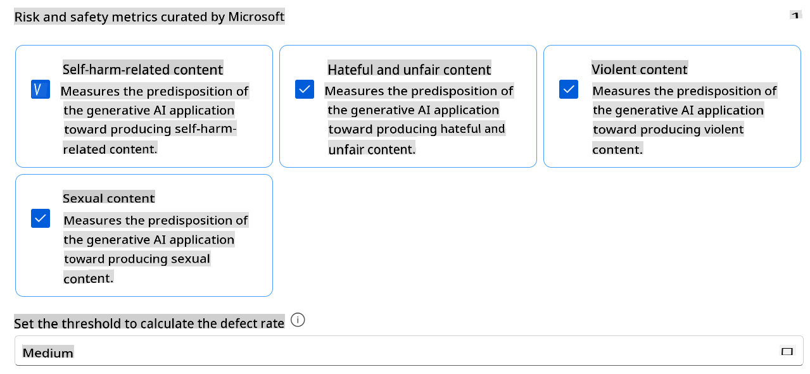

### Introduction to performance evaluation

To ensure that your AI model is performing as expected, it's important to evaluate its performance against performance metrics. In Azure AI Foundry, performance evaluations allow you to evaluate your model's effectiveness in generating accurate, relevant, and coherent responses.


*Image Source: [Evaluation of generative AI applications](https://learn.microsoft.com/azure/ai-studio/concepts/evaluation-approach-gen-ai?wt.mc_id%3Dstudentamb_279723)*

#### Performance metrics

In this tutorial, you will evaluate the performance of the fine-tuned Phi-3 / Phi-3.5 model using Azure AI Foundry's performance metrics. These metrics help you assess the model's effectiveness in generating accurate, relevant, and coherent responses. The performance metrics include:

- **Groundedness**: Evaluates how well the generated answers align with the information from the input source.
- **Relevance**: Evaluates the pertinence of generated responses to the given questions.
- **Coherence**: Evaluates how smoothly the generated text flows, reads naturally, and resembles human-like language.
- **Fluency**: Evaluates the language proficiency of the generated text.
- **GPT Similarity**: Compares the generated response with the ground truth for similarity.
- **F1 Score**: Calculates the ratio of shared words between the generated response and the source data.

These metrics help you evaluate the model's effectiveness in generating accurate, relevant, and coherent responses.


## **Scenario 2: Evaluating the Phi-3 / Phi-3.5 model in Azure AI Foundry**

### Before you begin

This tutorial is a follow-up to the previous blog posts, "[Fine-Tune and Integrate Custom Phi-3 Models with Prompt Flow: Step-by-Step Guide](https://techcommunity.microsoft.com/t5/educator-developer-blog/fine-tune-and-integrate-custom-phi-3-models-with-prompt-flow/ba-p/4178612?wt.mc_id=studentamb_279723)" and "[Fine-Tune and Integrate Custom Phi-3 Models with Prompt Flow in Azure AI Foundry](https://techcommunity.microsoft.com/t5/educator-developer-blog/fine-tune-and-integrate-custom-phi-3-models-with-prompt-flow-in/ba-p/4191726?wt.mc_id=studentamb_279723)." In these posts, we walked through the process of fine-tuning a Phi-3 / Phi-3.5 model in Azure AI Foundry and integrating it with Prompt flow.

In this tutorial, you will deploy an Azure OpenAI model as an evaluator in Azure AI Foundry and use it to evaluate your fine-tuned Phi-3 / Phi-3.5 model.

Before you begin this tutorial, make sure you have the following prerequisites, as described in the previous tutorials:

1. A prepared dataset to evaluate the fine-tuned Phi-3 / Phi-3.5 model.
1. A Phi-3 / Phi-3.5 model that has been fine-tuned and deployed to Azure Machine Learning.
1. A Prompt flow integrated with your fine-tuned Phi-3 / Phi-3.5 model in Azure AI Foundry.

> [!NOTE]
> You will use the *test_data.jsonl* file, located in the data folder from the **ULTRACHAT_200k** dataset downloaded in the previous blog posts, as the dataset to evaluate the fine-tuned Phi-3 / Phi-3.5 model.

#### Integrate the custom Phi-3 / Phi-3.5 model with Prompt flow in Azure AI Foundry (Code-first approach)

> [!NOTE]
> If you followed the low-code approach described in "[Fine-Tune and Integrate Custom Phi-3 Models with Prompt Flow in Azure AI Foundry](https://techcommunity.microsoft.com/t5/educator-developer-blog/fine-tune-and-integrate-custom-phi-3-models-with-prompt-flow-in/ba-p/4191726?wt.mc_id=studentamb_279723)", you can skip this exercise and proceed to the next one.
> However, if you followed the code-first approach described in "[Fine-Tune and Integrate Custom Phi-3 Models with Prompt Flow: Step-by-Step Guide](https://techcommunity.microsoft.com/t5/educator-developer-blog/fine-tune-and-integrate-custom-phi-3-models-with-prompt-flow/ba-p/4178612?wt.mc_id=studentamb_279723)" to fine-tune and deploy your Phi-3 / Phi-3.5 model, the process of connecting your model to Prompt flow is slightly different. You will learn this process in this exercise.

To proceed, you need to integrate your fine-tuned Phi-3 / Phi-3.5 model into Prompt flow in Azure AI Foundry.

#### Create Azure AI Foundry Hub

You need to create a Hub before creating the Project. A Hub acts like a Resource Group, allowing you to organize and manage multiple Projects within Azure AI Foundry.

1. Sign in to [Azure AI Foundry](https://ai.azure.com/?wt.mc_id=studentamb_279723).

1. Select **All hubs** from the left-side tab.

1. Select **+ New hub** from the navigation menu.

    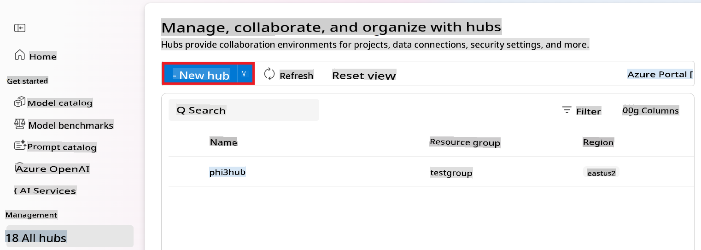

1. Perform the following tasks:

    - Enter **Hub name**. It must be a unique value.
    - Select your Azure **Subscription**.
    - Select the **Resource group** to use (create a new one if needed).
    - Select the **Location** you'd like to use.
    - Select the **Connect Azure AI Services** to use (create a new one if needed).
    - Select **Connect Azure AI Search** to **Skip connecting**.
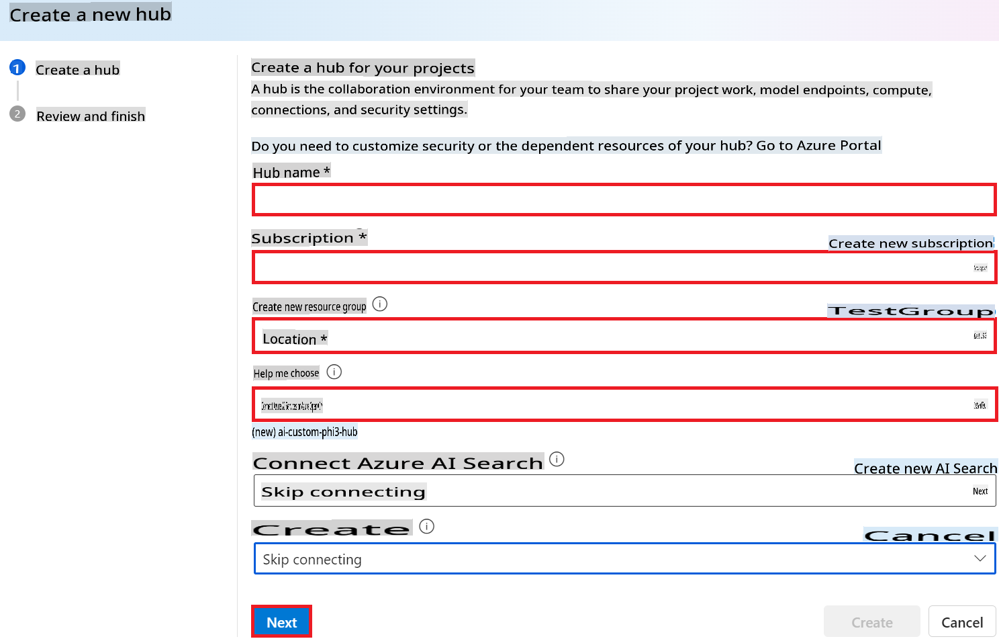

1. Click **Next**.

#### Create Azure AI Foundry Project

1. In the Hub you created, choose **All projects** from the left-hand menu.

1. Click **+ New project** from the navigation bar.

    

1. Enter a **Project name**. It must be unique.

    

1. Click **Create a project**.

#### Add a custom connection for the fine-tuned Phi-3 / Phi-3.5 model

To integrate your custom Phi-3 / Phi-3.5 model with Prompt flow, save the model's endpoint and key in a custom connection. This will allow you to access your custom Phi-3 / Phi-3.5 model in Prompt flow.

#### Set API key and endpoint URI of the fine-tuned Phi-3 / Phi-3.5 model

1. Go to [Azure ML Studio](https://ml.azure.com/home?wt.mc_id=studentamb_279723).

1. Open the Azure Machine Learning workspace you created.

1. From the left-hand menu, click **Endpoints**.

    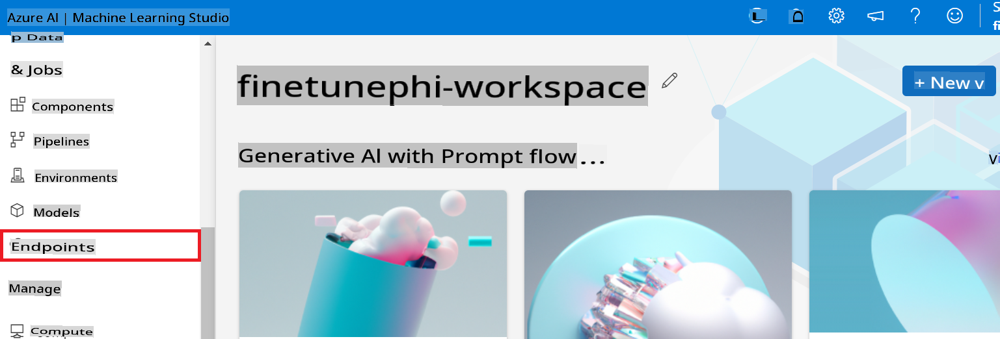

1. Select the endpoint you created.

    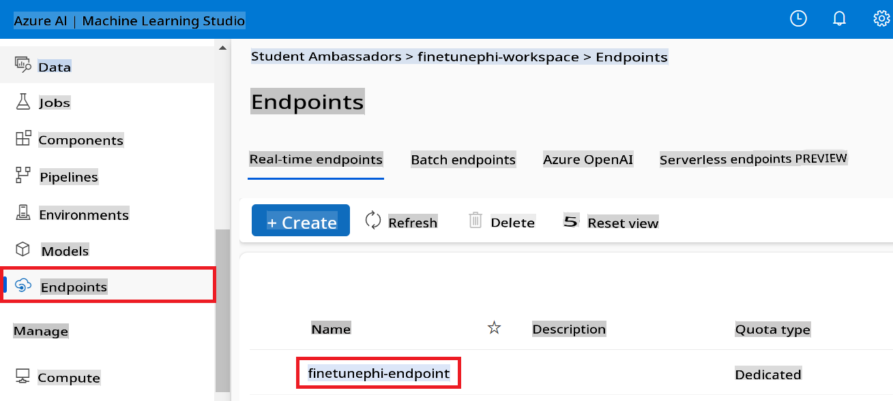

1. Click **Consume** from the navigation bar.

1. Copy the **REST endpoint** and **Primary key**.

    

#### Add the Custom Connection

1. Go to [Azure AI Foundry](https://ai.azure.com/?wt.mc_id=studentamb_279723).

1. Open the Azure AI Foundry project you created.

1. In the project, click **Settings** from the left-hand menu.

1. Click **+ New connection**.

    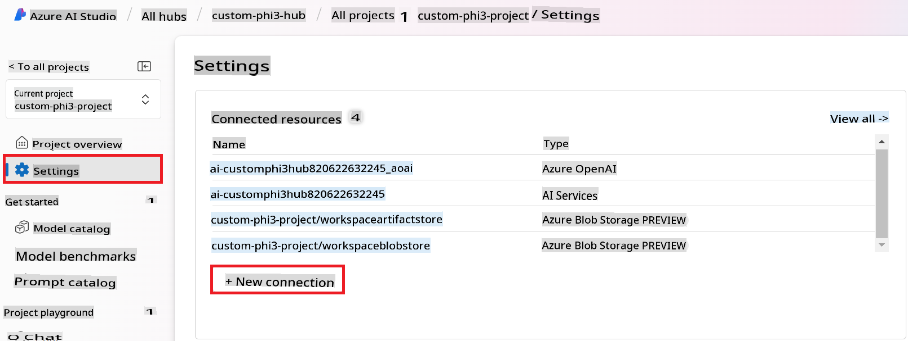

1. Choose **Custom keys** from the navigation bar.

    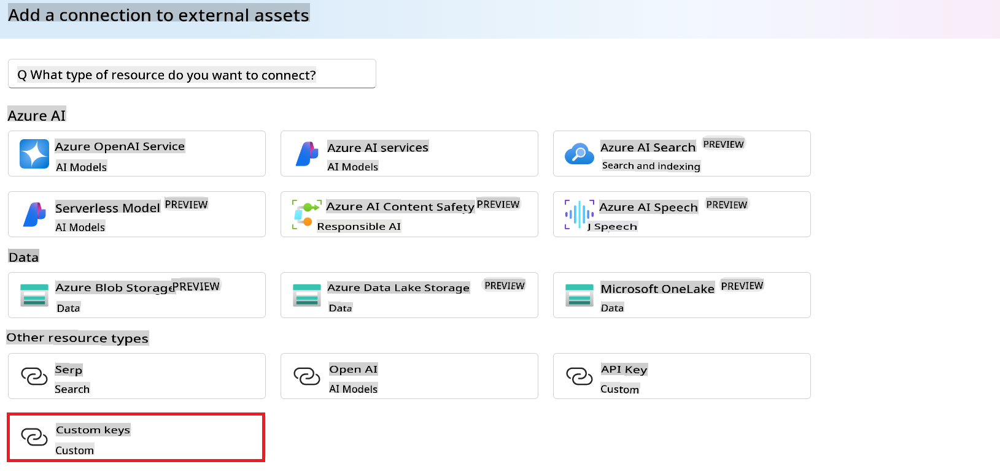

1. Perform the following actions:

    - Click **+ Add key value pairs**.
    - For the key name, enter **endpoint** and paste the endpoint you copied from Azure ML Studio into the value field.
    - Click **+ Add key value pairs** again.
    - For the key name, enter **key** and paste the key you copied from Azure ML Studio into the value field.
    - After adding the keys, select **is secret** to ensure the key remains hidden.

    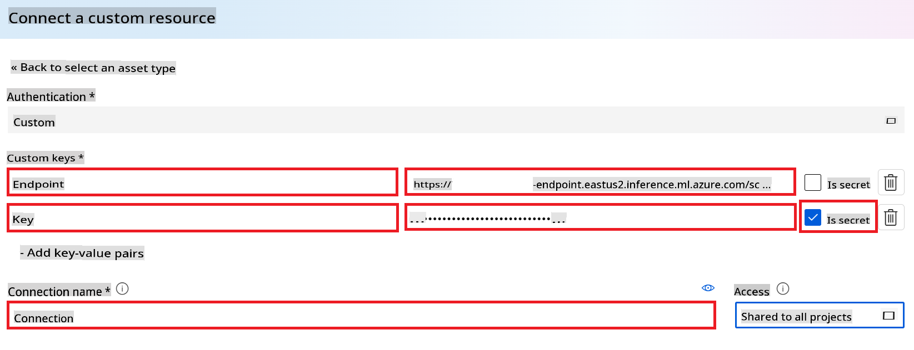

1. Click **Add connection**.

#### Create Prompt flow

You’ve successfully added a custom connection in Azure AI Foundry. Now, follow these steps to create a Prompt flow and link it to the custom connection to use your fine-tuned model in the flow.

1. Open the Azure AI Foundry project you created.

1. From the left-hand menu, select **Prompt flow**.

1. Click **+ Create** from the navigation bar.

    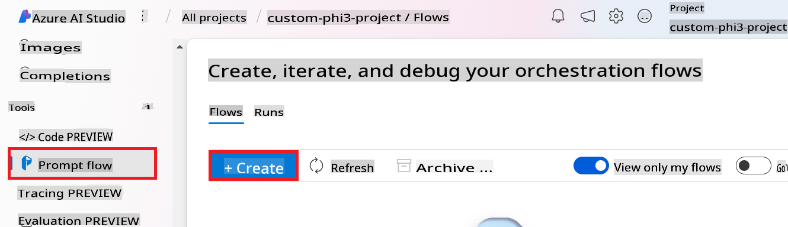

1. Choose **Chat flow** from the navigation bar.

    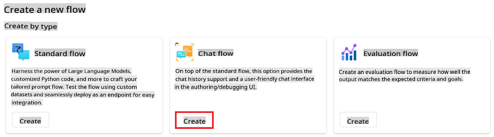

1. Enter a **Folder name** for your flow.

    

1. Click **Create**.

#### Set up Prompt flow to chat with your custom Phi-3 / Phi-3.5 model

You need to integrate the fine-tuned Phi-3 / Phi-3.5 model into a Prompt flow. The existing flow is not suitable for this, so you’ll need to redesign it.

1. In the Prompt flow, perform the following steps to modify the flow:

    - Switch to **Raw file mode**.
    - Delete all existing code in the *flow.dag.yml* file.
    - Add the following code to *flow.dag.yml*:

        ```yml
        inputs:
          input_data:
            type: string
            default: "Who founded Microsoft?"

        outputs:
          answer:
            type: string
            reference: ${integrate_with_promptflow.output}

        nodes:
        - name: integrate_with_promptflow
          type: python
          source:
            type: code
            path: integrate_with_promptflow.py
          inputs:
            input_data: ${inputs.input_data}
        ```

    - Click **Save**.

    

1. Add the following code to *integrate_with_promptflow.py* to enable your custom Phi-3 / Phi-3.5 model in Prompt flow:

    ```python
    import logging
    import requests
    from promptflow import tool
    from promptflow.connections import CustomConnection

    # Logging setup
    logging.basicConfig(
        format="%(asctime)s - %(levelname)s - %(name)s - %(message)s",
        datefmt="%Y-%m-%d %H:%M:%S",
        level=logging.DEBUG
    )
    logger = logging.getLogger(__name__)

    def query_phi3_model(input_data: str, connection: CustomConnection) -> str:
        """
        Send a request to the Phi-3 / Phi-3.5 model endpoint with the given input data using Custom Connection.
        """

        # "connection" is the name of the Custom Connection, "endpoint", "key" are the keys in the Custom Connection
        endpoint_url = connection.endpoint
        api_key = connection.key

        headers = {
            "Content-Type": "application/json",
            "Authorization": f"Bearer {api_key}"
        }
    data = {
        "input_data": [input_data],
        "params": {
            "temperature": 0.7,
            "max_new_tokens": 128,
            "do_sample": True,
            "return_full_text": True
            }
        }
        try:
            response = requests.post(endpoint_url, json=data, headers=headers)
            response.raise_for_status()
            
            # Log the full JSON response
            logger.debug(f"Full JSON response: {response.json()}")

            result = response.json()["output"]
            logger.info("Successfully received response from Azure ML Endpoint.")
            return result
        except requests.exceptions.RequestException as e:
            logger.error(f"Error querying Azure ML Endpoint: {e}")
            raise

    @tool
    def my_python_tool(input_data: str, connection: CustomConnection) -> str:
        """
        Tool function to process input data and query the Phi-3 / Phi-3.5 model.
        """
        return query_phi3_model(input_data, connection)

    ```

    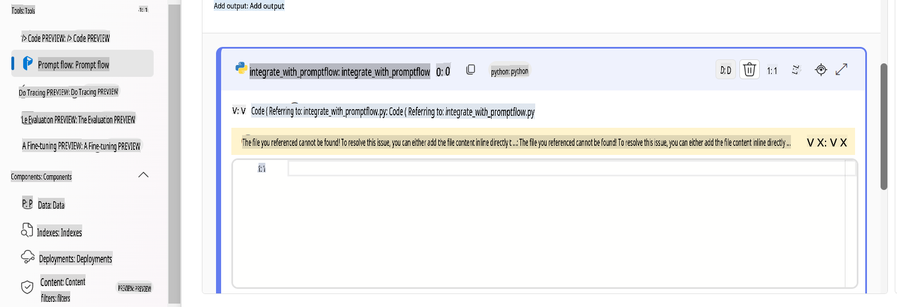

> [!NOTE]
> For more detailed information on using Prompt flow in Azure AI Foundry, refer to [Prompt flow in Azure AI Foundry](https://learn.microsoft.com/azure/ai-studio/how-to/prompt-flow).

1. Enable **Chat input** and **Chat output** to start chatting with your model.

    

1. You’re now ready to chat with your custom Phi-3 / Phi-3.5 model. In the next steps, you’ll learn how to start Prompt flow and use it to interact with your fine-tuned model.

> [!NOTE]
>
> The modified flow should resemble the following image:
>
> 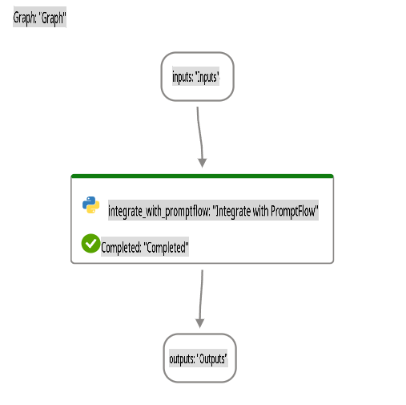
>

#### Start Prompt flow

1. Click **Start compute sessions** to launch Prompt flow.

    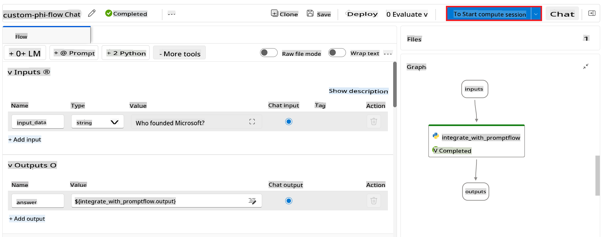

1. Click **Validate and parse input** to refresh parameters.

    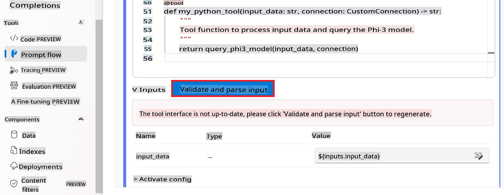

1. Select the **Value** of the **connection** you created earlier, such as *connection*.

    

#### Chat with your custom Phi-3 / Phi-3.5 model

1. Click **Chat**.

    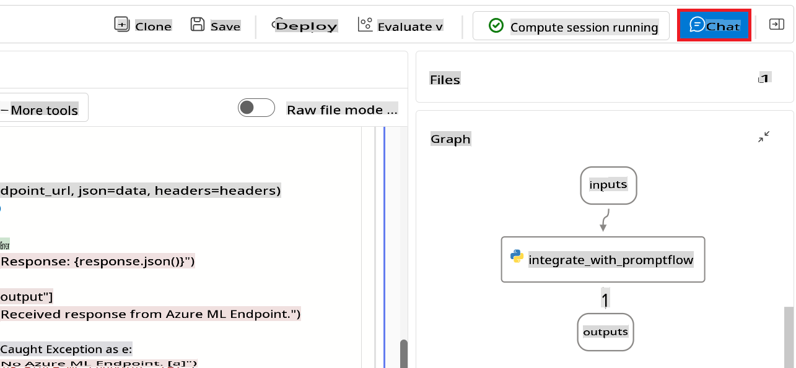

1. Here’s an example of the results: You can now chat with your custom Phi-3 / Phi-3.5 model. It’s recommended to ask questions related to the data used during fine-tuning.

    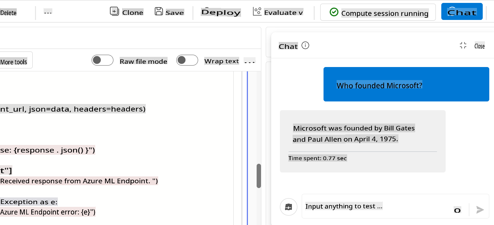

### Deploy Azure OpenAI to evaluate the Phi-3 / Phi-3.5 model

To evaluate the Phi-3 / Phi-3.5 model in Azure AI Foundry, you need to deploy an Azure OpenAI model. This will be used to assess the performance of the Phi-3 / Phi-3.5 model.

#### Deploy Azure OpenAI

1. Log in to [Azure AI Foundry](https://ai.azure.com/?wt.mc_id=studentamb_279723).

1. Open the Azure AI Foundry project you created.

    

1. In the project, click **Deployments** from the left-hand menu.

1. Click **+ Deploy model** from the navigation bar.

1. Select **Deploy base model**.

    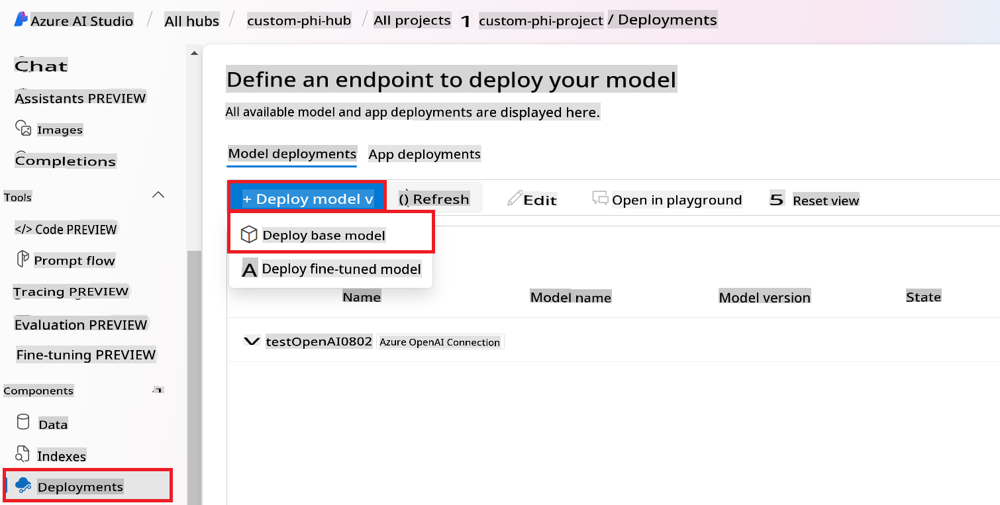

1. Choose the Azure OpenAI model you want to use, such as **gpt-4o**.

    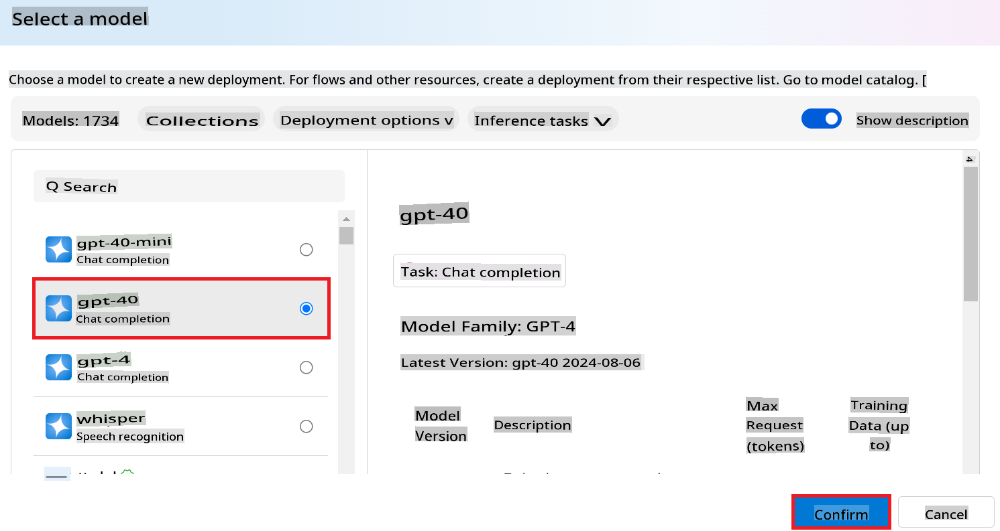

1. Click **Confirm**.

### Evaluate the fine-tuned Phi-3 / Phi-3.5 model using Azure AI Foundry's Prompt flow evaluation

### Start a new evaluation

1. Go to [Azure AI Foundry](https://ai.azure.com/?wt.mc_id=studentamb_279723).

1. Open the Azure AI Foundry project you created.

    

1. In the project, click **Evaluation** from the left-hand menu.

1. Click **+ New evaluation** from the navigation bar.
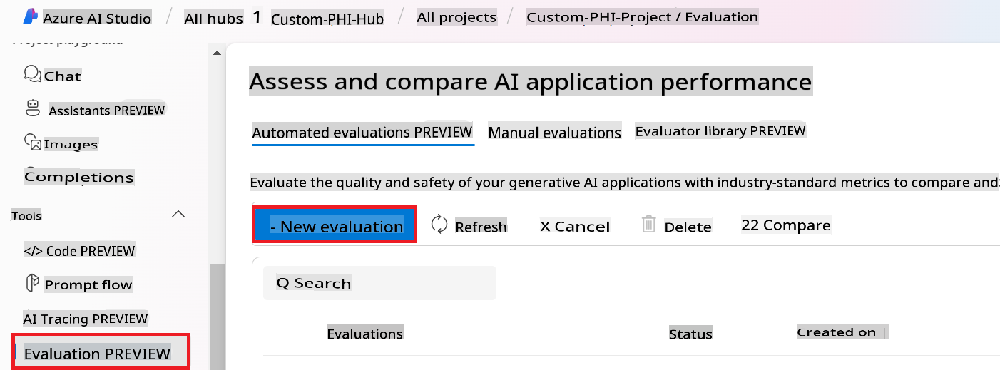

1. Select **Prompt flow** evaluation.

    

1. Perform the following steps:

    - Enter a name for the evaluation. It must be a unique value.
    - Choose **Question and answer without context** as the task type. This is because the **ULTRACHAT_200k** dataset used in this tutorial does not include context.
    - Select the prompt flow you want to evaluate.

    

1. Click **Next**.

1. Perform the following steps:

    - Click **Add your dataset** to upload the dataset. For instance, you can upload a test dataset file like *test_data.json1*, which is included when you download the **ULTRACHAT_200k** dataset.
    - Choose the appropriate **Dataset column** that corresponds to your dataset. For example, if you are using the **ULTRACHAT_200k** dataset, select **${data.prompt}** as the dataset column.

    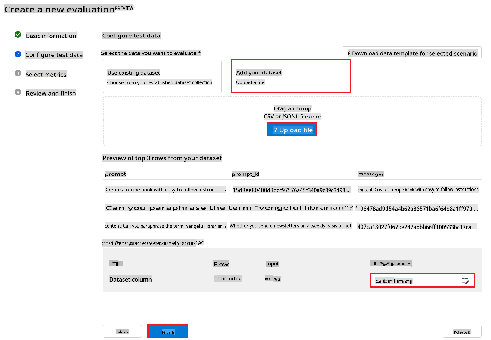

1. Click **Next**.

1. Perform the following steps to set up performance and quality metrics:

    - Choose the performance and quality metrics you want to use.
    - Select the Azure OpenAI model you created for evaluation. For example, choose **gpt-4o**.

    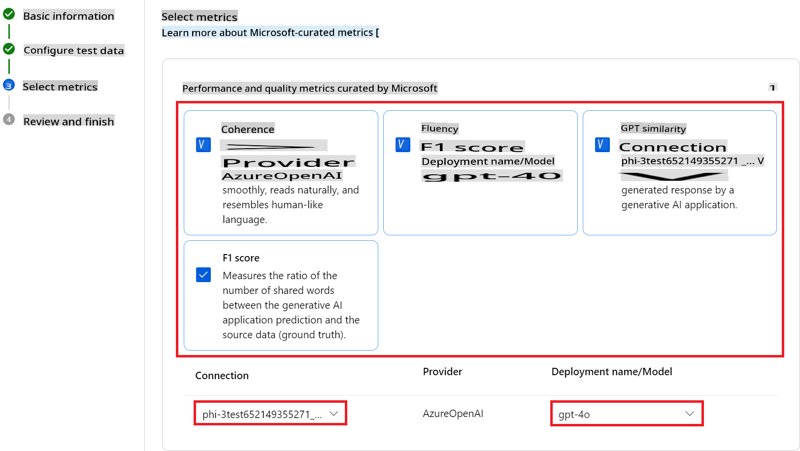

1. Perform the following steps to set up risk and safety metrics:

    - Choose the risk and safety metrics you want to use.
    - Select the threshold to calculate the defect rate. For instance, choose **Medium**.
    - For **question**, set **Data source** to **{$data.prompt}**.
    - For **answer**, set **Data source** to **{$run.outputs.answer}**.
    - For **ground_truth**, set **Data source** to **{$data.message}**.

    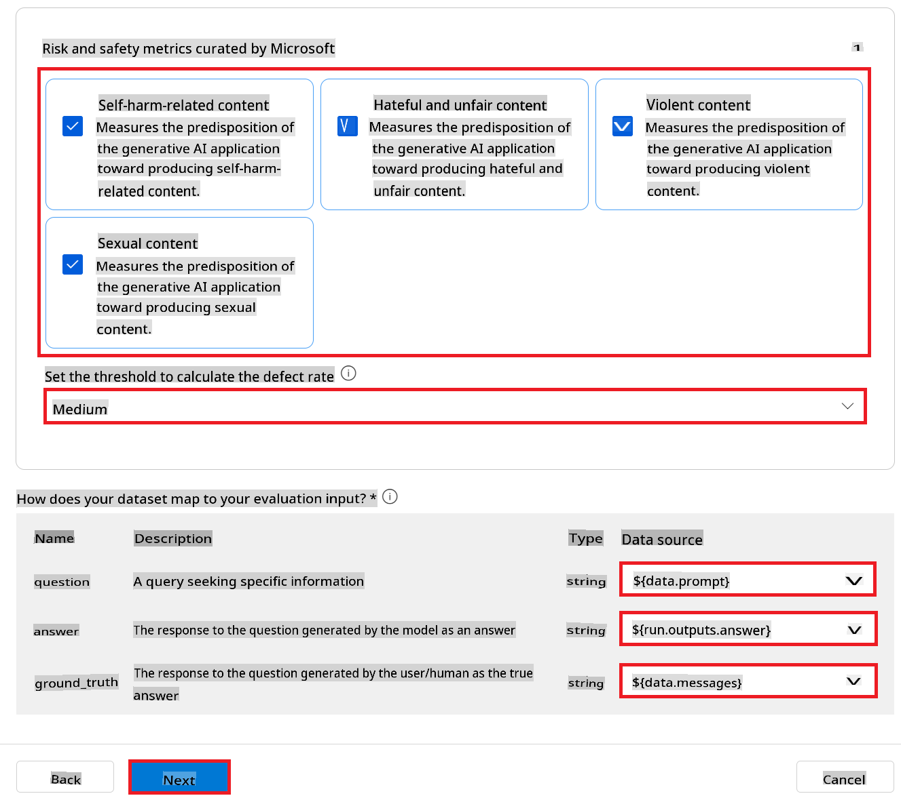

1. Click **Next**.

1. Click **Submit** to begin the evaluation.

1. The evaluation will take some time to complete. You can track its progress in the **Evaluation** tab.

### Review the Evaluation Results

> [!NOTE]
> The results shown below are for demonstration purposes. In this tutorial, we used a model fine-tuned on a relatively small dataset, which may result in sub-optimal outcomes. Actual results may vary depending on the size, quality, and diversity of the dataset, as well as the specific model configuration.

After the evaluation is complete, you can review the results for both performance and safety metrics.

1. Performance and quality metrics:

    - Assess the model’s ability to generate coherent, fluent, and relevant responses.

    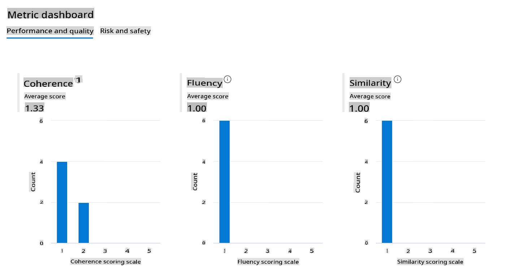

1. Risk and safety metrics:

    - Verify that the model’s outputs are safe and align with Responsible AI Principles, avoiding harmful or offensive content.

    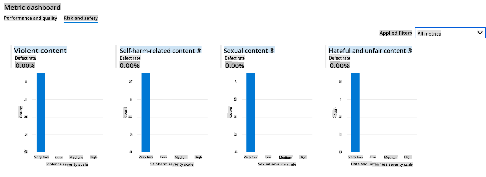

1. Scroll down to view **Detailed metrics result**.

    

1. By evaluating your custom Phi-3 / Phi-3.5 model against both performance and safety metrics, you can ensure the model is not only effective but also adheres to responsible AI principles, making it suitable for real-world applications.

## Congratulations!

### You’ve completed this tutorial

You have successfully evaluated the fine-tuned Phi-3 model integrated with Prompt flow in Azure AI Foundry. This is a crucial step in ensuring your AI models perform well while adhering to Microsoft’s Responsible AI principles, helping you create trustworthy and reliable AI solutions.


## Clean Up Azure Resources

To avoid incurring additional charges, clean up your Azure resources. Go to the Azure portal and delete the following resources:

- The Azure Machine Learning resource.
- The Azure Machine Learning model endpoint.
- The Azure AI Foundry Project resource.
- The Azure AI Foundry Prompt flow resource.

### Next Steps

#### Documentation

- [Assess AI systems by using the Responsible AI dashboard](https://learn.microsoft.com/azure/machine-learning/concept-responsible-ai-dashboard?view=azureml-api-2&source=recommendations?wt.mc_id=studentamb_279723)
- [Evaluation and monitoring metrics for generative AI](https://learn.microsoft.com/azure/ai-studio/concepts/evaluation-metrics-built-in?tabs=definition?wt.mc_id=studentamb_279723)
- [Azure AI Foundry documentation](https://learn.microsoft.com/azure/ai-studio/?wt.mc_id=studentamb_279723)
- [Prompt flow documentation](https://microsoft.github.io/promptflow/?wt.mc_id=studentamb_279723)

#### Training Content

- [Introduction to Microsoft's Responsible AI Approach](https://learn.microsoft.com/training/modules/introduction-to-microsofts-responsible-ai-approach/?source=recommendations?wt.mc_id=studentamb_279723)
- [Introduction to Azure AI Foundry](https://learn.microsoft.com/training/modules/introduction-to-azure-ai-studio/?wt.mc_id=studentamb_279723)

### Reference

- [What is Responsible AI?](https://learn.microsoft.com/azure/machine-learning/concept-responsible-ai?view=azureml-api-2?wt.mc_id=studentamb_279723)
- [Announcing new tools in Azure AI to help you build more secure and trustworthy generative AI applications](https://azure.microsoft.com/blog/announcing-new-tools-in-azure-ai-to-help-you-build-more-secure-and-trustworthy-generative-ai-applications/?wt.mc_id=studentamb_279723)
- [Evaluation of generative AI applications](https://learn.microsoft.com/azure/ai-studio/concepts/evaluation-approach-gen-ai?wt.mc_id%3Dstudentamb_279723)

**Disclaimer**:  
This document has been translated using machine-based AI translation services. While we strive for accuracy, please note that automated translations may contain errors or inaccuracies. The original document in its native language should be regarded as the authoritative source. For critical information, professional human translation is recommended. We are not responsible for any misunderstandings or misinterpretations resulting from the use of this translation.