# Fine-tune and Integrate Custom Phi-3 Models with Prompt Flow in Azure AI Foundry

This end-to-end (E2E) sample is based on the guide "[Fine-Tune and Integrate Custom Phi-3 Models with Prompt Flow in Azure AI Foundry](https://techcommunity.microsoft.com/t5/educator-developer-blog/fine-tune-and-integrate-custom-phi-3-models-with-prompt-flow-in/ba-p/4191726?WT.mc_id=aiml-137032-kinfeylo)" from the Microsoft Tech Community. It covers the processes of fine-tuning, deploying, and integrating custom Phi-3 models with Prompt Flow in Azure AI Foundry.  
Unlike the E2E sample, "[Fine-Tune and Integrate Custom Phi-3 Models with Prompt Flow](./E2E_Phi-3-FineTuning_PromptFlow_Integration.md)", which required running code locally, this tutorial focuses entirely on fine-tuning and integrating your model within the Azure AI / ML Studio.

## Overview

In this E2E sample, you'll learn how to fine-tune the Phi-3 model and integrate it with Prompt Flow in Azure AI Foundry. By leveraging Azure AI / ML Studio, you'll establish a workflow for deploying and utilizing custom AI models. This E2E sample is divided into three scenarios:

**Scenario 1: Set up Azure resources and Prepare for fine-tuning**  
**Scenario 2: Fine-tune the Phi-3 model and Deploy in Azure Machine Learning Studio**  
**Scenario 3: Integrate with Prompt Flow and Chat with your custom model in Azure AI Foundry**

Here’s an overview of this E2E sample.

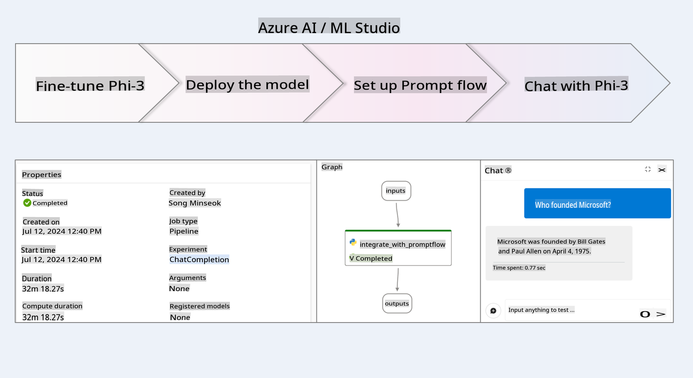

### Table of Contents

1. **[Scenario 1: Set up Azure resources and Prepare for fine-tuning](../../../../../../md/02.Application/01.TextAndChat/Phi3)**  
    - [Create an Azure Machine Learning Workspace](../../../../../../md/02.Application/01.TextAndChat/Phi3)  
    - [Request GPU quotas in Azure Subscription](../../../../../../md/02.Application/01.TextAndChat/Phi3)  
    - [Add role assignment](../../../../../../md/02.Application/01.TextAndChat/Phi3)  
    - [Set up project](../../../../../../md/02.Application/01.TextAndChat/Phi3)  
    - [Prepare dataset for fine-tuning](../../../../../../md/02.Application/01.TextAndChat/Phi3)

1. **[Scenario 2: Fine-tune Phi-3 model and Deploy in Azure Machine Learning Studio](../../../../../../md/02.Application/01.TextAndChat/Phi3)**  
    - [Fine-tune the Phi-3 model](../../../../../../md/02.Application/01.TextAndChat/Phi3)  
    - [Deploy the fine-tuned Phi-3 model](../../../../../../md/02.Application/01.TextAndChat/Phi3)

1. **[Scenario 3: Integrate with Prompt Flow and Chat with your custom model in Azure AI Foundry](../../../../../../md/02.Application/01.TextAndChat/Phi3)**  
    - [Integrate the custom Phi-3 model with Prompt Flow](../../../../../../md/02.Application/01.TextAndChat/Phi3)  
    - [Chat with your custom Phi-3 model](../../../../../../md/02.Application/01.TextAndChat/Phi3)

## Scenario 1: Set up Azure resources and Prepare for fine-tuning

### Create an Azure Machine Learning Workspace

1. Type *azure machine learning* in the **search bar** at the top of the portal page and select **Azure Machine Learning** from the options that appear.

    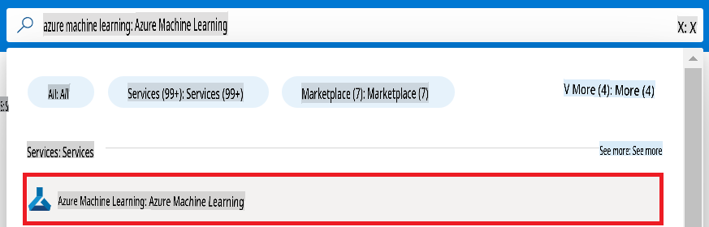

2. Select **+ Create** from the navigation menu.

3. Select **New workspace** from the navigation menu.

    

4. Perform the following tasks:  

    - Select your Azure **Subscription**.  
    - Select the **Resource group** to use (create a new one if needed).  
    - Enter **Workspace Name**. It must be a unique value.  
    - Select the **Region** you'd like to use.  
    - Select the **Storage account** to use (create a new one if needed).  
    - Select the **Key vault** to use (create a new one if needed).  
    - Select the **Application insights** to use (create a new one if needed).  
    - Select the **Container registry** to use (create a new one if needed).  

    

5. Select **Review + Create**.

6. Select **Create**.

### Request GPU quotas in Azure Subscription

In this tutorial, you'll fine-tune and deploy a Phi-3 model using GPUs. For fine-tuning, you'll use the *Standard_NC24ads_A100_v4* GPU, which requires a quota request. For deployment, you'll use the *Standard_NC6s_v3* GPU, which also requires a quota request.

> [!NOTE]  
> Only Pay-As-You-Go subscriptions (the standard subscription type) are eligible for GPU allocation; benefit subscriptions are not currently supported.

1. Visit [Azure ML Studio](https://ml.azure.com/home?wt.mc_id=studentamb_279723).

1. Perform the following tasks to request *Standard NCADSA100v4 Family* quota:

    - Select **Quota** from the left-side tab.  
    - Select the **Virtual machine family** to use. For example, select **Standard NCADSA100v4 Family Cluster Dedicated vCPUs**, which includes the *Standard_NC24ads_A100_v4* GPU.  
    - Select **Request quota** from the navigation menu.

        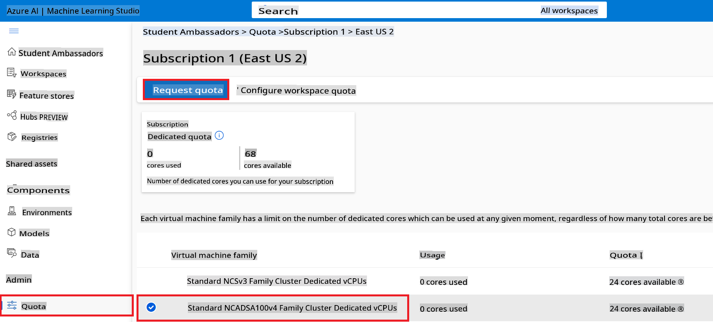

    - Inside the Request quota page, enter the **New cores limit** you'd like to use. For example, 24.  
    - Inside the Request quota page, select **Submit** to request the GPU quota.

1. Perform the following tasks to request *Standard NCSv3 Family* quota:

    - Select **Quota** from the left-side tab.  
    - Select the **Virtual machine family** to use. For example, select **Standard NCSv3 Family Cluster Dedicated vCPUs**, which includes the *Standard_NC6s_v3* GPU.  
    - Select **Request quota** from the navigation menu.  
    - Inside the Request quota page, enter the **New cores limit** you'd like to use. For example, 24.  
    - Inside the Request quota page, select **Submit** to request the GPU quota.

### Add role assignment

To fine-tune and deploy your models, you must first create a User Assigned Managed Identity (UAI) and assign it the appropriate permissions. This UAI will be used for authentication during deployment.

#### Create User Assigned Managed Identity (UAI)

1. Type *managed identities* in the **search bar** at the top of the portal page and select **Managed Identities** from the options that appear.

    

1. Select **+ Create**.

    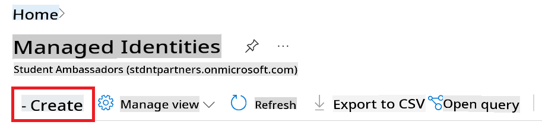

1. Perform the following tasks:  

    - Select your Azure **Subscription**.  
    - Select the **Resource group** to use (create a new one if needed).  
    - Select the **Region** you'd like to use.  
    - Enter the **Name**. It must be a unique value.  

    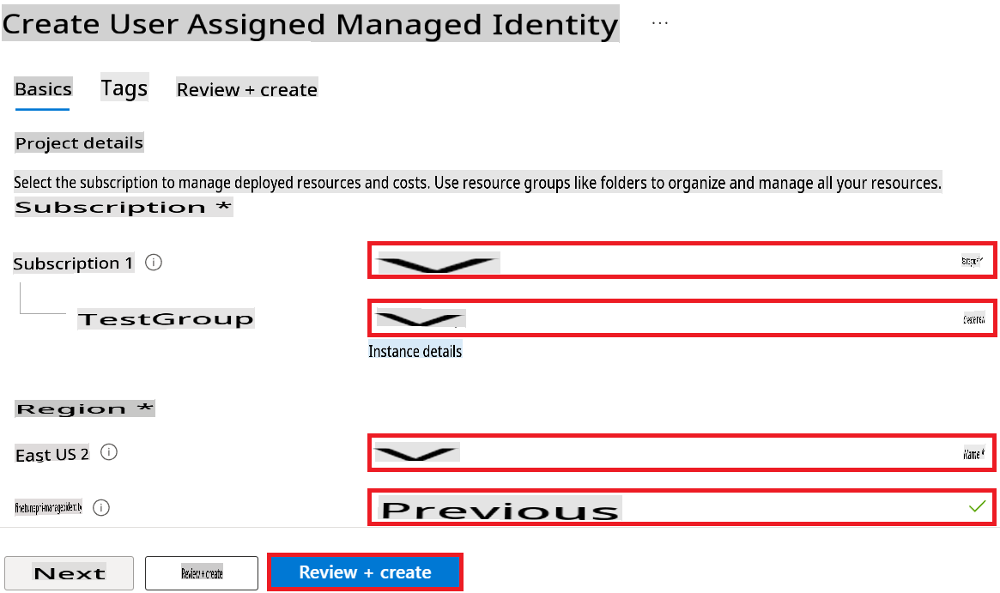

1. Select **Review + create**.

1. Select **+ Create**.

#### Add Contributor role assignment to Managed Identity

1. Navigate to the Managed Identity resource that you created.

1. Select **Azure role assignments** from the left-side tab.

1. Select **+ Add role assignment** from the navigation menu.

1. Inside Add role assignment page, perform the following tasks:  
    - Select the **Scope** to **Resource group**.  
    - Select your Azure **Subscription**.  
    - Select the **Resource group** to use.  
    - Select the **Role** to **Contributor**.

    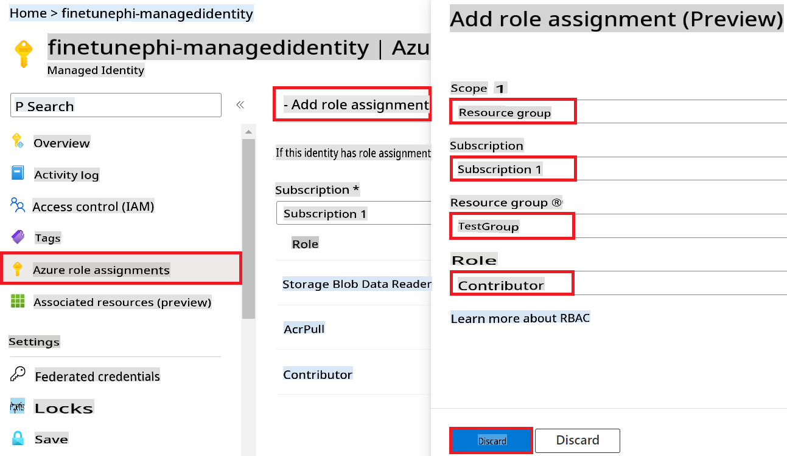

2. Select **Save**.

#### Add Storage Blob Data Reader role assignment to Managed Identity

1. Type *storage accounts* in the **search bar** at the top of the portal page and select **Storage accounts** from the options that appear.

    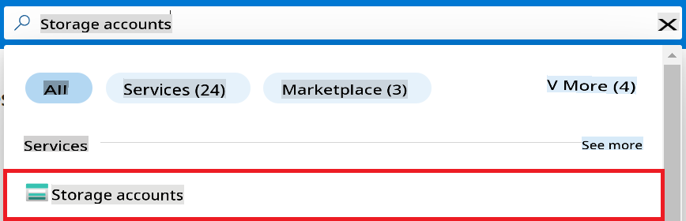

1. Select the storage account associated with the Azure Machine Learning workspace that you created. For example, *finetunephistorage*.

1. Perform the following tasks to navigate to the Add role assignment page:

    - Navigate to the Azure Storage account that you created.  
    - Select **Access Control (IAM)** from the left-side tab.  
    - Select **+ Add** from the navigation menu.  
    - Select **Add role assignment** from the navigation menu.

    

1. Inside Add role assignment page, perform the following tasks:  

    - Inside the Role page, type *Storage Blob Data Reader* in the **search bar** and select **Storage Blob Data Reader** from the options that appear.  
    - Inside the Role page, select **Next**.  
    - Inside the Members page, select **Assign access to** **Managed identity**.  
    - Inside the Members page, select **+ Select members**.  
    - Inside Select managed identities page, select your Azure **Subscription**.  
    - Inside Select managed identities page, select the **Managed identity** to **Manage Identity**.  
    - Inside Select managed identities page, select the Managed Identity that you created. For example, *finetunephi-managedidentity*.  
    - Inside Select managed identities page, select **Select**.

    

1. Select **Review + assign**.

#### Add AcrPull role assignment to Managed Identity

1. Type *container registries* in the **search bar** at the top of the portal page and select **Container registries** from the options that appear.

    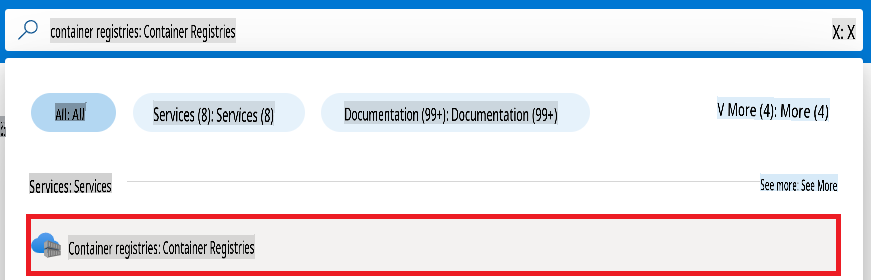

1. Select the container registry associated with the Azure Machine Learning workspace. For example, *finetunephicontainerregistry*.

1. Perform the following tasks to navigate to the Add role assignment page:

    - Select **Access Control (IAM)** from the left-side tab.  
    - Select **+ Add** from the navigation menu.  
    - Select **Add role assignment** from the navigation menu.

1. Inside Add role assignment page, perform the following tasks:

    - Inside the Role page, type *AcrPull* in the **search bar** and select **AcrPull** from the options that appear.  
    - Inside the Role page, select **Next**.  
    - Inside the Members page, select **Assign access to** **Managed identity**.  
    - Inside the Members page, select **+ Select members**.  
    - Inside Select managed identities page, select your Azure **Subscription**.  
    - Inside Select managed identities page, select the **Managed identity** to **Manage Identity**.  
    - Inside Select managed identities page, select the Managed Identity that you created. For example, *finetunephi-managedidentity*.  
    - Inside Select managed identities page, select **Select**.  
    - Select **Review + assign**.

### Set up project

To download the datasets needed for fine-tuning, you'll set up a local environment.

In this exercise, you will:

- Create a folder to work inside it.  
- Create a virtual environment.  
- Install the required packages.  
- Create a *download_dataset.py* file to download the dataset.

#### Create a folder to work inside it

1. Open a terminal window and type the following command to create a folder named *finetune-phi* in the default path.

    ```console
    mkdir finetune-phi
    ```

2. Type the following command inside your terminal to navigate to the *finetune-phi* folder you created.

    ```console
    cd finetune-phi
    ```

#### Create a virtual environment

1. Type the following command inside your terminal to create a virtual environment named *.venv*.

    ```console
    python -m venv .venv
    ```

2. Type the following command inside your terminal to activate the virtual environment.

    ```console
    .venv\Scripts\activate.bat
    ```

> [!NOTE]  
> If it worked, you should see *(.venv)* before the command prompt.

#### Install the required packages

1. Type the following commands inside your terminal to install the required packages.

    ```console
    pip install datasets==2.19.1
    ```

#### Create `download_dataset.py`

> [!NOTE]  
> Complete folder structure:  
>  
> ```text
> └── YourUserName
> .    └── finetune-phi
> .        └── download_dataset.py
> ```

1. Open **Visual Studio Code**.

1. Select **File** from the menu bar.

1. Select **Open Folder**.

1. Select the *finetune-phi* folder that you created, located at *C:\Users\yourUserName\finetune-phi*.

    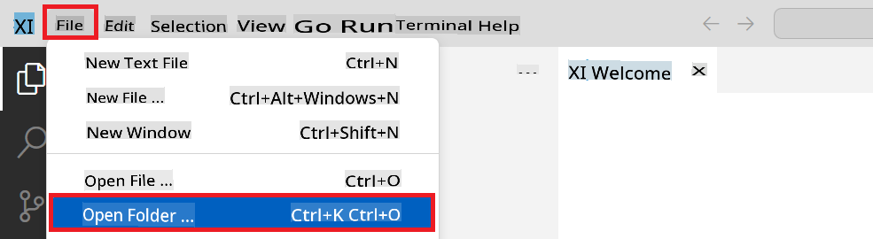

1. In the left pane of Visual Studio Code, right-click and select **New File** to create a new file named *download_dataset.py*.

    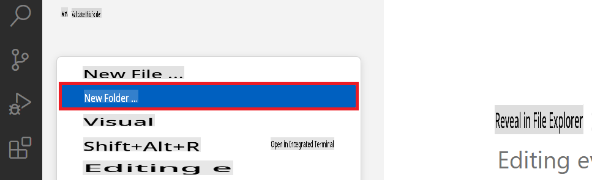

### Prepare dataset for fine-tuning

In this exercise, you'll run the *download_dataset.py* file to download the *ultrachat_200k* datasets to your local environment. You'll then use these datasets to fine-tune the Phi-3 model in Azure Machine Learning.

In this exercise, you will:

- Add code to the *download_dataset.py* file to download the datasets.  
- Run the *download_dataset.py* file to download datasets to your local environment.

#### Download your dataset using *download_dataset.py*

1. Open the *download_dataset.py* file in Visual Studio Code.

1. Add the following code into the *download_dataset.py* file.

    ```python
    import json
    import os
    from datasets import load_dataset

    def load_and_split_dataset(dataset_name, config_name, split_ratio):
        """
        Load and split a dataset.
        """
        # Load the dataset with the specified name, configuration, and split ratio
        dataset = load_dataset(dataset_name, config_name, split=split_ratio)
        print(f"Original dataset size: {len(dataset)}")
        
        # Split the dataset into train and test sets (80% train, 20% test)
        split_dataset = dataset.train_test_split(test_size=0.2)
        print(f"Train dataset size: {len(split_dataset['train'])}")
        print(f"Test dataset size: {len(split_dataset['test'])}")
        
        return split_dataset

    def save_dataset_to_jsonl(dataset, filepath):
        """
        Save a dataset to a JSONL file.
        """
        # Create the directory if it does not exist
        os.makedirs(os.path.dirname(filepath), exist_ok=True)
        
        # Open the file in write mode
        with open(filepath, 'w', encoding='utf-8') as f:
            # Iterate over each record in the dataset
            for record in dataset:
                # Dump the record as a JSON object and write it to the file
                json.dump(record, f)
                # Write a newline character to separate records
                f.write('\n')
        
        print(f"Dataset saved to {filepath}")

    def main():
        """
        Main function to load, split, and save the dataset.
        """
        # Load and split the ULTRACHAT_200k dataset with a specific configuration and split ratio
        dataset = load_and_split_dataset("HuggingFaceH4/ultrachat_200k", 'default', 'train_sft[:1%]')
        
        # Extract the train and test datasets from the split
        train_dataset = dataset['train']
        test_dataset = dataset['test']

        # Save the train dataset to a JSONL file
        save_dataset_to_jsonl(train_dataset, "data/train_data.jsonl")
        
        # Save the test dataset to a separate JSONL file
        save_dataset_to_jsonl(test_dataset, "data/test_data.jsonl")

    if __name__ == "__main__":
        main()

    ```

1. Type the following command inside your terminal to run the script and download the dataset to your local environment.

    ```console
    python download_dataset.py
    ```

1. Verify that the datasets were saved successfully to your local *finetune-phi/data* directory.

> [!NOTE]  
> #### Note on dataset size and fine-tuning time  
> In this tutorial, you use only 1% of the dataset (`split='train[:1%]'`). This significantly reduces the amount of data, speeding up both the upload and fine-tuning processes. You can adjust the percentage to find the right balance between training time and model performance. Using a smaller subset of the dataset reduces the time required for fine-tuning, making the process more manageable for a tutorial.

## Scenario 2: Fine-tune Phi-3 model and Deploy in Azure Machine Learning Studio

### Fine-tune the Phi-3 model

In this exercise, you'll fine-tune the Phi-3 model in Azure Machine Learning Studio.

In this exercise, you will:

- Create a compute cluster for fine-tuning.  
- Fine-tune the Phi-3 model in Azure Machine Learning Studio.  

#### Create a compute cluster for fine-tuning
1. Visit [Azure ML Studio](https://ml.azure.com/home?wt.mc_id=studentamb_279723).

1. Select **Compute** from the left-hand menu.

1. Click on **Compute clusters** in the navigation menu.

1. Click **+ New**.

    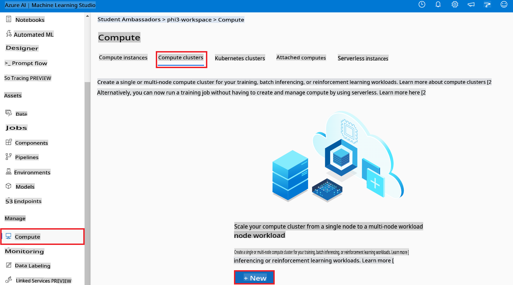

1. Complete the following steps:

    - Choose the **Region** you want to use.
    - Set the **Virtual machine tier** to **Dedicated**.
    - Set the **Virtual machine type** to **GPU**.
    - Apply the **Virtual machine size** filter to **Select from all options**.
    - Choose **Standard_NC24ads_A100_v4** for the **Virtual machine size**.

    

1. Click **Next**.

1. Complete the following steps:

    - Enter a unique **Compute name**.
    - Set the **Minimum number of nodes** to **0**.
    - Set the **Maximum number of nodes** to **1**.
    - Set the **Idle seconds before scale down** to **120**.

    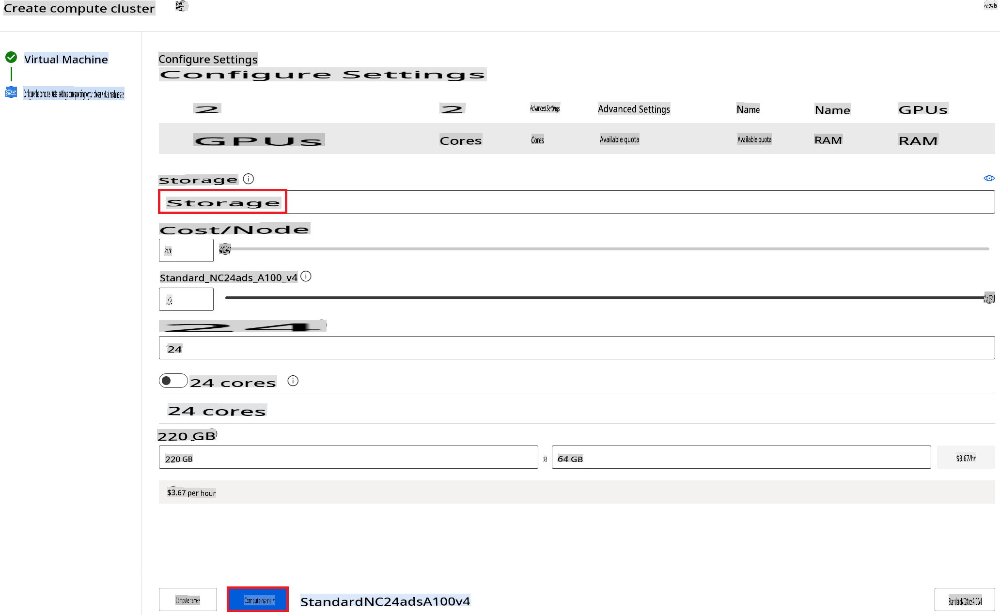

1. Click **Create**.

#### Fine-tune the Phi-3 model

1. Visit [Azure ML Studio](https://ml.azure.com/home?wt.mc_id=studentamb_279723).

1. Select the Azure Machine Learning workspace you created.

    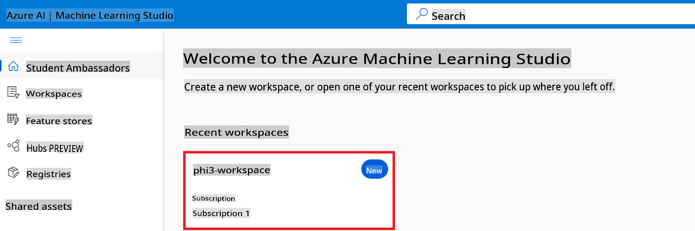

1. Complete the following steps:

    - Click on **Model catalog** in the left-hand menu.
    - Enter *phi-3-mini-4k* in the **search bar** and select **Phi-3-mini-4k-instruct** from the search results.

    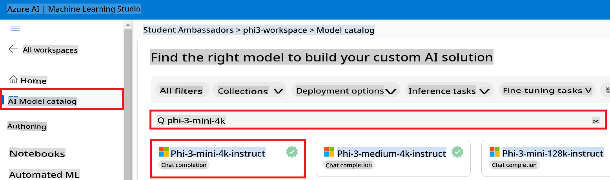

1. Click **Fine-tune** in the navigation menu.

    

1. Complete the following steps:

    - Set **Select task type** to **Chat completion**.
    - Click **+ Select data** to upload your **Training data**.
    - Set the Validation data upload type to **Provide different validation data**.
    - Click **+ Select data** to upload your **Validation data**.

    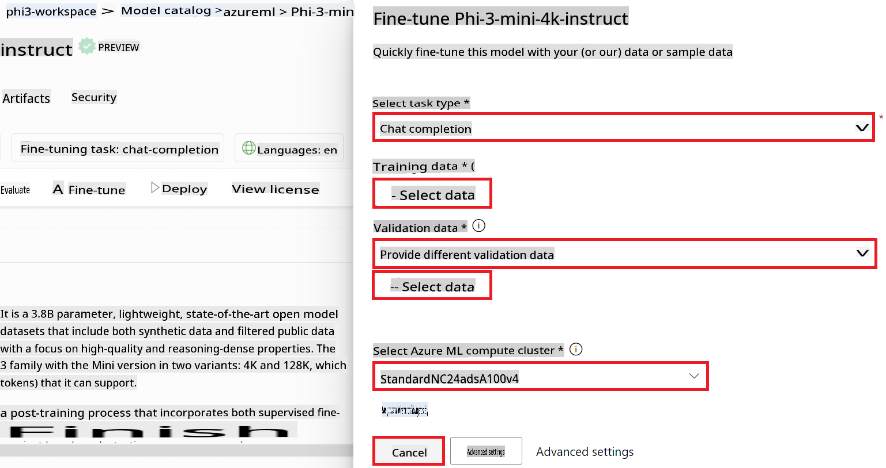

    > [!TIP]
    >
    > You can access **Advanced settings** to adjust configurations like **learning_rate** and **lr_scheduler_type** for optimizing the fine-tuning process to suit your requirements.

1. Click **Finish**.

1. Congratulations! You have successfully fine-tuned the Phi-3 model using Azure Machine Learning. Please note that the fine-tuning process may take some time. Once the job starts, you will need to wait for it to complete. You can monitor its progress in the Jobs tab within your Azure Machine Learning Workspace. In the next steps, you will deploy the fine-tuned model and integrate it with Prompt flow.

    

### Deploy the fine-tuned Phi-3 model

To integrate the fine-tuned Phi-3 model with Prompt flow, the model must be deployed for real-time inference. This process includes registering the model, creating an online endpoint, and deploying it.

In this exercise, you will:

- Register the fine-tuned model in your Azure Machine Learning workspace.
- Create an online endpoint.
- Deploy the fine-tuned Phi-3 model.

#### Register the fine-tuned model

1. Visit [Azure ML Studio](https://ml.azure.com/home?wt.mc_id=studentamb_279723).

1. Select the Azure Machine Learning workspace you created.

    

1. Click **Models** in the left-hand menu.
1. Click **+ Register**.
1. Choose **From a job output**.

    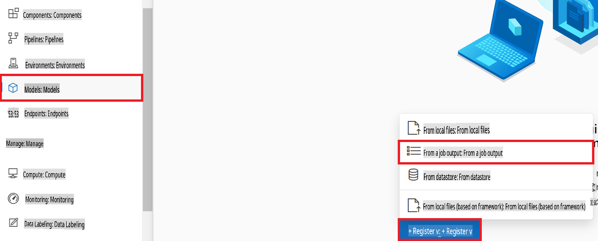

1. Select the job you created.

    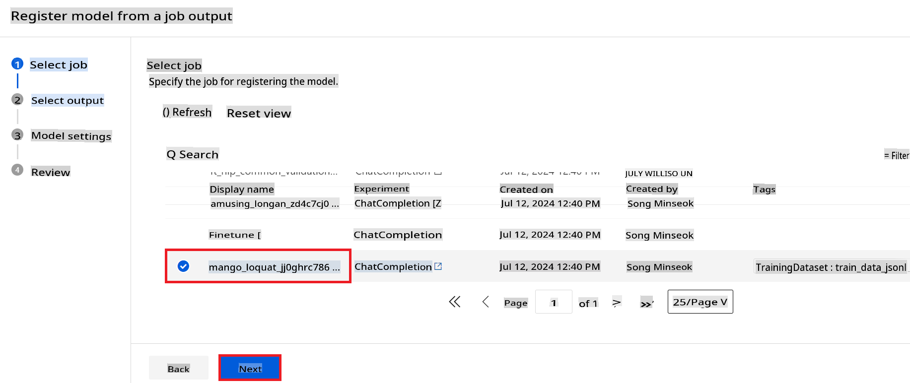

1. Click **Next**.

1. Set **Model type** to **MLflow**.

1. Ensure **Job output** is selected (this should be automatically selected).

    

2. Click **Next**.

3. Click **Register**.

    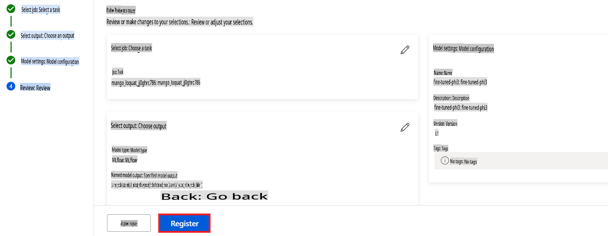

4. You can view your registered model by navigating to the **Models** section in the left-hand menu.

    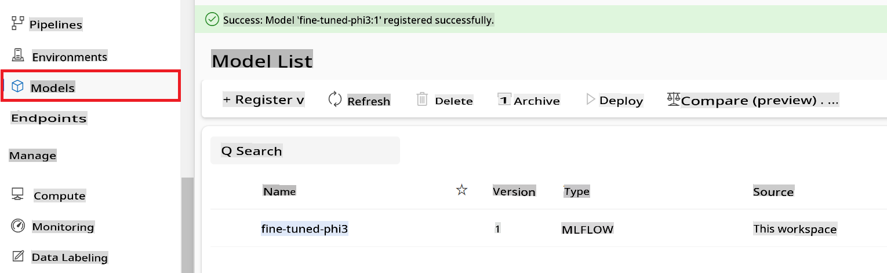

#### Deploy the fine-tuned model

1. Navigate to the Azure Machine Learning workspace you created.

1. Click **Endpoints** in the left-hand menu.

1. Choose **Real-time endpoints** from the navigation menu.

    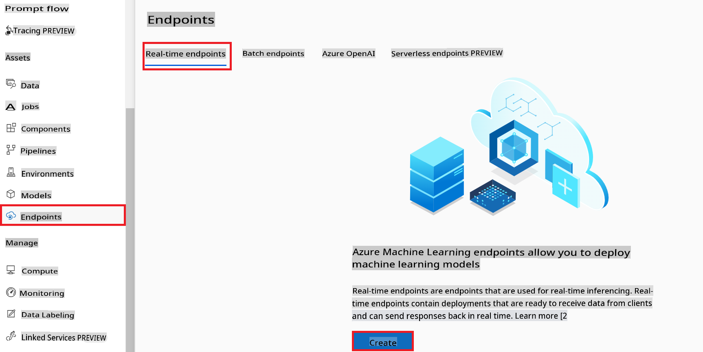

1. Click **Create**.

1. Select the registered model you created.

    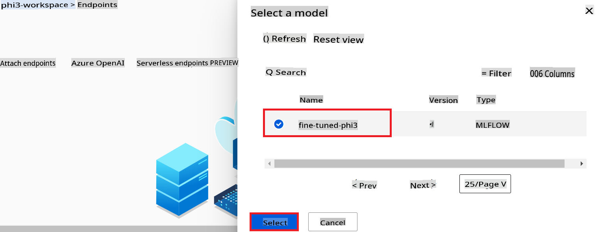

1. Click **Select**.

1. Complete the following steps:

    - Set **Virtual machine** to *Standard_NC6s_v3*.
    - Choose the **Instance count** (e.g., *1*).
    - Set the **Endpoint** to **New** to create a new endpoint.
    - Enter a unique **Endpoint name**.
    - Enter a unique **Deployment name**.

    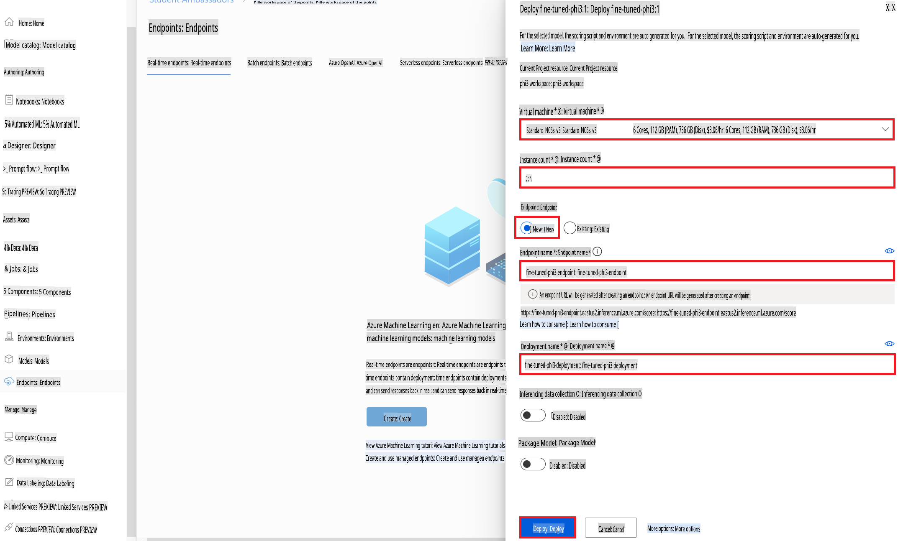

1. Click **Deploy**.

> [!WARNING]
> To prevent unnecessary charges, ensure you delete the created endpoint in your Azure Machine Learning workspace after completing your tasks.

#### Check deployment status in Azure Machine Learning Workspace

1. Navigate to the Azure Machine Learning workspace you created.

1. Click **Endpoints** in the left-hand menu.

1. Select the endpoint you created.

    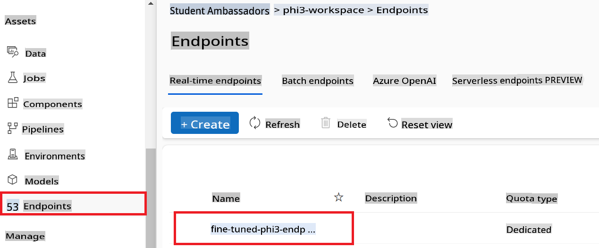

1. On this page, you can manage the endpoint during the deployment process.

> [!NOTE]
> After deployment is complete, ensure **Live traffic** is set to **100%**. If not, click **Update traffic** to adjust the traffic settings. Note that the model cannot be tested if the traffic is set to 0%.
>
> 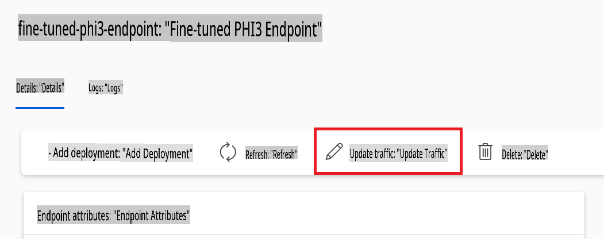
>

## Scenario 3: Integrate with Prompt flow and Chat with your custom model in Azure AI Foundry

### Integrate the custom Phi-3 model with Prompt flow

Once your fine-tuned model is deployed, you can integrate it with Prompt Flow to use it in real-time applications, enabling interactive tasks with your custom Phi-3 model.

In this exercise, you will:

- Create an Azure AI Foundry Hub.
- Create an Azure AI Foundry Project.
- Create a Prompt flow.
- Add a custom connection for the fine-tuned Phi-3 model.
- Set up Prompt flow to interact with your custom Phi-3 model.

> [!NOTE]
> You can also integrate Prompt Flow directly using Azure ML Studio. The process is the same.

#### Create Azure AI Foundry Hub

Before creating a Project, you need to create a Hub. A Hub functions like a Resource Group, helping you organize and manage multiple Projects within Azure AI Foundry.

1. Visit [Azure AI Foundry](https://ai.azure.com/?WT.mc_id=aiml-137032-kinfeylo).

1. Click **All hubs** in the left-hand menu.

1. Click **+ New hub** in the navigation menu.

    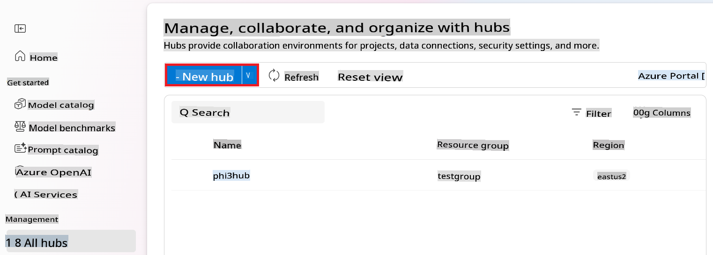

1. Complete the following steps:

    - Enter a unique **Hub name**.
    - Select your Azure **Subscription**.
    - Choose a **Resource group** (or create a new one if necessary).
    - Select the **Location** you want to use.
    - Choose the **Connect Azure AI Services** option (or create a new one if necessary).
    - Set **Connect Azure AI Search** to **Skip connecting**.

    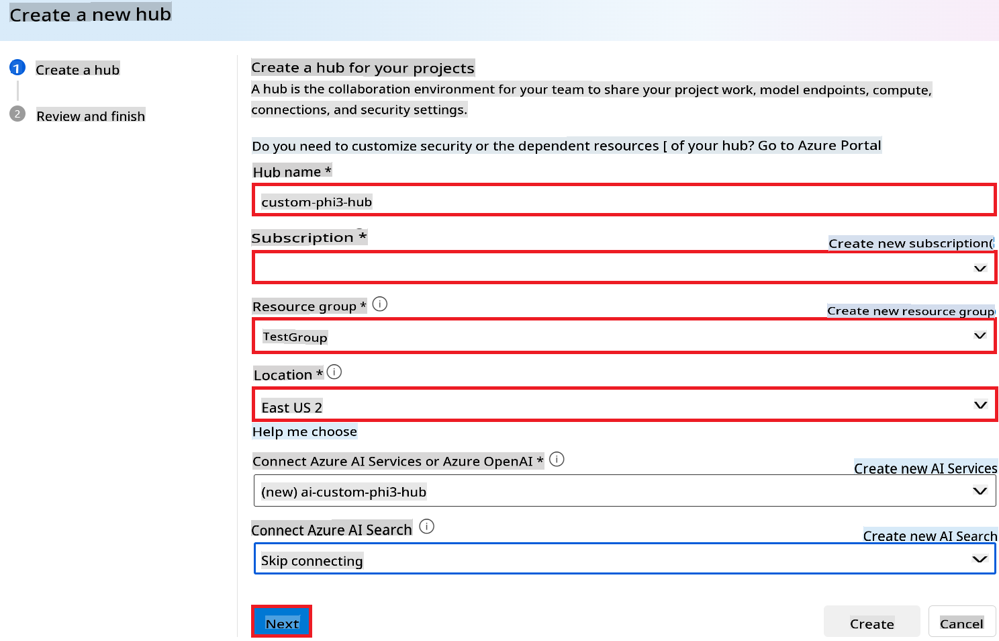

1. Click **Next**.

#### Create Azure AI Foundry Project

1. In the Hub you created, click **All projects** in the left-hand menu.

1. Click **+ New project** in the navigation menu.

    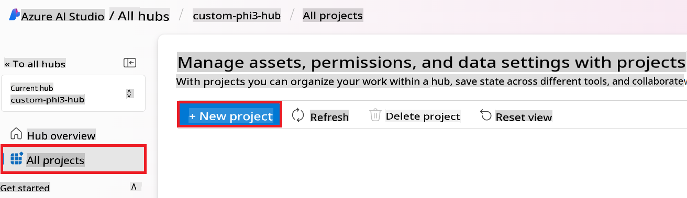

1. Enter a unique **Project name**.

    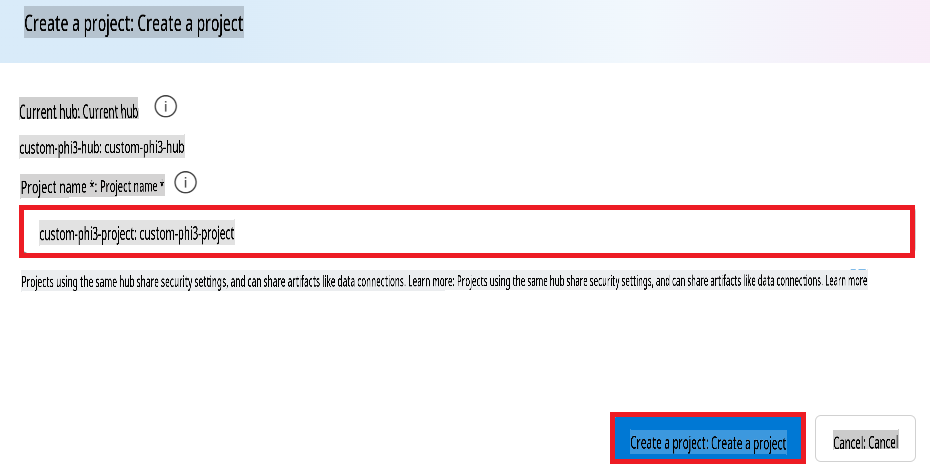

1. Click **Create a project**.

#### Add a custom connection for the fine-tuned Phi-3 model

To integrate your custom Phi-3 model with Prompt flow, you need to save the model's endpoint and key as a custom connection. This will allow access to your model in Prompt flow.

#### Set API key and endpoint URI of the fine-tuned Phi-3 model

1. Visit [Azure ML Studio](https://ml.azure.com/home?WT.mc_id=aiml-137032-kinfeylo).

1. Navigate to the Azure Machine Learning workspace you created.

1. Click **Endpoints** in the left-hand menu.

    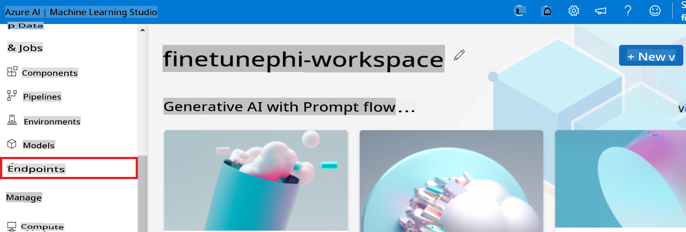

1. Select the endpoint you created.

    

1. Click **Consume** in the navigation menu.

1. Copy your **REST endpoint** and **Primary key**.
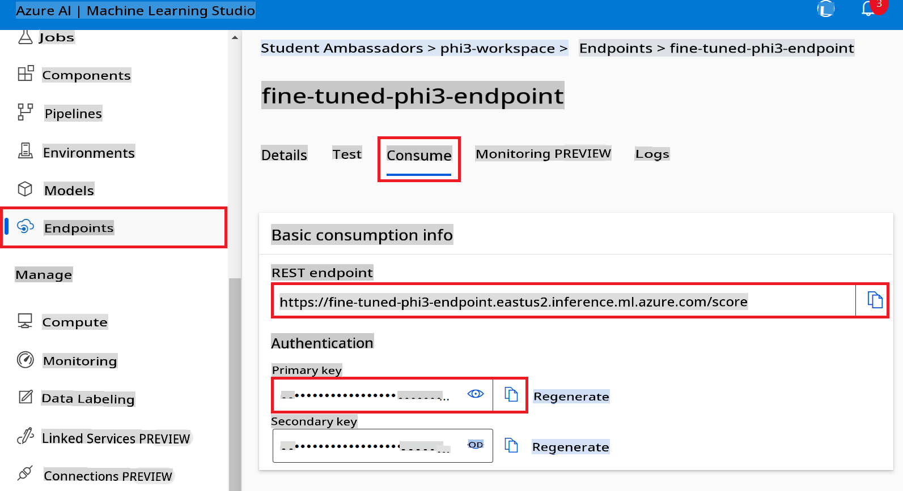

#### Add the Custom Connection

1. Go to [Azure AI Foundry](https://ai.azure.com/?WT.mc_id=aiml-137032-kinfeylo).

1. Open the Azure AI Foundry project you created.

1. In the project, select **Settings** from the left-hand menu.

1. Click on **+ New connection**.

    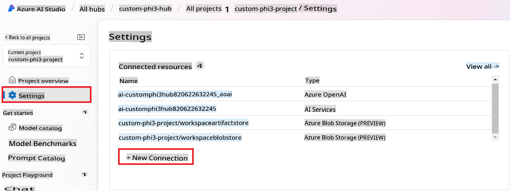

1. From the navigation menu, choose **Custom keys**.

    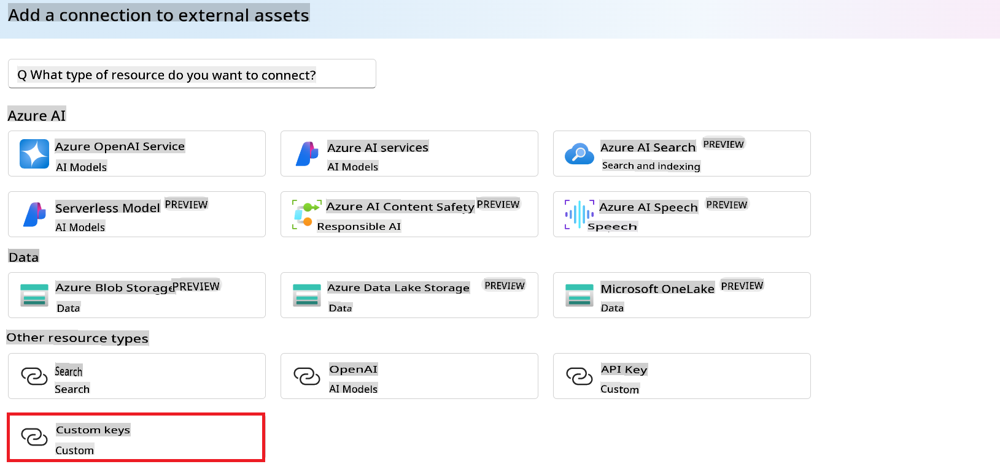

1. Complete the following steps:

    - Click **+ Add key value pairs**.
    - For the key name, type **endpoint** and paste the endpoint copied from Azure ML Studio into the value field.
    - Click **+ Add key value pairs** again.
    - For the key name, type **key** and paste the key copied from Azure ML Studio into the value field.
    - After adding the keys, enable **is secret** to keep the key hidden.

    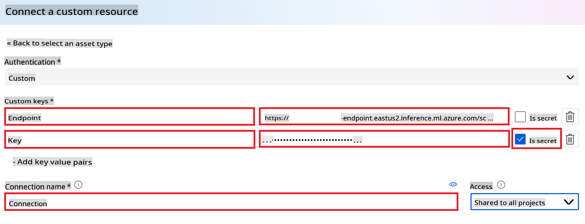

1. Click **Add connection**.

#### Create Prompt flow

You’ve successfully added a custom connection in Azure AI Foundry. Now, let’s create a Prompt flow. Afterward, you’ll link this Prompt flow to the custom connection, allowing you to use the fine-tuned model within the Prompt flow.

1. Open the Azure AI Foundry project you created.

1. From the left-hand menu, select **Prompt flow**.

1. Click **+ Create** from the navigation menu.

    

1. Choose **Chat flow** from the navigation menu.

    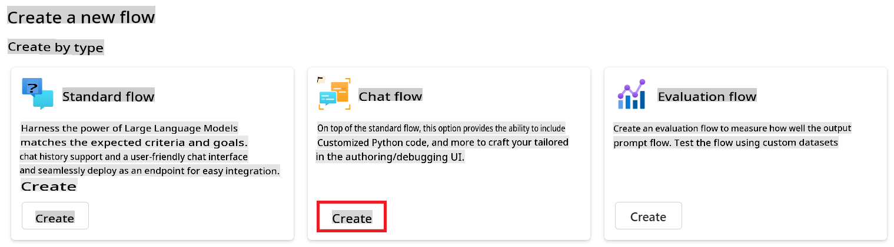

1. Enter a **Folder name**.

    

2. Click **Create**.

#### Set up Prompt flow to chat with your custom Phi-3 model

To integrate the fine-tuned Phi-3 model into a Prompt flow, you’ll need to modify the existing Prompt flow. The current setup isn’t designed for this purpose, so you’ll have to rebuild it.

1. In the Prompt flow, follow these steps to rebuild the flow:

    - Switch to **Raw file mode**.
    - Delete all existing code in the *flow.dag.yml* file.
    - Insert the following code into the *flow.dag.yml* file:

        ```yml
        inputs:
          input_data:
            type: string
            default: "Who founded Microsoft?"

        outputs:
          answer:
            type: string
            reference: ${integrate_with_promptflow.output}

        nodes:
        - name: integrate_with_promptflow
          type: python
          source:
            type: code
            path: integrate_with_promptflow.py
          inputs:
            input_data: ${inputs.input_data}
        ```

    - Click **Save**.

    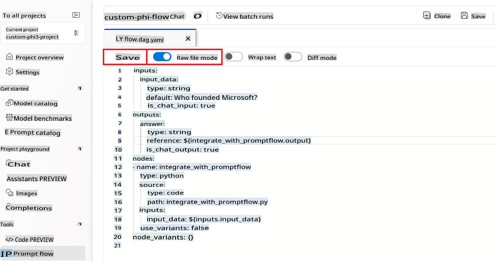

1. Add the following code to the *integrate_with_promptflow.py* file to enable the use of the custom Phi-3 model in Prompt flow.

    ```python
    import logging
    import requests
    from promptflow import tool
    from promptflow.connections import CustomConnection

    # Logging setup
    logging.basicConfig(
        format="%(asctime)s - %(levelname)s - %(name)s - %(message)s",
        datefmt="%Y-%m-%d %H:%M:%S",
        level=logging.DEBUG
    )
    logger = logging.getLogger(__name__)

    def query_phi3_model(input_data: str, connection: CustomConnection) -> str:
        """
        Send a request to the Phi-3 model endpoint with the given input data using Custom Connection.
        """

        # "connection" is the name of the Custom Connection, "endpoint", "key" are the keys in the Custom Connection
        endpoint_url = connection.endpoint
        api_key = connection.key

        headers = {
            "Content-Type": "application/json",
            "Authorization": f"Bearer {api_key}"
        }
        data = {
            "input_data": {
                "input_string": [
                    {"role": "user", "content": input_data}
                ],
                "parameters": {
                    "temperature": 0.7,
                    "max_new_tokens": 128
                }
            }
        }
        try:
            response = requests.post(endpoint_url, json=data, headers=headers)
            response.raise_for_status()
            
            # Log the full JSON response
            logger.debug(f"Full JSON response: {response.json()}")

            result = response.json()["output"]
            logger.info("Successfully received response from Azure ML Endpoint.")
            return result
        except requests.exceptions.RequestException as e:
            logger.error(f"Error querying Azure ML Endpoint: {e}")
            raise

    @tool
    def my_python_tool(input_data: str, connection: CustomConnection) -> str:
        """
        Tool function to process input data and query the Phi-3 model.
        """
        return query_phi3_model(input_data, connection)

    ```

    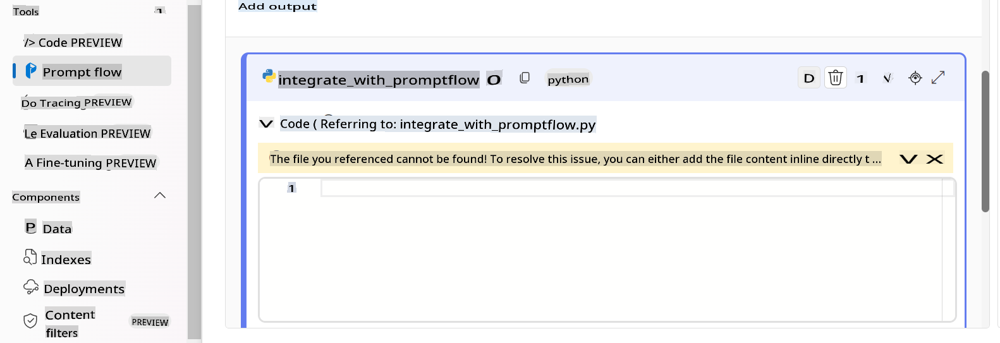

> [!NOTE]
> For detailed guidance on using Prompt flow in Azure AI Foundry, refer to [Prompt flow in Azure AI Foundry](https://learn.microsoft.com/azure/ai-studio/how-to/prompt-flow).

1. Enable **Chat input** and **Chat output** to interact with your model.

    

1. You’re now ready to chat with your custom Phi-3 model. In the next exercise, you’ll learn how to start Prompt flow and use it to interact with your fine-tuned Phi-3 model.

> [!NOTE]
>
> The redesigned flow should look like the image below:
>
> 
>

### Chat with your custom Phi-3 model

Now that your custom Phi-3 model is fine-tuned and integrated with Prompt flow, you’re ready to start interacting with it. This exercise will walk you through setting up and initiating a chat with your model using Prompt flow. Follow these steps to fully leverage your fine-tuned Phi-3 model for various tasks and conversations.

- Use Prompt flow to chat with your custom Phi-3 model.

#### Start Prompt flow

1. Click **Start compute sessions** to launch Prompt flow.

    

1. Select **Validate and parse input** to refresh parameters.

    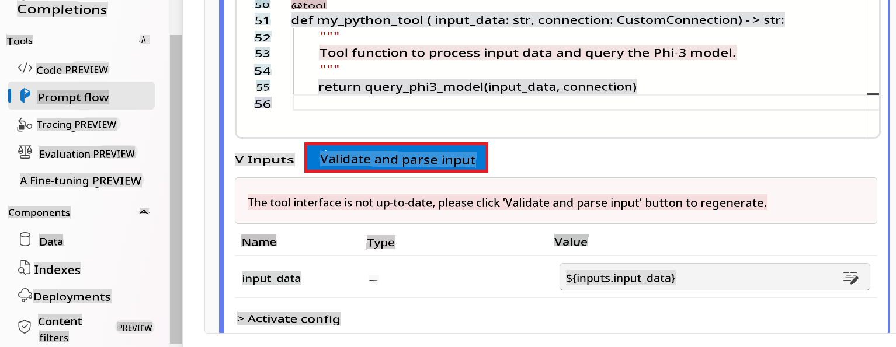

1. Choose the **Value** of the **connection** corresponding to the custom connection you created, such as *connection*.

    

#### Chat with your custom model

1. Click **Chat**.

    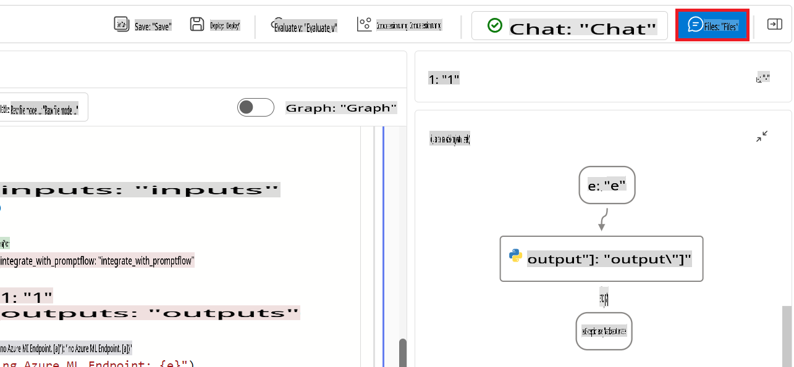

1. Example result: You can now chat with your custom Phi-3 model. It’s recommended to ask questions relevant to the data used for fine-tuning.

    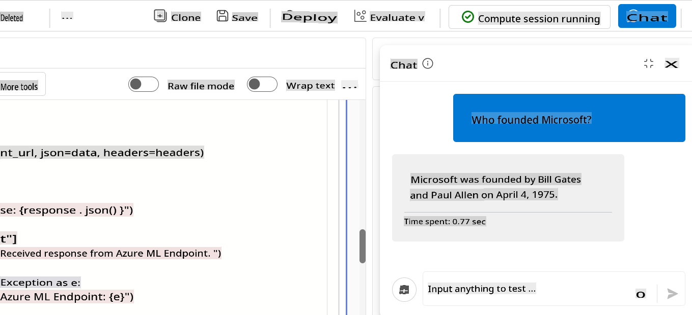

**Disclaimer**:  
This document has been translated using machine-based AI translation services. While we strive for accuracy, please be aware that automated translations may contain errors or inaccuracies. The original document in its native language should be considered the authoritative source. For critical information, professional human translation is recommended. We are not liable for any misunderstandings or misinterpretations arising from the use of this translation.