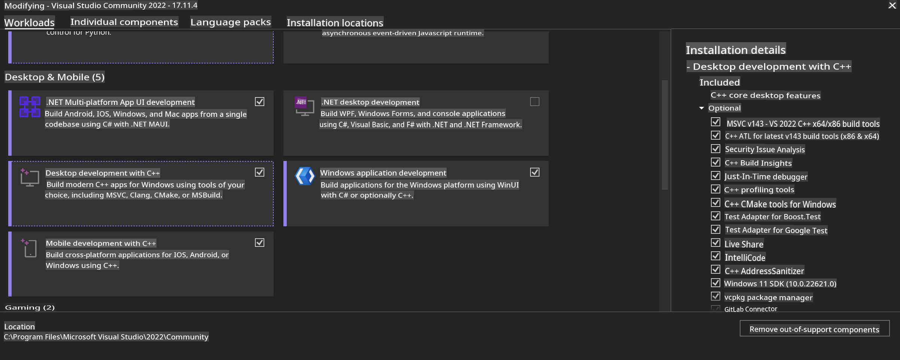
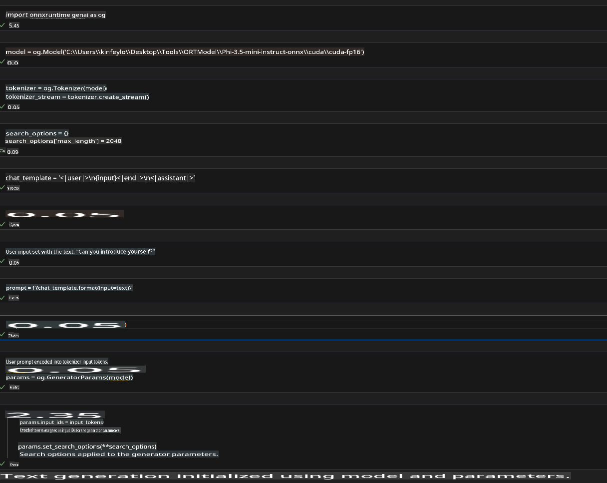
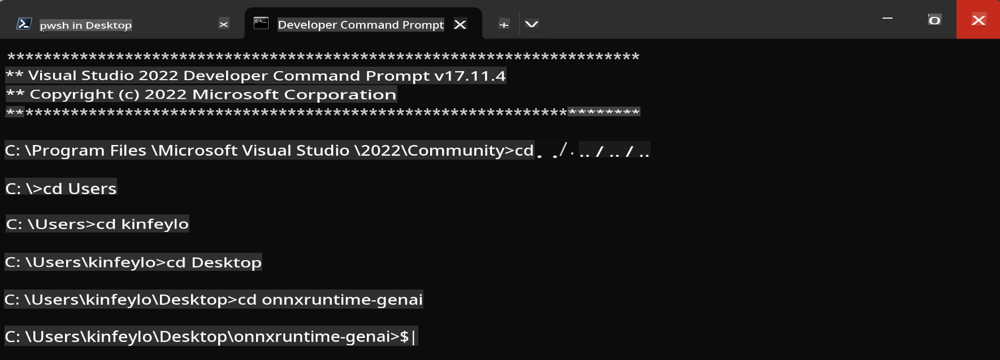

# **Guideline for OnnxRuntime GenAI Windows GPU**

This guideline outlines the steps to set up and use ONNX Runtime (ORT) with GPUs on Windows. It is designed to help you utilize GPU acceleration for your models, enhancing both performance and efficiency.

The document covers:

- Environment Setup: Steps for installing necessary dependencies such as CUDA, cuDNN, and ONNX Runtime.
- Configuration: Instructions for configuring the environment and ONNX Runtime to effectively use GPU resources.
- Optimization Tips: Recommendations for fine-tuning GPU settings to achieve optimal performance.

### **1. Python 3.10.x / 3.11.8**

   ***Note*** It is recommended to use [miniforge](https://github.com/conda-forge/miniforge/releases/latest/download/Miniforge3-Windows-x86_64.exe) as your Python environment.

   ```bash

   conda create -n pydev python==3.11.8

   conda activate pydev

   ```

   ***Reminder*** If you have already installed any Python ONNX library, please uninstall it.

### **2. Install CMake with winget**

   ```bash

   winget install -e --id Kitware.CMake

   ```

### **3. Install Visual Studio 2022 - Desktop Development with C++**

   ***Note*** If you do not plan to compile, you can skip this step.



### **4. Install NVIDIA Driver**

1. **NVIDIA GPU Driver** [https://www.nvidia.com/en-us/drivers/](https://www.nvidia.com/en-us/drivers/)

2. **NVIDIA CUDA 12.4** [https://developer.nvidia.com/cuda-12-4-0-download-archive](https://developer.nvidia.com/cuda-12-4-0-download-archive)

3. **NVIDIA CUDNN 9.4** [https://developer.nvidia.com/cudnn-downloads](https://developer.nvidia.com/cudnn-downloads)

***Reminder*** Please follow the default settings during the installation process.

### **5. Set NVIDIA Environment**

Copy the NVIDIA CUDNN 9.4 `lib`, `bin`, and `include` files to the respective folders in NVIDIA CUDA 12.4.

- Copy files from *'C:\Program Files\NVIDIA\CUDNN\v9.4\bin\12.6'* to *'C:\Program Files\NVIDIA GPU Computing Toolkit\CUDA\v12.4\bin'*.

- Copy files from *'C:\Program Files\NVIDIA\CUDNN\v9.4\include\12.6'* to *'C:\Program Files\NVIDIA GPU Computing Toolkit\CUDA\v12.4\include'*.

- Copy files from *'C:\Program Files\NVIDIA\CUDNN\v9.4\lib\12.6'* to *'C:\Program Files\NVIDIA GPU Computing Toolkit\CUDA\v12.4\lib\x64'*.

### **6. Download Phi-3.5-mini-instruct-onnx**

   ```bash

   winget install -e --id Git.Git

   winget install -e --id GitHub.GitLFS

   git lfs install

   git clone https://huggingface.co/microsoft/Phi-3.5-mini-instruct-onnx

   ```

### **7. Running InferencePhi35Instruct.ipynb**

   Open [Notebook](../../../../../../code/09.UpdateSamples/Aug/ortgpu-phi35-instruct.ipynb) and execute it.



### **8. Compile ORT GenAI GPU**

   ***Note*** 
   
   1. First, uninstall all ONNX, ONNX Runtime, and ONNX Runtime GenAI libraries.

   ```bash

   pip list 
   
   ```

   Then uninstall all ONNX Runtime libraries, such as:

   ```bash

   pip uninstall onnxruntime

   pip uninstall onnxruntime-genai

   pip uninstall onnxruntume-genai-cuda
   
   ```

   2. Check for Visual Studio Extension support.

   Navigate to `C:\Program Files\NVIDIA GPU Computing Toolkit\CUDA\v12.4\extras` to ensure that `C:\Program Files\NVIDIA GPU Computing Toolkit\CUDA\v12.4\extras\visual_studio_integration` exists. 

   If it is not found, check other CUDA toolkit driver folders and copy the `visual_studio_integration` folder and its contents to `C:\Program Files\NVIDIA GPU Computing Toolkit\CUDA\v12.4\extras\visual_studio_integration`.

   - If you do not plan to compile, you can skip this step.

   ```bash

   git clone https://github.com/microsoft/onnxruntime-genai

   ```

   - Download [https://github.com/microsoft/onnxruntime/releases/download/v1.19.2/onnxruntime-win-x64-gpu-1.19.2.zip](https://github.com/microsoft/onnxruntime/releases/download/v1.19.2/onnxruntime-win-x64-gpu-1.19.2.zip).

   - Unzip `onnxruntime-win-x64-gpu-1.19.2.zip`, rename the folder to **ort**, and copy the **ort** folder to `onnxruntime-genai`.

   - Using Windows Terminal, navigate to the Developer Command Prompt for VS 2022 and go to the `onnxruntime-genai` folder.



   - Compile it within your Python environment.

   ```bash

   cd onnxruntime-genai

   python build.py --use_cuda  --cuda_home "C:\Program Files\NVIDIA GPU Computing Toolkit\CUDA\v12.4" --config Release
 

   cd build/Windows/Release/Wheel

   pip install .whl

   ```

**Disclaimer**:  
This document has been translated using machine-based AI translation services. While we strive for accuracy, please note that automated translations may contain errors or inaccuracies. The original document in its native language should be regarded as the authoritative source. For critical information, professional human translation is recommended. We are not responsible for any misunderstandings or misinterpretations resulting from the use of this translation.