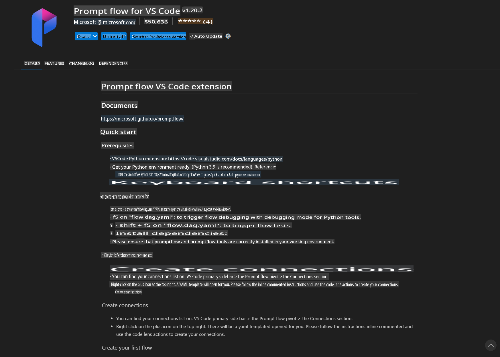
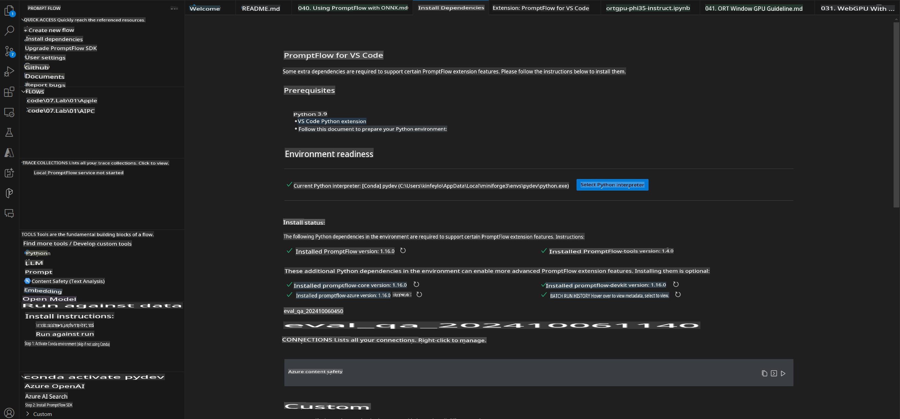
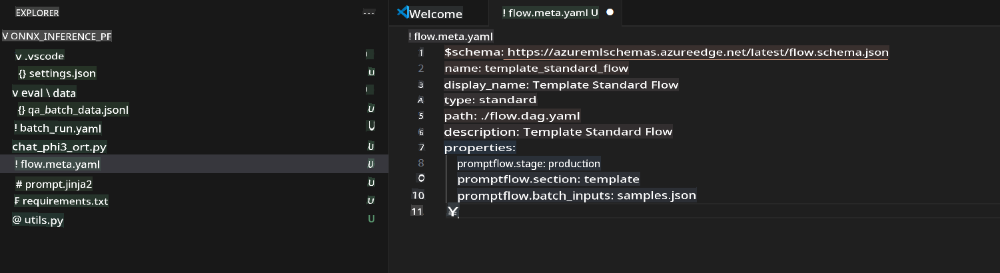
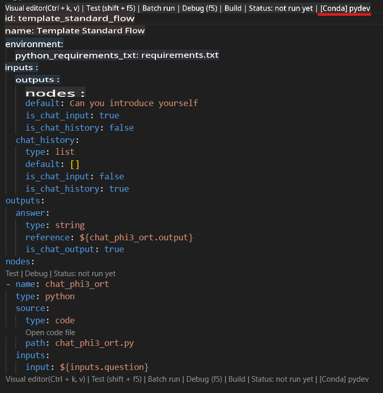
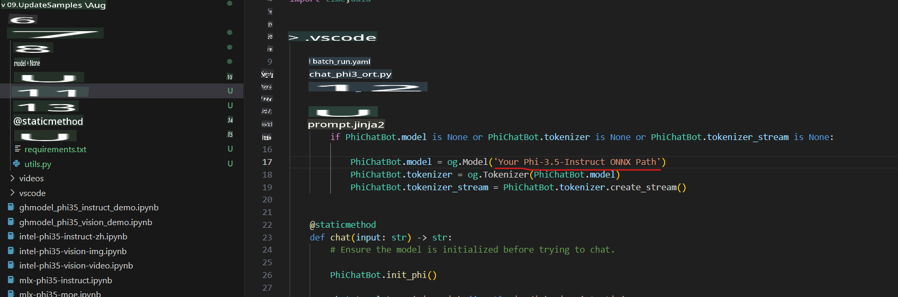
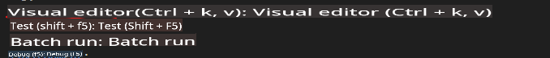
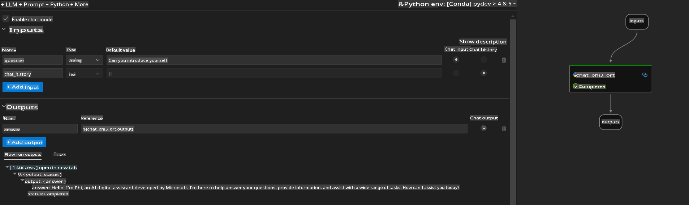
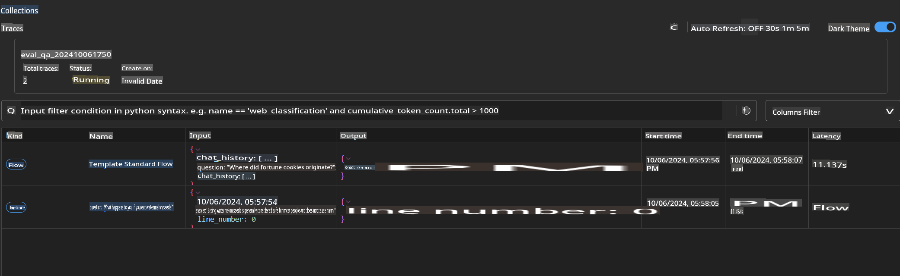

# Using Windows GPU to Create a Prompt Flow Solution with Phi-3.5-Instruct ONNX

This document provides an example of how to utilize PromptFlow with ONNX (Open Neural Network Exchange) to develop AI applications based on the Phi-3 models.

PromptFlow is a suite of development tools designed to streamline the complete development cycle of LLM-based (Large Language Model) AI applications, from ideation and prototyping to testing and evaluation.

By combining PromptFlow with ONNX, developers can:

- **Optimize Model Performance**: Use ONNX for efficient model inference and deployment.
- **Simplify Development**: Manage workflows and automate repetitive tasks with PromptFlow.
- **Enhance Collaboration**: Provide a unified development environment for better teamwork.

**PromptFlow** is a development toolset that simplifies the end-to-end creation process of LLM-based AI applications, including ideation, prototyping, testing, evaluation, production deployment, and monitoring. It makes prompt engineering more accessible and enables the development of production-grade LLM applications.

PromptFlow can integrate with OpenAI, Azure OpenAI Service, and customizable models (e.g., Huggingface, local LLM/SLM). Our goal is to deploy the quantized ONNX model of Phi-3.5 into local applications. PromptFlow will assist us in better planning our business needs and implementing local solutions based on Phi-3.5. In this example, we will use the ONNX Runtime GenAI Library to create a PromptFlow solution on a Windows GPU.

## **Installation**

### **ONNX Runtime GenAI for Windows GPU**

Refer to this guide to set up ONNX Runtime GenAI for Windows GPU: [click here](./ORTWindowGPUGuideline.md)

### **Set Up PromptFlow in VS Code**

1. Install the PromptFlow VS Code Extension.



2. After installing the PromptFlow VS Code Extension, click on the extension and choose **Installation dependencies**. Follow the provided instructions to install the PromptFlow SDK in your environment.



3. Download the [Sample Code](../../../../../../code/09.UpdateSamples/Aug/pf/onnx_inference_pf) and open it in VS Code.



4. Open **flow.dag.yaml** and select your Python environment.



   Then, open **chat_phi3_ort.py** and update the location of your Phi-3.5-Instruct ONNX Model.



5. Test your PromptFlow setup.

   Open **flow.dag.yaml** and click on the visual editor.



   After clicking, run it to perform a test.



6. You can run batch commands in the terminal to see more results.

```bash

pf run create --file batch_run.yaml --stream --name 'Your eval qa name'    

```

Check the results in your default browser.



**Disclaimer**:  
This document has been translated using machine-based AI translation services. While we strive for accuracy, please be aware that automated translations may contain errors or inaccuracies. The original document in its native language should be considered the authoritative source. For critical information, professional human translation is recommended. We are not liable for any misunderstandings or misinterpretations arising from the use of this translation.