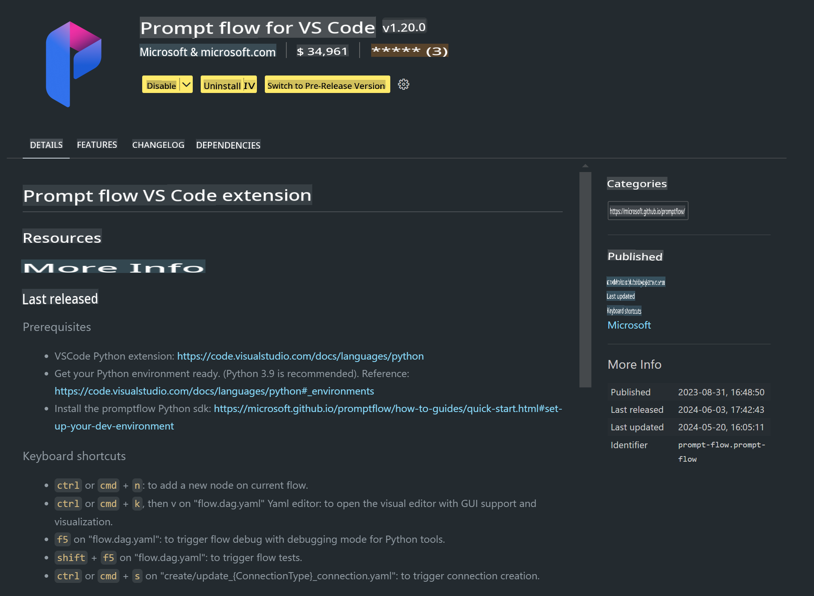

# **Lab 0 - Installation**

When we begin the Lab, we need to set up the appropriate environment:

### **1. Python 3.11+**

It is recommended to use Miniforge to configure your Python environment.

To set up Miniforge, refer to [https://github.com/conda-forge/miniforge](https://github.com/conda-forge/miniforge).

Once Miniforge is set up, run the following command in PowerShell:

```bash

conda create -n pyenv python==3.11.8 -y

conda activate pyenv

```

### **2. Install Prompt flow SDK**

In Lab 1, we will use Prompt flow, so you need to install the Prompt flow SDK.

```bash

pip install promptflow --upgrade

```

You can verify the installation of the Prompt flow SDK using this command:

```bash

pf --version

```

### **3. Install Visual Studio Code Prompt flow Extension**



### **4. Intel NPU Acceleration Library**

Intel's latest processors support NPU. If you want to run LLMs/SLMs locally using NPU, you can use the ***Intel NPU Acceleration Library***. For more details, visit [https://github.com/microsoft/PhiCookBook/blob/main/md/01.Introduction/03/AIPC_Inference.md](https://github.com/microsoft/PhiCookBook/blob/main/md/01.Introduction/03/AIPC_Inference.md).

Install the Intel NPU Acceleration Library in bash:

```bash

pip install intel-npu-acceleration-library

```

***Note***: Please ensure that this library supports transformers version ***4.40.2***. Confirm the version before proceeding.

### **5. Other Python Libraries**

Create a `requirements.txt` file and add the following content:

```txt

notebook
numpy 
scipy 
scikit-learn 
matplotlib 
pandas 
pillow 
graphviz

```

### **6. Install NVM**

Install NVM in PowerShell:

```bash

winget install -e --id CoreyButler.NVMforWindows

```

Install Node.js version 18.20:

```bash

nvm install 18.20.0

nvm use 18.20.0

```

### **7. Install Visual Studio Code Development Support**

```bash

npm install --global yo generator-code

```

Congratulations! You have successfully set up the SDK. Now, proceed to the hands-on exercises.

**Disclaimer**:  
This document has been translated using machine-based AI translation services. While we strive for accuracy, please note that automated translations may contain errors or inaccuracies. The original document in its native language should be considered the authoritative source. For critical information, professional human translation is recommended. We are not responsible for any misunderstandings or misinterpretations resulting from the use of this translation.