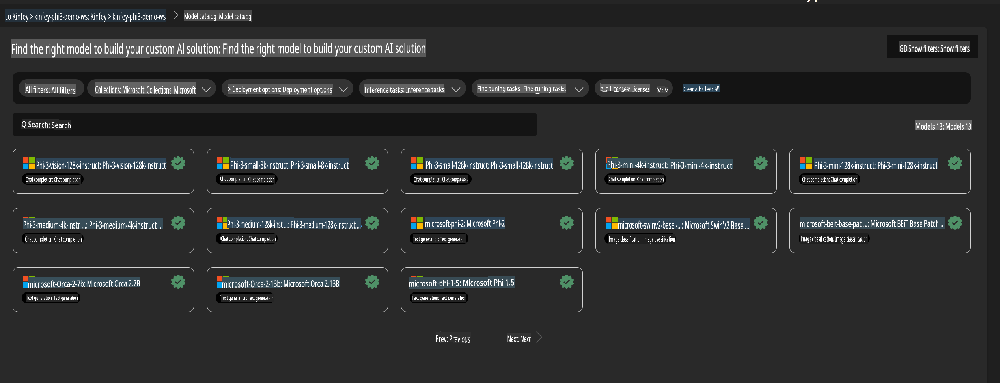
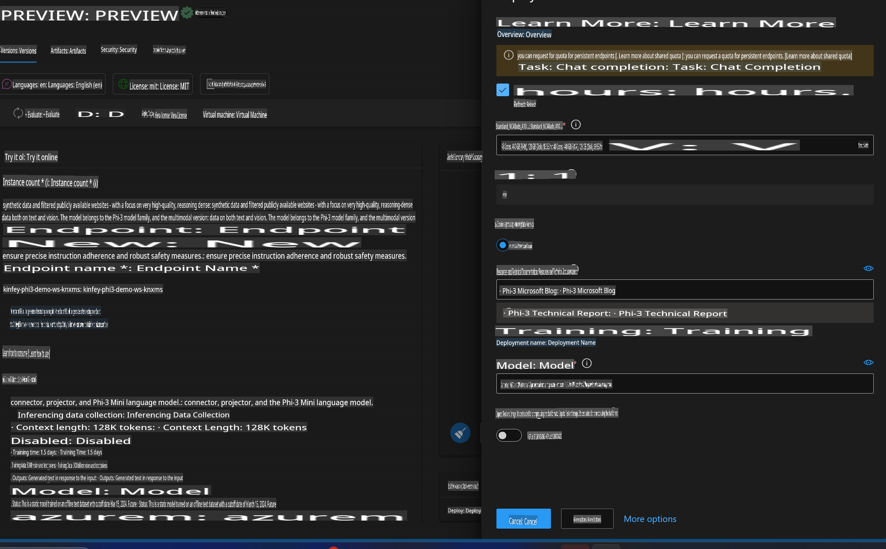
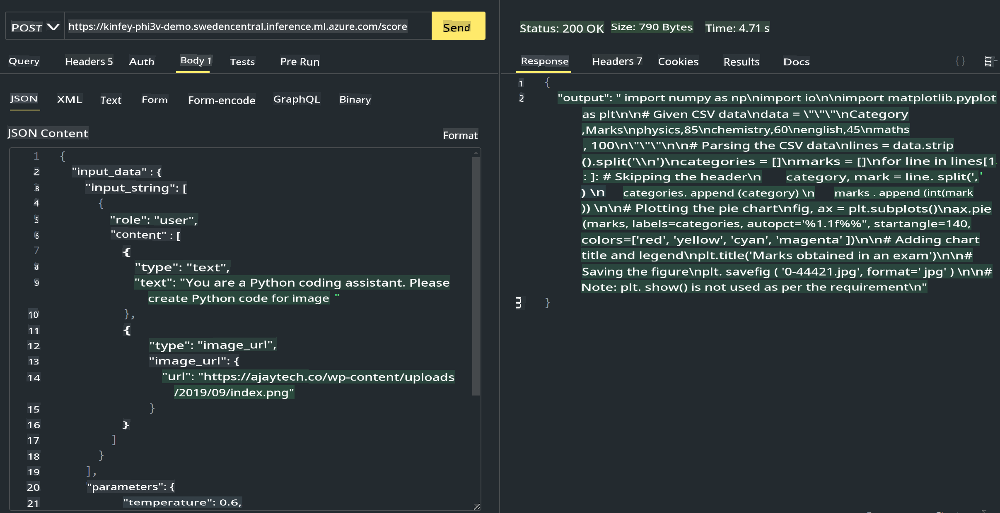

# **Lab 3 - Deploy Phi-3-Vision on Azure Machine Learning Service**

We use NPU to complete the production deployment of local code, and then we aim to integrate PHI-3-VISION capabilities to convert images into code.

In this guide, we will quickly set up a Model-As-Service Phi-3-Vision service using Azure Machine Learning Service.

***Note***: Phi-3-Vision requires significant computing power to generate content efficiently. Cloud computing resources are essential to accomplish this.

### **1. Create Azure Machine Learning Service**

We need to create an Azure Machine Learning Service in the Azure Portal. If you're unsure how to do this, please refer to the following link: [https://learn.microsoft.com/azure/machine-learning/quickstart-create-resources?view=azureml-api-2](https://learn.microsoft.com/azure/machine-learning/quickstart-create-resources?view=azureml-api-2)

### **2. Choose Phi-3 Vision in Azure Machine Learning Service**



### **3. Deploy Phi-3-Vision in Azure**



### **4. Test Endpoint in Postman**



***Note***

1. The parameters to be sent must include Authorization, azureml-model-deployment, and Content-Type. You need to check the deployment details to retrieve these values.

2. When sending parameters, Phi-3-Vision requires an image link. Refer to the GPT-4-Vision method for parameter transmission, such as:

```json

{
  "input_data":{
    "input_string":[
      {
        "role":"user",
        "content":[ 
          {
            "type": "text",
            "text": "You are a Python coding assistant.Please create Python code for image "
          },
          {
              "type": "image_url",
              "image_url": {
                "url": "https://ajaytech.co/wp-content/uploads/2019/09/index.png"
              }
          }
        ]
      }
    ],
    "parameters":{
          "temperature": 0.6,
          "top_p": 0.9,
          "do_sample": false,
          "max_new_tokens": 2048
    }
  }
}

```

3. Use the **Post** method to call **/score**.

**Congratulations**! You have successfully completed the quick deployment of PHI-3-VISION and experimented with generating code from images. Next, you can start building applications by combining NPUs with cloud resources.

**Disclaimer**:  
This document has been translated using machine-based AI translation services. While we strive for accuracy, please note that automated translations may contain errors or inaccuracies. The original document in its native language should be regarded as the authoritative source. For critical information, professional human translation is recommended. We are not responsible for any misunderstandings or misinterpretations resulting from the use of this translation.