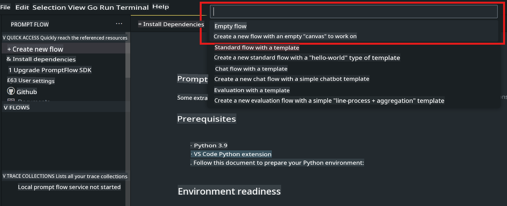
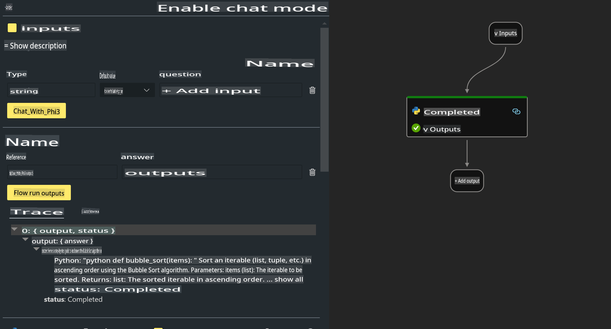

# **Lab 2 - Run Prompt flow with Phi-3-mini in AIPC**

## **What is Prompt flow**

Prompt flow is a set of development tools that simplifies the complete lifecycle of developing LLM-based AI applications. From ideation, prototyping, testing, and evaluation to production deployment and monitoring, it streamlines the process. It makes prompt engineering more accessible and helps you create LLM applications with production-grade quality.

With Prompt flow, you can:

- Build workflows that connect LLMs, prompts, Python code, and other tools into an executable flow.

- Debug and refine your workflows, especially interactions with LLMs, with ease.

- Assess your workflows and calculate quality and performance metrics using larger datasets.

- Integrate testing and evaluation into your CI/CD system to ensure the quality of your workflow.

- Deploy your workflows to your preferred serving platform or integrate them seamlessly into your app’s codebase.

- (Optional but highly recommended) Collaborate with your team by using the cloud version of Prompt flow in Azure AI.

## **Creating code generation flows on Apple Silicon**

***Note***: If you haven’t completed the environment setup, please refer to [Lab 0 - Installations](./01.Installations.md).

1. Open the Prompt flow Extension in Visual Studio Code and create an empty flow project.



2. Add Input and Output parameters and include Python Code as a new flow.



You can use this structure (flow.dag.yaml) as a reference to construct your flow:

```yaml

inputs:
  prompt:
    type: string
    default: Write python code for Fibonacci serie. Please use markdown as output
outputs:
  result:
    type: string
    reference: ${gen_code_by_phi3.output}
nodes:
- name: gen_code_by_phi3
  type: python
  source:
    type: code
    path: gen_code_by_phi3.py
  inputs:
    prompt: ${inputs.prompt}


```

3. Quantize phi-3-mini.

We aim to optimize SLM performance on local devices. Typically, the model is quantized (INT4, FP16, FP32).

```bash

python -m mlx_lm.convert --hf-path microsoft/Phi-3-mini-4k-instruct

```

**Note:** The default folder is mlx_model.

4. Add the following code to ***Chat_With_Phi3.py***.

```python


from promptflow import tool

from mlx_lm import load, generate


# The inputs section will change based on the arguments of the tool function, after you save the code
# Adding type to arguments and return value will help the system show the types properly
# Please update the function name/signature per need
@tool
def my_python_tool(prompt: str) -> str:

    model_id = './mlx_model_phi3_mini'

    model, tokenizer = load(model_id)

    # <|user|>\nWrite python code for Fibonacci serie. Please use markdown as output<|end|>\n<|assistant|>

    response = generate(model, tokenizer, prompt="<|user|>\n" + prompt  + "<|end|>\n<|assistant|>", max_tokens=2048, verbose=True)

    return response


```

5. You can test the flow using Debug or Run to verify if the code generation works correctly.


6. Execute the flow as a development API in the terminal.

```

pf flow serve --source ./ --port 8080 --host localhost   

```

You can test it using Postman or Thunder Client.

### **Important Notes**

1. The first run may take a long time. It is recommended to download the phi-3 model using the Hugging Face CLI.

2. Given the limited computing power of Intel NPU, it is advisable to use Phi-3-mini-4k-instruct.

3. We use Intel NPU Acceleration for INT4 quantization. However, if you restart the service, you must delete the cache and nc_workshop folders.

## **Resources**

1. Learn about Prompt flow: [https://microsoft.github.io/promptflow/](https://microsoft.github.io/promptflow/)

2. Learn about Intel NPU Acceleration: [https://github.com/intel/intel-npu-acceleration-library](https://github.com/intel/intel-npu-acceleration-library)

3. Sample Code: Download [Local NPU Agent Sample Code](../../../../../../../../../code/07.Lab/01/AIPC/local-npu-agent)

**Disclaimer**:  
This document has been translated using machine-based AI translation services. While we strive for accuracy, please be aware that automated translations may contain errors or inaccuracies. The original document in its native language should be considered the authoritative source. For critical information, professional human translation is recommended. We are not liable for any misunderstandings or misinterpretations arising from the use of this translation.