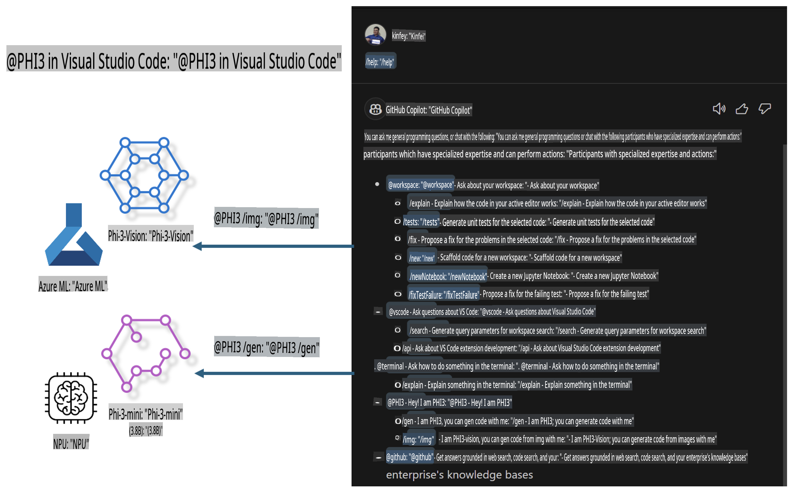

# **Build your own Visual Studio Code GitHub Copilot Chat with Microsoft Phi-3 Family**

Have you tried the workspace agent in GitHub Copilot Chat? Want to create a custom code assistant for your team? This hands-on lab is designed to help you use an open-source model to build an enterprise-grade code assistant.

## **Introduction**

### **Why choose Microsoft Phi-3**

The Phi-3 family includes models like phi-3-mini, phi-3-small, and phi-3-medium, tailored for tasks such as text generation, dialogue completion, and code generation, based on different training parameters. There’s also phi-3-vision for image-based tasks. This makes it a great choice for enterprises or teams looking to develop offline generative AI solutions.

Check out this link for more details: [https://github.com/microsoft/PhiCookBook/blob/main/md/01.Introduction/01/01.PhiFamily.md](https://github.com/microsoft/PhiCookBook/blob/main/md/01.Introduction/01/01.PhiFamily.md)

### **Microsoft GitHub Copilot Chat**

The GitHub Copilot Chat extension provides a chat interface that allows you to interact with GitHub Copilot and get answers to coding questions directly within VS Code. This eliminates the need to search through documentation or online forums.

Copilot Chat enhances clarity in its responses using syntax highlighting, indentation, and other formatting. Depending on your question, the responses might include links to context used, like source code files or documentation, and buttons for accessing VS Code features.

- Copilot Chat integrates seamlessly into your development workflow and assists you where you need it most:
  - Start an inline chat directly from the editor or terminal for real-time coding help.
  - Use the Chat view to have an AI assistant ready to assist you anytime.
  - Use Quick Chat for quick questions without disrupting your focus.

Some common use cases for GitHub Copilot Chat include:
- Solving coding problems
- Explaining and improving existing code
- Suggesting fixes for code issues
- Generating unit tests
- Creating code documentation

Learn more here: [https://code.visualstudio.com/docs/copilot/copilot-chat](https://code.visualstudio.com/docs/copilot/copilot-chat?WT.mc_id=aiml-137032-kinfeylo)

### **Microsoft GitHub Copilot Chat @workspace**

The **@workspace** feature in Copilot Chat lets you ask questions about your entire codebase. Copilot intelligently retrieves relevant files and symbols to provide context-rich answers with links and code examples.

To generate responses, **@workspace** searches through:
- All files in the workspace, except those ignored by a `.gitignore` file.
- Directory structures, including folder and file names.
- GitHub’s code search index (if the workspace is a GitHub repository and indexed by code search).
- Symbols and definitions in the workspace.
- Selected or visible text in the active editor.

Note: If you have a file open or text selected in an ignored file, `.gitignore` is bypassed.

Learn more here: [https://code.visualstudio.com/docs/copilot/copilot-chat](https://code.visualstudio.com/docs/copilot/workspace-context?WT.mc_id=aiml-137032-kinfeylo)

## **About this Lab**

GitHub Copilot has significantly boosted programming productivity for enterprises. Many companies aim to customize GitHub Copilot-like extensions tailored to their business needs using open-source models. While custom extensions give enterprises greater control, they can sometimes compromise the user experience. GitHub Copilot excels in handling general scenarios with professionalism. Maintaining a consistent experience while adding custom features ensures a superior user experience.

This lab leverages the Phi-3 model, combined with local NPU and Azure hybrid setups, to build a custom agent in GitHub Copilot Chat called ***@PHI3***. This agent assists enterprise developers with tasks like code generation ***(@PHI3 /gen)*** and generating code from images ***(@PHI3 /img)***.

### ***Note:*** 

This lab currently supports Intel CPU AIPC and Apple Silicon. We are working on adding support for Qualcomm NPUs.

## **Lab Steps**

| Name | Description | AIPC | Apple |
| ------------ | ----------- | -------- |-------- |
| Lab0 - Installations(✅) | Configure and install the required environment and tools | [Go](./HOL/AIPC/01.Installations.md) |[Go](./HOL/Apple/01.Installations.md) |
| Lab1 - Run Prompt flow with Phi-3-mini (✅) | Use local NPU with AIPC or Apple Silicon to create code generation using Phi-3-mini | [Go](./HOL/AIPC/02.PromptflowWithNPU.md) |  [Go](./HOL/Apple/02.PromptflowWithMLX.md) |
| Lab2 - Deploy Phi-3-vision on Azure Machine Learning Service(✅) | Generate code by deploying the Phi-3-vision model from Azure Machine Learning Service's Model Catalog | [Go](./HOL/AIPC/03.DeployPhi3VisionOnAzure.md) |[Go](./HOL/Apple/03.DeployPhi3VisionOnAzure.md) |
| Lab3 - Create a @phi-3 agent in GitHub Copilot Chat(✅)  | Build a custom Phi-3 agent in GitHub Copilot Chat for tasks like code generation, image-based code generation, and RAG | [Go](./HOL/AIPC/04.CreatePhi3AgentInVSCode.md) | [Go](./HOL/Apple/04.CreatePhi3AgentInVSCode.md) |
| Sample Code (✅)  | Download sample code | [Go](../../../../../../../code/07.Lab/01/AIPC) | [Go](../../../../../../../code/07.Lab/01/Apple) |

## **Resources**

1. Phi-3 Cookbook: [https://github.com/microsoft/Phi-3CookBook](https://github.com/microsoft/Phi-3CookBook)
2. Learn about GitHub Copilot: [https://learn.microsoft.com/training/paths/copilot/](https://learn.microsoft.com/training/paths/copilot/?WT.mc_id=aiml-137032-kinfeylo)
3. Learn about GitHub Copilot Chat: [https://learn.microsoft.com/training/paths/accelerate-app-development-using-github-copilot/](https://learn.microsoft.com/training/paths/accelerate-app-development-using-github-copilot/?WT.mc_id=aiml-137032-kinfeylo)
4. GitHub Copilot Chat API: [https://code.visualstudio.com/api/extension-guides/chat](https://code.visualstudio.com/api/extension-guides/chat?WT.mc_id=aiml-137032-kinfeylo)
5. Azure AI Foundry: [https://learn.microsoft.com/training/paths/create-custom-copilots-ai-studio/](https://learn.microsoft.com/training/paths/create-custom-copilots-ai-studio/?WT.mc_id=aiml-137032-kinfeylo)
6. Azure AI Foundry Model Catalog: [https://learn.microsoft.com/azure/ai-studio/how-to/model-catalog-overview](https://learn.microsoft.com/azure/ai-studio/how-to/model-catalog-overview)

**Disclaimer**:  
This document has been translated using machine-based AI translation services. While we strive for accuracy, please be aware that automated translations may contain errors or inaccuracies. The original document in its native language should be considered the authoritative source. For critical information, professional human translation is recommended. We are not liable for any misunderstandings or misinterpretations arising from the use of this translation.